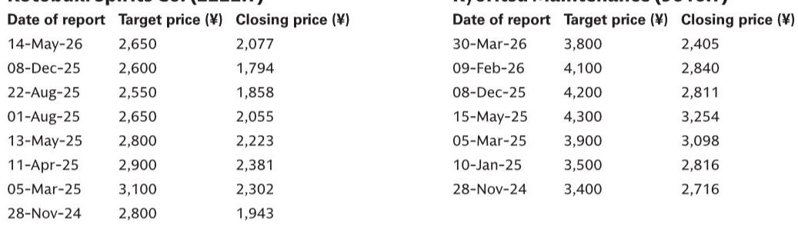
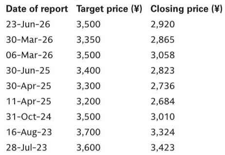
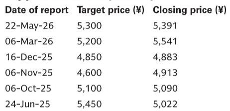

# GS：日本交运造船旅游读者访问反馈——组织各板块辩论要点和未来催化剂

这份GS在7月初与香港读者交流后形成的反馈，核心判断并不复杂：日本交运板块的报价已经部分反映了“正常化”预期，但真正能拉开公司间差距的变量——那些尚未被广泛定价的结构性变化——才是中期值得追踪的线索。

报告覆盖了航运、造船、航空、入境旅游和物流五个子行业。读者对每个板块的共识与分歧，恰好勾勒出当前日本市场的定价边界。

## 1. 航运的短期弹性与2027年隐忧并存，汽车船价值被低估

航运是讨论最集中的板块。市场对中东局势的二元预期非常清晰：局势持续则运价上行，局势缓和则供给不确定性释放。短期看，集装箱船市场因货量改善，多数读者预期4-6月财报季会出现全年利润指引上调，以及基于40%派息率的股息提升——日本邮船FY3/27的每股股息预期已到210日元，高于公司指引的200日元。

但分歧在于2027年之后。集装箱船交付量增加背景下，供需可能从2027年起松动。GS特别指出，汽车运输船租金上涨和自有船资产价值上升这两个逻辑，目前市场认知度很低，可能成为中期估值催化剂。

> **KC评论：** 航运板块的短期交易逻辑（中东局势、财报上调）已经被充分讨论，但汽车运输船这条线几乎无人问津。如果读者只盯着集装箱船，可能错过资产重估的另一个来源。

## 2. 造船股回调是资金轮动，而非基本面出现变化

过去三个月，日本造船股出现明显回调。读者最常给出的解释是资金从国防/地缘相关公司流向AI科技股。GS认为，这种轮动掩盖了基本面改善的持续性。

名村造船和三井E&S的FY3/27市盈率均在10倍左右，随着盈利扩张，低估会进一步凸显。东京计器作为国防设备主要供应商，其海外国防需求扩张的故事在交流中没有遇到实质性反驳。造船板块的估值压缩，更多是资金行为，而非行业逻辑逆转。

## 3. 航空业共识偏正面，但国际航空货运是未被定价的弹性来源

原油价格见顶的预期让读者对航空板块态度转暖。但GS注意到，报价已经定价了“正常化盈利”，市场在寻找进一步上行的空间。

国内客运业务的结构性改革和国际航空货运市场的改善，是GS认为的两个上行来源。尤其后者，市场认知度明显不足。对于ANA控股，由于上一财年整合了NCA，其收入弹性高于历史周期，盈利预期存在进一步上调的可能。

## 4. 入境旅游报价修复过快，短期催化仍在但中期空间收窄

入境旅游板块的积极情绪比三个月前有所回升，主要因为原油价格回落缓解了机票燃油附加费的担忧。但共立维护和寿Spirits的报价已经快速修复，FY3/27的盈利改善很大程度上已被定价。

GS认为，短期盈利仍高于指引，中期催化剂也存在——共立维护的积分计划、寿Spirits的新兴品牌推出。但日本机场大楼被更新公司观点，因为缺乏中期盈利提升的催化剂，尽管市内免税店退税方式的引入可能在财年下半年带来正面影响。

## 5. 物流行业价格竞争依然激烈，持续提价周期尚未到来

日本邮政近期调整了Yu-Pack/Yu-Packet的定价，部分读者期待竞争环境改善。但GS的判断更谨慎：从近期市场份额波动看，竞争环境依然严峻，持续提价周期难以想象。对于盈利能力相对较高的SG Holdings，GS更新公司观点立场，认为包裹配送行业竞争加剧带来的盈利出现变化不确定性仍在。

这份报告的价值不在于给出统一结论，而在于清晰标出了各板块中“市场共识”与“GS判断”之间的差距。差距最大的地方——汽车运输船资产价值、国际航空货运弹性、造船股的资金轮动——恰恰是中期需要持续跟踪的观察点。

For informational purposes only. Portions may be generated,translated,summarized,or edited with AI assistance based on source materials and may contain omissions or errors. Please verify independently. This is not investment,legal,tax,accounting,or other professional advice.

For informational purposes only. Portions may be generated,translated,summarized,or edited with AI assistance based on source materials and may contain omissions or errors. Please verify independently. This is not investment,legal,tax,accounting,or other professional advice.

