# 日本机械行业：工程机械

## 基于风险收益比的偏好：在周期不明朗阶段，维持对久保田的积极看法

工程机械行业目前处于结构性可见度较低的阶段，不同终端需求对应的周期阶段差异显著，难以对行业整体方向做出统一判断。尽管宏观环境中的积极因素——例如6月宣布的美国关税缓和——对盈利构成支撑，但由于需求波动，能够清晰判断盈利方向的公司有限，选股仍具挑战。在本报告中，我们梳理了各终端市场的需求环境，并更新了覆盖公司的盈利预测与观点。

武内 健
+81(3)4587-4067 |
takeru.adachi@gs.com
GS Japan Co., Ltd.

石山 雄一郎
+81(3)4587-9806 |
yuichiro.isayama@gs.com
GS Japan Co., Ltd.

榎 貴斗
+81(3)4587-1739 |
takato.enoki@gs.com
GS Japan Co., Ltd.

## 通用工程机械：库存周期上行构成利好，终端需求趋势是关注焦点

从建筑需求趋势来看，尤其是在最大的北美市场，数据中心等特定领域的稳健表现引人关注。与此同时，美国建筑投资在2024财年末以来基本持平，即便在通胀调整前也是如此。虽然仍处于历史高位，但由于制造业建筑投资下降等因素，市场开始认识到建筑投资存在小幅下行风险，而非大幅上行的情景。

我们认为近期出货量和产量的改善主要源于库存周期的上行，而非终端需求的全面复苏。经销商等渠道层面的库存在2024年至2025年期间经历了调整，过剩库存已清理至较为健康的水平，因此我们认为目前处于库存上行周期。强劲的批发需求可能在未来几个季度持续，直至补库完成。但展望更远，除非终端需求全面复苏，否则结构性需求扩张的可能性不大。短期来看形势有利，但我们认为下一个关注焦点将是本轮库存周期结束后终端需求的走势。

图表1：过去1-2年美国建筑投资在高位保持平稳
美国建筑投资
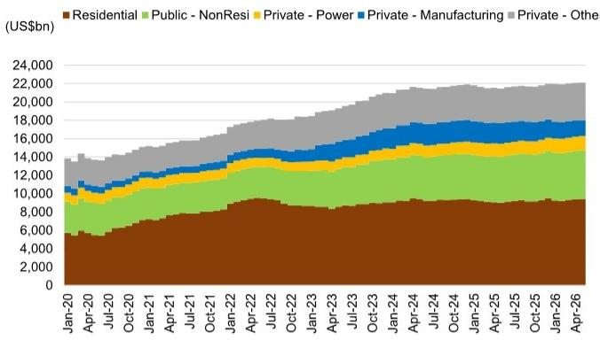
来源：美国人口普查局

图表2：液压挖掘机出口额同比增长超过20%，增长稳健
CEMA：液压挖掘机出口额
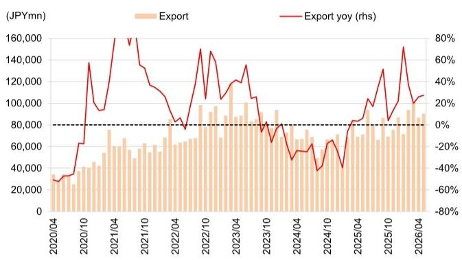
来源：日本建设机械工业会
图表3：对北美液压挖掘机出口量同比增长超过40%，是增长的主要驱动力
出货统计：对北美液压挖掘机出货量（同比）

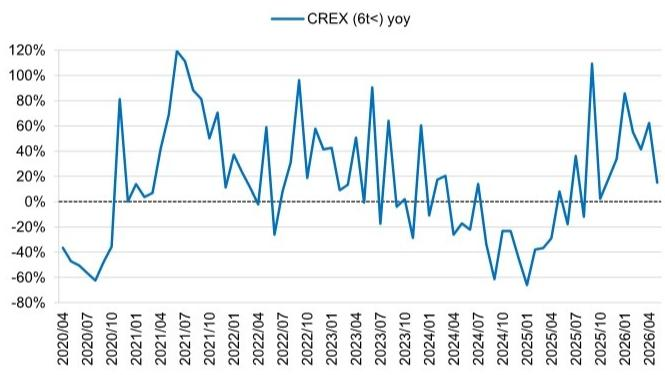
来源：日本财务省
图表4：库存调整后，当前销售快于库存，形势有利
卡特彼勒工程机械销售与经销商库存变化（自2022财年末累计变化）

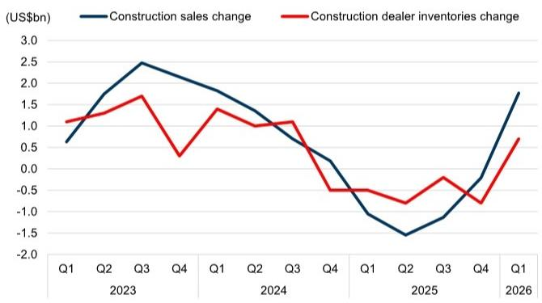
来源：公司数据
图表5：对欧洲液压挖掘机出口量年初至今同比增长也超过40%
出货统计：对欧洲液压挖掘机出货量（同比）

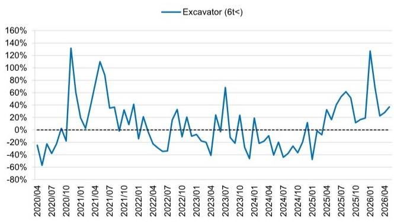
来源：日本财务省

图表6：北美和欧洲当前的强劲表现可能已是阶段性高点
2025年液压挖掘机出口额按地区划分
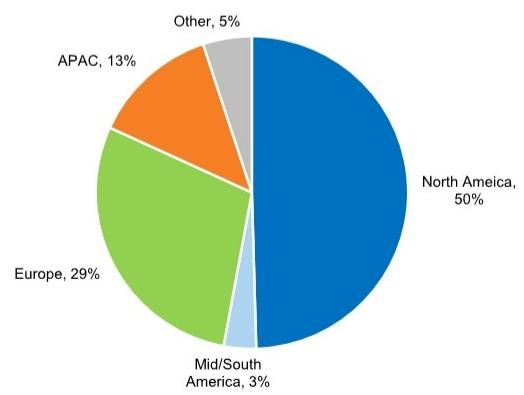
来源：日本财务省

## 小型工程机械：微型挖掘机库存过剩构成拖累，对装载机的依赖可能进一步增强

正如近期美国新屋开工数据所示，与住宅相关的建筑需求明显趋缓。考虑到下半年存在进一步加息的担忧，如果这一情景成为现实，美国住宅市场可能进一步承压。

住宅需求的放缓将对微型挖掘机造成较大冲击，因为其住宅用途占比较高。在这一细分领域，库存水平偏高。我们此前已多次指出库存调整的必要性，而近期数据的走弱进一步增加了这种可能性。尽管早春时节曾出现短暂强势，但其背景并不明确。我们认为，不可避免的下行周期终于到来。

另一方面，客户群体广泛的装载机则继续保持稳健趋势。然而，库存已达到健康水平，难以重现过去几年强劲的需求扩张。结合微型挖掘机的困境，我们认为整个小型工程机械板块目前处于较强的下行压力阶段。由于终端需求尚未出现全面复苏迹象，我们认为短期内应保持审慎态度。

图表7：美国新屋开工自2022年以来持续下行
美国新屋开工
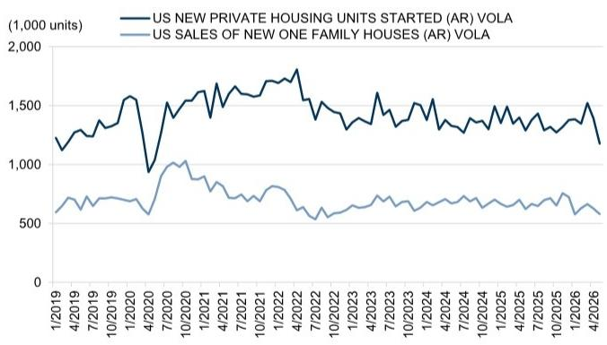
来源：美国人口普查局

图表8：紧凑型卡车装载机（CTL）库存水平健康，但微型挖掘机库存偏高
久保田：北美经销商工程机械库存
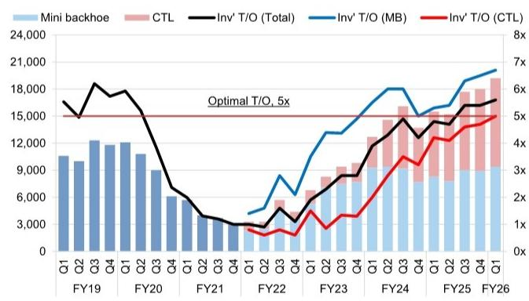
来源：公司数据

图表9：5月微型挖掘机出口额10个月来首次转为负增长
CEMA：微型挖掘机出口额
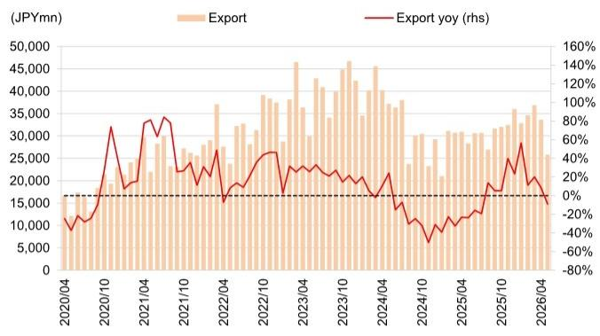
来源：日本建设机械工业会

图表10：除微型挖掘机恶化外，CTL的急剧下降也令人担忧
出货统计：对北美微型挖掘机和装载机出货量（同比）
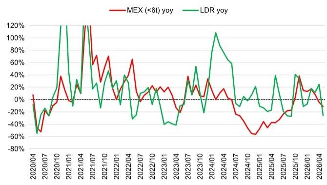
来源：日本财务省

## 拖拉机：北美小型和中型拖拉机零售需求均低于预期

当前需求环境未达初期预期，北美小型和中型拖拉机的近期零售销售均低于我们最初的假设。然而，鉴于去年经历了较大幅度的库存调整，批发层面仍有充足的恢复空间；需求触底的迹象正在逐步显现。从中长期来看，拖拉机销量处于历史低位具有重要含义。这一低水平意味着置换需求的积累，因此我们认为2027年转为正增长的可能性较高。

另一方面，风险因素依然存在。如果下半年实施加息，农户的购买意愿将进一步受到抑制，这可能构成不利因素。此外，如果下半年零售需求无法确认改善迹象，2027年的复苏情景可能无法实现。基于这些假设，我们在预测2026年12月财年批发销售时，假设近期零售需求持续；同时，对于2027年，我们以库存周期正常化和置换需求实现为基础，假设小型和中型拖拉机需求逐步恢复约5%。我们假设的不是强劲反弹，而是在库存周期正常化和置换需求实现背景下的谨慎而稳定的恢复。

美国AEM：中型拖拉机零售与批发量

图表11：5月零售额同比下降25%
美国AEM：小型拖拉机零售与批发量
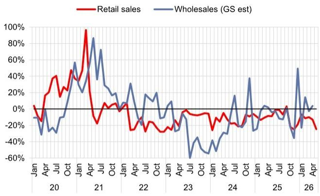
来源：美国设备制造商协会
图表12：中型拖拉机5月同比降幅也有所扩大

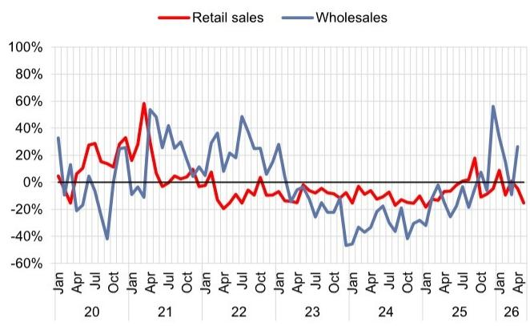
图表13：久保田库存水平优于行业整体，但尚非乐观局面
久保田/AEM：北美小型拖拉机库存
来源：美国设备制造商协会
图表14：久保田中型拖拉机库存远低于行业水平

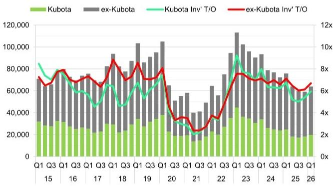
来源：公司数据、美国设备制造商协会
久保田/AEM：北美中型拖拉机库存量

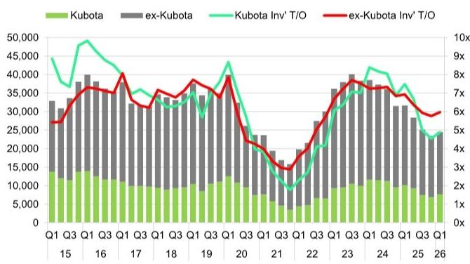
来源：公司数据、美国设备制造商协会
图表15：小型拖拉机零售量可能连续第5年下降
久保田：北美小型拖拉机销量同比增速

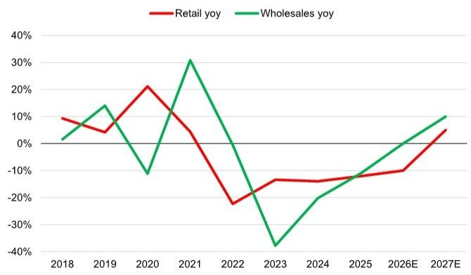
来源：公司数据
图表16：关注中型拖拉机下半年能否复苏
久保田：北美中型拖拉机销量同比增速

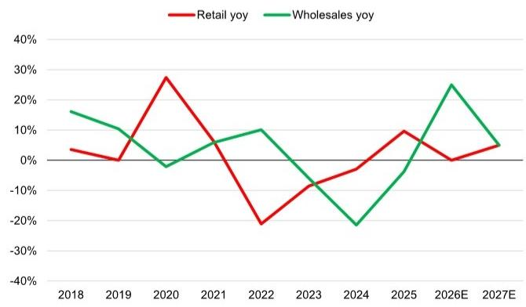
来源：公司数据

## 矿山机械：关注煤炭市场政策变化，但整体趋势温和向好

从大宗商品价格趋势来看，铜价表现强劲，焦煤也保持稳健，而铁矿石价格则相对疲软。以两家主要矿产资源公司的资本支出作为行业整体代理指标，虽然铜和铁矿石的资本支出预计短期内将持续，但我们预计整体趋势将在高位持平至小幅下降。

图表17：受AI/数据中心需求推动，持续稳步攀升
铜价趋势
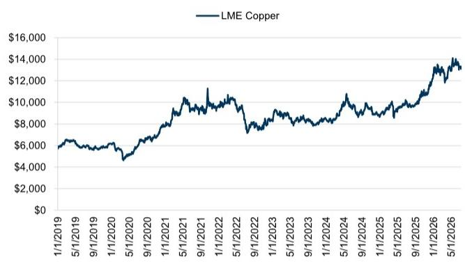
来源：LSEG Data & Analytics

图表19：与其他矿种相比趋势不利
铁矿石价格趋势
图表18：焦煤价格也保持在常规区间内的高位
焦煤价格趋势
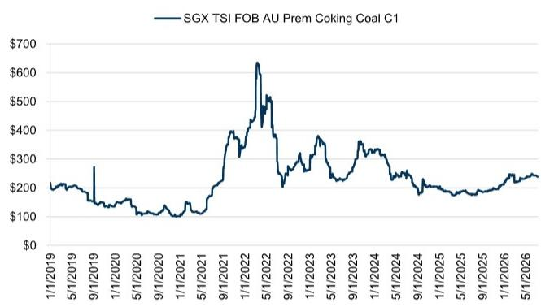
来源：LSEG Data & Analytics

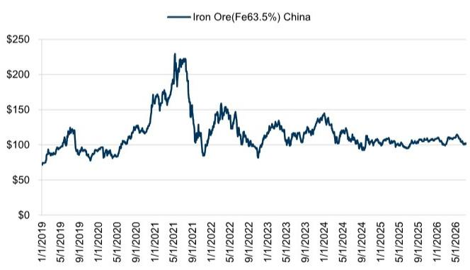
来源：LSEG Data & Analytics

图表20：两家主要矿产资源公司资本支出预计在2025年见顶，随后逐步放缓
必和必拓/力拓合计资本支出
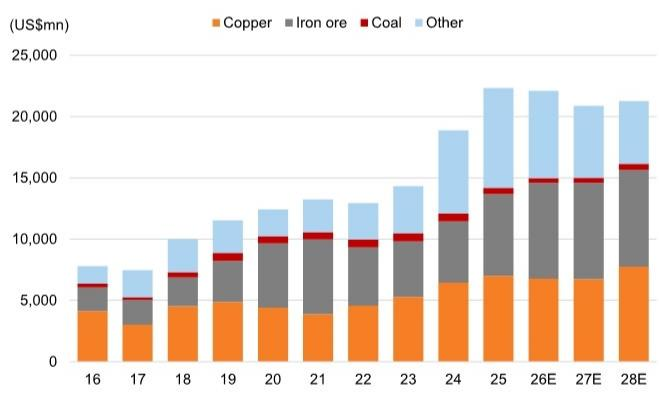
来源：公司数据、GS全球投资研究

亚洲（尤其是印度尼西亚）的需求趋势对小松至关重要。公司盈利强劲的阶段通常与动力煤价格有利相吻合。鉴于印尼动力煤价格与工程机械柴油价格之间的价差正在扩大，自然可以解读为需求正在触底。然而，近期印尼的工程机械出货量依然低迷，实际复苏尚未得到确认。

此外，需要警惕的是，印尼的政策环境正在发生显著变化，这种情况可能暂时持续。主要政策趋势如下：

- 负面因素：6月1日宣布的国有企业DSI对煤炭出口的集中管理（2027年1月1日起全面运营）给私营矿企的经营带来不确定性。

- 正面因素：能源和矿产资源部（ESDM）明确了接受2026年RKAB（煤炭业务计划和预算）产量配额修订申请（申请期：7月1日至31日）的政策。这可能带来产能扩张。

- 正面因素：正在考虑审查适用于国内市场需求（DMO）的煤炭价格，如果实现，可能有助于改善矿企的盈利能力。

总体来看，如果煤炭市场状况不再进一步恶化，我们预计整体将逐步向积极方向发展。鉴于铜的基本面强劲，我们认为整体矿山设备需求最可能的情景是在高位持平至小幅增长。然而，由于印尼政策趋势和动力煤市场价格方向仍将是重要变量，我们将密切关注下半年的动向。

图表21：铜及其他矿种占比的明显上升，是动力煤疲软的另一面
小松：矿山机械销售矿种构成
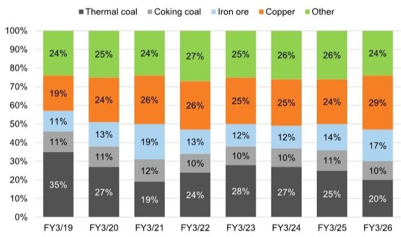
来源：公司数据
图表22：因中东局势恶化而收窄的价差，也正趋于正常化
4200千卡动力煤与工程机械柴油价格价差

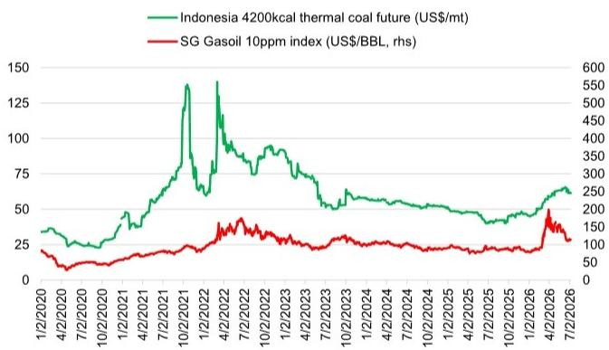
*注：燃料成本通常占运营成本的15-25%，此价差图表仅为示意

图表23：挖掘量在2023年见顶后持续稳步下降
United Tractors：Pama的剥离量与煤炭产量
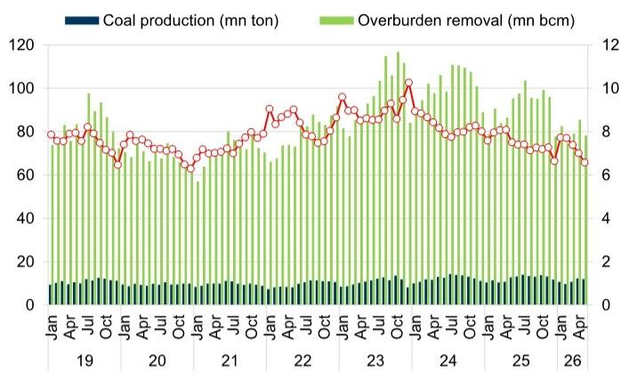
来源：公司数据

## 个股观点

久保田：只要拖拉机不再进一步恶化，预计2027年12月财年盈利将持续稳定增长（积极，目标价3,300日元）

<table><tr><td>6326.T</td><td>12个月目标价：3300日元</td><td colspan="2">现价：2724.5日元</td><td colspan="2">上行空间：21.1%</td></tr><tr><td>积极</td><td>GS预测</td><td></td><td></td><td></td><td></td></tr><tr><td></td><td></td><td>12/25</td><td>12/26E</td><td>12/27E</td><td>12/28E</td></tr><tr><td>市值：3.1万亿日元 / 190亿美元</td><td>营收（十亿日元）</td><td>3,019.0</td><td>3,230.0</td><td>3,392.0</td><td>3,459.0</td></tr><tr><td>企业价值：5.2万亿日元 / 321亿美元</td><td>营业利润（十亿日元）新</td><td>265.5</td><td>340.0</td><td>405.0</td><td>430.0</td></tr><tr><td>3个月日均交易量：117亿日元 / 7320万美元</td><td>营业利润（十亿日元）旧</td><td>265.5</td><td>318.0</td><td>337.0</td><td>352.0</td></tr><tr><td>日本</td><td>营业利润一致预期（十亿日元）</td><td>220.0</td><td>300.0</td><td>--</td><td>--</td></tr><tr><td>日本多行业</td><td>每股收益（日元）新</td><td>163.4</td><td>217.2</td><td>258.2</td><td>282.9</td></tr><tr><td></td><td>每股收益（日元）旧</td><td>163.4</td><td>201.7</td><td>213.8</td><td>227.0</td></tr><tr><td>并购排名：3</td><td>市盈率（倍）</td><td>11.3</td><td>12.5</td><td>10.6</td><td>9.6</td></tr><tr><td>租赁是否计入净债务及企业价值：否</td><td>市净率（倍）</td><td>0.8</td><td>1.1</td><td>1.0</td><td>1.0</td></tr><tr><td></td><td>CROCI（%）</td><td>6.9</td><td>10.5</td><td>11.8</td><td>12.0</td></tr><tr><td></td><td></td><td>12/25</td><td>3/26E</td><td>6/26E</td><td>9/26E</td></tr><tr><td></td><td>每股收益（日元）</td><td>39.3</td><td>64.5</td><td>61.4</td><td>42.3</td></tr></table>

来源：公司数据、GS预测、FactSet。价格截至2026年7月9日收盘。

## 我们的观点

在盈利方面，日元贬值和6月宣布的美国第232条关税减免构成利好，外部环境总体向好。另一方面，需求低于预期，美国上半年拖拉机需求未达初期假设。此外，原本预期从去年低迷水平反弹的泰国拖拉机需求，因燃料价格上涨抑制了农户购买意愿，可能录得同比负增长。

总体而言，汇率和关税等外部因素抵消了需求的下行，2026年12月财年的盈利展望整体基本不变。然而，考虑到当前美国和泰国拖拉机需求处于历史低位，我们认为在置换需求积累和库存周期正常化的推动下，2027年12月财年转为正增长的可能性较高，尽管并非强劲反弹。基于这一假设，我们预计2027年12月财年盈利也将继续增长。

基于上述分析，我们调整了预测假设。我们将美元/日元汇率假设从155日元调整为160日元，并计入美国关税减免的影响，将2026年12月财年营业利润预测上调7%。此外，从2027年12月财年起，考虑到需求复苏情景以及汇率和关税假设的修正，我们将预测上调约20%。

另一方面，考虑到利率上升对资产负债表和权益成本的影响，我们将目标价从3,400日元下调至3,300日元。然而，鉴于需求复苏的可能性以及2027年12月财年起盈利增长的持续性，我们维持积极评级。

当前估值约为基于2026年12月财年一致预期市盈率的14倍，处于历史周期平均区间（12-16倍）的中位数水平。鉴于当前需求环境处于难以明确判断为上行或下行周期的过渡阶段，当前股价水平可视为合理估值。

此外，I/B/E/S一致预期的营业利润预测仍较为保守，为3,200亿日元，考虑到与我们预测的差异，一致预期存在上调空间。未来，如果全年业绩指引上调或宣布额外股份回购等潜在催化剂得以实现，可能同时提振盈利预测和股价。当前估值既未反映过度乐观也未反映过度悲观，因此我们认为这可能是等待催化剂的同时增加持仓的良好时机。

图表24：在正常周期中，市盈率通常在12-16倍区间波动
久保田：12个月远期市盈率
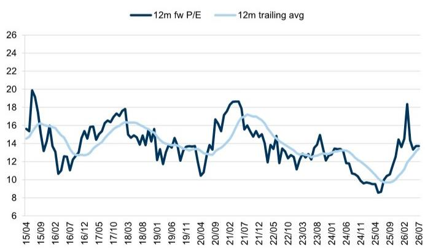
来源：LSEG Data & Analytics

## 目标价风险与方法论 - 久保田

我们12个月目标价3,300日元基于2026年12月财年预期EV/EBITDA，应用行业平均倍数10倍并给予10%的行业相对折价（过去10年上行周期的平均值）。我们给予积极评级。

主要下行风险包括日元走强（我们估计美元/日元每变动1日元，营业利润影响30亿日元；欧元/泰铢每变动1日元，营业利润影响8亿日元/100亿日元）、北美拖拉机/工程机械需求低于预期，以及美国关税变化导致销售成本上升。

## 投资论点 - 久保田

我们对久保田给予积极评级。公司在关键的北美拖拉机市场，尤其是小型和中型拖拉机领域，拥有领先份额。在北美和欧洲的小型工程机械市场也拥有最高市场份额。虽然北美拖拉机经销商库存已正常化，零售需求终于出现触底迹象，但近年来推动业绩增长的北美工程机械市场的快速增长已经停止。在这种不确定的环境中，久保田已将重心从市场份额转向盈利能力和资本效率，我们认为公司正在稳步构建一个不易受外部因素影响的业务模式。虽然市净率已在一段时间内高于1倍，但我们认为，如果公司通过自身努力实现现金回报的改善，鉴于其在股份回购等股东回报方面的良好记录，市场对进一步重估抱有较高期待。

小松：煤炭开采可能触底，但预期可能已超前（中性，目标价6,300日元）

<table><tr><td>6301.T</td><td>12个月目标价：6300日元</td><td colspan="2">现价：6395日元</td><td colspan="2">下行空间：1.5%</td></tr><tr><td>中性</td><td>GS预测</td><td></td><td></td><td></td><td></td></tr><tr><td></td><td></td><td>3/26</td><td>3/27E</td><td>3/28E</td><td>3/29E</td></tr><tr><td>市值：5.8万亿日元 / 355亿美元</td><td>营收（十亿日元）</td><td>4,132.8</td><td>4,374.2</td><td>4,583.8</td><td>4,744.3</td></tr><tr><td>企业价值：7.0万亿日元 / 434亿美元</td><td>营业利润（十亿日元）新</td><td>567.3</td><td>564.0</td><td>588.0</td><td>612.0</td></tr><tr><td>3个月日均交易量：256亿日元 / 1.603亿美元</td><td>营业利润（十亿日元）旧</td><td>567.3</td><td>529.5</td><td>579.6</td><td>667.4</td></tr><tr><td>日本</td><td>营业利润一致预期（十亿日元）</td><td>500.0</td><td>508.0</td><td>--</td><td>--</td></tr><tr><td>日本多行业</td><td>每股收益（日元）新</td><td>413.9</td><td>415.2</td><td>440.7</td><td>469.0</td></tr><tr><td></td><td>每股收益（日元）旧</td><td>413.9</td><td>390.4</td><td>437.5</td><td>521.7</td></tr><tr><td>并购排名：3</td><td>市盈率（倍）</td><td>12.6</td><td>15.4</td><td>14.5</td><td>13.6</td></tr><tr><td>租赁是否计入净债务及企业价值：是</td><td>市净率（倍）</td><td>1.3</td><td>1.5</td><td>1.4</td><td>1.4</td></tr><tr><td></td><td>CROCI（%）</td><td>13.0</td><td>12.6</td><td>12.3</td><td>12.1</td></tr><tr><td></td><td></td><td>3/26</td><td>6/26E</td><td>9/26E</td><td>12/26E</td></tr><tr><td></td><td>每股收益（日元）</td><td>118.1</td><td>88.6</td><td>92.3</td><td>104.1</td></tr></table>

来源：公司数据、GS预测、FactSet。价格截至2026年7月9日收盘。

## 我们的观点

如前文所述，虽然以美国为主的通用建筑需求目前趋势向好，但很难设想从此进一步大幅上行的情景。虽然采矿领域以铜相关项目为中心的稳健资本支出应会持续，但根据主要矿产资源公司的展望，我们预计整体资本支出将逐步放缓。对于目前面临最严峻局面的亚洲动力煤，我们认为当前状况已基本达到最差水平，进一步恶化的可能性不大，预计未来将逐步恢复。

综合来看，除亚洲矿山机械外，终端需求不太可能出现大幅波动，我们预计小松的盈利将以2027年3月财年为底部，继续逐步改善。

然而，需要警惕的是，这种复苏预期已在很大程度上被纳入一致预期。I/B/E/S一致预期对2027年3月财年的营业利润预测目前为5,800亿日元，高于我们最初的5,640亿日元预测；对2028年3月财年的一致预期为6,250亿日元，而我们的预测为5,880亿日元，两者均基于相对乐观的假设。如果区域和产品组合改善的积极效应超出预期，这些水平并非不可能实现，但若要进一步上行，某个应用领域的需求需要显著超出预期。

在盈利预测处于相对乐观水平的同时，估值也处于较高水平。剔除2016年3月-2017年3月财年和2020年3月-2021年3月财年等盈利大幅恶化的异常值，小松的平均市盈率区间约为10-15倍。相比之下，基于2027年3月财年预期的当前市盈率已达到15倍，处于该区间的上沿，表明其估值处于周期高位。虽然我们预计亚洲矿山机械将触底，但在整体需求尚未出现重大变化的背景下，我们认为有必要对当前水平保持相应的审慎态度。

基于上述分析，我们调整了预测。对于2027年3月财年，我们计入美国建筑需求上行、日元贬值和关税影响全面减弱的因素，将营业利润预测上调7%。另一方面，对于2028年3月财年和2029年3月财年，我们分别将预测上调1%和下调8%，以反映矿山机械需求见顶和价格竞争加剧。我们将基于2027年3月财年预测的目标价从6,200日元上调至6,300日元。然而，鉴于与当前股价的差异有限，我们维持中性评级。

图表25：小松通常的市盈率区间为10-15倍，目前已处于峰值
小松：12个月远期市盈率

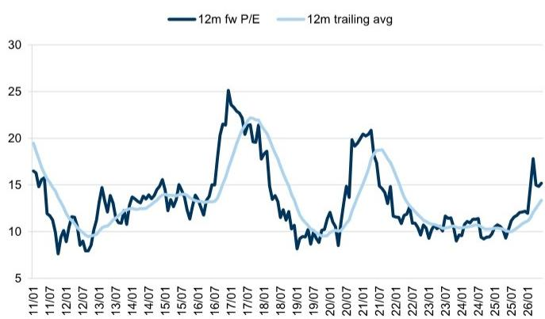
来源：LSEG Data & Analytics

## 目标价风险与方法论 - 小松

我们12个月目标价6,300日元基于2027年3月财年预期EBITDA，应用行业EV/EBITDA倍数10倍并给予25%的行业相对折价（相当于近期上行周期的平均值）。我们给予中性评级。

主要上行/下行风险包括：因大宗商品市场价格波动导致的新矿山机械需求或生产利用率高于/低于预期、美元/日元及其他汇率波动，以及美国关税导致的销售成本上升。

## 投资论点 - 小松

我们给予中性评级。小松是全球第二大建筑/矿山机械制造商，仅次于北美的卡特彼勒。在作为关键盈利驱动力的矿山机械业务中，我们预计铜和黄金领域的新车需求和生产利用率在全球范围内将总体保持稳健，但以煤炭为主的亚洲需求目前正在快速放缓。由于通用工程机械需求正在改善（主要是在库存调整已完成的美国和欧洲），我们预计整体盈利不会急剧恶化。然而，由于亚洲煤炭相关采矿需求的疲软仍构成拖累，整体需求前景存在不确定性。在缺乏明显的短期积极催化剂或长期增长预期提升因素的情况下，我们给予中性评级。

## 披露附录

## Reg AC

我们，武内健、石山雄一郎和榎貴斗，特此证明本报告中表达的所有观点准确反映了我们个人对相关公司及其证券的看法。我们还证明，我们的薪酬中没有任何部分直接或间接地与报告中表达的具体建议或观点相关。

除非另有说明，本报告封面所列人员为GS全球投资研究部分析师。

撰稿作者：武内健 GS Japan Co., Ltd.，石山雄一郎 GS Japan Co., Ltd.，榎貴斗 GS Japan Co., Ltd.

除非另有说明，本报告撰稿作者披露中列出的个人为GS全球投资研究部分析师。

## GS因子概况

GS因子概况通过将股票的关键属性与市场（即我们的评级股票池）及其行业同行进行比较，提供投资背景。所描绘的四个关键属性是：增长、财务回报、倍数（例如估值）和综合（增长、财务回报和倍数的复合）。增长、财务回报和倍数是通过对每只股票的特定指标使用标准化排名来计算的。各指标的标准化排名随后被平均并转换为相关属性的百分位数。每个指标的具体计算可能因财年、行业和地区而异，但标准方法如下：

增长基于股票的前瞻性销售增长、EBITDA增长和每股收益增长（对于金融股，仅每股收益和销售增长），百分位数越高表示增长公司越高。财务回报基于股票的前瞻性ROE、ROCE和CROCI（对于金融股，仅ROE），百分位数越高表示财务回报越高。倍数基于股票的前瞻性市盈率、市净率、价格/股息（P/D）、EV/EBITDA、EV/FCF和EV/债务调整后现金流（DACF）（对于金融股，仅市盈率、市净率和P/D），百分位数越高表示股票交易倍数越高。综合百分位数计算为增长百分位数、财务回报百分位数和（100% - 倍数百分位数）的平均值。

财务回报和倍数使用GS分析师对未来至少三个季度后的财年末的预测。增长使用对未来至少七个季度后的财年与未来至少三个季度后的财年相比的输入（所有指标均基于每股）。

有关我们如何计算GS因子概况的更详细说明，请联系您的GS代表。

## 并购排名

在我们的全球覆盖范围内，我们使用并购框架审视股票，考虑定性因素和定量因素（可能因行业和地区而异），以纳入某些公司可能被收购的可能性。然后，我们将并购排名作为对我们评级覆盖下的公司进行评分的手段，从1到3，其中1表示公司成为收购目标的可能性高（30%-50%），2表示可能性中等（15%-30%），3表示可能性低（0%-15%）。对于排名为1或2的公司，按照我们标准部门指引，我们将并购组成部分纳入目标价。并购排名3被视为不重要，因此不计入我们的目标价，并且可能在研究中讨论或不讨论。

## Quantum

Quantum是GS的专有数据库，提供详细的财务报表历史、预测和比率。它可用于对单一公司进行深入分析，或在不同行业和市场的公司之间进行比较。

## 披露

对小松和久保田的评级是相对于其覆盖范围内的其他公司：伊藤忠商事、Japan Material、小松、久保田、栗田工业、丸红、NOM Micro Science、Organo Corp.、双日、竹内制造

## 公司特定监管披露

以下披露涉及GS集团（及其关联公司，“GS”）与GS全球投资研究覆盖的公司之间的关系。

截至本报告前一个月末，GS实益拥有普通股1%或以上（不包括根据美国证券法无需合并的关联公司和业务部门持有的头寸）：小松（6,407日元）

GS在过去12个月内因投资银行服务获得报酬：小松（6,407日元）

GS预计在未来3个月内将寻求或打算寻求投资银行服务报酬：小松（6,407日元）、久保田（2,705日元）和久保田（ADR）（70.17美元）

GS在过去12个月内与小松（6,407日元）、久保田（2,705日元）和久保田（ADR）（70.17美元）存在投资银行服务客户关系

GS在过去12个月内与小松（6,407日元）存在非投资银行证券相关服务客户关系

GS在过去12个月内与小松（6,407日元）、久保田（2,705日元）和久保田（ADR）（70.17美元）存在非证券服务客户关系

## 评级/投资银行关系分布

GS投资研究全球股票覆盖范围

<table><tr><td colspan="3">评级分布</td></tr><tr><td>积极</td><td>中性</td><td>卖出</td></tr><tr><td>50%</td><td>34%</td><td>16%</td></tr></table>

<table><tr><td colspan="3">投资银行关系</td></tr><tr><td>积极</td><td>中性</td><td>卖出</td></tr><tr><td>65%</td><td>59%</td><td>43%</td></tr></table>

截至2026年7月1日，GS全球投资研究对3,104只股票有投资评级。GS将股票指定为各区域投资清单上的积极和卖出；未如此指定的股票被视为中性。此类指定相当于FINRA规则要求的上述披露中的积极、持有和卖出。请参阅下面的“评级、覆盖范围和相关定义”。投资银行关系图表反映了每个评级类别中GS在过去十二个月内提供过投资银行服务的公司百分比。

目标价和评级历史图表
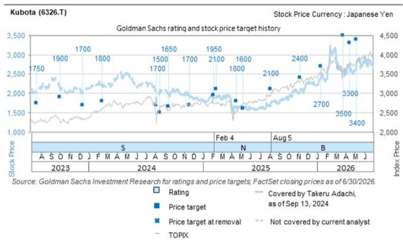
所示目标价应结合所有先前发布的GS报告（可能包含或不包含目标价）以及公司、行业和金融市场的发展情况来考虑。

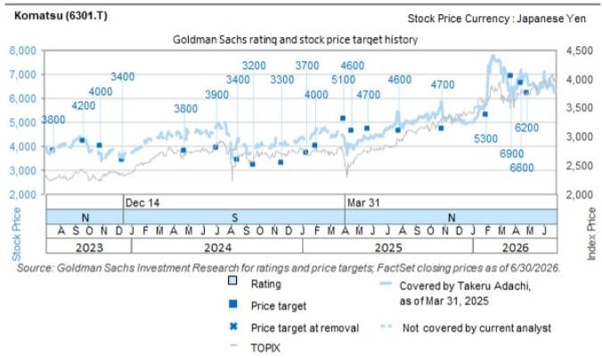
所示目标价应结合所有先前发布的GS报告（可能包含或不包含目标价）以及公司、行业和金融市场的发展情况来考虑。

## 目标价历史表格

小松（6301.T）
久保田（6326.T）

<table><tr><td>报告日期</td><td>目标价（日元）</td><td>收盘价（日元）</td><td>报告日期</td><td>目标价（日元）</td><td>收盘价（日元）</td></tr><tr><td>2026年4月28日</td><td>6,200</td><td>6,856</td><td>2026年5月8日</td><td>3,400</td><td>2,814</td></tr><tr><td>2026年4月16日</td><td>6,600</td><td>6,812</td><td>2026年4月16日</td><td>3,300</td><td>2,608</td></tr><tr><td>2026年3月25日</td><td>6,900</td><td>6,428</td><td>2026年3月25日</td><td>3,500</td><td>2,535</td></tr><tr><td>2026年1月30日</td><td>5,300</td><td>5,929</td><td>2026年1月14日</td><td>2,700</td><td>2,381</td></tr><tr><td>2025年10月29日</td><td>4,700</td><td>5,550</td><td>2025年11月7日</td><td>2,400</td><td>2,068</td></tr><tr><td>2025年7月29日</td><td>4,600</td><td>5,022</td><td>2025年8月5日</td><td>2,100</td><td>1,655</td></tr><tr><td>2025年5月23日</td><td>4,700</td><td>4,303</td><td>2025年5月9日</td><td>1,600</td><td>1,598</td></tr><tr><td>2025年4月18日</td><td>4,600</td><td>4,044</td><td>2025年4月18日</td><td>1,800</td><td>1,666</td></tr><tr><td>2025年3月31日</td><td>5,100</td><td>4,306</td><td>2025年2月13日</td><td>2,100</td><td>1,927</td></tr><tr><td>2025年1月31日</td><td>4,000</td><td>4,736</td><td>2025年2月4日</td><td>1,950</td><td>1,862</td></tr><tr><td>2025年1月12日</td><td>3,700</td><td>4,195</td><td>2024年11月19日</
