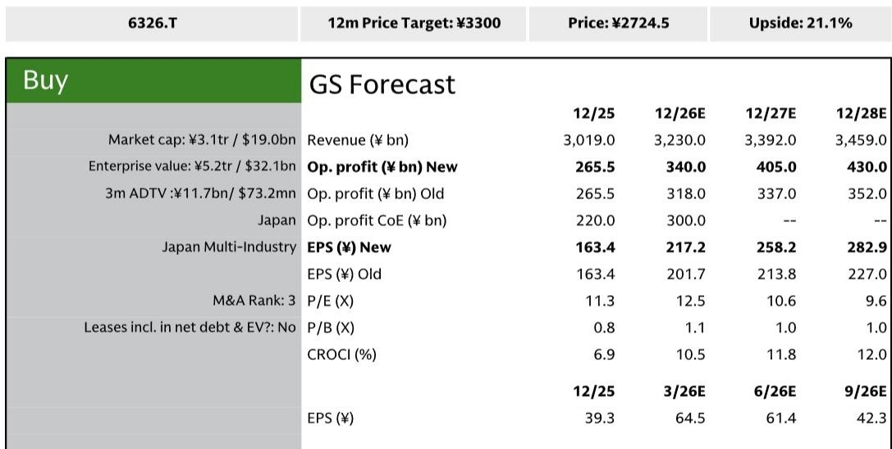
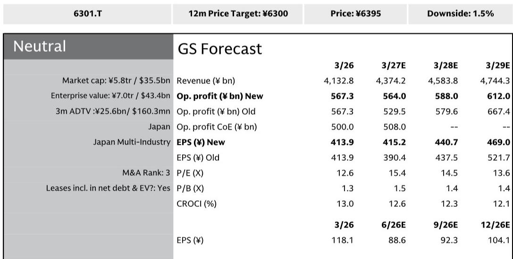
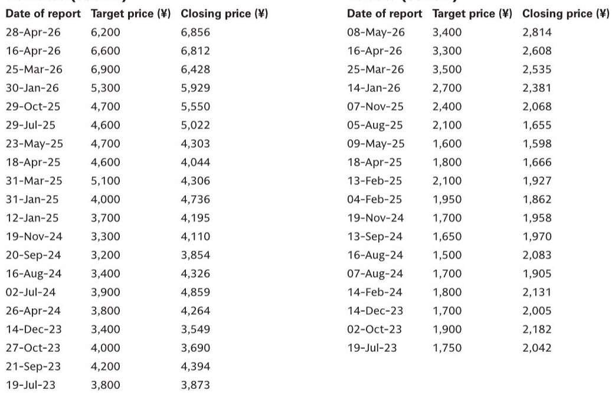

# 机械周期已分化：下一阶段更看重个股风险回报纪律，而非板块层面的判断

工程机械行业已进入一个传统周期分析不再提供统一方向信号的阶段。2026年上半年，北美液压挖掘机出口同比增长超过40%，但过去两年美国建筑投资基本持平于历史高位。这一看似矛盾的现象并非数据异常——它是当前环境的核心结构性特征。出货量和产量的增长反映的是库存回补周期，而非终端需求的复苏。与此同时，北美紧凑型拖拉机零售额5月同比下降25%，小型挖掘机出口额十个月来首次转为负值。该行业并非经历单一周期，而是多个不同步、甚至可能相互矛盾的周期在不同产品类别、终端市场和地区同时运行。

对观察者而言，结论是明确的：至少在可预见的未来，对机械行业进行广泛板块押注的时代已经结束。那些拥有特定产品组合、库存状况和终端市场敞口，并与当前出现的碎片化需求模式相匹配的公司，将更值得关注。分析任务已从预测单一宏观轨迹，转向构建一个独立评估各子板块的投资组合层面风险回报框架。对于报告中分析最详细的久保田而言，当前约14倍远期报价处于其历史12至16倍区间的中位数——这一水平既未体现乐观也未体现悲观，因此为愿意等待催化剂的观察者创造了不对称机会。

## 通用建筑领域的表面强势是库存周期而非需求复苏，这一区分对盈利可见性至关重要

当前环境中最显著的分析陷阱是将库存周期误认为需求周期。自2024年底以来，美国建筑投资一直处于高位持平趋势，即便在通胀调整前也是如此。然而，日本液压挖掘机出口额持续以超过20%的同比增长，对北美出口量更是加速至超过40%的同比增长。调和这两个事实的机制是2024年至2025年期间在分销商和经销商层面发生的库存调整。过剩库存已被清理至相当健康的水平，系统现已进入补库存的上行周期。批发需求的强劲势头可能在未来几个季度持续，直至这一过程完成。

关键问题是补库存结束后会发生什么。如果没有终端需求的全面复苏，有利的批发趋势将无法持续。报告指出，美国建筑投资已开始出现轻微的下行风险，特别是由于制造业投资下降。数据中心仍是一个亮点，但其总量不足以抵消更广泛的持平趋势。由此形成的模式是：短期顺风创造了虚假的动能感，随后在库存周期结束后进入一段不确定期。对于那些已将需求复苏计入报价的公司而言，失望的风险是实质性的。对于那些尚未计入的公司而言，当前的强势提供了一个可能不会持久的盈利支撑窗口。

## 紧凑型工程机械面临双重速度问题：小型挖掘机处于下行周期，而装载机缺乏加速催化剂

紧凑型工程机械板块揭示了行业内最明显的碎片化现象。小型挖掘机对住房相关需求依赖度高，正面临不可避免的下行周期。美国新屋开工自2022年以来呈下降趋势，对2026年下半年进一步加息的担忧带来了额外下行风险。小型挖掘机库存水平过高，报告指出必要库存调整的可能性已经增加。尽管早春观察到暂时性强势，但其背景并未明确归因于任何基本面改善。一直存在的下行风险如今已变为现实。

相比之下，装载机客户基础更广泛，且继续呈现稳健趋势。然而，其库存已达到健康水平，这意味着过去几年看到的强劲需求扩张不太可能重演。小型挖掘机市场恶化与装载机市场已正常化的组合，意味着整个紧凑型板块面临强劲的下行压力。对于像久保田这样对这两个产品类别都有显著敞口的公司而言，净效应是一个无法被任何单一产品线抵消的逆风。报告的评估是明确的：在终端需求全面复苏无望的情况下，目前宜持谨慎态度。

## 北美拖拉机需求处于历史低位，为2027年创造了基于更新需求的复苏逻辑——合理但不确定

拖拉机板块呈现出整个行业中最有趣的风险回报动态。近期北美紧凑型和中型拖拉机的零售额均低于初步预期，紧凑型拖拉机零售量可能连续第五年下降。然而，报告识别出一个支持2027年复苏的结构性论据：当前的低销量代表了更新需求的积累。从历史上看，如此低的水平往往先于正增长的出现，报告认为这一模式重演的可能性很高。

复苏路径并非自动实现。它取决于两个条件。首先，2025年进行的库存调整已为批发复苏留出了充足空间，即便零售需求依然低迷。其次，库存周期的正常化和更新需求的实现可能支持2027年紧凑型和中型拖拉机约5%的温和复苏。报告将其定性为谨慎但稳定的复苏，而非强劲反弹。风险方面，如果2026年下半年实施加息，农民的购买意愿将进一步受到抑制；如果下半年无法确认零售改善迹象，2027年的复苏情景可能不会实现。因此，拖拉机逻辑是一个条件性逻辑：它需要耐心、愿意看透短期疲弱，并接受时机无法保证的事实。

## 采矿机械受益于铜价强势，但印尼政策不确定性可能抵消正面因素

采矿机械板块提供了一个更直接的正面故事，但有一个重要前提。受人工智能和数据中心需求推动，铜价保持强劲，焦煤价格也较为坚挺。铁矿石是落后者，价格趋势不利。两大主要矿产资源公司必和必拓和力拓的资本支出周期预计已在2025年见顶并将逐步放缓。因此，采矿设备需求的整体趋势是高位持平至小幅增长，铜提供了基础支撑。

复杂性来自印尼，这是小松的关键市场。印尼动力煤价格与工程机械柴油价格之间的价差表明需求正在触底，但实际出货量依然低迷。更重要的是，政策环境正在发生显著变化。负面方面，国有企业DSI宣布自2027年1月起全面运营煤炭出口集中管理，这给私营采矿公司带来了不确定性。正面方面，能源和矿产资源部已明确政策，接受对生产配额修订的申请，这可能导致产能扩张，而对国内市场义务适用煤价的审查可能改善采矿公司盈利能力。总体评估是，如果煤炭市场状况不再恶化，逐步向好的方向是可能的。但印尼政策变量是一个重要的不确定性来源，观察者必须在进入下半年时密切关注。

## 碎片化周期的决策框架：关注库存状况、终端需求可见性和更新周期的不对称性

当前周期的碎片化性质需要一个脱离传统板块层面分析的决策框架。三个变量应指导公司选择。第一，相对于终端需求的库存状况。那些库存调整基本完成、批发需求由真实补库存而非投机性建仓驱动的公司，拥有短期缓冲。那些在面临结构性逆风的产品类别（如小型挖掘机）中库存过高的公司，则面临明确的下行风险。第二，终端需求可见性。通用建筑板块可见性较差，因其当前强势由库存驱动。拖拉机板块通过更新需求逻辑提供了条件性可见性。采矿板块通过铜需求提供了中等可见性，但被印尼政策风险所笼罩。第三，更新周期的不对称性。当销量达到历史低位时，均值回归复苏的概率增加，为耐心的观察者创造了不对称回报。这是支撑2027年拖拉机逻辑的基础。

具体到久保田，报告的分析转化为清晰的风险回报计算。该公司的拖拉机库存水平优于行业平均水平，这提供了一定的缓冲。FY12/26的盈利前景受到日元贬值和美国第232条关税减免的支持，这抵消了需求方面的下行因素。市场共识营业利润预测为3200亿日元，相对于报告估计的3400亿日元仍显保守，表明存在上调空间。当前约14倍的远期报价处于历史区间中位数，表明市场既未计入过度乐观也未计入过度悲观。可能提升盈利预测和报价的催化剂包括全年指引的上调或额外股份回购的宣布。

机械周期已经分化，但分化为那些能够驾驭碎片的人创造了机会。关键在于停止寻找单一信号，开始构建一个根据各子板块自身风险回报逻辑进行权重分配的组合。在这个环境中，能够产生超额回报的公司不一定是那些终端市场较强的公司，而是那些产品组合、库存状况和盈利催化剂与其实际所处周期的具体动态相匹配的公司。

*仅供参考。部分内容可能基于源材料通过人工智能辅助生成、翻译、总结或编辑，可能存在遗漏或错误。请独立核实。本文不构成专业建议。*

仅供参考。部分内容可能基于源材料通过人工智能辅助生成、翻译、总结或编辑，可能存在遗漏或错误。请独立核实。本文不构成专业建议。

