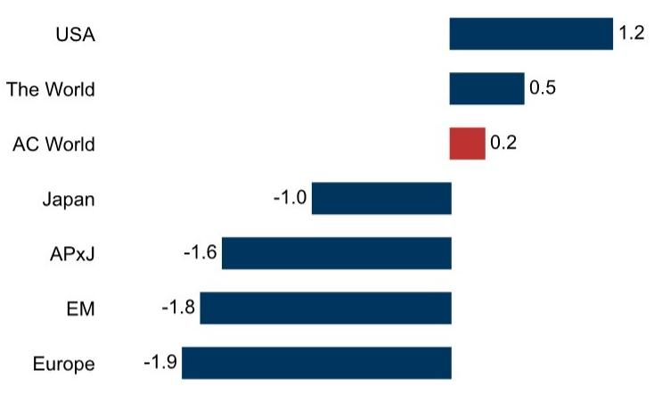
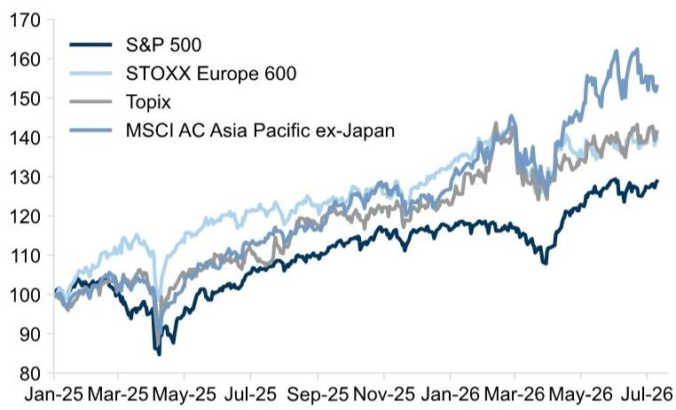
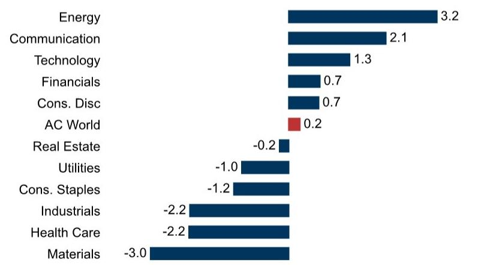
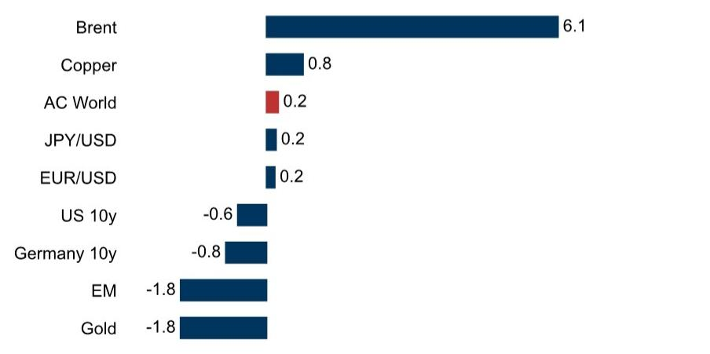
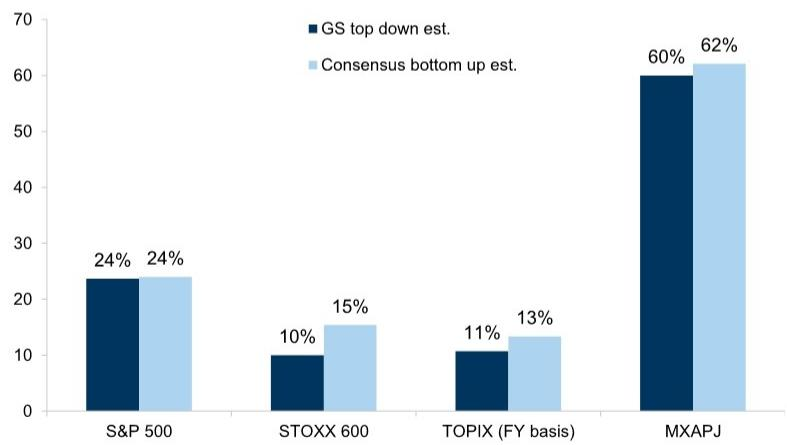
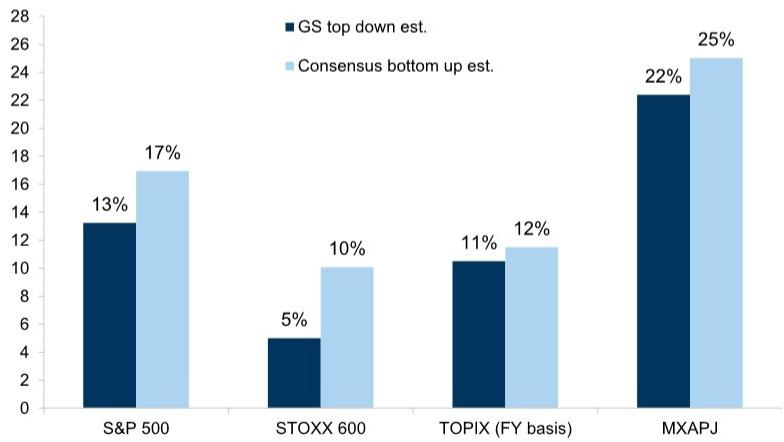
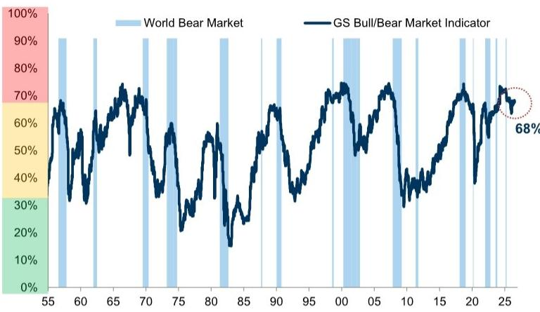
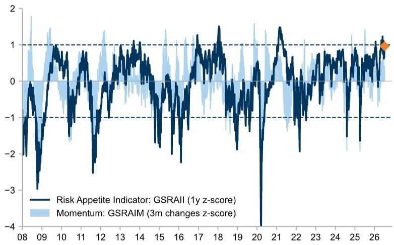
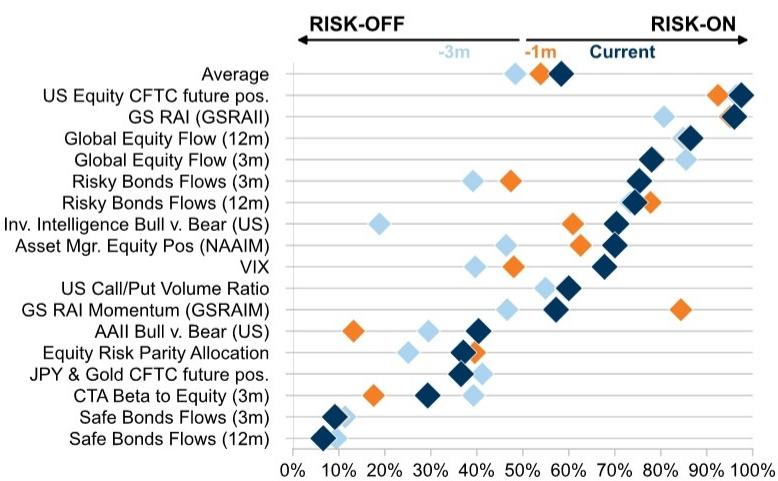

# 全球市场周度观察

## 美国与能源板块表现领先，中东局势再度引发关注

上周全球市场整体表现平稳。欧洲与新兴市场区域表现相对温和，美国是主要区域中相对少见录得正向表现的市场（图表1）。受地缘局势再度升温影响，能源板块表现突出（图表3），布伦特原油报价有所上升（图表4）。我们的风险偏好指标（RAI）较6月初的高位有所回落（图表11），但仍处于较高水平。

## 本周宏观数据

**美国：** CPI报告、零售销售报告，以及美联储官员的公开讲话，包括主席Warsh的半年度国会听证会。

**欧洲：** 欧元区与瑞典6月通胀终值、英国5月GDP数据；欧央行与英央行官员讲话。

**日本：** 7月路透短观调查中的制造业景气判断指数。

**亚洲（除日本外）：** 第二季度GDP数据，以及贸易、工业产出、投资和零售销售数据；新加坡与马来西亚第二季度GDP初值；印度与马来西亚6月CPI数据；韩国央行会议。

数据截至7月10日周五收盘。

## HALO策略再聚焦：从估值重估到盈利驱动

在欧洲，我们的策略师建议关注HALO类公司：重资产、低过时风险。更高的实际利率、地缘格局变化以及供应链重构，有利于实体生产性资产。

HALO交易的第一阶段已基本完成，但第二阶段才刚刚开始。展望未来，我们预计回报将越来越多地由盈利驱动，赢家与输家之间的分化将更加明显。

短期来看，持仓结构面临一定挑战，但长期来看具有支撑。在经历一轮强劲上涨后，存在战术性持仓风险。然而，长期配置仍明显偏向价值类资产。

在我们的资本密集型篮子中，有一半公司获得了股票分析师的报告评级。这些建议集中在五个主题：（1）基础设施，（2）基础材料，（3）航空航天与国防，（4）平台型公司，以及（5）技术硬件层。

详见：策略速递：HALO策略再聚焦——从估值重估到盈利驱动

Guillaume Jaisson +44(20)7552-3000 | guillaume.jaisson@gs.com GS International

Peter Oppenheimer +44(20)7552-5782 | peter.oppenheimer@gs.com GS International

Sharon Bell  
+44(20)7552-1341 | sharon.bell@gs.com GS International

John Kwon  
+65-6654-6337 |  
jongmin.kwon@gs.com  
GS (Singapore) Pte

Giovanni Ferrannini  
+44(20)7051-2589 |  
giovanni.ferrannini@gs.com  
GS International

Elena Porfidia  
+44(20)7051-5240 |  
elena.porfidia@gs.com  
GS International

## 一周概览——全球市场与指数

**图表1：全球市场表现**  
MSCI指数，1周价格回报（美元，%）

  
来源：Datastream, Bloomberg, GS全球投资研究

**图表2：全球股票指数** 美元计价，价格表现指数化

  
来源：Datastream, STOXX, GS全球投资研究

**图表3：MSCI全球行业表现**  
MSCI指数，1周价格回报（美元，%）

  
来源：Datastream, Bloomberg, GS全球投资研究

**图表4：跨资产表现** MSCI指数，1周价格回报（美元，%）

  
来源：Datastream, Bloomberg, GS全球投资研究

## 预测

**图表5：GDP增速，同比%：GS vs. 市场共识**

<table><tr><td colspan="6">实际GDP增速</td></tr><tr><td rowspan="2">同比变化百分比</td><td>2025</td><td colspan="2">2026</td><td colspan="2">2027</td></tr><tr><td>GS</td><td>GS</td><td>共识*</td><td>GS</td><td>共识*</td></tr><tr><td>美国</td><td>2.1</td><td>2.2</td><td>2.1</td><td>2.1</td><td>2.1</td></tr><tr><td>日本</td><td>1.1</td><td>0.5</td><td>0.6</td><td>1.0</td><td>0.8</td></tr><tr><td>欧元区</td><td>1.5</td><td>0.5</td><td>0.5</td><td>1.2</td><td>1.2</td></tr><tr><td>德国</td><td>0.3</td><td>0.7</td><td>0.6</td><td>1.1</td><td>1.1</td></tr><tr><td>法国</td><td>0.9</td><td>0.6</td><td>0.6</td><td>0.7</td><td>0.9</td></tr><tr><td>意大利</td><td>0.7</td><td>0.8</td><td>0.6</td><td>0.7</td><td>0.7</td></tr><tr><td>西班牙</td><td>2.8</td><td>2.3</td><td>2.3</td><td>1.6</td><td>1.8</td></tr><tr><td>英国</td><td>1.4</td><td>1.2</td><td>1.0</td><td>1.3</td><td>1.1</td></tr><tr><td>中国</td><td>5.0</td><td>4.7</td><td>4.6</td><td>4.7</td><td>4.4</td></tr><tr><td>发达市场</td><td>1.8</td><td>1.5</td><td>1.9</td><td>1.7</td><td>1.4</td></tr><tr><td>新兴市场</td><td>4.2</td><td>3.7</td><td>3.9</td><td>4.1</td><td>3.8</td></tr><tr><td>全球</td><td>2.8</td><td>2.5</td><td>2.8</td><td>2.8</td><td>2.5</td></tr></table>

\* 彭博国家及GS汇总共识  
来源：Bloomberg, GS全球投资研究

**图表6：GS宏观3、6、12个月预测**

<table><tr><td rowspan="2"></td><td rowspan="2">当前值</td><td colspan="3">预测值</td><td rowspan="2">距12个月目标价涨跌幅（%）</td></tr><tr><td>3个月</td><td>6个月</td><td>12个月</td></tr><tr><td colspan="6">股票市场</td></tr><tr><td>标普500</td><td>7575</td><td>7600</td><td>8000</td><td>8300</td><td>9.6</td></tr><tr><td>欧洲斯托克600</td><td>641</td><td>640</td><td>645</td><td>660</td><td>2.9</td></tr><tr><td>MSCI亚太（除日本）</td><td>871</td><td>980</td><td>1030</td><td>1080</td><td>23.9</td></tr><tr><td>东证指数</td><td>4036</td><td>4100</td><td>4200</td><td>4400</td><td>9.0</td></tr><tr><td colspan="6">10年期利率（%）</td></tr><tr><td>美国</td><td>4.6</td><td>4.4</td><td>4.4</td><td>4.3</td><td>-27 bp</td></tr><tr><td>欧元区（德国）</td><td>3.0</td><td>3.0</td><td>3.0</td><td>3.0</td><td>-4 bp</td></tr><tr><td>日本</td><td>2.7</td><td>2.5</td><td>2.5</td><td>2.4</td><td>-33 bp</td></tr><tr><td colspan="6">汇率</td></tr><tr><td>欧元/美元</td><td>1.14</td><td>1.14</td><td>1.12</td><td>1.12</td><td>-2.1</td></tr><tr><td>英镑/美元</td><td>1.34</td><td>1.33</td><td>1.29</td><td>1.28</td><td>-4.6</td></tr><tr><td>美元/日元</td><td>161</td><td>162</td><td>163</td><td>165</td><td>2.3</td></tr><tr><td colspan="6">大宗商品</td></tr><tr><td>布伦特原油（美元/桶）</td><td>76.0</td><td>83</td><td>80</td><td>75</td><td>-1.3</td></tr><tr><td>NYMEX天然气（美元/百万英热单位）</td><td>3.0</td><td>3.50</td><td>3.50</td><td>3.50</td><td>16.2</td></tr><tr><td>黄金（美元/盎司）</td><td>4098</td><td>4690</td><td>4900</td><td>5115</td><td>24.8</td></tr><tr><td>LME铜（美元/吨）</td><td>13419</td><td>13620</td><td>13735</td><td>13800</td><td>2.8</td></tr></table>

来源：Bloomberg, Datastream, STOXX, GS全球投资研究

**图表7：GS自上而下vs. 市场自下而上对2026年EPS增速的预估**  
  
来源：I/B/E/S, Toyo Keizai, STOXX, MSCI, GS全球投资研究

**图表8：GS自上而下vs. 市场自下而上对2027年EPS增速的预估**  
  
来源：I/B/E/S, Toyo Keizai, STOXX, MSCI, GS全球投资研究

## 风险与情绪指标

**图表9：GS牛/熊市指标（GSBLBR）**  
  
来源：Shiller, Haver Analytics, Datastream, GS全球投资研究

**图表10：GS牛/熊市指标各分项详情**
GS牛/熊市指标 = 平均百分位

<table><tr><td></td><td>水平</td><td>百分位</td></tr><tr><td>Shiller市盈率</td><td>40.8</td><td>98%</td></tr><tr><td>失业率</td><td>4.2</td><td>80%</td></tr><tr><td>0-6个季度回报表现曲线</td><td>0.4</td><td>72%</td></tr><tr><td>私人部门金融余额</td><td>3.9</td><td>55%</td></tr><tr><td>核心通胀</td><td>2.9</td><td>53%</td></tr><tr><td>ISM制造业指数</td><td>53.3</td><td>50%</td></tr><tr><td>GS牛/熊市指标</td><td></td><td>68%</td></tr></table>

注：第100百分位表示这些变量处于最高水平，但私人部门金融余额、回报表现曲线和失业率除外，其中100%表示它们处于最低水平。  
来源：Haver Analytics, Datastream, Robert Shiller, GS全球投资研究

## 图表11：风险偏好指标（GSRAII）

RAI基于跨资产类别的27对交易，以相对于过去2年表现的z-score衡量，详见2016年7月GOAL报告

  
来源：GS全球投资研究

**图表12：情绪指标百分位** 数据自2007年起  
  
来源：EPFR, Datastream, Haver Analytics, GS全球投资研究

## 表现——本地指数

**图表13：全球股票市场表现（本地指数）**

<table><tr><td rowspan="2">市场</td><td colspan="4">价格回报（本地货币，%）</td></tr><tr><td>指数</td><td>1周（本地）</td><td>年初至今</td><td>1年</td></tr><tr><td>中国（H股）</td><td>恒生中国企业指数</td><td>4.4</td><td>(9.8)</td><td>(7.3)</td></tr><tr><td>新加坡</td><td>海峡时报指数</td><td>4.3</td><td>17.7</td><td>34.2</td></tr><tr><td>香港</td><td>恒生指数</td><td>3.5</td><td>(5.7)</td><td>0.6</td></tr><tr><td>埃及</td><td>EGX30</td><td>3.5</td><td>25.1</td><td>57.0</td></tr><tr><td>波兰</td><td>WIG</td><td>2.2</td><td>21.3</td><td>35.5</td></tr><tr><td>巴西</td><td>IBOV</td><td>2.2</td><td>10.4</td><td>30.1</td></tr><tr><td>菲律宾</td><td>PCOMP</td><td>1.6</td><td>3.9</td><td>(2.7)</td></tr><tr><td>美国</td><td>标普500</td><td>1.2</td><td>10.7</td><td>20.6</td></tr><tr><td>新西兰</td><td>NZX 50</td><td>1.2</td><td>0.3</td><td>4.8</td></tr><tr><td>印度尼西亚</td><td>JCI</td><td>0.8</td><td>(31.5)</td><td>(15.4)</td></tr><tr><td>马来西亚</td><td>FBMKLCI</td><td>0.7</td><td>0.7</td><td>10.1</td></tr><tr><td>加拿大</td><td>SPTSX60</td><td>0.7</td><td>12.0</td><td>29.3</td></tr><tr><td>泰国</td><td>SET</td><td>0.6</td><td>28.7</td><td>46.0</td></tr><tr><td>捷克</td><td>PX</td><td>0.5</td><td>(2.2)</td><td>20.4</td></tr><tr><td>荷兰</td><td>AEX</td><td>0.1</td><td>14.0</td><td>16.9</td></tr><tr><td>印度</td><td>NIFTY</td><td>-0.3</td><td>(7.4)</td><td>(4.5)</td></tr><tr><td>挪威</td><td>OSEAX</td><td>-0.3</td><td>16.5</td><td>20.2</td></tr><tr><td>意大利</td><td>FTSEMIB</td><td>-0.4</td><td>17.1</td><td>29.8</td></tr><tr><td>匈牙利</td><td>HUX</td><td>-0.4</td><td>28.3</td><td>42.5</td></tr><tr><td>澳大利亚</td><td>AS51</td><td>-0.4</td><td>1.1</td><td>2.5</td></tr><tr><td>土耳其</td><td>XU100</td><td>-0.7</td><td>27.2</td><td>38.6</td></tr><tr><td>日本</td><td>东证指数</td><td>-0.7</td><td>18.4</td><td>43.5</td></tr><tr><td>墨西哥</td><td>MEXBOL</td><td>-0.8</td><td>3.4</td><td>17.2</td></tr><tr><td>希腊</td><td>ASE</td><td>-0.9</td><td>18.5</td><td>27.7</td></tr><tr><td>南非</td><td>JALSH</td><td>-1.0</td><td>(4.7)</td><td>13.3</td></tr><tr><td>奥地利</td><td>ATX</td><td>-1.2</td><td>21.8</td><td>43.9</td></tr><tr><td>中国（A股）</td><td>沪深300</td><td>-1.3</td><td>3.3</td><td>19.2</td></tr><tr><td>瑞士</td><td>SMI</td><td>-1.3</td><td>7.3</td><td>17.3</td></tr><tr><td>丹麦</td><td>KFX</td><td>-1.5</td><td>2.2</td><td>(8.4)</td></tr><tr><td>英国</td><td>UKX</td><td>-1.7</td><td>5.7</td><td>17.0</td></tr><tr><td>欧洲斯托克600</td><td>SXXP</td><td>-1.8</td><td>8.3</td><td>15.9</td></tr><tr><td>法国</td><td>CAC</td><td>-2.0</td><td>2.3</td><td>5.5</td></tr><tr><td>瑞典</td><td>OMX</td><td>-2.1</td><td>10.2</td><td>23.2</td></tr><tr><td>欧元区斯托克50</td><td>SX5E</td><td>-2.2</td><td>8.3</td><td>15.3</td></tr><tr><td>西班牙</td><td>IBEX</td><td>-2.4</td><td>12.0</td><td>37.1</td></tr><tr><td>葡萄牙</td><td>BVLX</td><td>-2.4</td><td>13.8</td><td>20.5</td></tr><tr><td>德国</td><td>DAX</td><td>-2.8</td><td>2.4</td><td>2.5</td></tr><tr><td>台湾</td><td>TWSE</td><td>-3.0</td><td>56.6</td><td>99.9</td></tr><tr><td>比利时</td><td>BEL20</td><td>-3.8</td><td>10.2</td><td>23.0</td></tr><tr><td>韩国</td><td>KOSPI</td><td>-7.6</td><td>77.4</td><td>134.9</td></tr></table>

<table><tr><td rowspan="2">市场</td><td colspan="4">相对价格回报（vs MSCI全球指数，美元，%）</td></tr><tr><td>指数</td><td>1周（美元）</td><td>年初至今</td><td>1年</td></tr><tr><td>中国（H股）</td><td>恒生中国企业指数</td><td></td><td>(21.5)</td><td>(28.8)</td></tr><tr><td>新加坡</td><td>海峡时报指数</td><td></td><td>6.2</td><td>11.4</td></tr><tr><td>香港</td><td>恒生指数</td><td></td><td>(17.4)</td><td>(20.9)</td></tr><tr><td>巴西</td><td>IBOV</td><td></td><td>7.3</td><td>19.6</td></tr><tr><td>埃及</td><td>EGX30</td><td></td><td>9.2</td><td>35.1</td></tr><tr><td>新西兰</td><td>NZX 50</td><td></td><td>(10.6)</td><td>(21.1)</td></tr><tr><td>菲律宾</td><td>PCOMP</td><td></td><td>(11.7)</td><td>(32.3)</td></tr><tr><td>美国</td><td>标普500</td><td></td><td>(0.4)</td><td>(1.0)</td></tr><tr><td>加拿大</td><td>SPTSX60</td><td></td><td>(2.6)</td><td>3.5</td></tr><tr><td>波兰</td><td>WIG</td><td></td><td>3.9</td><td>8.5</td></tr><tr><td>马来西亚</td><td>FBMKLCI</td><td></td><td>(10.6)</td><td>(6.6)</td></tr><tr><td>印度尼西亚</td><td>JCI</td><td></td><td>(47.7)</td><td>(45.6)</td></tr><tr><td>挪威</td><td>OSEAX</td><td></td><td>9.2</td><td>2.6</td></tr><tr><td>泰国</td><td>SET</td><td>-0.2</td><td></td><td>21.7</td></tr><tr><td>捷克</td><td>PX</td><td>-0.2</td><td></td><td>(2.0)</td></tr><tr><td>荷兰</td><td>AEX</td><td></td><td>(0.2)</td><td>(7.3)</td></tr><tr><td>澳大利亚</td><td>AS51</td><td></td><td>(5.8)</td><td>(13.1)</td></tr><tr><td>印度</td><td>NIFTY</td><td></td><td>(23.7)</td><td>(35.8)</td></tr><tr><td>意大利</td><td>FTSEMIB</td><td></td><td>2.8</td><td>5.3</td></tr><tr><td>日本</td><td>东证指数</td><td>-1.3</td><td></td><td>8.3</td></tr><tr><td>土耳其</td><td>XU100</td><td>-1.3</td><td></td><td>(3.4)</td></tr><tr><td>墨西哥</td><td>MEXBOL</td><td>-1.3</td><td></td><td>3.3</td></tr><tr><td>希腊</td><td>ASE</td><td>-1.4</td><td></td><td>3.2</td></tr><tr><td>中国（A股）</td><td>沪深300</td><td>-1.5</td><td></td><td>4.6</td></tr><tr><td>匈牙利</td><td>HUX</td><td>-1.6</td><td></td><td>34.5</td></tr><tr><td>英国</td><td>UKX</td><td>-1.6</td><td></td><td>(5.9)</td></tr><tr><td>奥地利</td><td>ATX</td><td>-1.6</td><td></td><td>19.1</td></tr><tr><td>丹麦</td><td>KFX</td><td>-1.9</td><td></td><td>(32.2)</td></tr><tr><td>南非</td><td>JALSH</td><td>-2.0</td><td></td><td>1.6</td></tr><tr><td>瑞士</td><td>SMI</td><td>-2.1</td><td></td><td>(5.8)</td></tr><tr><td>欧洲斯托克600</td><td>SXXP</td><td>-2.2</td><td></td><td>(8.2)</td></tr><tr><td>法国</td><td>CAC</td><td>-2.4</td><td></td><td>(18.4)</td></tr><tr><td>瑞典</td><td>OMX</td><td>-2.5</td><td></td><td>0.1</td></tr><tr><td>欧元区斯托克50</td><td>SX5E</td><td>-2.6</td><td></td><td>(8.9)</td></tr><tr><td>西班牙</td><td>IBEX</td><td>-2.8</td><td></td><td>12.4</td></tr><tr><td>葡萄牙</td><td>BVLX</td><td>-2.8</td><td></td><td>(3.8)</td></tr><tr><td>德国</td><td>DAX</td><td>-3.2</td><td></td><td>(21.4)</td></tr><tr><td>台湾</td><td>TWSE</td><td>-4.0</td><td></td><td>59.8</td></tr><tr><td>比利时</td><td>BEL20</td><td>-4.2</td><td></td><td>(1.3)</td></tr><tr><td>韩国</td><td>KOSPI</td><td>-6.2</td><td></td><td>92.7</td></tr></table>

来源：MSCI, STOXX, 各本地指数编制机构, FactSet, GS全球投资研究

## 各地区行业表现——周度

浅蓝色：低于MSCI全球市场表现1个标准差。深蓝色：高于MSCI全球市场表现1个标准差。

<table><tr><td rowspan="2">MSCI指数</td><td colspan="18">周度相对表现（%，美元）</td></tr><tr><td>美国</td><td>加拿大</td><td>英国</td><td>德国</td><td>法国</td><td>瑞士</td><td>西班牙</td><td>意大利</td><td>发达欧洲</td><td>日本</td><td>韩国</td><td>巴西</td><td>印度</td><td>中国</td><td>台湾</td><td>亚太（除日本）</td><td>新兴市场</td><td>全球</td></tr><tr><td>市场</td><td>1.2</td><td>0.8</td><td>-1.3</td><td>-2.7</td><td>-2.2</td><td>-2.0</td><td>-2.1</td><td>-0.6</td><td>-1.9</td><td>-1.0</td><td>-6.4</td><td>2.9</td><td>0.0</td><td>3.1</td><td>-3.6</td><td>-1.6</td><td>-1.8</td><td>0.2</td></tr><tr><td>能源</td><td>3.3</td><td>2.8</td><td>4.9</td><td>-</td><td>1.9</td><td>-</td><td>3.4</td><td>1.4</td><td>3.7</td><td>2.6</td><td>7.8</td><td>5.3</td><td>0.1</td><td>0.7</td><td>-</td><td>1.8</td><td>2.1</td><td>3.2</td></tr><tr><td>原材料</td><td>-2.3</td><td>-5.2</td><td>-3.3</td><td>-1.5</td><td>-3.1</td><td>-4.3</td><td>-</td><td>-3.2</td><td>-2.9</td><td>-0.6</td><td>-1.9</td><td>-2.9</td><td>-0.2</td><td>-5.5</td><td>-8.5</td><td>-3.9</td><td>-3.2</td><td>-3.0</td></tr><tr><td>工业</td><td>-1.3</td><td>1.2</td><td>-2.4</td><td>-5.7</td><td>-4.7</td><td>-4.5</td><td>-3.9</td><td>-5.7</td><td>-4.1</td><td>-1.3</td><td>-8.3</td><td>1.6</td><td>-0.6</td><td>-3.7</td><td>-6.6</td><td>-3.7</td><td>-4.6</td><td>-2.2</td></tr><tr><td>资本品</td><td>-1.8</td><td>0.4</td><td>-3.8</td><td>-6.4</td><td>-4.8</td><td>-4.9</td><td>-4.9</td><td>-5.7</td><td>-4.8</td><td>-1.9</td><td>-8.5</td><td>1.1</td><td>-0.3</td><td>-6.1</td><td>-8.6</td><td>-5.0</td><td>-5.8</td><td>-2.9</td></tr><tr><td>商业与专业服务</td><td>-0.3</td><td>-2.0</td><td>1.7</td><td>-</td><td>-0.2</td><td>-1.2</td><td>-</td><td>-</td><td>1.3</td><td>1.9</td><td>-</td><td>-</td><td>-</td><td>5.6</td><td>-</td><td>-1.4</td><td>5.6</td><td>0.2</td></tr><tr><td>交通运输</td><td>1.0</td><td>2.7</td><td>-</td><td>-0.2</td><td>-1.7</td><td>-2.2</td><td>-2.0</td><td>-</td><td>-1.1</td><td>1.4</td><td>-1.0</td><td>2.6</td><td>-2.1</td><td>1.4</td><td>-3.8</td><td>0.5</td><td>-0.2</td><td>0.8</td></tr><tr><td>可选消费</td><td>0.4</td><td>0.0</td><td>-0.7</td><td>-3.1</td><td>-1.0</td><td>-1.5</td><td>-3.2</td><td>-1.0</td><td>-1.1</td><td>-1.1</td><td>-2.6</td><td>11.1</td><td>-0.2</td><td>7.9</td><td>0.0</td><td>4.5</td><td>4.8</td><td>0.7</td></tr><tr><td>汽车与零部件</td><td>3.5</td><td>1.1</td><td>-</td><td>-3.7</td><td>-0.5</td><td>-</td><td>-</td><td>-0.6</td><td>-2.2</td><td>-1.4</td><td>-2.6</td><td>-</td><td>-0.7</td><td>0.4</td><td>-</td><td>-0.9</td><td>-0.9</td><td>1.
