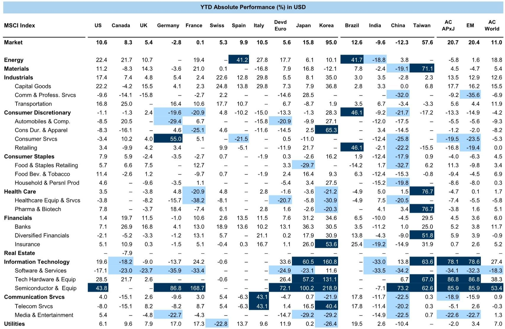
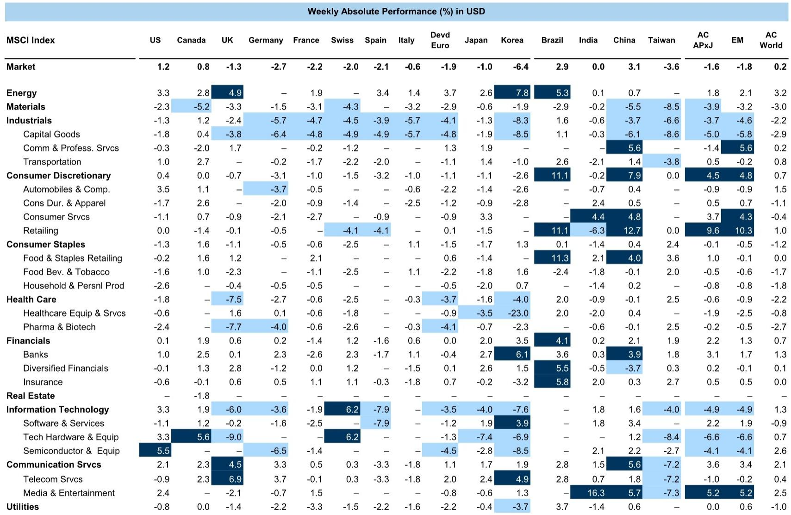
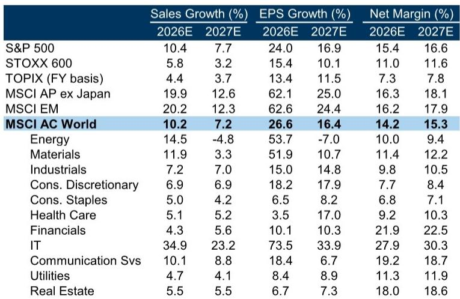

# The Second Phase of the HALO Trade Favors Earnings Selection Over Broad Re-Rating

Global equities ended last week broadly flat, but this apparent calm masks a significant divergence. The US market was the only major region to post a positive return, while Europe and emerging markets lagged. Energy was the standout sector, with Brent crude prices rising as Middle Eastern geopolitical tensions resurfaced. The global Risk Appetite Indicator has moderated from its elevated June levels but remains high, suggesting markets are not yet in risk-off territory but are no longer pricing in unqualified optimism.

This week brings a dense macro calendar that will test the current narrative. The US CPI report, retail sales data, and the start of Fed Chair Warsh's semiannual Congressional testimony will dominate attention. In Europe, final June inflation data for the Euro area and UK May GDP will be released alongside speeches from ECB and BoE officials. Japan's July Reuters Tankan survey, AEJ Q2 GDP data, and a Korea central bank meeting round out a week where inflation, growth, and policy signals converge.

The most consequential strategic insight for investors lies not in the week's data points, however, but in the evolving lifecycle of the HALO trade. The first phase—a broad re-rating of Heavy Assets, Low Obsolescence stocks driven by higher real yields, geopolitical fragmentation, and supply chain rewiring—is largely complete. What comes next is a fundamentally different regime where returns will be driven by earnings differentiation, not multiple expansion. This shift demands a more surgical approach to stock selection.

## The First Phase of the HALO Trade Has Matured, Shifting the Return Driver From Multiple Expansion to Earnings Delivery

The HALO framework identified a structural advantage for tangible productive assets in an environment of higher real yields, geopolitical fragmentation, and rewiring global supply chains. In its initial phase, this thesis played out primarily through valuation re-rating as investors repriced these assets to reflect their new strategic scarcity. That repricing is now largely reflected in market prices.

The critical implication is that the easy gains from simply being long the HALO basket are behind us. Going forward, the dispersion between winners and losers within the capital-intensive universe will widen significantly. Companies that can demonstrate earnings growth consistent with the structural tailwinds will continue to perform, while those that merely possess the asset profile but lack the operational execution will stagnate or decline. The market is transitioning from a regime where the right sector was sufficient to a regime where the right company within that sector is essential.

## Positioning Data Reveals a Contradiction: Short-Term Crowding Risk Coexists With Long-Term Under-Allocation to Value

Current positioning data presents a nuanced picture that investors must navigate carefully. On a tactical horizon, the strong rally in capital-intensive and value-oriented stocks has created meaningful crowding risk. The Risk Appetite Indicator, while moderated, remains elevated, and sentiment indicators show that certain trades have become consensus positions. This creates vulnerability to sharp reversals if macro data disappoints or if geopolitical events trigger a flight to safety.

However, this short-term risk masks a more important structural reality. Longer-term institutional allocations remain heavily skewed away from Value and toward Growth and passive strategies. The multi-decade underweight to tangible assets has not been fully unwound. This means that while tactical positioning is fragile, the strategic opportunity set remains compelling. Investors who can tolerate short-term volatility and maintain discipline through potential pullbacks are positioned to capture the second phase of the HALO trade, which will be driven by earnings rather than sentiment.

## Five Investment Themes Define Where Earnings Delivery Will Concentrate Within the Capital Intensive Universe

The second phase of the HALO trade is not a monolithic opportunity. Half of the Capital Intensive basket currently carries positive recommendations from equity analysts, and these recommendations cluster around five distinct themes. Infrastructure represents the most direct beneficiary of fiscal spending and supply chain rewiring. Basic Materials benefit from resource scarcity and the physical demands of the energy transition. Aerospace and Defence is driven by elevated geopolitical spending and the need to rebuild depleted inventories. Platforms encompass the industrial and logistical infrastructure that enables global trade. The Physical Layer of Tech includes the hardware, networking, and semiconductor capital equipment that underpins digital infrastructure.

Each of these themes has a different earnings trajectory, competitive dynamic, and valuation sensitivity. The common thread is that all require companies to execute operationally—to manage costs, invest capital efficiently, and demonstrate pricing power. The first phase rewarded the asset profile. The second phase will reward the earnings outcome.

## A Decision Framework for Navigating the Transition From Re-Rating to Earnings-Driven Returns

Investors need a structured approach to allocate capital in this new regime. The framework has three dimensions. First, assess earnings visibility. Companies with contracted revenue streams, long-duration backlogs, or pricing power derived from irreplaceable assets have an advantage. Infrastructure concession operators, defence contractors with multi-year procurement programs, and specialty chemical producers with limited substitutes all fit this profile.

Second, evaluate capital efficiency. The HALO thesis is about productive assets, but not all capital spending is created equal. Companies with high returns on invested capital, disciplined capital allocation, and a track record of converting investment into free cash flow will be rewarded. Those that over-invest without corresponding returns will see their valuations compress as the market shifts focus from asset ownership to asset productivity.

Third, monitor valuation discipline. The first phase of re-rating has brought some HALO stocks to full valuations. The second phase requires that earnings growth justify current prices. Investors should be willing to trim positions where the earnings story is not materializing and add where the valuation still embeds upside from operational improvement. The key is to avoid treating the basket as a single trade and instead manage it as a portfolio of differentiated earnings stories.

## Europe Faces a Particularly Sharp Test of the Earnings Thesis as Macro Headwinds Intensity

The European market underperformed last week, with the STOXX 600 falling 1.8% and Germany's DAX declining 2.8%. This weakness reflects a market that is already pricing in the transition to an earnings-driven regime without yet having the earnings data to confirm the thesis. The macro outlook for Europe is challenging, with GDP growth forecasts for the Euro area at just 0.5% for 2026, well below the US at 2.2%. High real yields, a strong euro, and ongoing industrial weakness create a headwind for earnings.

For European investors, the HALO trade is both more necessary and more difficult. The structural tailwinds from supply chain rewiring and defence spending are real, but the macro environment means that earnings delivery will require exceptional operational execution. Companies that can grow earnings in a low-growth economy will command a significant premium. Those that disappoint will be punished severely. The dispersion between winners and losers in European capital-intensive stocks is likely to be wider than in the US, making stock selection even more critical.

*For informational purposes only. Portions may be generated, translated, summarized, or edited with AI assistance based on source materials and may contain omissions or errors. Please verify independently. This is not investment, legal, tax, accounting, or other professional advice.*

For informational purposes only. Portions may be generated, translated, summarized, or edited with AI assistance based on source materials and may contain omissions or errors. Please verify independently. This is not investment, legal, tax, accounting, or other professional advice.

