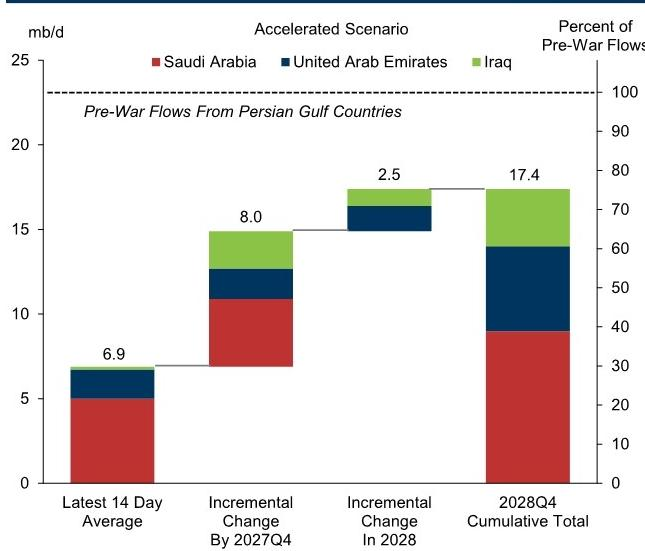
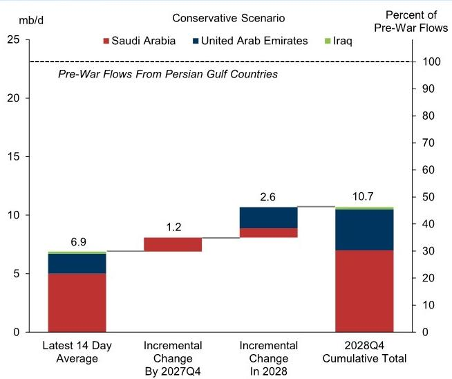

# 宏观观察：海湾地区出口的短期不确定性，长期管道对冲

近期，由于油轮遇袭事件和美伊冲突的再度升级，原油报价出现阶段性波动。这反映出霍尔木兹海峡的运输流量在短期内对价格仍具有关键影响。然而，从长期来看，我们估算中东地区将新增足够的管道运力，到2027年底，可覆盖波斯湾主要产油国战前出口水平超过45%的规模；到2028年底，这一比例将超过60%，从而有效对冲未来可能出现的霍尔木兹海峡运输中断风险（见图表1）。

■ 历史经验表明，中东地区的单一国家管道建设速度相对较快。

☐ 在我们研究的样本中，管道建设的中位时间为2.5年。通常，为应对供应中断而建设的项目速度更快，而需要多国协调的项目则相对较慢¹（见图表2）。

我们通过考察七条中东管道的建设情况，来估算未来可绕行霍尔木兹海峡的有效管道运力增量。这些管道包括已开工建设、处于规划阶段，以及涉及现有管道修复/扩建的潜在项目²。我们做出简化假设，认为新增管道运力将主要用于出口³。

在我们的基准情景下⁴，我们估算，到2027年底，有效管道运力将新增380万桶/日；到2028年底，累计新增730万桶/日⁵。这意味着到2028年底，有效管道运力将超过1400万桶/日，能够覆盖七个波斯湾国家战前2300万桶/日出口量的60%以上。这些国家在地理上需要依赖管道来降低霍尔木兹海峡运输中断对出口的影响⁶（见图表1）。

☐ 我们的估算对潜在项目的可行性和建设速度的假设较为敏感。

在我们的“加速情景”下⁷，到2028年底，管道运力可覆盖75%的出口量；而在“保守情景”下⁸，这一比例略高于45%（见图表3）。

在美伊冲突最激烈时期，我们已将长期价格假设（即三年期布伦特期货）上调了9美元/桶，至76美元/桶，主要基于结构性安全溢价的提升。近期的袭击事件再次表明，海湾地区的出口仍存在不确定性，若冲突再度升级，可能在短期内对原油报价构成上行风险。然而，绕行霍尔木兹海峡的管道运力最终扩张，将对这一长期价格假设构成下行风险⁹。

**我们的基准情景显示，到2028年底，有效管道运力将超过1400万桶/日，可覆盖波斯湾主要产油国战前出口量60%以上，以应对任何潜在的运输中断。**

我们以延布港（通过东西管道）、富查伊拉港（通过ADCOP管道）和博塔斯杰伊汉港（通过基尔库克-杰伊汉管道）的流量之和，作为当前有效管道运力的衡量指标（取最近14天平均值）。我们假设目前从博塔斯杰伊汉港出口的原油100%来自伊拉克。所考察的七个波斯湾国家为：沙特阿拉伯、科威特、伊拉克、卡塔尔、巴林、阿联酋和伊朗。

来源：GS全球投资研究

## 海湾出口：短期不确定性，长期管道对冲

**图表1：我们的基准情景显示，到2028年底，有效管道运力将超过1400万桶/日，可覆盖波斯湾主要产油国战前出口量60%以上，以应对任何潜在的运输中断。**

我们以延布港（通过东西管道）、富查伊拉港（通过ADCOP管道）和博塔斯杰伊汉港（通过基尔库克-杰伊汉管道）的流量之和，作为当前有效管道运力的衡量指标（取最近14天平均值）。我们假设目前从博塔斯杰伊汉港出口的原油100%来自伊拉克。所考察的七个波斯湾国家为：沙特阿拉伯、科威特、伊拉克、卡塔尔、巴林、阿联酋和伊朗。

来源：GS全球投资研究

**图表2：在9条主要管道的样本中，现有管道建设的中位时间为2.5年。**

涵盖波斯湾地区已建成的8条管道，以及历史上建设速度最快的管道（美国和加拿大）。东西管道（Petroline）和经沙特阿拉伯的伊拉克管道（IPSA）是为应对两伊战争而建，而戈雷赫-贾斯克管道则是为应对美国“极限施压”制裁而建。

**图表3：根据管道项目的范围和建设速度，我们估算，到2028年底，有效管道运力可覆盖波斯湾主要产油国战前出口量的45%至75%。**

我们以延布港（通过东西管道）、富查伊拉港（通过ADCOP管道）和博塔斯杰伊汉港（通过基尔库克-杰伊汉管道）的流量之和，作为当前有效管道运力的衡量指标（取最近14天平均值）。我们假设目前从博塔斯杰伊汉港出口的原油100%来自伊拉克。所考察的七个波斯湾国家为：沙特阿拉伯、科威特、伊拉克、卡塔尔、巴林、阿联酋和伊朗。

来源：GS全球投资研究
