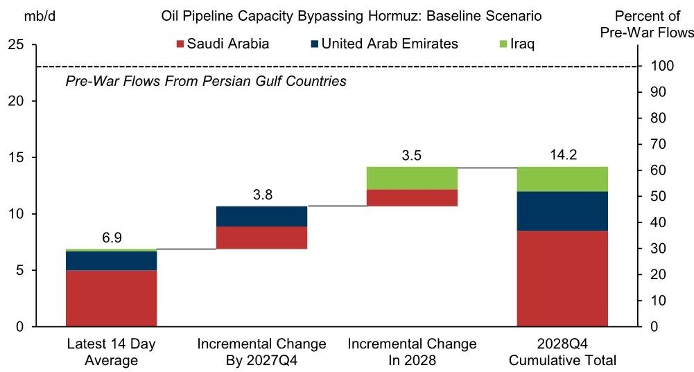
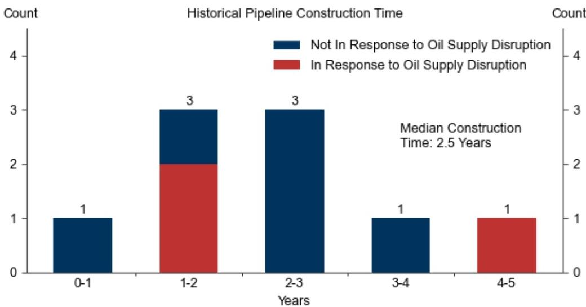

# GS：石油评论海湾出口短期不确定性长期管道对冲

近期油轮遇袭和美伊新一轮打击推高了油价，但GS这份报告的核心判断并非押注地缘溢价持续。它指向一个更结构性的变化：到2028年底，中东地区绕过霍尔木兹海峡的有效管道运力，将足以覆盖波斯湾七国战前出口量的60%以上。这意味着，每一次霍尔木兹扰动对油价的脉冲式冲击，其长期效力都在被物理基础设施的扩张所稀释。报告估算，到2027年底新增有效运力380万桶/日，到2028年底累计增加730万桶/日，总有效运力将超过1400万桶/日。这个数字不是假设，而是基于七条已在建设、规划或扩建中的管道项目推算得出。

## 1. 历史经验表明，中东单国管道从开工到投运的中位时间仅2.5年

GS梳理了九条主要管道的建设周期，发现中东地区的单国管道往往在供应中断后加速建成。例如，东西管道和伊拉克经沙特管道均是在两伊战争期间快速推进，而戈尔赫-贾斯克管道则是在美国“极限施压”制裁背景下建成。这个样本的关键启示是：当政治不确定性转化为明确的出口瓶颈时，管道建设的决策和执行速度可能快于市场预期。报告特别指出，跨国协调会拖慢进度，但单国项目通常更高效。这意味着，当前正在推进的七条管道中，那些不依赖多国合作的项目，其落地节奏可能比基准假设更早。

## 2. 三种情景下的运力覆盖范围差异显著，保守与加速之间相差30个百分点

报告设定了基准、加速和保守三种情景。在加速情景下，到2028年底有效管道运力可覆盖波斯湾七国战前出口量的75%；而在保守情景下，这一比例仅为45%。差距主要来自两个变量：一是潜在项目的可行性，二是建设速度。GS在基准假设中已经纳入了部分不确定性折价，但加速情景并非极端假设——它只是假设所有规划项目都能按历史最快节奏推进。这个区间意味着，即便在最保守的路径下，到2028年也有近一半的出口量可以绕过霍尔木兹，而一旦项目落地顺利，这一比例将接近四分之三。

> **KC评论：** 45%到75%的覆盖区间，本质上是在回答“霍尔木兹封锁对全球油市的冲击还能持续多久”。如果只看基准情景，2028年底60%的覆盖已经是一个重要的结构性拐点——届时地缘溢价的结构性基础将被大幅削弱。

## 3. 长期定价的核心变量正在从“能否通过”转向“需要多久”

报告在美伊冲突高峰时将三年期布伦特期货的长期价格假设上调了9美元/桶至76美元，主要理由是结构性安全溢价上升。但这份报告同时指出，绕过霍尔木兹的管道运力扩张，对这个长期价格假设构成了节奏变化不确定性。逻辑链条很清晰：安全溢价的前提是运输瓶颈的不可替代性。一旦管道运力足以覆盖大部分出口，霍尔木兹的“咽喉”属性就会从相对瓶颈降级为阶段性扰动。市场对长期油价的定价，将越来越多地取决于管道建设的实际进度，而非地缘事件的短期烈度。

## 4. 一个可复用的观察框架：关注管道项目清单而非油价波动

对产业决策者而言，这份报告提供了一个更务实的跟踪框架。与其每天追踪霍尔木兹周边的军事动态，不如盯住七条管道的建设节点：东西管道扩建、ADCOP管道扩容、基尔库克-杰伊汉管道的恢复进度，以及戈尔赫-贾斯克管道的二期规划。这些项目的审批、融资和施工公告，比任何一次油轮遇袭都更能预示长期油价的边际变化。报告没有给出具体的时间表，但历史中位2.5年的建设周期，为读者提供了一个可校准的参考锚点。

For informational purposes only. Portions may be generated,translated,summarized,or edited with AI assistance based on source materials and may contain omissions or errors. Please verify independently. This is not investment,legal,tax,accounting,or other professional advice.

For informational purposes only. Portions may be generated,translated,summarized,or edited with AI assistance based on source materials and may contain omissions or errors. Please verify independently. This is not investment,legal,tax,accounting,or other professional advice.

