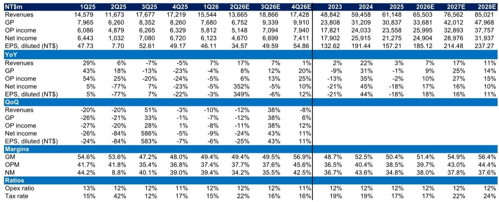
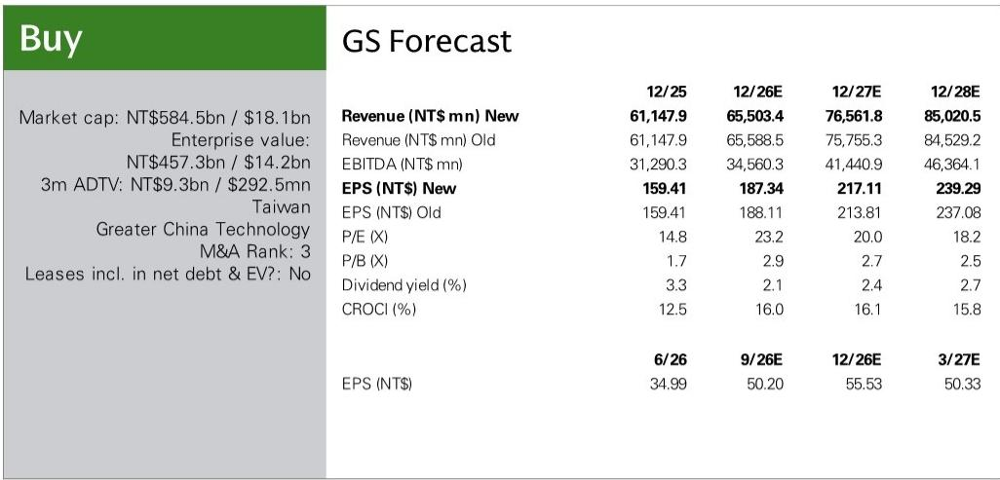
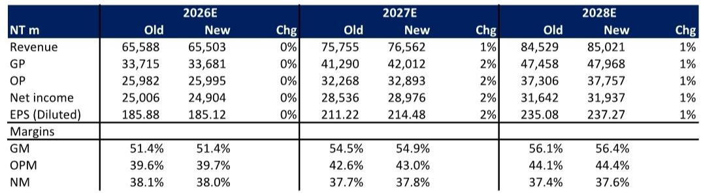

# GS：大立光CPO镜头进展-高端手机镜头2026年三季度量产

智能手机镜头规格升级的故事讲了多年，但真正让大立光这家台湾光学龙头进入新估值区间的，可能不是手机镜头多卖了几颗，而是CPO（共封装光学）镜头从实验室走向量产线的速度。GS在最新报告中给出一个关键时间点：大立光最快在2027年中进入CPO光纤阵列（FA）的量产阶段，目前已有明确客户项目在推进。这不是远期愿景，而是未来18个月就能验证的产能爬坡。

这份报告的核心判断是：大立光的高端手机镜头业务在2026年下半年将迎来季节性反弹，但真正支撑其毛利率从51%向56%以上移动的，是CPO镜头带来的新市场增量。GS将2027-2028年净利润预测上调了1-2%，主要基于产品组合升级和CPO的早期贡献。

## 1. CPO镜头不是替代手机镜头，而是打开一个精度更高的新市场

大立光在CPO领域的切入点很具体：光纤阵列（FA）和玻璃模造PMLA。管理层在法说会上透露，公司目前有一个项目已瞄准量产（单排FA），其他如双排、多排FA仍处于概念验证阶段。关键差异在于精度要求——用于光栅耦合的FA，其对准精度远高于边缘耦合方案，这正是大立光自研主动对准和测试设备的优势所在。

报告特别澄清了一个市场误解：GlassBridge方案主要用于边缘耦合，与大立光主攻的光栅耦合FA并不直接竞争，且GlassBridge目前商业化仍处于早期。这意味着大立光在CPO领域的竞争格局相对清晰，短期内不会陷入价格战。

> **KC评论：** 大立光在CPO上的优势不是规模，而是精密制造能力。手机镜头积累的微米级对准经验，在CPO光纤阵列中恰好是核心壁垒。这个逻辑能否兑现，关键看2026年三季度FA试产线的良率数据。

## 2. 手机镜头的规格升级在2027年仍有空间，但驱动逻辑变了

市场对手机镜头升级的担忧集中在“像素竞赛已经到头”。但GS认为，2027年的升级方向将从像素数量转向结构复杂度：潜望式镜头内部变焦、可变光圈镜头更高分辨率、折叠屏带来的超薄镜头和屏下镜头。这些变化对镜片数量、组装精度的要求更高，反而有利于大立光这类高端供应商。

报告引用的数据支撑了这一判断：大立光2026年第二季度营收同比增长17%，主要来自10-19MP镜头，而非低端产品。毛利率49.4%虽然环比持平，但管理层明确表示，随着可变光圈镜头良率提升，第三季度毛利率有望改善。GS预测2026-2028年毛利率将从51.4%逐步升至56.4%，这个斜率在手机零部件行业里并不常见。

## 3. GS与市场共识的分歧点：2027年营收和毛利率被低估

对比Bloomberg共识数据，GS对2027年营业利润的预测高出14%。差异来源有两个：一是营收预测高出7%，二是毛利率预测高出3.1个百分点。GS认为，在内存成本高企的环境下，高端智能手机品牌会进一步扩大市场份额，而大立光在高像素镜头领域的领先地位将直接受益。

这个分歧值得关注。市场可能低估了两个因素：一是高端机型在2027年的渗透率提升速度，二是CPO镜头即使初期贡献有限，也会在估值层面改变市场对大立光的认知框架。GS将目标市盈率从29.5倍微调至29.2倍，但强调这个倍数仍在大立光历史交易区间（8-31倍）内，反映的是“从手机镜头扩展到CPO镜头”这一结构性变化。

## 4. 一个可复用的观察框架：从“产品升级”转向“精度壁垒”的估值逻辑

大立光的案例提供了一个观察硬件公司转型的框架：当一家公司从成熟市场（手机镜头）进入新兴市场（CPO光学）时，市场对其估值逻辑会从“产品周期驱动”转向“技术壁垒驱动”。前者看的是季度出货量和ASP，后者看的是良率、客户认证进度和竞争对手的追赶难度。

报告中最有信息量的证据是：大立光在CPO领域的客户认证周期通常为2-4周，试产线计划在2026年第三季度末完成。这意味着2026年第四季度到2027年第一季度，市场将获得第一批关于良率和客户反馈的硬数据。在此之前，CPO对估值的贡献更多是情绪层面的，但一旦数据验证，估值框架的重置可能比营收增长来得更快。

For informational purposes only. Portions may be generated,translated,summarized,or edited with AI assistance based on source materials and may contain omissions or errors. Please verify independently. This is not investment,legal,tax,accounting,or other professional advice.

For informational purposes only. Portions may be generated,translated,summarized,or edited with AI assistance based on source materials and may contain omissions or errors. Please verify independently. This is not investment,legal,tax,accounting,or other professional advice.

