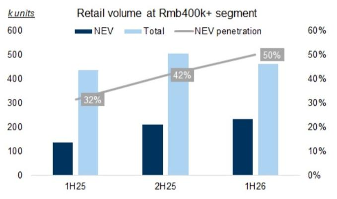
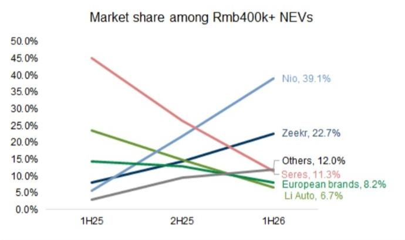
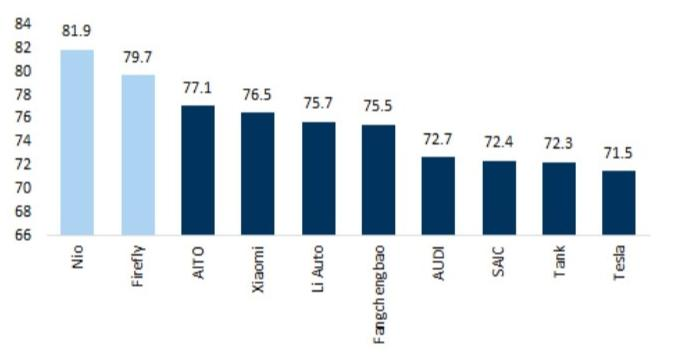
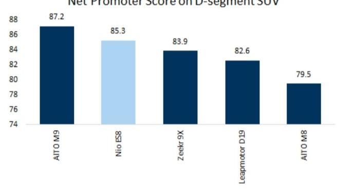
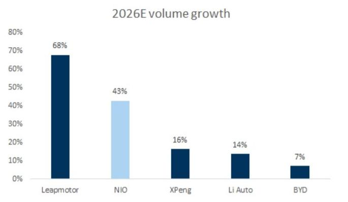
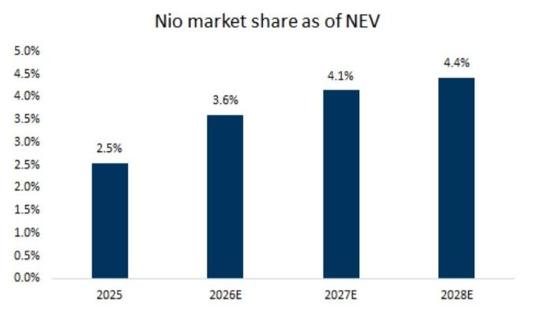
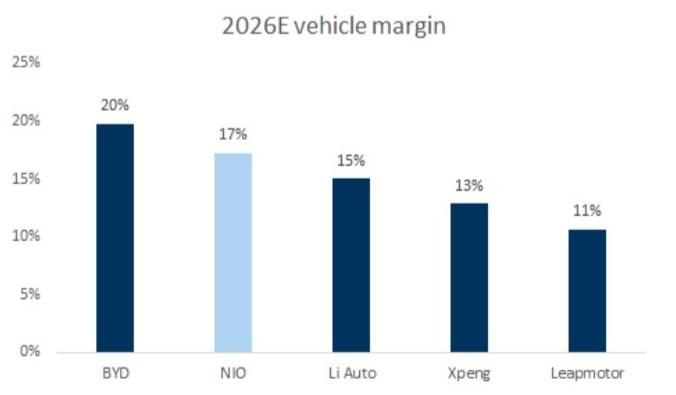
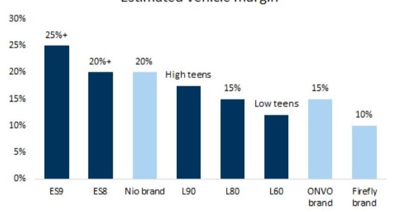

NIO INC. (NIO/9866.HK)

# 行业领先的增长与高端利润率特征，估值具备吸引力；评级上调至买入

我们将蔚来评级上调至买入，基于12个月DCF估值模型的目标价为7.0美元/55港元，隐含46%/42%的上行空间。在我们覆盖的公司中，我们预计蔚来不仅将实现最快的销量增长之一，还将在2026E年展现出高端利润率特征以及强劲的盈利/自由现金流转正。这得益于公司成功推出的新ES8/ES9（在人民币40万以上新能源车细分市场以39%的市场份额占据第一），以及领先的品牌力（由高质量净推荐值所证明），巩固了其在高端新能源车市场的地位，我们认为这创造了更高的竞争壁垒，且更难被竞争对手取代。展望未来，我们相信公司可以将类似的策略应用于其5系列和6系列车型（定价在人民币20万-40万之间），并在2027E年及以后重振这些车型的销量，进一步巩固其在高端市场的定位，并推动市场份额的持续增长。

尽管2026年上半年国内新能源车市场同比增长为-14%，蔚来仍实现了+67%的同比增长。对于2026E全年，我们预计其销量/收入同比增长为+43%/+60%，非GAAP净利润为16亿人民币（对比2025年亏损124亿人民币），我们也预计自由现金流将从2025年的-31亿人民币显著改善至2026E年的121亿人民币。然而，其股价年初至今下跌-6%，较2026年4月的近期高点下跌-32%，我们认为这与公司正在改善的基本面脱节。与我们覆盖的纯新能源车同行相比，蔚来在2026E/27E年市销率上存在25%/29%的折价，在2027E年市盈率上存在17%的折价，考虑到其近期的产品势头和强劲增长，我们认为这具有吸引力。催化剂包括ES8五座版交付的爬坡、以及财报中利润的改善。

我们的不同之处：我们对2026E-2028E年的盈利预测比Visible Alpha一致预期高出30%（部分由于低基数），主要基于更高的收入和更低的运营支出，因为我们相信公司的高端品牌力能够支撑未来更稳定的定价和更高效的营销支出。

预测与目标价调整：我们将2026E-2028E年的盈利预测上调1%-9%，主要基于ES8/ES9强劲销售带来的更高毛利率。相应地，我们基于12个月DCF模型的目标价上调6%至7.0美元/55港元，隐含46%/42%的上行空间。我们将蔚来评级上调至买入（此前为中性）。风险：销量低于预期、价格竞争加剧、成本通胀高于预期。

Tina Hou  
+86(21)2401-8694 |  
tina.hou@goldmansachs.cn  
GS (China) Securities  
Company Limited

Jenny Du  
+86(21)2401-8978 |  
jenny.x.du@goldmansachs.cn  
GS (China) Securities  
Company Limited

图表1：蔚来财务摘要

<table><tr><td>利润模型 (Rmb mn)</td><td>12/25</td><td>12/26E</td><td>12/27E</td><td>12/28E</td></tr><tr><td>总收入</td><td>87,488</td><td>140,339</td><td>163,491</td><td>175,745</td></tr><tr><td>销售成本</td><td>(75,572)</td><td>(115,670)</td><td>(133,960)</td><td>(143,817)</td></tr><tr><td>销售、一般及管理费用</td><td>(16,088)</td><td>(15,588)</td><td>(17,388)</td><td>(18,688)</td></tr><tr><td>研发费用</td><td>(10,605)</td><td>(10,130)</td><td>(10,130)</td><td>(10,130)</td></tr><tr><td>其他营业利润/(费用)</td><td>736</td><td>736</td><td>736</td><td>736</td></tr><tr><td>EBITDA</td><td>(6,895)</td><td>7,874</td><td>12,008</td><td>14,108</td></tr><tr><td>折旧与摊销</td><td>7,147</td><td>8,186</td><td>9,258</td><td>10,262</td></tr><tr><td>EBIT</td><td>(14,041)</td><td>(312)</td><td>2,749</td><td>3,846</td></tr><tr><td>利息收入</td><td>762</td><td>718</td><td>908</td><td>1,039</td></tr><tr><td>利息费用</td><td>(885)</td><td>(792)</td><td>(792)</td><td>(792)</td></tr><tr><td>未合并子公司收益/(亏损)</td><td>(1,092)</td><td>80</td><td>40</td><td>20</td></tr><tr><td>其他非营业收益/(费用)</td><td>436</td><td>125</td><td>-</td><td>-</td></tr><tr><td>税前利润</td><td>(14,821)</td><td>(181)</td><td>2,905</td><td>4,113</td></tr><tr><td>所得税</td><td>(122)</td><td>(1)</td><td>(436)</td><td>(617)</td></tr><tr><td>少数股东权益</td><td>(18)</td><td>(0)</td><td>4</td><td>5</td></tr><tr><td>净利润 (非GAAP)</td><td>(12,432)</td><td>1,608</td><td>4,264</td><td>5,291</td></tr><tr><td>每ADS基本收益 (非GAAP)</td><td>(5.47)</td><td>0.71</td><td>1.88</td><td>2.33</td></tr><tr><td>每股股息</td><td>-</td><td>-</td><td>-</td><td>-</td></tr></table>

<table><tr><td>资产负债表 (Rmb mn)</td><td>12/25</td><td>12/26E</td><td>12/27E</td><td>12/28E</td></tr><tr><td>现金及等价物</td><td>45,776</td><td>57,867</td><td>66,205</td><td>73,254</td></tr><tr><td>应收账款</td><td>17,473</td><td>25,498</td><td>26,758</td><td>25,595</td></tr><tr><td>存货</td><td>8,531</td><td>12,347</td><td>13,477</td><td>13,586</td></tr><tr><td>其他流动资产</td><td>4,854</td><td>4,854</td><td>4,854</td><td>4,854</td></tr><tr><td>流动资产合计</td><td>76,633</td><td>100,566</td><td>111,294</td><td>117,289</td></tr><tr><td>不动产、厂房及设备净额</td><td>25,828</td><td>24,757</td><td>21,715</td><td>17,722</td></tr><tr><td>无形资产净额</td><td>226</td><td>221</td><td>216</td><td>210</td></tr><tr><td>证券投资</td><td>2,481</td><td>2,561</td><td>2,601</td><td>2,621</td></tr><tr><td>其他长期资产</td><td>19,233</td><td>19,233</td><td>19,233</td><td>19,233</td></tr><tr><td>资产总计</td><td>124,401</td><td>147,339</td><td>155,058</td><td>157,075</td></tr><tr><td>应付账款</td><td>53,936</td><td>75,265</td><td>78,724</td><td>75,455</td></tr><tr><td>短期借款</td><td>6,856</td><td>6,856</td><td>6,856</td><td>6,856</td></tr><tr><td>流动租赁负债</td><td>1,619</td><td>342</td><td>257</td><td>260</td></tr><tr><td>其他流动负债</td><td>16,172</td><td>17,449</td><td>17,534</td><td>17,531</td></tr><tr><td>流动负债合计</td><td>78,583</td><td>99,912</td><td>103,371</td><td>100,102</td></tr><tr><td>长期债务</td><td>8,626</td><td>8,626</td><td>8,626</td><td>8,626</td></tr><tr><td>非流动租赁负债</td><td>10,092</td><td>3,388</td><td>2,546</td><td>2,577</td></tr><tr><td>其他长期负债</td><td>14,408</td><td>21,111</td><td>21,954</td><td>21,923</td></tr><tr><td>负债合计</td><td>111,709</td><td>133,038</td><td>136,497</td><td>133,228</td></tr><tr><td>优先股</td><td>8,552</td><td>8,552</td><td>8,552</td><td>8,552</td></tr><tr><td>普通股权益合计</td><td>4,159</td><td>5,768</td><td>10,031</td><td>15,323</td></tr><tr><td>少数股东权益</td><td>(19)</td><td>(19)</td><td>(22)</td><td>(27)</td></tr><tr><td>负债及权益总计</td><td>124,401</td><td>147,339</td><td>155,058</td><td>157,075</td></tr><tr><td>每股账面价值</td><td>1.8</td><td>2.5</td><td>4.4</td><td>6.7</td></tr></table>

<table><tr><td>增长与利润率 (%)</td><td>12/25</td><td>12/26E</td><td>12/27E</td><td>12/28E</td></tr><tr><td>销售增长</td><td>33.1%</td><td>60.4%</td><td>16.5%</td><td>7.5%</td></tr><tr><td>EBITDA增长</td><td>56.9%</td><td>214.2%</td><td>52.5%</td><td>17.5%</td></tr><tr><td>EBIT增长</td><td>35.8%</td><td>97.8%</td><td>980.7%</td><td>39.9%</td></tr><tr><td>净利润增长</td><td>39.0%</td><td>112.9%</td><td>165.1%</td><td>24.1%</td></tr><tr><td>毛利率</td><td>13.6%</td><td>17.6%</td><td>18.1%</td><td>18.2%</td></tr><tr><td>EBITDA利润率</td><td>-7.9%</td><td>5.6%</td><td>7.3%</td><td>8.0%</td></tr><tr><td>EBIT利润率</td><td>-16.0%</td><td>-0.2%</td><td>1.7%</td><td>2.2%</td></tr><tr><td>非GAAP净利润率</td><td>-14.2%</td><td>1.1%</td><td>2.6%</td><td>3.0%</td></tr></table>

<table><tr><td>现金流量表 (Rmb mn)</td><td>12/25</td><td>12/26E</td><td>12/27E</td><td>12/28E</td></tr><tr><td>净利润（优先股股息前）</td><td>(14,961)</td><td>(183)</td><td>2,473</td><td>3,501</td></tr><tr><td>加回折旧与摊销</td><td>7,147</td><td>8,186</td><td>9,258</td><td>10,262</td></tr><tr><td>加回少数股东权益</td><td>18</td><td>0</td><td>(4)</td><td>(5)</td></tr><tr><td>营运资本净变动</td><td>15,434</td><td>9,487</td><td>1,070</td><td>(2,216)</td></tr><tr><td>其他经营活动现金流</td><td>453</td><td>2,986</td><td>(4,262)</td><td>3,868</td></tr><tr><td>经营活动现金流</td><td>2,993</td><td>19,201</td><td>14,548</td><td>13,313</td></tr><tr><td>资本支出</td><td>(6,065)</td><td>(7,110)</td><td>(6,211)</td><td>(6,264)</td></tr><tr><td>收购</td><td>(6,362)</td><td>-</td><td>-</td><td>-</td></tr><tr><td>资产剥离</td><td>-</td><td>-</td><td>-</td><td>-</td></tr><tr><td>其他</td><td>967</td><td>-</td><td>-</td><td>-</td></tr><tr><td>投资活动现金流</td><td>(11,460)</td><td>(7,110)</td><td>(6,211)</td><td>(6,264)</td></tr><tr><td>支付的股息（普通股及优先股）</td><td>-</td><td>-</td><td>-</td><td>-</td></tr><tr><td>债务增加/(减少)</td><td>(5,461)</td><td>-</td><td>-</td><td>-</td></tr><tr><td>普通股发行（回购）</td><td>11,855</td><td>-</td><td>-</td><td>-</td></tr><tr><td>其他融资活动现金流</td><td>435</td><td>-</td><td>-</td><td>-</td></tr><tr><td>融资活动现金流</td><td>6,828</td><td>-</td><td>-</td><td>-</td></tr><tr><td>现金净变动</td><td>(1,639)</td><td>12,091</td><td>8,338</td><td>7,049</td></tr></table>

来源：公司数据，GS全球研究

<table><tr><td>比率</td><td>12/25</td><td>12/26E</td><td>12/27E</td><td>12/28E</td></tr><tr><td>ROIC</td><td>NM</td><td>NM</td><td>NM</td><td>NM</td></tr><tr><td>ROE</td><td>NM</td><td>NM</td><td>NM</td><td>NM</td></tr><tr><td>ROA</td><td>NM</td><td>NM</td><td>NM</td><td>NM</td></tr><tr><td>存货周转天数</td><td>43.7</td><td>41.2</td><td>39.0</td><td>36.7</td></tr><tr><td>应收账款周转天数</td><td>52.1</td><td>72.9</td><td>66.3</td><td>59.7</td></tr><tr><td>应付账款周转天数</td><td>214.4</td><td>260.5</td><td>237.5</td><td>214.5</td></tr><tr><td>资产负债率</td><td>87.4%</td><td>89.8%</td><td>90.3%</td><td>88.0%</td></tr></table>

<table><tr><td>估值</td><td>12/25</td><td>12/26E</td><td>12/27E</td><td>12/28E</td></tr><tr><td colspan="5">目标价隐含估值</td></tr><tr><td>市盈率</td><td>(9.1)</td><td>70.7</td><td>26.7</td><td>21.5</td></tr><tr><td>市销率</td><td>1.3</td><td>0.8</td><td>0.7</td><td>0.6</td></tr><tr><td>市净率</td><td>9.0</td><td>8.0</td><td>6.2</td><td>4.8</td></tr><tr><td>EV/EBITDA</td><td>NM</td><td>NM</td><td>NM</td><td>NM</td></tr><tr><td colspan="5">当前股价隐含估值</td></tr><tr><td>市盈率</td><td>(6.2)</td><td>48.3</td><td>18.2</td><td>14.7</td></tr><tr><td>市销率</td><td>0.9</td><td>0.6</td><td>0.5</td><td>0.4</td></tr><tr><td>市净率</td><td>6.1</td><td>5.4</td><td>4.2</td><td>3.3</td></tr><tr><td>EV/EBITDA</td><td>NM</td><td>NM</td><td>NM</td><td>NM</td></tr></table>

## (1) ES8/ES9成功实现转折

自2025年9月起，蔚来已开始成功更新其产品线，突出表现为全新ES8的推出和交付，截至2026年6月，其过去12个月月均销量超过1万辆，在人民币40万以上SUV细分市场中排名第一。继2026年5月推出ES9和L80后，蔚来在2026年上半年交付了19.1万辆（同比增长67%，对比行业新能源车零售增长为-14%），并将其在新能源车零售市场的份额扩大至2026年上半年的3.6%（对比2025年上半年的2.1%）。截至2026年上半年，蔚来品牌在人民币40万以上细分市场以39%的市场份额占据第一。

我们观察到，基于我们的产品比较框架，蔚来在过去四个季度中展现出持续推出更具竞争力车型的能力。该框架识别了四个关键的消费者购买因素，即价格、续航、尺寸和自动驾驶。基于我们对人民币40万以上畅销新能源SUV/MPV的产品比较分析，我们看到蔚来的ES8和ES9均位列最畅销车型前五（尤其是ES8排名第一），在价格和尺寸方面具有竞争优势（图表4）。

图表2：2026年上半年新能源车渗透率达到50%，在人民币40万价格区间

来源：乘联会

图表3：在新能源车人民币40万以上价格区间，蔚来市场份额从2025年上半年的6%增至2026年上半年的39%

来源：乘联会

图表4：蔚来ES8/ES9产品对比
最畅销新能源SUV/MPV前十名（建议零售价人民币40万以上）

<table><tr><td>OEM 车型</td><td>蔚来 ES8 纯电</td><td>吉利 极氪9X 插混</td><td>赛力斯 问界M9 增程</td><td>蔚来 ES9 纯电</td><td>沃尔沃 XC70 插混</td><td>理想 L9 增程</td><td>上汽 大通 插混</td><td>理想 MEGA 纯电</td><td>沃尔沃 极氪009 纯电</td><td>赛力斯 问界M9 纯电</td></tr><tr><td>车型上市日期（最新改款入门级）</td><td>2025年9月</td><td>2025年9月</td><td>2025年3月</td><td>2026年5月</td><td>2026年4月</td><td>2025年5月</td><td>2025年12月</td><td>2025年4月</td><td>2024年7月</td><td>2025年3月</td></tr><tr><td>车身类型</td><td>SUV</td><td>SUV</td><td>SUV</td><td>SUV</td><td>SUV</td><td>SUV</td><td>MPV</td><td>MPV</td><td>MPV</td><td>SUV</td></tr><tr><td>细分市场</td><td>D</td><td>D</td><td>D</td><td>D</td><td>C</td><td>D</td><td>C</td><td>D</td><td>C</td><td>D</td></tr><tr><td>座位数</td><td>6/7</td><td>6</td><td>5/6</td><td>6-1月</td><td>5</td><td>6</td><td>7</td><td>7</td><td>7</td><td>6</td></tr><tr><td>动力类型</td><td>纯电</td><td>插混</td><td>增程</td><td>纯电</td><td>插混</td><td>增程</td><td>插混</td><td>纯电</td><td>纯电</td><td>增程</td></tr><tr><td>入门价格 (Rmb k)</td><td>406.8</td><td>465.9</td><td>469.8</td><td>498.0</td><td>411.9</td><td>409.8</td><td>439.9</td><td>529.8</td><td>439.0</td><td>509.8</td></tr><tr><td>最大续航里程 (km)</td><td>635</td><td>1,200</td><td>1,474</td><td>620</td><td>1,203</td><td>1,412</td><td>1,320</td><td>710</td><td>740</td><td>630</td></tr><tr><td>轴距 (mm)</td><td>3,130</td><td>3,169</td><td>3,110</td><td>3,250</td><td>2,895</td><td>3,105</td><td>3,160</td><td>3,300</td><td>3,205</td><td>3,110</td></tr><tr><td>硬件 0-100km/h加速时间 (s)</td><td>3.97</td><td>3.9</td><td>4.9</td><td>4.3</td><td>8</td><td>5.18</td><td>5.8</td><td>5.5</td><td>6.9</td><td>4.3</td></tr><tr><td>电池容量 (kWh)</td><td>102.0</td><td>55.0</td><td>52.0</td><td>102.0</td><td>21.2</td><td>52.3</td><td>40.9</td><td>102.7</td><td>108.0</td><td>100</td></tr><tr><td>充电速度 (kWh/min)</td><td></td><td>3.7</td><td>1.0</td><td></td><td>0.4</td><td>1.2</td><td>1.0</td><td>6.0</td><td>5.7</td><td>3.3</td></tr><tr><td>连续语音指令</td><td>是</td><td>是</td><td>是</td><td>是</td><td>是</td><td>是</td><td>是</td><td>是</td><td>是</td><td>是</td></tr><tr><td>软件 高速自动驾驶</td><td>选配</td><td>标配</td><td>标配</td><td>选配</td><td>选配</td><td>标配</td><td>标配</td><td>标配</td><td>选配</td><td>标配</td></tr><tr><td>城市自动驾驶</td><td>选配</td><td>标配</td><td>选配</td><td>选配</td><td>选配</td><td>选配</td><td>标配</td><td>标配</td><td>无</td><td>选配</td></tr><tr><td>价格评分</td><td>10</td><td>5</td><td>4</td><td>3</td><td>8</td><td>9</td><td>6</td><td>1</td><td>7</td><td>2</td></tr><tr><td>续航评分</td><td>3</td><td>6</td><td>10</td><td>1</td><td>7</td><td>9</td><td>8</td><td>4</td><td>5</td><td>2</td></tr><tr><td>尺寸评分</td><td>5</td><td>7</td><td>3</td><td>9</td><td>1</td><td>2</td><td>6</td><td>10</td><td>8</td><td>3</td></tr><tr><td>自动驾驶评分</td><td>2</td><td>4</td><td>3</td><td>2</td><td>2</td><td>3</td><td>4</td><td>4</td><td>1</td><td>3</td></tr><tr><td>小计评分</td><td>20</td><td>22</td><td>20</td><td>15</td><td>18</td><td>23</td><td>24</td><td>19</td><td>21</td><td>10</td></tr><tr><td>平均月销量 (过去12个月)</td><td>10,187</td><td>6,778</td><td>5,853</td><td>5,852</td><td>3,160</td><td>2,615</td><td>1,739</td><td>1,298</td><td>1,276</td><td>991</td></tr><tr><td>月销量峰值 (过去12个月)</td><td>22,258</td><td>10,060</td><td>15,945</td><td>8,595</td><td>5,354</td><td>14,913</td><td>3,154</td><td>3,277</td><td>4,201</td><td>2,700</td></tr><tr><td>累计销量</td><td>193,964</td><td>67,782</td><td>265,912</td><td>11,703</td><td>28,438</td><td>297,188</td><td>13,911</td><td>32,182</td><td>68,449</td><td>34,694</td></tr></table>

来源：乘联会，懂车帝，GS全球研究

## (2) 强大的品牌力创造更高的竞争壁垒

此外，根据JLL调查的净推荐值，截至2026年上半年，蔚来品牌在市场中排名第一，萤火虫品牌排名第二（图表5），这主要得益于：1）蔚来品牌的产品体验、销售交付服务和售后服务；2）萤火虫品牌在产品品质、品牌和服务方面更为均衡的优势。截至2026年上半年，蔚来ES8在D级SUV的净推荐值中也排名第二（图表6），反映了消费者对该车型的高满意度。我们认为这体现了蔚来在高端市场的稳固地位，不仅得益于其产品，也得益于其服务。我们预计这种强大的品牌资产将创造更高的竞争壁垒，且更难被竞争对手取代。

展望未来，我们相信公司可以将类似的策略应用于其5系列和6系列车型（定价在人民币20万-40万之间），并在2027E年及以后重振这些车型的销量，进一步巩固其在高端市场的定位，并推动市场份额的持续增长。

图表5：截至2026年上半年，蔚来和萤火虫品牌在净推荐值方面排名第一和第二
品牌净推荐值
图表6：蔚来ES8在D级SUV净推荐值中排名第二

来源：JLL

D级SUV净推荐值

来源：JLL

图表7：蔚来在不同价格区间的多品牌策略

<table><tr><td>价格区间</td><td>蔚来品牌</td><td>ONVO</td><td>萤火虫</td><td>蔚来品牌</td><td>ONVO</td><td>萤火虫</td><td>总计</td></tr><tr><td>Rmb100-150k</td><td></td><td></td><td>萤火虫</td><td></td><td></td><td>1</td><td>1</td></tr><tr><td>Rmb200k-300k</td><td>ET5, ET5T</td><td>L60, L80, L90</td><td></td><td>2</td><td>3</td><td></td><td>5</td></tr><tr><td>Rmb300k-400k</td><td>EC6, ES6</td><td></td><td></td><td>2</td><td></td><td></td><td>2</td></tr><tr><td>Rmb400k+</td><td>ES9, ES8, ES7,ET9, ET7, EC7</td><td></td><td></td><td>6</td><td></td><td></td><td>6</td></tr></table>

来源：公司数据

## (3) 行业领先的增长与高端利润率特征

在我们覆盖的公司中，我们预计蔚来不仅将实现最快的销量增长之一，还将在2026E年展现出高端利润率特征以及强劲的盈利转正。

销量：我们预测蔚来在2026E年将实现43%的销量增长（对比国内新能源车零售量同比增长1%），主要得益于具有竞争力的新车型推出以及及时的交付爬坡。在2026E年之后，我们相信公司能够继续在国内市场获得市场份额，2027E/2028E年销量增长分别为19%/11%，对比新能源车行业增长为3%/4%，因为公司将更新5系列和6系列车型以重振其销量。

图表8：2026E年销量增长

来源：GS全球研究
图表9：我们预计蔚来未来将在国内新能源车市场获得市场份额

来源：公司数据，乘联会，GS全球研究

车辆毛利率：我们预计蔚来在2026E年将实现最高的车辆毛利率之一，达到17%（对比同行平均15%）。

从2025年开始，蔚来开发了共享技术平台以降低物料成本。例如，自2025年4月起，开始在ET9及更多车型上采用自研的NX9031芯片。它还统一了蔚来、ONVO和萤火虫品牌的纯电平台、智能驾驶系统和900V碳化硅平台，从而提高了零部件的通用化率。此外，蔚来通过集中采购电池、芯片和钢材来加强供应链管理，通过长期供应协议确保有利的价格。

因此，我们相信公司有能力将蔚来品牌的车辆毛利率提升至约20%，ONVO品牌约15%，萤火虫品牌约10%。特别是，根据我们的估算，得益于高端定位和物料成本优化，ES9/ES8可能产生25%+/20%+的车辆毛利率（图表11）。

图表10：2026E年车辆毛利率

来源：GS全球研究
图表11：我们认为公司能够将蔚来品牌的车辆毛利率提升至约20%，ONVO品牌约15%，萤火虫品牌约10%

来源：GS全球研究

净利润和自由现金流：我们预计蔚来在2026E年将实现非GAAP净利润16亿人民币（对比2025年亏损124亿人民币），我们也预计自由现金流将从2025年的-31亿人民币显著改善至2026E年的121亿人民币。

自2025年以来，蔚来一直专注于通过一系列
