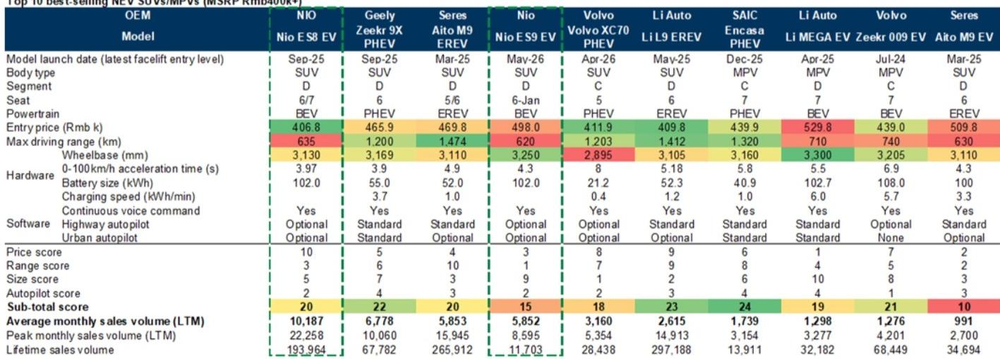
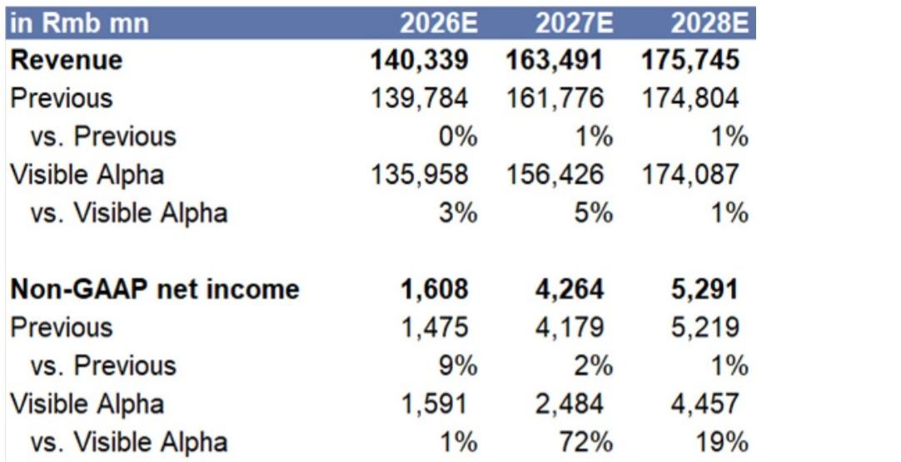
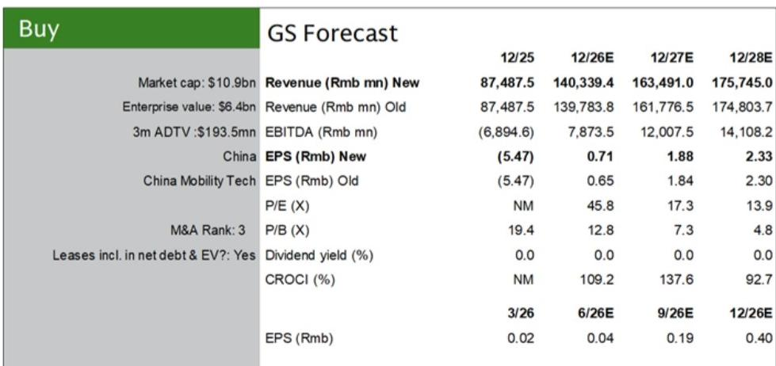

# 蔚来高端市场转型观察：市场尚未充分反映2026年盈利拐点

蔚来在2026年上半年交付了19.1万辆汽车，同比增长67%，而同期中国新能源汽车零售市场整体收缩了14%。这一差异并非周期性的短期波动，而是表明蔚来在高端细分市场中的竞争地位正在发生结构性变化，而公司目前的报价尚未充分体现这一点。自2026年4月达到高点以来，蔚来的报价已下跌32%，尽管其财务轨迹正指向一个显著的转变：从2025年非GAAP净亏损124亿元人民币，到2026年预计实现净利润16亿元人民币，同时自由现金流从负31亿元人民币转为正121亿元人民币。

运营势头与市场定价之间的脱节创造了一个值得关注的观察窗口。蔚来目前基于2026年预估市销率的估值，较其纯电动同行有25%的折让；基于2027年预估市盈率则有17%的折让。此次观察观点的更新并非基于预期，而是建立在三个可观察、可衡量的发展之上：高端市场顶部由产品驱动的份额获取、转化为定价稳定性和较低营销成本的品牌资产优势，以及从2027年起将相同策略应用于更广泛车型阵容的清晰路径。

## ES8和ES9已占据40万元以上新能源车市场39%的份额，证明蔚来能够规模化地赢得与现有品牌的竞争

蔚来转型最具体的证据是其更新后的旗舰车型的表现。全新ES8于2025年9月推出，截至2026年6月，过去十二个月平均月销量超过1万辆，成为40万元以上SUV细分市场中最畅销的车型。2026年5月推出的ES9进一步增添了动力。这两款车型共同推动蔚来在高端新能源车市场的份额从2025年上半年的6%提升至2026年同期的39%。

这并非市场增长带动所有参与者的故事。整体40万元以上新能源车细分市场在2026年上半年的渗透率达到了50%，但蔚来的份额增长远超该细分市场的扩张。该公司直接从现有竞争对手手中夺取了份额。一个基于价格、续航、尺寸和自动驾驶能力的产品对比框架显示，ES8和ES9均位列其价格区间最畅销车型前五名，其中ES8在价格竞争力和车辆尺寸方面领先。这些并非面向早期用户的细分产品，而是基于客观消费者购买标准取代了现有品牌的主流高端车型。

其含义很直接：蔚来已经证明，它能够通过产品更新来重塑其竞争地位。转型失败的风险已被连续18个月的销售数据所消除。

## 净推荐值领先地位确认品牌资产（而非仅仅是产品规格）是难以复制的壁垒

产品规格可以被模仿，品牌忠诚度则更难复制。根据仲量联行在2026年上半年的调查，蔚来的净推荐值在中国所有汽车品牌中排名第一。其子品牌萤火虫排名第二。ES8本身在D级SUV中按净推荐值排名第二。这些分数不仅反映了对车辆本身的满意度，还反映了对整个拥有体验的满意度：销售、交付、售后服务和持续的产品互动。

这之所以重要，有两个超越消费者情绪的原因。首先，高净推荐值与较低的客户获取成本相关。满意的车主会带来推荐，并减少对激进折扣的需求。财务数据支持这一点：蔚来的销售、一般及行政费用预计将从2025年的161亿元人民币相对值小幅下降至2026年的156亿元人民币，即使收入增长60%。这意味着销售、一般及行政费用占收入的比例将显著改善，从18.4%降至11.1%。其次，品牌资产可以保护定价。在新能源汽车行业价格竞争日益激烈的市场中，蔚来的高端定位使其能够维持预计将从2025年的13.6%扩大至2026年的17.6%的毛利率，并到2028年进一步逐步改善至18.2%。

这里的竞争护城河并非技术秘密，而是积累的信任和满意度，这使得客户在价格更低但规格相似的替代品中仍会选择蔚来。这是一种持久的优势，并且是可衡量的。

## 2026年盈利拐点由运营杠杆驱动，而非一次性收益

从124亿元亏损到16亿元盈利的转变足够大，足以引发对其可持续性的质疑。然而，这一转变的构成指向的是结构性运营杠杆，而非会计调整或不可持续的成本削减。预计收入将同比增长60%至1403亿元人民币，而销售成本增长53%，这意味着毛利率的扩张。更重要的是，运营费用的增长速度预计将远低于收入。研发支出基本持平在101亿元人民币，而销售、一般及行政费用相对值下降。

结果是，息税折旧摊销前利润从2025年的负69亿元人民币转为2026年的正79亿元人民币，自由现金流转为正121亿元人民币。这些并非边际改善，它们代表了公司从其运营中产生现金能力的根本性转变。营运资金动态也起到了作用：应付账款天数预计将在2026年延长至260天，这反映了随着规模扩大，蔚来对供应商的议价能力增强，而库存天数则下降至41天。该公司不仅在销售更多汽车，而且更高效地销售，并通过其供应链为其增长提供资金。

本分析中的盈利预估比2026年至2028年的Visible Alpha共识高出约30%，这主要是由于更高的收入假设和更低的运营费用预估。这一差异并非微不足道，但它建立在可观察的品牌力量之上，这种力量支撑着稳定的定价和降低的营销强度。

## 决策框架：如何评估蔚来的高端策略能否扩展到更低价格区间

对于评估当前机会是否可持续的观察者而言，关键问题并非ES8和ES9是否会继续表现良好，而是蔚来能否在20万至40万元的价格区间（其5系和6系车型在此竞争）复制其高端策略。该报告基于三个因素提供了一个清晰的评估框架。

首先，在较低价格区间内与同行相比的产品竞争力。同样的四因素比较（价格、续航、尺寸和自动驾驶）曾识别出ES8和ES9是高端细分市场的佼佼者，现在可以应用于ET5、ET5T、EC6和ES6车型。如果蔚能能够以与使ES8成为市场领导者相同的竞争定位关注度来更新这些车型，那么销量提升可能是巨大的。

其次，品牌可转移性。蔚来排名第一的净推荐值适用于整个品牌，而不仅仅是旗舰车型。如果推动40万元以上细分市场满意度的服务体验和产品质量能够转移到较低价格区间，那么该公司应该能够在其整个产品线中维持更高的利润率和更低的客户获取成本。

第三，成本纪律。2026年的预估假设研发支出趋于平稳，销售、一般及行政费用下降。如果蔚来能够在扩大其可寻址市场的同时保持这种纪律，那么推动2026年盈利拐点的运营杠杆将在2027年和2028年（届时5系和6系更新预计将生效）进一步发挥作用。

该框架的风险很直接：较低的销量、加剧的价格竞争或更高的成本通胀可能会延迟或阻碍盈利轨迹。该报告明确指出了这些风险。但目前证据的分量支持以下论点：蔚来的高端定位并非营销口号，而是一个市场尚未完全定价的财务现实。

*仅供参考。部分内容可能基于源材料通过AI辅助生成、翻译、总结或编辑，可能存在遗漏或错误。请独立核实。这不构成投资、法律、税务、会计或其他专业建议。*

仅供参考。部分内容可能基于源材料通过AI辅助生成、翻译、总结或编辑，可能存在遗漏或错误。请独立核实。这不构成投资、法律、税务、会计或其他专业建议。

