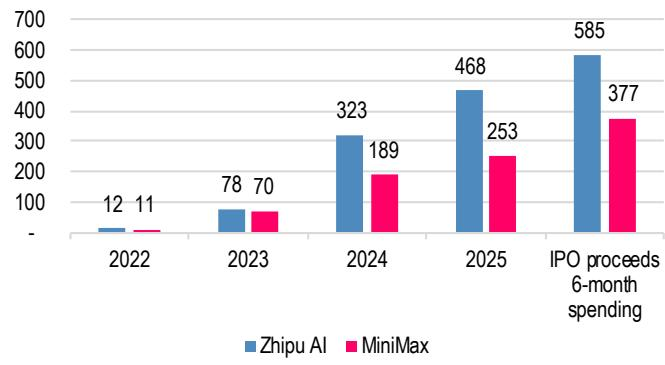
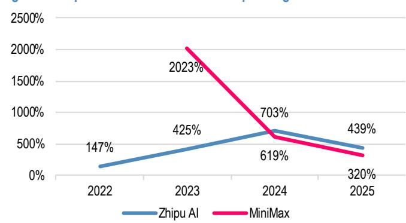
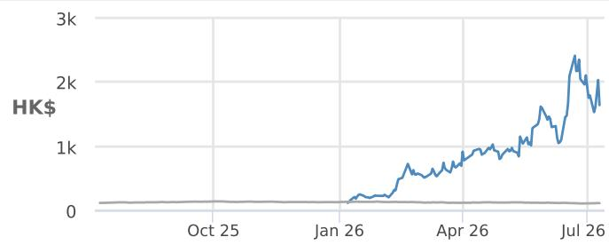
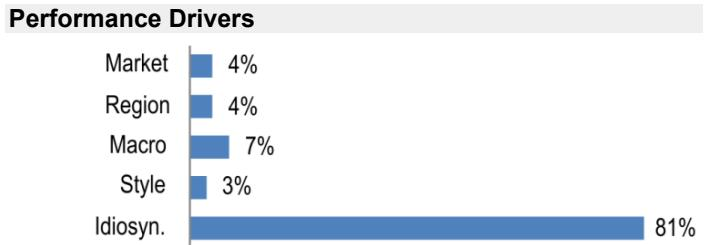

## China Artificial Intelligence

## Capital accelerates race; Zhipu (OW) PT to HK\$2400 on higher ARR visibility; MiniMax (N) needs stronger model validation

We raise our price target for Zhipu AI to HK\$2,400 from HK\$2,000 and maintain Overweight; we lower our MiniMax price target to HK\$240 from HK\$300 and maintain Neutral following both companies' large financing announcements last week. We believe the foundation-model industry is moving into a more capital-intensive phase, where access to funding supports longer model development cycles and infrastructure expansion. However, returns will ultimately depend on each company's ability to translate resources into model improvements, customer adoption and ARR growth. For Zhipu, demand already presses against serving capacity, so incremental inference resources plausibly convert to ARR within 12 months, with the financing funds a conversion that is already visible, in our view. For MiniMax, conversion runs through model capability that is not yet demonstrated against peers, so the financing buys time to prove conversion, while its cost is certain – immediately effective at 11% and potential of another 6% assuming full-conversion of the convertible bonds. The same catalyst therefore moves the two PTs in opposite directions.

\- Capital intensity is rising across independent LLM providers, yet capital is a necessary rather than sufficient condition. Since the start of 2026, Chinese independent LLM providers collectively raised or announced over US\$20+bn via IPOs, placements and private rounds, reflecting the increasing resource requirements of frontier model development. Going forward, we expect differentiation to come from technical direction, talent quality and density, execution and efficiency of converting capital investment into commercial growth. We will judge that through the coming release cycle, specifically MiniMax's M3Pro, Zhipu's GLM 5.5, and DeepSeek's V4 official.

\- Zhipu AI: financing accelerates a visible demand-to-revenue conversion path. The US\$4bn placement at 4.4% shares alleviates potential serving capacity constraint where demand is extremely strong, in addition to its support of the forward model trainings. We believe incremental inference capacity can enhance higher ARR conversion over the next 12 months – we therefore hike PT to HK\$2,400 (implies 30-35x at US\$4-5bn 2027-end ARR) after this visible conversion. Key risks remain around: free float is at 14% after the placement, so volatility stays extreme on a stock up 14x YTD; continued pricing power or widening model leadership position would further validate our thesis.

\- MiniMax: certain cost today, unproven conversion tomorrow. The US\$2bn raise removes training resource constraints, but the two sides of the trade are not symmetric in time or certainty. The dilution is booked now: about 11% of share count from the placement, rising toward 17% on full CB conversion. The offsetting value depends on MiniMax first closing the capability gap versus peers and then monetizing it, two steps that have not yet occurred. We cut the PT to HK\$240 to reflect the certain dilution against a conversion path still to be evidenced. We would turn more constructive after seeing clear evidence of model improvement and narrowing monetization gap versus peers.

See page 13 for analyst certification and important disclosures, including non-US analyst disclosures.

Hong Kong

SAC Registration Number: S1730525060001

Alex Yao
(86 21) 6106 6505
alex.yao@JPM.com
SAC Registration Number: S1730523020001

Daniel Chen
(86-21) 6106 6205
daniel.q.chen@JPM.com
SAC Registration Number: S1730521040001
JPM Securities (China) Company Limited

Equity Ratings and Price Targets

<table><tr><td rowspan="2">Company</td><td rowspan="2">Ticker</td><td rowspan="2">Mkt Cap ($ mn)</td><td rowspan="2">Price CCY</td><td rowspan="2">Price</td><td colspan="2">Rating</td><td colspan="4">Price Target</td></tr><tr><td>Cur</td><td>Prev</td><td>Cur</td><td>End Date</td><td>Prev</td><td>End Date</td></tr><tr><td>Zhipu AI</td><td>2513 HK</td><td>46,320</td><td>HKD</td><td>1,640.00</td><td>OW</td><td>n/c</td><td>2,400.00</td><td>Dec-26</td><td>2,000.00</td><td>n/c</td></tr><tr><td>MiniMax Group Inc - H</td><td>100 HK</td><td>7,821</td><td>HKD</td><td>268.60</td><td>N</td><td>n/c</td><td>240.00</td><td>Dec-26</td><td>300.00</td><td>n/c</td></tr></table>

Source: Company data, Bloomberg Finance L.P., JPM estimates. n/c = no change. All prices as of 10 Jul 26.

## China AI foundation-model industry: capital accelerates the race, while execution determines outcomes

The foundation-model industry is becoming structurally more capital intensive: maintaining competitiveness requires continuous investment across pre-training, post-training, reinforcement learning, evaluation infrastructure and inference deployment. Unlike traditional software businesses where incremental distribution can scale at relatively low marginal cost, frontier AI models require repeated investment cycles to improve capability and support growing usage. This dynamic is increasingly visible among China's independent LLM providers –since the start of 2026, Chinese independent LLM providers have collectively raised or announced over US\$20+bn via IPOs, placements and private rounds.

However, the increasing importance of capital does not mean funding alone determines competitive outcomes, as model development remains dependent on several other factors, including the ability to identify the right technical direction, attract high-quality research talent, build efficient engineering processes and organize resources effectively. Capital provides additional resources and extends the ability to compete, while companies still need to demonstrate that these resources can translate into stronger models. For observers, the key question is therefore how efficiently companies convert capital into competitive advantages. Additional funding can accelerate model iteration and commercialization, while the ultimate differentiation remains the ability to consistently deliver stronger models.

Table 1: 2026 YTD financing progress of independent China LLM providers

<table><tr><td>Company</td><td>Date</td><td>Transaction Type</td><td>Amount Raised</td><td>Valuation (Post-Money)</td></tr><tr><td rowspan="3">Zhipu AI</td><td>TBD</td><td>STAR Market Listing (Target)</td><td>~US$2.1bn (Rmb15.0bn)</td><td>N/A</td></tr><tr><td>Jul-26</td><td>Share Placement</td><td>~US$4.0bn</td><td>Public Market Cap (placement on 4.4% of total shares)</td></tr><tr><td>Jan-26</td><td>Hong Kong IPO</td><td>~US$0.6bn (HK$4.4bn)</td><td>~US$13.0bn (at debut)</td></tr><tr><td rowspan="3">MiniMax</td><td>TBD</td><td>STAR Market Listing (Target)</td><td>N/A</td><td>N/A</td></tr><tr><td>Jul-26</td><td>Share Placement &amp; Convertible Bonds</td><td>~US$2.1bn (HK$16.0bn)</td><td>Public Market Cap (placement on 11% of total shares, convertible bonds at 6% of total shares)</td></tr><tr><td>Jan-26</td><td>Hong Kong IPO</td><td>~US$0.7bn (HK$5.5bn)</td><td>~US$13.7bn (at close)</td></tr><tr><td>DeepSeek</td><td>Jun-26</td><td>Series A (First External Round)</td><td>~US$7.4bn (&gt;Rmb50.0bn)</td><td>&gt;US$50.0bn (&gt;Rmb330.0bn)</td></tr></table>

Source: Zhipu/MiniMax prospectus, placement announcements, Bloomberg Finance L.P. (data as of Jul 10, 2026)

Figure 1: Zhipu & MiniMax 2022-25 R&D spending and IPO proceeds 6-month spending (US\$mn)  
  
Source: Zhipu/MiniMax prospectus and placement announcements, (data as of Jul 10, 2026)

Figure 2: Zhipu & MiniMax 2022-25 R&D spending as % of revenue  
  
Source: Zhipu/MiniMax prospectus and placement announcements, (data as of Jul 10, 2026)

## Zhipu AI: financing improves execution visibility across model development and commercialization; PT to HK\$2,400

We view Zhipu's financing positively as it reduces potential execution constraints across both model development and commercialization. Additional capital does not independently create model leadership, and Zhipu's long-term positioning will continue to depend on its research direction, talent quality and organizational execution. However, given Zhipu's recent strong model progress and commercial momentum, additional resources improve confidence around the company's ability to execute against future opportunities.

On the training side, financing provides greater flexibility to support future model cycles. Frontier model development requires sustained investment across pre-training, post-training, reinforcement learning and engineering optimization. As model competition continues to accelerate, maintaining sufficient resources becomes increasingly important for companies seeking to remain competitive. Zhipu's expected R&D investment reflects the significant resources required to continue improving model capability.

On the inference side, we see a more direct monetization benefit in the next 12 months. We believe Zhipu's current bottleneck has increasingly shifted from demand generation toward serving capacity. The company has demonstrated strong demand momentum across API services and enterprise use cases, while available inference resources remain a constraint across the industry. Additional compute investment should allow Zhipu to expand serving capacity, improve service availability and convert existing demand into revenue more efficiently.

The combination of training support and inference expansion creates a more favorable financing impact for Zhipu. Additional capital supports the development of future model capability while also improving the company's ability to monetize current demand. This provides greater visibility on ARR upside over the next 12 months.

Key risks remain around: free float is at 14% after the placement, so volatility stays extreme on a stock up over 1,700% YTD; continued pricing power or sustained utilization would further validate our thesis.

## Estimate changes

We raise Zhipu's 2026-30E revenue by 7-13% to reflect higher monetization visibility with more sufficient capital to expand compute power. We also increase the share count number to reflect the recent H-share placement of 4.4% of total shares. Accordingly, we lower our adjusted net loss forecasts from a loss of Rmb3,711mn, loss of Rmb3,141mn and profit of Rmb2,367mn in 2026, 2027 and 2028 to a loss of Rmb3,605mn, loss of Rmb2,566mn and profit of Rmb4,120mn. We consequently raise our Dec-26 price target to HK\$2,400 from HK\$2,000, still based on 30x 2030E P/E discounted back using a 15% WACC.

Table 2: Estimate changes summary for Zhipu AI

<table><tr><td>Rmb mn</td><td>2026E</td><td>2027E</td><td>2028E</td><td>2029E</td><td>2030E</td></tr><tr><td>Revenue</td><td></td><td></td><td></td><td></td><td></td></tr><tr><td>New</td><td>5,038</td><td>13,768</td><td>37,672</td><td>101,706</td><td>175,864</td></tr><tr><td>Old</td><td>4,715</td><td>12,324</td><td>33,485</td><td>89,984</td><td>155,497</td></tr><tr><td>% change</td><td>7%</td><td>12%</td><td>13%</td><td>13%</td><td>13%</td></tr><tr><td>Operating profit</td><td></td><td></td><td></td><td></td><td></td></tr><tr><td>New</td><td>(5,173)</td><td>(5,532)</td><td>(569)</td><td>22,085</td><td>52,249</td></tr><tr><td>Old</td><td>(5,280)</td><td>(6,108)</td><td>(2,322)</td><td>16,932</td><td>42,847</td></tr><tr><td>% change</td><td>2%</td><td>9%</td><td>75%</td><td>30%</td><td>22%</td></tr><tr><td>Adjusted net profit</td><td></td><td></td><td></td><td></td><td></td></tr><tr><td>New</td><td>(3,605)</td><td>(2,566)</td><td>4,120</td><td>24,264</td><td>50,380</td></tr><tr><td>Old</td><td>(3,711)</td><td>(3,141)</td><td>2,367</td><td>20,141</td><td>42,858</td></tr><tr><td>% change</td><td>3%</td><td>18%</td><td>74%</td><td>20%</td><td>18%</td></tr></table>

Source: JPM estimates (data as of Jul 10, 2026)

## MiniMax: Financing alleviates resource constraints, while model capability remains the key catalyst; PT to HK\$240

MiniMax's latest financing meaningfully strengthens its financial position and reduces concerns around future funding requirements. The US\$2bn financing, including equity placement and convertible bonds, provides additional resources for model development, infrastructure investment and commercialization.

We view the financing as a positive step in extending MiniMax's ability to compete. As the industry becomes more capital intensive, access to sufficient resources is increasingly important for sustaining multiple model cycles. The transaction reduces pressure around future training expenditure and provides more flexibility in allocating resources across research, infrastructure and commercialization.

However, we believe the key question remains whether MiniMax can translate additional resources into stronger model capability. Similar to peers, long-term competitiveness will depend on technical roadmap, research talent and execution efficiency alongside capital availability. Financing improves the company's ability to participate in the competition, while future model progress will determine whether MiniMax can improve its relative positioning.

The equity component of the transaction also creates meaningful dilution – placement on 11% of total shares, convertible bonds at 6% of total shares. Such near-term financial benefit needs to be weighed against share dilution and the limited immediate impact on revenue growth.

MiniMax has established strengths in multimodal models, consumer applications and international expansion. However, recent pricing dynamics highlight the importance of demonstrating differentiated model capability. Following the M3 launch, pricing adjustments suggested that sustained monetization upside requires clearer evidence of model superiority and user willingness to pay.

We would become more constructive if future model releases demonstrate clear capability improvement and meaningful catch-up versus peers. Until then, we believe the risk-reward remains balanced.

## Estimate changes

We make no changes to MiniMax's forward P&L forecasts as the recent financing didn't give us higher conviction of the forward monetization path; on the other hand, we reflect the cost of financing with 11% of total shares on placement and 6% of shares if 100% of converted bonds are converted. Accordingly, we lower our adjusted net EPS by 4% for 2026E and 20% for 2027-30E. We consequently lower our Dec-26 price target to HK\$240 from HK\$300, still based on 30x 2030E P/E discounted back using a 15% WACC.

Table 3: Estimate changes summary for MiniMax

<table><tr><td>Estimate changes (US$mn)</td><td>2026E</td><td>2027E</td><td>2028E</td><td>2029E</td><td>2030E</td></tr><tr><td>Revenue</td><td></td><td></td><td></td><td></td><td></td></tr><tr><td>New</td><td>383</td><td>830</td><td>1,652</td><td>3,194</td><td>6,633</td></tr><tr><td>Old</td><td>383</td><td>830</td><td>1,652</td><td>3,194</td><td>6,633</td></tr><tr><td>% change</td><td>0%</td><td>0%</td><td>0%</td><td>0%</td><td>0%</td></tr><tr><td>Operating profit</td><td></td><td></td><td></td><td></td><td></td></tr><tr><td>New</td><td>(932)</td><td>(1,217)</td><td>(1,353)</td><td>(1,148)</td><td>(41)</td></tr><tr><td>Old</td><td>(932)</td><td>(1,217)</td><td>(1,353)</td><td>(1,148)</td><td>(41)</td></tr><tr><td>% change</td><td>0%</td><td>0%</td><td>0%</td><td>0%</td><td>0%</td></tr><tr><td>Adjusted net profit</td><td></td><td></td><td></td><td></td><td></td></tr><tr><td>New</td><td>(432)</td><td>(948)</td><td>(1,003)</td><td>(647)</td><td>633</td></tr><tr><td>Old</td><td>(432)</td><td>(948)</td><td>(1,003)</td><td>(647)</td><td>633</td></tr><tr><td>% change</td><td>0%</td><td>0%</td><td>0%</td><td>0%</td><td>0%</td></tr><tr><td>Adjusted EPS</td><td></td><td></td><td></td><td></td><td></td></tr><tr><td>New</td><td>(1.30)</td><td>(2.34)</td><td>(2.47)</td><td>(1.60)</td><td>1.56</td></tr><tr><td>Old</td><td>(1.36)</td><td>(2.92)</td><td>(3.09)</td><td>(2.00)</td><td>1.95</td></tr><tr><td>% change</td><td>-4%</td><td>-20%</td><td>-20%</td><td>-20%</td><td>-20%</td></tr></table>

Source: JPM estimates (data as of Jul 10, 2026)

## Overweight

2513.HK,2513 HK
Price (10 Jul 26): HK\$1,640.00

## ▲ Price Target (Dec-26): HK\$2,400.00 Prior (Dec-26): HK\$2,000.00

## Hong Kong Internet

Internet
Olivia Xu AC
(86-21) 6106 6138
olivia.w.xu@JPM.com
SAC Registration Number: S1730525060001
JPM Securities (China) Company Limited

Key Changes (FYE Dec)

<table><tr><td colspan="4">Key Changes (FYE Dec)</td></tr><tr><td></td><td>Prev</td><td>Cur</td><td>Δ</td></tr><tr><td>Adj. EPS - 26E (Rmb)</td><td>(8.20)</td><td>(7.91)</td><td>3.6%</td></tr><tr><td>Adj. EPS - 27E (Rmb)</td><td>(6.71)</td><td>(5.40)</td><td>19.4%</td></tr></table>

## Half Yearly Forecasts (FYE Dec)

<table><tr><td colspan="4">Adj. EPS (Rmb)</td></tr><tr><td></td><td>2025A</td><td>2026E</td><td>2027E</td></tr><tr><td>H1</td><td>(11.09)</td><td>(5.07)</td><td>(4.65)</td></tr><tr><td>H2</td><td>(9.11)</td><td>(2.89)</td><td>(0.76)</td></tr><tr><td>FY</td><td>(19.95)</td><td>(7.91)</td><td>(5.40)</td></tr></table>

Style Exposure

<table><tr><td rowspan="2">Quant Factors</td><td rowspan="2">Current %Rank</td><td colspan="4">Hist %Rank (1=Top)</td></tr><tr><td>6M</td><td>1Y</td><td>3Y</td><td>5Y</td></tr><tr><td>Value</td><td>98</td><td>94</td><td>94</td><td>86</td><td></td></tr><tr><td>Growth</td><td>31</td><td>100</td><td>100</td><td></td><td></td></tr><tr><td>Momentum</td><td>100</td><td></td><td></td><td></td><td></td></tr><tr><td>Quality</td><td>86</td><td></td><td></td><td></td><td></td></tr><tr><td>Low Vol</td><td>100</td><td></td><td></td><td></td><td></td></tr></table>

Sources for: Style Exposure – JPM Global Markets Strategy; all other tables are company data and JPM estimates.

## Zhipu AI

## Financing improves execution visibility across model development and commercialization; PT to HK\$2,400

We view Zhipu's financing positively as it reduces potential execution constraints across both model development and commercialization. Additional capital does not independently create model leadership, and Zhipu's long-term positioning will continue to depend on its research direction, talent quality and organizational execution. However, given Zhipu's recent model progress and commercial momentum, additional resources improve confidence around the company's ability to execute against future opportunities.

## Investment Thesis, Valuation and Risks

## Knowledge Atlas Technology Joint Stock Co. Ltd.

(Overweight; Price Target: HK\$2,400.00)

## Investment Thesis

We rate Z.AI (Zhipu AI) Overweight. as the company better fits our framework of repeated SOTA visibility, high-value workflow exposure and pricing power. Year-to-date, Zhipu has delivered multiple domestic SOTA releases across the GLM series, and GLM-5.1 still ranks as one of the best Chinese models on WebDev Arena even after the later releases of Kimi K2.6 and DeepSeek V4. The release of GLM5.2 further enhances its leadership position. In a market where model cycles are compressing, we believe such a track record matters: observers are likely to place more weight on repeated frontier delivery than on one-off usage spikes or single-model success.

## Valuation

Our Dec-26 PT of HK\$2,400 is based on a 30x 2030E P/E, when we expect Zhipu AI to generate normalized earnings, discounted back using a 15% WACC. The 30x multiple represents a valuation premium over tier-1 Chinese internet players, mostly to reflect the company's 100+% revenue CAGR in 2026-30E.

Price target calculation

<table><tr><td>2030E Revenue (Rmb mn)</td><td>175,864</td></tr><tr><td>2030E Adjusted net profit (Rmb mn)</td><td>50,380</td></tr><tr><td>2030E Adjusted EPS (Rmb/share)</td><td>106</td></tr><tr><td>Target multiple</td><td>30</td></tr><tr><td>WACC</td><td>15%</td></tr><tr><td>Dec-26 PT (HK$)</td><td>2,400</td></tr></table>

Source: JPM estimates.

## Risks to Rating and Price Target

Risks to our rating and price target include export controls, geopolitical risk, and entity list designation; intensified competition; high and ongoing R&D investment creates execution risk and pressure on profitability; commercialization and customer adoption remain subject to uncertainty; dependence on computing infrastructure and external suppliers exposes Zhipu to cost and availability risks.

Price Performance  

— 2513.HK Price (HK\$) MSCI-Cnx (rebased)

<table><tr><td></td><td>YTD</td><td>1m</td><td>3m</td><td>12m</td></tr><tr><td>Abs</td><td>-</td><td>56.5%</td><td>75.2%</td><td>-</td></tr><tr><td>Rel</td><td>-</td><td>58.7%</td><td>82.8%</td><td>-</td></tr></table>

<table><tr><td colspan="2">Company Data</td></tr><tr><td>Shares O/S (mn)</td><td>221</td></tr><tr><td>52-week range (HK$)</td><td>2,980.00-116.10</td></tr><tr><td>Market cap ($ mn)</td><td>46,320</td></tr><tr><td>Exchange rate</td><td>7.84</td></tr><tr><td>Free float (%)</td><td>56.2%</td></tr><tr><td>3M ADV (mn)</td><td>2.25</td></tr><tr><td>3M ADV ($ mn)</td><td>423.2</td></tr><tr><td>Volatility (90 Day)</td><td>167</td></tr><tr><td>Index</td><td>MXCNX</td></tr><tr><td>BBG ANR (Buy | Hold | Sell)</td><td>19|4|2</td></tr></table>

<table><tr><td colspan="5">Key Metrics (FYE Dec)</td></tr><tr><td>Rmb in millions</td><td>FY25A</td><td>FY26E</td><td>FY27E</td><td>FY28E</td></tr><tr><td>Financial Estimates</td><td></td><td></td><td></td><td></td></tr><tr><td>Revenue</td><td>724</td><td>5,038</td><td>13,768</td><td>37,672</td></tr><tr><td>Adj. EBIT</td><td>(7,015)</td><td>(8,760)</td><td>(8,134)</td><td>3,421</td></tr><tr><td>Adj. EBITDA</td><td>(3,517)</td><td>(4,669)</td><td>(4,844)</td><td>184</td></tr><tr><td>Adj. net income</td><td>(3,182)</td><td>(3,605)</td><td>(2,566)</td><td>4,120</td></tr><tr><td>Adj. EPS</td><td>(19.95)</td><td>(7.91)</td><td>(5.40)</td><td>8.67</td></tr><tr><td>BBG EPS</td><td>(8.58)</td><td>(11.10)</td><td>(10.76)</td><td>(6.06)</td></tr><tr><td>Cashflow from operations</td><td>(2,246)</td><td>(1,551)</td><td>2,507</td><td>11,922</td></tr><tr><td>FCFF</td><td>(2,195)</td><td>(1,980)</td><td>1,893</td><td>10,089</td></tr><tr><td>Margins and Growth</td><td></td><td></td><td></td><td></td></tr><tr><td>Revenue Growth Y/Y (%)</td><td>131.9%</td><td>595.5%</td><td>173.3%</td><td>173.6%</td></tr><tr><td>EBIT margin</td><td>(968.5%)</td><td>(173.9%)</td><td>(59.1%)</td><td>9.1%</td></tr><tr><td>EBIT Growth Y/Y (%)</td><td>38.8%</td><td>24.9%</td><td>(7.2%)</td><td>(142.1%)</td></tr><tr><td>EBITDA margin</td><td>(485.5%)</td><td>(92.7%)</td><td>(35.2%)</td><td>0.5%</td></tr><tr><td>EBITDA Growth Y/Y (%)</td><td>55.0%</td><td>32.8%</td><td>3.7%</td><td>(103.8%)</td></tr><tr><td>Net margin</td><td>(439.3%)</td><td>(71.6%)</td><td>(18.6%)</td><td>10.9%</td></tr><tr><td>Adj. EPS growth</td><td>29.3%</td><td>(60.3%)</td><td>(31.7%)</td><td>(260.6%)</td></tr><tr><td>Ratios</td><td></td><td></td><td></td><td></td></tr><tr><td>Adj. tax rate</td><td>0.0%</td><td>0.0%</td><td>0.0%</td><td>0.0%</td></tr><tr><td>Interest cover</td><td>NM</td><td>NM</td><td>NM</td><td>3.7</td></tr><tr><td>Net debt/Equity</td><td>0.1</td><td>NM</td><td>NM</td><td>NM</td></tr><tr><td>Net debt/EBITDA</td><td>0.2</td><td>6.5</td><td>9.7</td><td>NM</td></tr><tr><td>ROE</td><td>52.8%</td><td>(61.1%)</td><td>(9.8%)</td><td>12.8%</td></tr><tr><td>Valuation</td><td></td><td></td><td></td><td></td></tr><tr><td>FCFF yield</td><td>(1.0%)</td><td>(0.3%)</td><td>0.3%</td><td>1.5%</td></tr><tr><td>Dividend yield</td><td>-</td><td>-</td><td>-</td><td>-</td></tr><tr><td>EV/Revenue</td><td>431.0</td><td>56.1</td><td>19.3</td><td>6.8</td></tr><tr><td>EV/EBITDA</td><td>NM</td><td>NM</td><td>NM</td><td>1,387.0</td></tr><tr><td>Adj. P/E</td><td>NM</td><td>NM</td><td>NM</td><td>163.9</td></tr></table>

## Summary Investment Thesis and Valuation

We rate Z.AI (Zhipu AI) Overweight. as the company better fits our framework of repeated SOTA visibility, high-value workflow exposure and pricing power. Year-to-date, Zhipu has delivered multiple domestic SOTA releases across the GLM series, and GLM-5.1 still ranks as one of the best Chinese models on WebDev Arena even after the later releases of Kimi K2.6 and DeepSeek V4, and the release of GLM-5.2 further enhances its leadership position. In a market where model cycles are compressing, we believe such a track record matters: observers are likely to place more weight on repeated frontier delivery than on one-off usage spikes or single-model success.

Our Dec-26 PT of HK\$2,400 is derived from 30x 2030E P/E, when we expect Zhipu AI to generate normalized earnings, discounted back using a 15% WACC. The 30x multiple represents a valuation premium over tier-1 Chinese internet players, mostly to reflect the company's 100+% revenue CAGR in 2026-30E.

<table><tr><td>Factors</td><td>6M Corr</td><td>1Y Corr</td></tr><tr><td>Market: MSCI Asia Pac ex JP</td><td>0.29</td><td>0.21</td></tr><tr><td>Region: Hong Kong</td><td>-0.21</td><td>-0.21</td></tr><tr><td>Macro:</td><td></td><td></td></tr><tr><td>JPM China A-shares Sentiment</td><td>-0.26</td><td>-0.24</td></tr><tr><td>JPM EM Currency(EMCI) Fixing</td><td>-0.18</td><td>-0.17</td></tr><tr><td>JPM Global Equity Sentiment</td><td>-0.22</td><td>-0.14</td></tr><tr><td>Quant Styles:</td><td></td><td></td></tr><tr><td>Value</td><td>-0.13</td><td>-0.14</td></tr><tr><td>Quality</td><td>-0.18</td><td>-0.13</td></tr><tr><td>Momentum</td><td>0.11</td><td>0.08</td></tr></table>

Zhipu AI: Summary of Financials

<table><tr><td>Income Statement</td><td>FY24A</td><td>FY25A</td><td>FY26E</td><td>FY27E</td><td>FY28E</td></tr><tr><td>Revenue</td><td>312</td><td>724</td><td>5,038</td><td>13,768</td><td>
