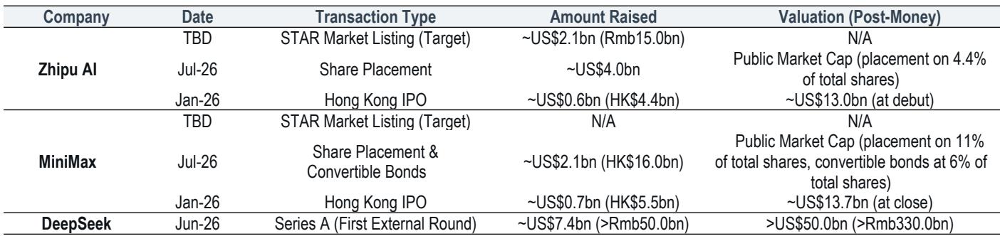
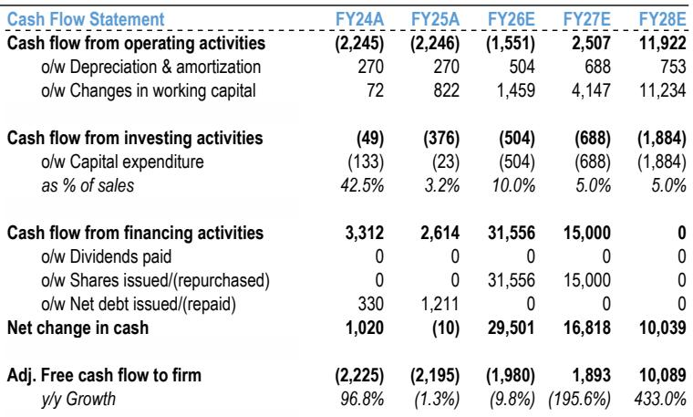
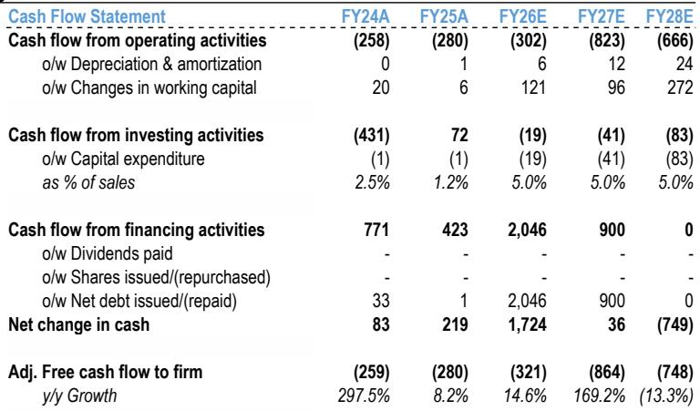

# JPM：公司情况更新

2026年至今，中国独立大模型厂商通过IPO、配售和私募累计融资超过200亿美元。这笔资金正在改写行业竞争规则，但JPM最新报告给出了一个反直觉的判断：同一笔融资，对不同公司意味着完全相反的研究含义。

报告以智谱AI和MiniMax为样本，展示了资本密集度上升阶段，资金如何成为“放大镜”——它放大的是公司已有的业务能力，而非凭空创造竞争力。

## 1. 智谱AI：融资加速的是已经可见的收入转化路径

智谱AI近期完成约40亿美元配售，仅占已发行股份的4.4%。JPM认为，这笔资金最直接的用途不是训练下一代模型，而是缓解推理侧的服务容量瓶颈。

报告指出，智谱AI当前的瓶颈已经从“需求不足”转向“服务容量不足”。API和企业用例的需求已经强劲到逼近现有算力上限。新增推理资源可以在12个月内直接转化为ARR增长——因为需求已经存在，缺的是算力去承接。隐含2027年末ARR在40-50亿美元区间、对应30-35倍估值。但报告也提醒，配售后自由流通盘仅14%，报价年内已上涨超过1700%，波动不确定性极高。

> **KC评论：** 智谱AI的案例说明，在AI基础设施研究中，区分“训练瓶颈”和“推理瓶颈”至关重要。训练投入的回报周期长、不确定性高；推理投入的回报周期短、确定性高——前提是需求已经跑在算力前面。这份报告的核心逻辑，其实是把融资分成了“买未来”和“卖现在”两类。

## 2. MiniMax：确定的稀释成本，尚未证明的转化路径

MiniMax同期完成约21亿美元融资，包含股权配售和可转换债券。原因在于融资成本与收益在时间和确定性上不对称。稀释是立即发生的：配售摊薄约11%股份，可转债全额转换后摊薄比例升至约17%。而抵消稀释的价值，取决于MiniMax先缩小与同行的模型能力差距，再实现商业化——这两步都尚未发生。

报告没有调整MiniMax的营收预测，因为融资本身并未提供更高的商业化确定性。它只是买到了继续参赛的时间，但能否转化为更强的模型，要看后续M3Pro等产品的实际表现。

## 3. 资本是必要条件，但差异化来自技术方向、人才密度和执行效率

JPM在行业层面给出了一个观察框架：资本密集度上升是结构性趋势，但资金不是充分条件。模型开发仍然依赖技术路线选择、高质量研究人才、高效工程流程和资源组织能力。

报告特别提到，2026年以来中国独立大模型厂商的融资总额已超过200亿美元，包括DeepSeek的74亿美元A轮。但接下来的分化将来自三个可验证的节点：MiniMax的M3Pro、智谱AI的GLM 5.5、DeepSeek的V4正式版。

对于产业决策者而言，这份报告提供了一个更务实的视角：在AI基础设施研究中，与其关注谁融了多少钱，不如关注钱被用在了哪个环节——是缓解已经存在的需求瓶颈，还是购买尚未验证的竞争资格。前者有更清晰的回报路径，后者则需要更长的耐心和更高的不确定性承受力。

For informational purposes only. Portions may be generated,translated,summarized,or edited with AI assistance based on source materials and may contain omissions or errors. Please verify independently. This is not investment,legal,tax,accounting,or other professional advice.

For informational purposes only. Portions may be generated,translated,summarized,or edited with AI assistance based on source materials and may contain omissions or errors. Please verify independently. This is not investment,legal,tax,accounting,or other professional advice.

