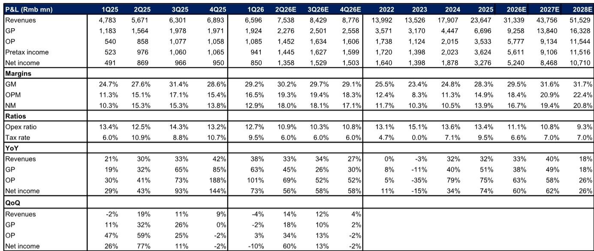
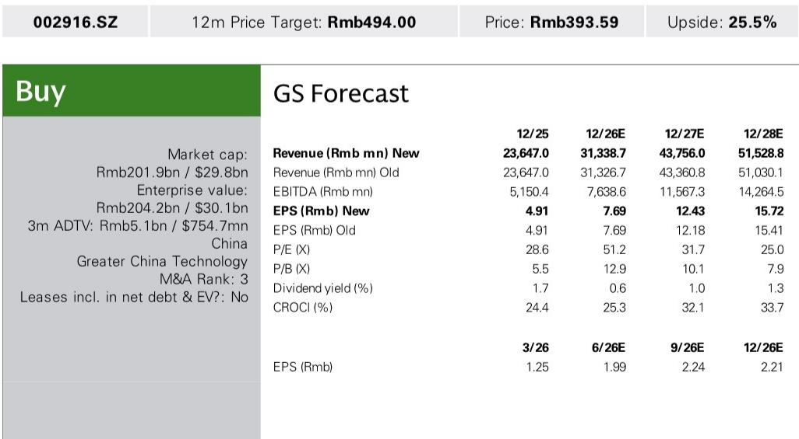
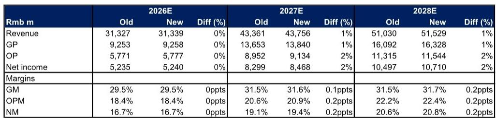

# GS：深南电路AIPCB扩产受益强劲需求

这份GS报告的核心判断并不复杂：深南电路正在经历一轮由AI驱动的产品结构升级，而公司选择用一次近50亿元的定向增发来回应。报告上调了2027和2028年的盈利预测，幅度不大，各约2%，但调整方向指向一个更长期的判断——AI服务器、高速交换机、1.6T光模块所需的PCB和基板，正在成为这家公司未来两年最确定的增长来源。

报告发布时，公司刚披露2026年上半年业绩预告。净利润区间为21亿至23亿元，同比增长54%至69%。其中第二季度单季净利润中值约13.5亿元，与GS此前预估的13.6亿元基本吻合。管理层的解释有三点：广州工厂产能爬坡、AI计算与存储需求上升、产品组合改善推高利润率。这三条放在一起，指向的是一个正在发生的结构性变化，而非单纯的周期反弹。

## 1. 这轮扩产不是防御性的，而是客户需求倒逼的产能前置

2026年6月，深南电路披露了一项约49亿元的定向增发计划，其中36亿元计划投入无锡工厂的AI PCB产能扩建。GS据此将公司2026年的资本开支预期上调至60亿元，而2025年这一数字是38亿元。增幅超过50%。

这不是一个常规的产能更新。报告提到，公司正在同时覆盖AI服务器、高速交换机和光模块三个数据中心子领域。这种多元化的客户结构，意味着单一环节的需求波动不会对整体产能利用率造成剧烈冲击。GS认为，这种布局本身就能分散不确定性。

> **KC评论：** 扩产节奏本身就是一个信号。当一家PCB公司愿意在一年内把资本开支提高近六成，而且资金用途明确指向AI相关产能，这比任何季度利润数字都更能说明下游需求的紧迫程度。报告没有直接说，但隐含的判断是：客户可能已经给出了足够清晰的订单预期，公司才敢做这样的资本承诺。

## 2. 产品组合改善正在推高利润率，但真正的弹性还在后面

从报告提供的利润表数据看，深南电路的毛利率从2024年的24.8%提升至2025年的28.3%，营业利润率从11.3%升至14.9%。GS预计，到2027年，毛利率将达到31.6%，营业利润率突破20%。

驱动这一改善的核心不是成本压缩，而是产品结构。AI服务器PCB的层数、孔径精度和材料要求都显著高于传统服务器，单台价值量更高。1.6T光模块的PCB需求也在加速放量。报告上调2027和2028年毛利率的幅度虽然只有0.1和0.2个百分点，但这是在营收预期已经上调1%的基础上做出的——量价齐升的逻辑是成立的。

值得注意的是，报告对2026年的营收和利润预期几乎没有调整，真正的上调集中在2027和2028年。这说明分析师认为，当前产能扩张的效果要到更远的周期才会充分释放。

## 3. 估值框架的调整背后，是对增长持续性的重新定价

目标市盈率从36.9倍提升至39.7倍。这个调整的依据是公司2027至2028年的每股盈利增长预期，以及一个结合了盈利增长和营业利润率的估值模型。

报告没有直接说，但估值倍数的提升隐含了一个判断：市场此前可能低估了AI对PCB行业的拉动周期长度。如果1.6T光模块和下一代交换机PCB的升级周期能持续到2028年之后，那么当前的增长就不是一次性的产能填满，而是一个持续的产品迭代过程。

当然，报告也列出了不确定性：AI PCB扩产慢于预期、竞争加剧导致价格侵蚀、客户集中度过高、服务器和汽车PCB增长不及预期。这些不确定性在任何一个高速扩张的硬件公司身上都存在，但深南电路当前面临的核心问题不是需求是否存在，而是产能能否跟上客户的节奏。

For informational purposes only. Portions may be generated,translated,summarized,or edited with AI assistance based on source materials and may contain omissions or errors. Please verify independently. This is not investment,legal,tax,accounting,or other professional advice.

