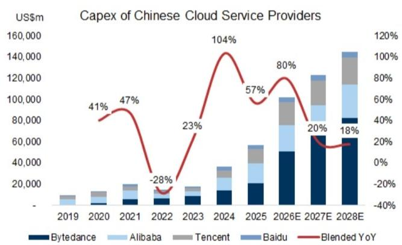
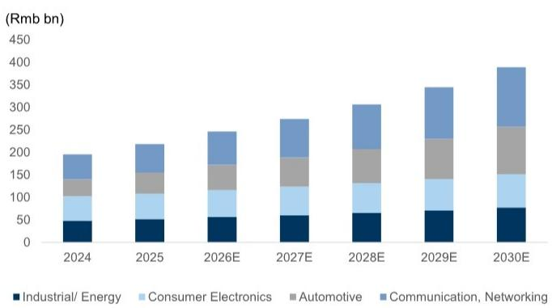
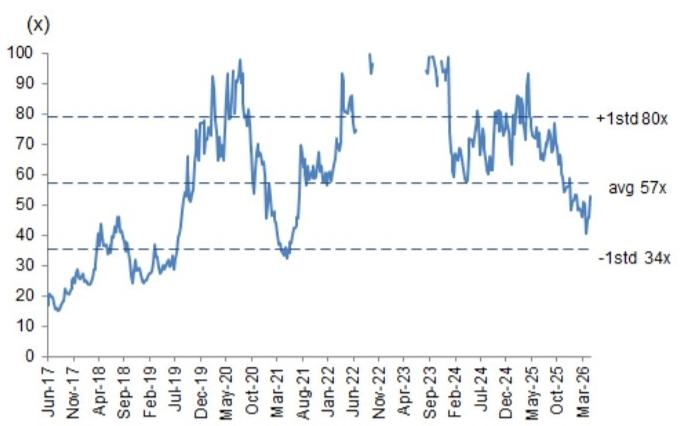

GC TECH

# 上调圣邦股份与锐捷网络目标价：AI数据中心趋势持续；基于合理估值将锐捷网络调至中性

我们对AI基础设施的上升周期保持积极看法，并认为圣邦股份和锐捷网络充分受益于这一趋势。我们在6月下旬更新了全球服务器市场规模预测（报告链接），其中AI服务器隐含的AI芯片在2026E-28E的预测上调了14%/22%/14%，中国云服务商的AI资本支出在2026E-28E的预测上调了37%/44%/55%，这反映了我们对当前AI基础设施上升周期的积极观点。圣邦股份作为国内模拟芯片领域的领先企业，正将模拟芯片业务拓展至AI数据中心（如AI服务器、光模块）；锐捷网络作为国内白牌交换机领域的领先企业，受益于中国云服务商的AI资本支出上升周期和超级节点的发展。基于此，我们上调了对两家公司的盈利预测和目标价：圣邦股份（从96.1元上调至143元），锐捷网络（从83.4元上调至120.5元）。同时，基于合理估值，我们将锐捷网络的评级从买入下调至中性；其股价目前交易在12个月远期市盈率的历史均值附近，目标价隐含的PEG为1.5倍，处于同业0.9倍至1.7倍的区间内。

图表1：中国云服务商资本支出趋势

  
数据包含字节跳动、腾讯、阿里巴巴、百度。我们通过分析中国互联网团队覆盖的行业和公司，推算字节跳动（非上市）的相关运营指标，并将其外推至字节跳动。  
来源：公司数据，GS全球投资研究

Allen Chang  
+852-2978-2930 |  
allen.k.chang@gs.com  
GS (Asia) L.L.C.

Verena Jeng
+852-2978-1681 | verena.jeng@gs.com
GS (Asia) L.L.C.

Ting Song +852-2978-6466 | ting.song@gs.com GS (Asia) L.L.C.

Yifan Hu  
+852-2978-0996 | yifan.hu@gs.com  
GS (Asia) L.L.C.

## 圣邦股份 (300661.SZ, 中性): PMIC/信号链产品受益于AI趋势；目标价上调至143元

我们持续看好圣邦股份的电源管理IC和信号链产品向AI数据中心的拓展，这得益于AI基础设施的上升周期、单机价值量的提升以及产品结构的优化。该公司目前为数据中心客户提供超过200个料号，我们预计其产品组合将持续扩大，单机价值量也将随之提升，以满足AI数据中心客户的需求。我们将12个月目标价上调至143元，2026E-28E净利润预测分别上调1%/5%/9%。我们的目标价隐含的2027E市盈率从之前的43.2倍提升至61倍，反映了对未来年份盈利增长的更强预期以及AI趋势下板块的重新定价。维持中性评级，基于合理估值。

PMIC/信号链产品向AI数据中心拓展：根据Frost & Sullivan的数据，网络和计算市场的模拟芯片市场预计在2026-2030年将以16%的复合年增长率增长，到2030年达到1330亿元。圣邦股份提供大功率DC/DC转换器、多相DC/DC控制器和DrMOS，以实现数据中心传输所需的高效、大电流和快速瞬态供电，这得益于其产品卓越的效率和稳健的热性能。

图表2：网络/计算市场的模拟芯片市场预计在2026-2030年将以16%的复合年增长率增长，到2030年达到1330亿元

  
来源：Frost & Sullivan，中国半导体行业协会

盈利预测调整：我们上调圣邦股份2026-28E的盈利预测，幅度分别为1%/5%/9%，主要由于收入上调及毛利率提升。收入上调主要源于AI服务器和光模块中模拟芯片需求的增长，受益于AI基础设施上升周期和单机价值量提升。毛利率在2027E/2028E分别上调0.2个百分点/0.4个百分点，主要由于产品结构优化。

图表3：盈利预测调整

<table><tr><td></td><td colspan="3">2026E</td><td colspan="3">2027E</td><td colspan="3">2028E</td></tr><tr><td>(百万元)</td><td>新</td><td>旧</td><td>差异</td><td>新</td><td>旧</td><td>差异</td><td>新</td><td>旧</td><td>差异</td></tr><tr><td>收入</td><td>5,118</td><td>5,100</td><td>0.4%</td><td>6,753</td><td>6,621</td><td>2%</td><td>8,705</td><td>8,313</td><td>5%</td></tr><tr><td>毛利润</td><td>2,617</td><td>2,608</td><td>0.4%</td><td>3,453</td><td>3,385</td><td>2%</td><td>4,453</td><td>4,252</td><td>5%</td></tr><tr><td>营业利润</td><td>950</td><td>940</td><td>1%</td><td>1,525</td><td>1,457</td><td>5%</td><td>2,193</td><td>2,008</td><td>9%</td></tr><tr><td>净利润</td><td>890</td><td>881</td><td>1%</td><td>1,439</td><td>1,376</td><td>5%</td><td>1,927</td><td>1,766</td><td>9%</td></tr><tr><td>每股收益</td><td>1.44</td><td>1.42</td><td>1%</td><td>2.33</td><td>2.22</td><td>5%</td><td>3.11</td><td>2.85</td><td>9%</td></tr><tr><td>利润率</td><td colspan="3"></td><td colspan="3"></td><td colspan="3"></td></tr><tr><td>毛利率</td><td>51.1%</td><td>51.1%</td><td>0个百分点</td><td>51.1%</td><td>51.1%</td><td>0个百分点</td><td>51.2%</td><td>51.1%</td><td>0个百分点</td></tr><tr><td>营业利润率</td><td>18.6%</td><td>18.4%</td><td>0.1个百分点</td><td>22.6%</td><td>22.0%</td><td>0.6个百分点</td><td>25.2%</td><td>24.1%</td><td>1个百分点</td></tr><tr><td>净利润率</td><td>17.4%</td><td>17.3%</td><td>0.1个百分点</td><td>21.3%</td><td>20.8%</td><td>0.5个百分点</td><td>22.1%</td><td>21.2%</td><td>0.9个百分点</td></tr></table>

来源：公司数据，GS全球投资研究

GS vs. 彭博一致预期：我们的2026/2027年盈利预测分别比彭博一致预期高5%/18%，主要由于收入更高和运营费用率更低。更高的收入反映了我们对圣邦股份模拟芯片向AI数据中心拓展的积极看法，而更优的运营费用率则源于收入规模增长带来的运营效率提升。

图表4：GS预测 vs. 彭博一致预期

<table><tr><td rowspan="2">(百万元)</td><td colspan="3">2026E</td><td colspan="3">2027E</td></tr><tr><td>GS</td><td>彭博</td><td>差异</td><td>GS</td><td>彭博</td><td>差异</td></tr><tr><td>收入</td><td>5,118</td><td>4,982</td><td>3%</td><td>6,753</td><td>6,259</td><td>8%</td></tr><tr><td>毛利润</td><td>2,617</td><td>2,547</td><td>3%</td><td>3,453</td><td>3,217</td><td>7%</td></tr><tr><td>营业利润</td><td>950</td><td>845</td><td>12%</td><td>1,525</td><td>1,298</td><td>17%</td></tr><tr><td>净利润</td><td>890</td><td>850</td><td>5%</td><td>1,439</td><td>1,221</td><td>18%</td></tr><tr><td>利润率</td><td></td><td></td><td></td><td></td><td></td><td></td></tr><tr><td>毛利率</td><td>51.1%</td><td>51.1%</td><td>0个百分点</td><td>51.1%</td><td>51.4%</td><td>-0.3个百分点</td></tr><tr><td>营业利润率</td><td>18.6%</td><td>17.0%</td><td>1.6个百分点</td><td>22.6%</td><td>20.7%</td><td>1.8个百分点</td></tr><tr><td>净利润率</td><td>17.4%</td><td>17.1%</td><td>0.3个百分点</td><td>21.3%</td><td>19.5%</td><td>1.8个百分点</td></tr></table>

来源：公司数据，GS全球投资研究

估值：我们将估值方法从短期市盈率调整为基于2030E市盈率的折现模型，以捕捉长期增长机会，并与我们覆盖的其他中国半导体公司保持一致。我们的12个月目标价上调至143元（此前为96.1元）。我们的目标市盈率36.5倍，基于同业市盈率与远期净利润增长率（2031E为27%）和营业利润率（2031E为27%）之和的相关性。将36.5倍的目标市盈率应用于我们的2030E每股收益，并以10.2%的股权成本折现回2027E，得出143元。维持中性评级。

图表5：圣邦股份折现市盈率

<table><tr><td>(百万元)</td><td>2022</td><td>2023</td><td>2024</td><td>2025</td><td>2026E</td><td>2027E</td><td>2028E</td><td>2029E</td><td>2030E</td><td>2031E</td></tr><tr><td></td><td colspan="2">TWS/智能设备</td><td colspan="2">工业/汽车</td><td colspan="6">数据中心/人形机器人</td></tr><tr><td>收入</td><td>3,188</td><td>3,121</td><td>3,347</td><td>3,894</td><td>5,118</td><td>6,753</td><td>8,705</td><td>11,142</td><td>14,039</td><td>17,409</td></tr><tr><td>PMIC</td><td>1,995</td><td>1,904</td><td>2,182</td><td>2,423</td><td>2,871</td><td>3,497</td><td>4,265</td><td>5,416</td><td>6,878</td><td>8,736</td></tr><tr><td>信号链</td><td>1,193</td><td>1,218</td><td>1,165</td><td>1,471</td><td>2,247</td><td>3,255</td><td>4,440</td><td>5,726</td><td>7,161</td><td>8,673</td></tr><tr><td>收入同比</td><td>42%</td><td>-2%</td><td>7%</td><td>16%</td><td>31%</td><td>32%</td><td>29%</td><td>28%</td><td>26%</td><td>24%</td></tr><tr><td>PMIC</td><td>30%</td><td>-5%</td><td>15%</td><td>11%</td><td>18%</td><td>22%</td><td>22%</td><td>27%</td><td>27%</td><td>27%</td></tr><tr><td>信号链</td><td>68%</td><td>2%</td><td>-4%</td><td>26%</td><td>53%</td><td>45%</td><td>36%</td><td>29%</td><td>25%</td><td>21%</td></tr><tr><td>毛利率</td><td>59.0%</td><td>41.6%</td><td>51.5%</td><td>49.2%</td><td>51.1%</td><td>51.1%</td><td>51.2%</td><td>51.4%</td><td>51.6%</td><td>51.8%</td></tr><tr><td>PMIC</td><td>55.4%</td><td>31.7%</td><td>47.8%</td><td>43.8%</td><td>50.1%</td><td>49.8%</td><td>49.7%</td><td>49.9%</td><td>50.1%</td><td>50.3%</td></tr><tr><td>信号链</td><td>64.9%</td><td>57.0%</td><td>58.3%</td><td>58.2%</td><td>52.4%</td><td>52.6%</td><td>52.6%</td><td>52.8%</td><td>53.0%</td><td>53.2%</td></tr><tr><td>毛利润</td><td>1,880</td><td>1,297</td><td>1,722</td><td>1,917</td><td>2,617</td><td>3,453</td><td>4,453</td><td>5,724</td><td>7,238</td><td>9,005</td></tr><tr><td>营业利润</td><td>991</td><td>258</td><td>499</td><td>474</td><td>950</td><td>1,525</td><td>2,193</td><td>2,864</td><td>3,677</td><td>4,658</td></tr><tr><td>营业利润率</td><td>31.1%</td><td>8.3%</td><td>14.9%</td><td>12.2%</td><td>18.6%</td><td>22.6%</td><td>25.2%</td><td>25.7%</td><td>26.2%</td><td>26.8%</td></tr><tr><td>税前利润</td><td>921</td><td>254</td><td>484</td><td>481</td><td>898</td><td>1,551</td><td>2,210</td><td>2,881</td><td>3,694</td><td>4,675</td></tr><tr><td>净利润</td><td>874</td><td>281</td><td>500</td><td>478</td><td>890</td><td>1,439</td><td>1,927</td><td>2,532</td><td>3,247</td><td>4,111</td></tr><tr><td>同比</td><td>25%</td><td>-68%</td><td>78%</td><td>-4%</td><td>86%</td><td>62%</td><td>34%</td><td>31%</td><td>28%</td><td>27%</td></tr><tr><td>每股收益 (元)</td><td>1.88</td><td>0.46</td><td>0.82</td><td>0.88</td><td>1.44</td><td>2.33</td><td>3.11</td><td>4.10</td><td>5.25</td><td>6.65</td></tr><tr><td>同比</td><td>23%</td><td>-75%</td><td>77%</td><td>9%</td><td>63%</td><td>62%</td><td>34%</td><td>32%</td><td>28%</td><td>27%</td></tr><tr><td>2030目标市盈率</td><td></td><td></td><td></td><td></td><td></td><td></td><td></td><td></td><td>36.5</td><td></td></tr><tr><td>12个月目标价 (元)</td><td></td><td></td><td></td><td></td><td></td><td>143</td><td></td><td></td><td></td><td></td></tr><tr><td>目标价隐含市盈率</td><td></td><td></td><td></td><td></td><td></td><td></td><td>61</td><td>46</td><td>35</td><td></td></tr></table>

<table><tr><td colspan="2">股权成本假设</td></tr><tr><td>Beta</td><td>1.2</td></tr><tr><td>无风险利率</td><td>3%</td></tr><tr><td>市场风险溢价</td><td>6%</td></tr><tr><td>股权成本</td><td>10.2%</td></tr></table>

来源：公司数据，GS全球投资研究

图表6：圣邦股份12个月远期市盈率  
  
来源：Eikon Datastream

图表7：圣邦股份损益表摘要

<table><tr><td>(百万元)</td><td>1Q25</td><td>2Q25</td><td>3Q25</td><td>4Q25</td><td>1Q26</td><td>2Q26E</td><td>3Q26E</td><td>4Q26E</td><td>2021</td><td>2022</td><td>2023</td><td>2024</td><td>2025</td><td>2026E</td><td>2027E</td><td>2028E</td></tr><tr><td>收入</td><td>790</td><td>1,029</td><td>982</td><td>1,097</td><td>1,098</td><td>1,197</td><td>1,303</td><td>1,520</td><td>2,238</td><td>3,188</td><td>2,616</td><td>3,347</td><td>3,898</td><td>5,118</td><td>6,753</td><td>8,705</td></tr><tr><td>毛利润</td><td>387</td><td>525</td><td>500</td><td>574</td><td>567</td><td>611</td><td>664</td><td>775</td><td>1,242</td><td>1,880</td><td>1,297</td><td>1,723</td><td>1,986</td><td>2,617</td><td>3,453</td><td>4,453</td></tr><tr><td>营业费用</td><td>(341)</td><td>(366)</td><td>(415)</td><td>(320)</td><td>(402)</td><td>(418)</td><td>(446)</td><td>(402)</td><td>(580)</td><td>(889)</td><td>(1,040)</td><td>(1,223)</td><td>(1,442)</td><td>(1,667)</td><td>(1,928)</td><td>(2,261)</td></tr><tr><td>营业利润</td><td>46</td><td>159</td><td>84</td><td>254</td><td>165</td><td>194</td><td>218</td><td>373</td><td>662</td><td>991</td><td>258</td><td>499</td><td>543</td><td>950</td><td>1,525</td><td>2,193</td></tr><tr><td>税前利润</td><td>68</td><td>157</td><td>112</td><td>212</td><td>124</td><td>190</td><td>214</td><td>371</td><td>739</td><td>921</td><td>254</td><td>485</td><td>550</td><td>898</td><td>1,551</td><td>2,210</td></tr><tr><td>净利润</td><td>60</td><td>141</td><td>142</td><td>204</td><td>124</td><td>188</td><td>212</td><td>367</td><td>699</td><td>874</td><td>281</td><td>500</td><td>547</td><td>890</td><td>1,439</td><td>1,927</td></tr><tr><td>每股收益 (元)</td><td>0.10</td><td>0.23</td><td>0.23</td><td>0.33</td><td>0.20</td><td>0.30</td><td>0.34</td><td>0.59</td><td>1.53</td><td>1.88</td><td>0.46</td><td>0.82</td><td>0.88</td><td>1.44</td><td>2.33</td><td>3.11</td></tr><tr><td>利润率/比率</td><td colspan="4"></td><td colspan="4"></td><td colspan="8"></td></tr><tr><td>毛利率</td><td>49.1%</td><td>51.0%</td><td>50.9%</td><td>52.3%</td><td>51.6%</td><td>51.1%</td><td>51.0%</td><td>51.0%</td><td>55.5%</td><td>59.0%</td><td>49.6%</td><td>51.5%</td><td>50.9%</td><td>51.1%</td><td>51.1%</td><td>51.2%</td></tr><tr><td>营业费用率</td><td>-43.2%</td><td>-35.6%</td><td>-42.3%</td><td>-29.1%</td><td>-36.6%</td><td>-34.9%</td><td>-34.2%</td><td>-26.4%</td><td>-25.9%</td><td>-27.9%</td><td>-39.8%</td><td>-36.5%</td><td>-37.0%</td><td>-32.6%</td><td>-28.6%</td><td>-26.0%</td></tr><tr><td>营业利润率</td><td>5.9%</td><td>15.4%</td><td>8.6%</td><td>23.2%</td><td>15.1%</td><td>16.2%</td><td>16.7%</td><td>24.5%</td><td>29.6%</td><td>31.1%</td><td>9.8%</td><td>14.9%</td><td>13.9%</td><td>18.6%</td><td>22.6%</td><td>25.2%</td></tr><tr><td>净利润率</td><td>7.6%</td><td>13.7%</td><td>14.5%</td><td>18.6%</td><td>11.3%</td><td>15.7%</td><td>16.3%</td><td>24.1%</td><td>31.2%</td><td>27.4%</td><td>10.7%</td><td>14.9%</td><td>14.0%</td><td>17.4%</td><td>21.3%</td><td>22.1%</td></tr><tr><td>环比</td><td colspan="4"></td><td colspan="4"></td><td colspan="8"></td></tr><tr><td>收入</td><td>-12%</td><td>30%</td><td>-5%</td><td>12%</td><td>0%</td><td>9%</td><td>9%</td><td>17%</td><td rowspan="6" colspan="8"></td></tr><tr><td>毛利润</td><td>-13%</td><td>36%</td><td>-5%</td><td>15%</td><td>-1%</td><td>8%</td><td>9%</td><td>17%</td></tr><tr><td>营业利润</td><td>-67%</td><td>243%</td><td>-47%</td><td>202%</td><td>-35%</td><td>17%</td><td>13%</td><td>71%</td></tr><tr><td>税前利润</td><td>-55%</td><td>130%</td><td>-29%</td><td>89%</td><td>-41%</td><td>52%</td><td>13%</td><td>73%</td></tr><tr><td>净利润</td><td>-72%</td><td>136%</td><td>1%</td><td>43%</td><td>-39%</td><td>52%</td><td>13%</td><td>73%</td></tr><tr><td>每股收益</td><td>-72%</td><td>135%</td><td>1%</td><td>43%</td><td>-39%</td><td>52%</td><td>13%</td><td>73%</td></tr><tr><td>同比</td><td colspan="4"></td><td colspan="4"></td><td colspan="8"></td></tr><tr><td>收入</td><td>8%</td><td>21%</td><td>13%</td><td>22%</td><td>39%</td><td>16%</td><td>33%</td><td>39%</td><td>87%</td><td>42%</td><td>-18%</td><td>28%</td><td>16%</td><td>31%</td><td>32%</td><td>29%</td></tr><tr><td>毛利润</td><td>1%</td><td>19%</td><td>11%</td><td>28%</td><td>46%</td><td>16%</td><td>33%</td><td>35%</td><td>113%</td><td>51%</td><td>-31%</td><td>33%</td><td>15%</td><td>32%</td><td>32%</td><td>29%</td></tr><tr><td>营业利润</td><td>-48%</td><td>10%</td><td>-32%</td><td>79%</td><td>257%</td><td>22%</td><td>159%</td><td>47%</td><td>152%</td><td>50%</td><td>-74%</td><td>94%</td><td>9%</td><td>75%</td><td>61%</td><td>44%</td></tr><tr><td>税前利润</td><td>1%</td><td>11%</td><td>-8%</td><td>39%</td><td>82%</td><td>20%</td><td>91%</td><td>75%</td><td>146%</td><td>25%</td><td>-72%</td><td>91%</td><td>13%</td><td>63%</td><td>73%</td><td>42%</td></tr><tr><td>净利润</td><td>10%</td><td>14%</td><td>34%</td><td>-5%</td><td>107%</td><td>33%</td><td>49%</td><td>80%</td><td>142%</td><td>25%</td><td>-68%</td><td>78%</td><td>9%</td><td>63%</td><td>62%</td><td>34%</td></tr><tr><td>每股收益</td><td>9%</td><td>12%</td><td>33%</td><td>-6%</td><td>105%</td><td>33%</td><td>48%</td><td>80%</td><td>139%</td><td>23%</td><td>-75%</td><td>77%</td><td>9%</td><td>63%</td><td>62%</td><td>34%</td></tr></table>

来源：公司数据，GS全球投资研究

图表8：圣邦股份资产负债表和现金流量表

<table><tr><td>百万元</td><td>2023</td><td>2024</td><td>2025</td><td>2026E</td><td>2027E</td><td>2028E</td></tr><tr><td colspan="7">现金流量表</td></tr><tr><td>净利润</td><td>281</td><td>500</td><td>547</td><td>890</td><td>1,439</td><td>1,927</td></tr><tr><td>加回折旧摊销</td><td>76</td><td>96</td><td>120</td><td>132</td><td>150</td><td>173</td></tr><tr><td>加回少数股东权益</td><td>(11)</td><td>(9)</td><td>(13)</td><td>(4)</td><td>(4)</td><td>(4)</td></tr><tr><td>营运资本变动净额</td><td>(278)</td><td>(278)</td><td>(329)</td><td>(455)</td><td>(572)</td><td>(771)</td></tr><tr><td>其他经营活动现金流</td><td>103</td><td>240</td><td>141</td><td>0</td><td>0</td><td>0</td></tr><tr><td>经营活动现金流</td><td>171</td><td>549</td><td>466</td><td>563</td><td>1,013</td><td>1,325</td></tr><tr><td>资本支出</td><td>(233)</td><td>(240)</td><td>(256)</td><td>(281)</td><td>(308)</td><td>(338)</td></tr><tr><td>收购/处置</td><td>0</td><td>0</td><td>(254)</td><td>0</td><td>0</td><td>0</td></tr><tr><td>其他</td><td>(317)</td><td>(1,023)</td><td>46</td><td>3</td><td>3</td><td>3</td></tr><tr><td>投资活动现金流</td><td>(550)</td><td>(1,264)</td><td>(465)</td><td>(278)</td><td>(305)</td><td>(335)</td></tr><tr><td>支付股息</td><td>(108)</td><td>(48)</td><td>(98)</td><td>(202)</td><td>(326)</td><td>(437)</td></tr><tr><td>债务增加/减少</td><td>0</td><td>90</td><td>319</td><td>0</td><td>0</td><td>0</td></tr><tr><td>股份回购/发行</td><td>1</td><td>4</td><td>147</td><td>0</td><td>0</td><td>0</td></tr><tr><td>其他融资活动现金流</td><td>146</td><td>167</td><td>17</td><td>0</td><td>0</td><td>0</td></tr><tr><td>融资活动现金流</td><td>39</td><td>214</td><td>385</td><td>(202)</td><td>(326
