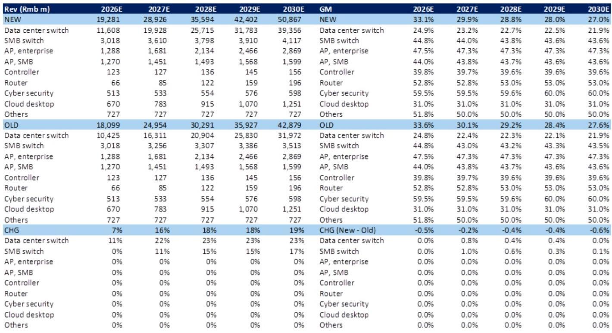
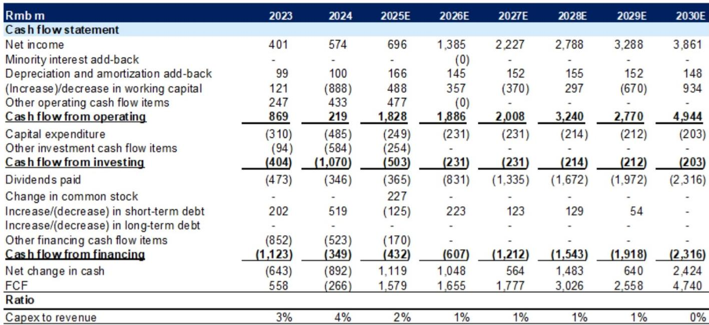
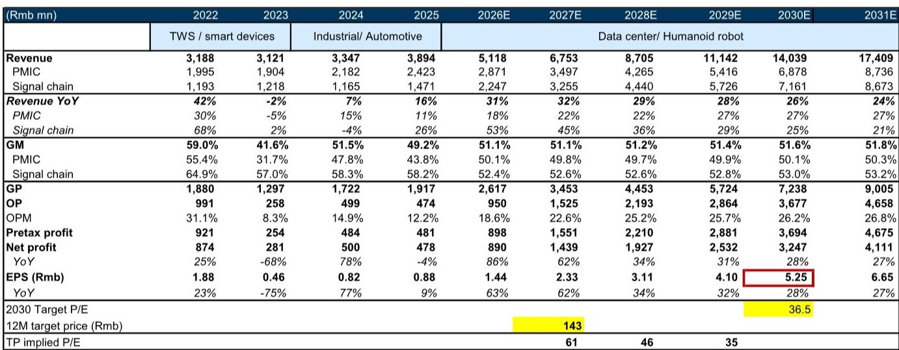

# GS：因AI数据中心增长-锐捷网络因估值合理下调至中性

GS在最新报告中上调了对两家中国芯片公司的目标报价，核心驱动来自同一个判断：AI基础设施的资本开支周期正在加速，并且中国云计算厂商的投入力度超出此前预期。报告更新了全球服务器市场规模预测，其中2026至2028年AI服务器相关芯片的预期被上调14%至22%，而中国云计算厂商的AI资本开支同期被上调37%至55%。这一调整幅度值得关注——它不是边际修正，而是对周期斜率的重新评估。

报告重点分析了两家公司：圣邦股份（SG Micro）和锐捷网络（Ruijie）。前者是国内模拟芯片龙头，正在将产品线从消费电子向AI数据中心延伸；后者是国内白牌交换机领导者，直接受益于云计算厂商的资本开支扩张和超节点建设。GS上调了两者的目标报价，但同时将锐捷网络的评级从观点偏积极下调至中性，理由是估值已回到历史均值附近。

## 1. 模拟芯片的AI化：圣邦股份的产品组合正在发生结构性迁移

圣邦股份目前为数据中心客户提供超过200个料号的产品，主要集中在电源管理芯片和信号链芯片。GS引用Frost & Sullivan的数据指出，网络与计算领域的模拟芯片市场在2026至2030年间将以16%的复合年增长率扩张，到2030年市场规模将达到1330亿元人民币。圣邦股份提供的高功率DC/DC转换器、多相DC/DC控制器和DrMOS产品，正是为数据中心高效、大电流、快速瞬态响应供电而设计。

报告上调了圣邦股份2026至2028年的盈利预测，幅度分别为1%、5%和9%，主要来自更高的营收预期和毛利率改善。营收上调的逻辑是：AI服务器和光模块对模拟芯片的需求增加，同时单机价值量也在提升。毛利率的改善则来自产品组合优化——高毛利的AI数据中心产品占比上升。

> **KC评论：** 圣邦股份的估值方法从短期市盈率切换到了折现2030年市盈率，这本身就是一个信号——分析师认为这家公司的增长故事已经从周期性的消费电子复苏，转向了结构性的AI数据中心渗透。2027年目标市盈率从43倍升至61倍，反映的不是短期盈利爆发，而是市场愿意为更长周期的增长支付溢价。

## 2. 锐捷网络：白牌交换机受益于中国云计算厂商的资本开支扩张，但估值已到位

锐捷网络是国内白牌交换机的领先厂商。GS认为，中国云计算厂商的AI资本开支上调——2026至2028年分别上调37%、44%和55%——将直接拉动白牌交换机的需求，尤其是在超节点架构下，交换机用量和规格都在提升。

报告上调了锐捷网络的目标报价，但同时将评级从观点偏积极下调至中性。理由很直接：报价已经交易在12个月远期市盈率的历史均值附近，目标报价隐含的PEG（市盈率相对盈利增长比率）为1.5倍，处于同业0.9倍至1.7倍的区间中段。换句话说，AI数据中心带来的增长预期已经被部分定价。

> **KC评论：** 这里有一个容易被忽略的细节——GS同时上调了目标报价和下调了评级。目标报价上调是因为盈利预测上调，评级下调是因为报价已经涨到了目标附近。这不是矛盾，而是典型的“基本面改善但估值不再便宜”的框架。对于跟踪这类公司的读者来说，关键不是评级本身，而是理解分析师对“合理估值区间”的判断依据。

## 3. 一个可复用的观察框架：如何判断AI芯片公司的估值是否合理

GS在这份报告中提供了一个值得关注的估值框架。对于圣邦股份，分析师放弃了传统的短期市盈率法，改用折现2030年市盈率。具体做法是：先根据2030年的盈利预测和36.5倍目标市盈率算出2030年的目标市值，再以10.2%的股权成本折现回2027年。这个36.5倍的目标市盈率并非随意选取，而是基于同业市盈率与远期盈利增长率和营业利润率的相关性推导得出。

这个框架的核心假设是：AI数据中心带来的增长不是一两年的事，而是一个持续到2030年甚至更长的结构性趋势。对于读者来说，与其纠结于短期市盈率的高低，不如追问三个问题：这家公司的产品是否真正进入了AI数据中心的供应链？单机价值量是否在提升？市场空间是否足够大，足以支撑多年的增长？GS对圣邦股份的回答是肯定的，但同时也承认——估值已经不便宜。

For informational purposes only. Portions may be generated,translated,summarized,or edited with AI assistance based on source materials and may contain omissions or errors. Please verify independently. This is not investment,legal,tax,accounting,or other professional advice.

For informational purposes only. Portions may be generated,translated,summarized,or edited with AI assistance based on source materials and may contain omissions or errors. Please verify independently. This is not investment,legal,tax,accounting,or other professional advice.

