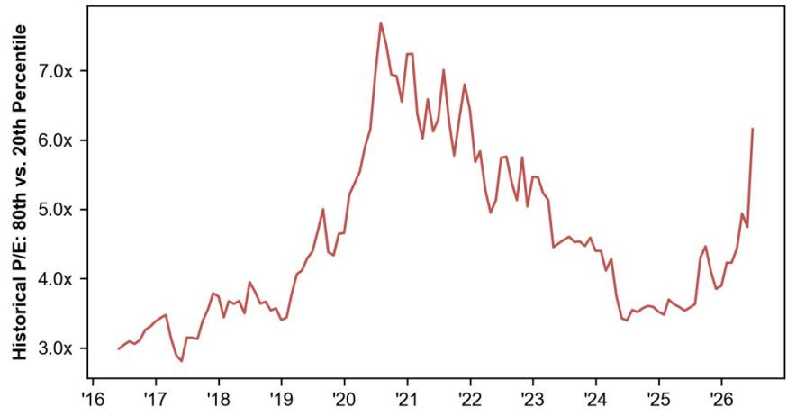
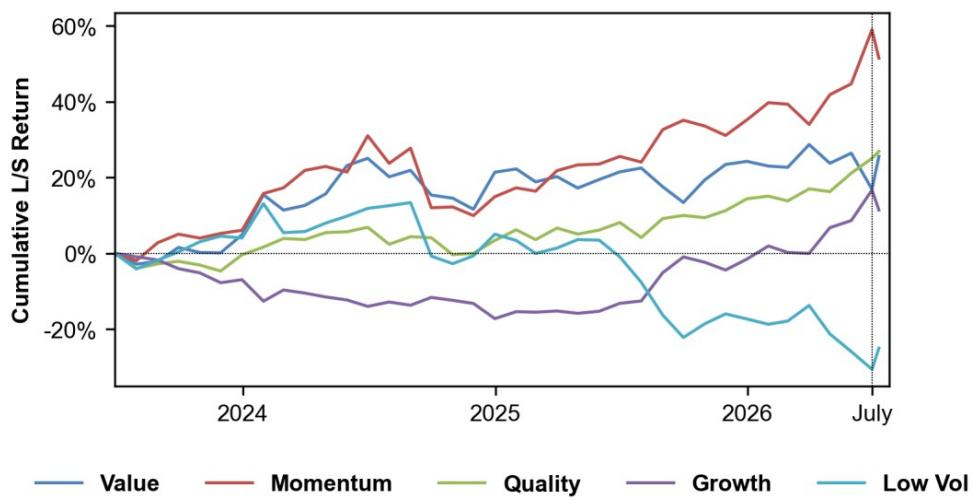
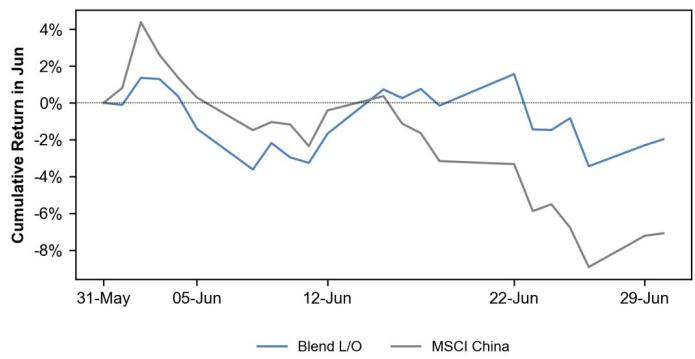
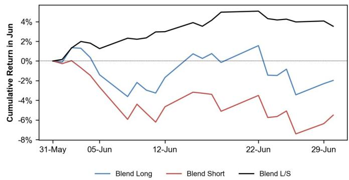
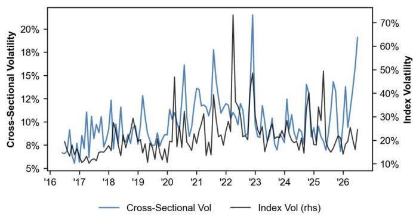
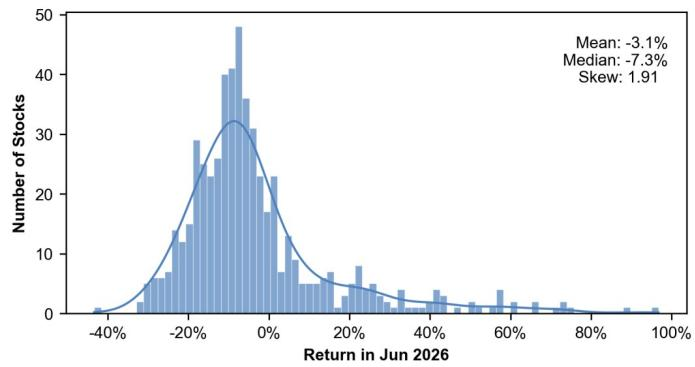
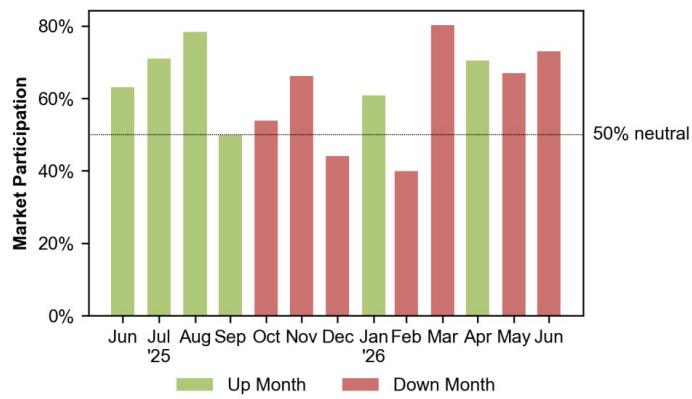
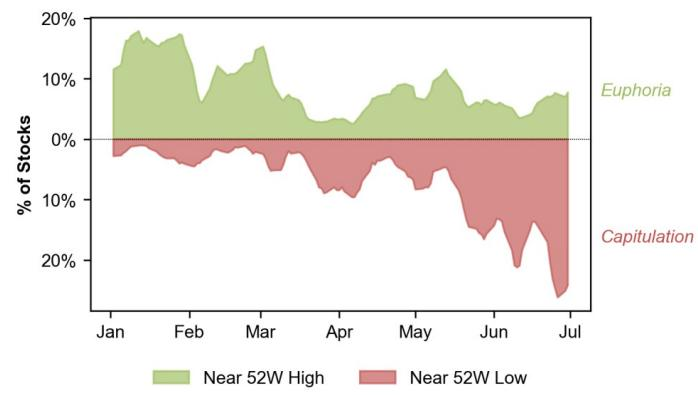

# 市场观察笔记

## 关于市场风格的一些思考

自6月15日以来，成长风格相对价值风格的表现较为突出，成长风格跑赢价值风格约4.5%。6月的市场风格表现与此一致：动量与成长分别上涨9.8%和7.4%，而价值则下跌7.5%。然而，市场再次集中在少数且估值不断走高的右侧标的，而更广泛的标的则面临一定压力：MSCI中国指数6月下跌7.1%，73%的个股随之下行。

估值分化显示，尽管平均个股表现偏弱，市场仍在为赢家支付溢价，6月昂贵组与廉价组之间的差距进一步扩大。昂贵组目前的估值倍数已超过廉价组的6倍，其中位数市盈率分别为114.9倍和6.3倍。赢家的估值看起来有些偏高。

图1：估值比率：昂贵组 vs. 廉价组  
  
来源：JPM；MSCI, FactSet

这并不自动意味着昂贵组是错误的，也不意味着廉价组是正确的。当盈利动能、流动性和叙事都指向同一方向时，昂贵可以保持昂贵。但当市场为一小部分赢家支付几乎任何价格，而大多数个股却在下跌时，举证责任就发生了转移。

当前的估值分化也与2020年末疫情复苏时的峰值有所不同。虽然廉价组看起来较为熟悉（银行、保险、资本品、公用事业和其他低估值板块），但今天的昂贵组更加集中在科技硬件、半导体和材料领域。这使得6月动量与成长的反弹看起来不像是对成长资产的广泛认可，而更像是一个拥挤的、基于FOMO的人工智能主题交易。

## 关于市场风格转换的观察

7月初的市场表现支持了这一解读。月初至今，动量下跌4.7%，成长下跌4.5%，而价值反弹7.4%，低波动上涨8.0%。我们需要注意不要过度解读几天的反转。短期轮动可能较为嘈杂，拥挤的交易也可能迅速重新占据主导。但这一变动与当前的市场环境一致：当估值偏高、分化极端、领导力狭窄时，市场可能不需要重大的宏观冲击来引发轮动。它可能只需要读者思考：赢家是否已经被定价了过多的胜利。

图2：关键风格近三年表现  
  
来源：JPM；MSCI, FactSet, I/B/E/S。

在此背景下，我们建议在动量之外增加防御性、高质量价值的对冲，而不是简单地超配价值或成长。目标不是押注动量/成长领导力的终结，而是参与市场可能从最昂贵的赢家向更便宜、更防御性标的轮动的过程。

我们提出的组合是低波动、股息率、质量和规模的结合：即处于波动率最低三分之一、股息率最高三分之一、质量最高二分之一和市值最高二分之一的个股。该筛选产生31只个股，其中位数历史市盈率为12.3倍，中位数历史股息率为5.5%。行业敞口自然倾向于食品饮料、银行、家电与服装、能源和交通运输。我们认为这一特征适合当前的市场环境：估值足够低以提供支撑，有收入支撑以帮助缓冲波动，并且关注质量以降低价值陷阱风险并保留潜在重估的敞口。

## 多因子组合表现

作为全天候基准，我们的多因子组合在6月表现良好。多头组合下跌2.0%，而MSCI中国指数下跌7.1%。空头组合下跌5.5%，多空组合上涨3.5%。7月，该组合模型在多头端主要增加了能源、信息技术、材料和经纪商等板块的配置，包括中国石油、阳光电源、建滔积层板、中信股份、江西铜业等。在空头端，模型增加了五粮液、HTSC、华虹半导体、长安汽车、海南航空等。

图3：多因子组合：纯多头 vs. 市场  
  
来源：JPM；MSCI, FactSet, I/B/E/S, Bloomberg Finance L.P.

图4：多因子组合：多空  
  
来源：JPM；MSCI, FactSet, I/B/E/S, Bloomberg Finance L.P.

我们曾指出，截至5月，截面波动率已处于过去10年第98百分位的高位。6月，该指标进一步上升至第99百分位。指数波动率也有所上升，从第29百分位升至第77百分位。

图5：MSCI中国指数波动率 vs. 截面波动率  
  
来源：JPM；MSCI, FactSet；截至6月30日

图6：6月月度回报分布  
  
来源：JPM；MSCI, FactSet

图7：与市场方向一致的个股  
  
来源：JPM；MSCI, FactSet。注：过往表现并非未来结果的指标。

图8：接近52周极值的个股  
  
来源：JPM；MSCI, FactSet

表2：低波动、高质量收益股

| SEDOL | 公司 | 行业 | 1个月回报 |
|-------|------|------|----------|
| BP3R2X9 | 中国联合网络通信股份有限公司 | 通信服务 | -7.1% |
| BKPQZT6 | 京东集团股份有限公司A类 | 可选消费 | -12.6% |
| B1YVKN8 | 安踏体育用品有限公司 | 可选消费 | -6.3% |
| BQB7ZL7 | 美的集团股份有限公司H类 | 可选消费 | 1.3% |
| BD5CPP1 | 美的集团股份有限公司A类 | 可选消费 | -2.3% |
| BP3R3G9 | 海尔智家股份有限公司A类 | 可选消费 | -2.6% |
| BD5CPN9 | 珠海格力电器股份有限公司A类 | 可选消费 | -4.6% |
| BP3R2F1 | 贵州茅台酒股份有限公司A类 | 必需消费 | -8.7% |
| 6972459 | 华润啤酒（控股）有限公司 | 必需消费 | -12.1% |
| BD5CPG2 | 宜宾五粮液股份有限公司A类 | 必需消费 | -13.1% |
| BTFRHX0 | 佛山市海天调味食品股份有限公司A类 | 必需消费 | -5.8% |
| BP3R2V7 | 内蒙古伊利实业集团股份有限公司A类 | 必需消费 | -8.2% |
| BP3R820 | 山西杏花村汾酒厂股份有限公司A类 | 必需消费 | -15.0% |
| B09N7M0 | 中国神华能源股份有限公司 | 能源 | -11.1% |
| BP3R262 | 中国神华能源股份有限公司A类 | 能源 | -17.1% |
| BS7K5P8 | 陕西煤业股份有限公司A类 | 能源 | -17.7% |
| B0LMTQ3 | 中国建设银行股份有限公司 | 金融 | -5.0% |
| B1G1QD8 | 中国工商银行股份有限公司 | 金融 | -3.2% |
| B1DYPZ5 | 招商银行股份有限公司 | 金融 | -4.7% |
| 6706250 | 中国人民财产保险股份有限公司 | 金融 | -1.7% |
| BP3R273 | 招商银行股份有限公司A类 | 金融 | -6.9% |
| B8RZJZ1 | 中国人民保险集团股份有限公司 | 金融 | -9.5% |
| BP3R217 | 中国工商银行股份有限公司A类 | 金融 | -2.4% |
| BD5CP95 | 云南白药集团股份有限公司A类 | 医疗保健 | -5.4% |
| BMZ1C83 | 中通快递（开曼）有限公司A类 | 工业 | -1.3% |
| B0B8Z18 | 中国远洋海运控股股份有限公司 | 工业 | -8.3% |
| BP3R552 | 中远海运控股股份有限公司A类 | 工业 | -3.4% |
| BP3R358 | 中国中车股份有限公司A类 | 工业 | -10.2% |
| BD5CH66 | 浙江新和成股份有限公司A类 | 材料 | -3.5% |
| BP3R2M8 | 中国长江电力股份有限公司A类 | 公用事业 | -4.9% |
| 6333937 | 新奥能源控股有限公司 | 公用事业 | -23.1% |

来源：JPM；MSCI, FactSet, I/B/E/S, Bloomberg Finance L.P.；截至6月30日。注：过往表现并非未来结果的指标。

图9：多因子组合：7月多头头寸

| SEDOL | 公司 | 行业 | 排名 | 1个月回报 |
|-------|------|------|------|----------|
| BD5CG58 | 浙江世纪华通集团股份有限公司A类 | 通信服务 | 39 | -3.6% |
| 6531827 | 吉利汽车控股有限公司 | 可选消费 | 34 | -8.1% |
| BN6PP37 | 泡泡玛特国际集团有限公司 | 可选消费 | 26 | -10.9% |
| 6718255 | 长城汽车股份有限公司 | 可选消费 | 46 | -15.4% |
| BZ04KX9 | 雅迪集团控股有限公司 | 可选消费 | 21 | -16.7% |
| BP3R4T9 | 华域汽车系统股份有限公司A类 | 可选消费 | 29 | -7.4% |
| BMGWW30 | 农夫山泉股份有限公司H类 | 必需消费 | 37 | -7.5% |
| BD5CMC7 | 烟台杰瑞石油服务集团股份有限公司A类 | 能源 | 15 | 8.8% |
| BD5CG92 | 内蒙古电投能源股份有限公司A类 | 能源 | 33 | -25.5% |
| 6718976 | 中国人寿保险股份有限公司 | 金融 | 31 | -5.3% |
| B2Q5H56 | 中国太平洋保险（集团）股份有限公司 | 金融 | 53 | -10.9% |
| B5730Z1 | 新华人寿保险股份有限公司 | 金融 | 20 | -5.1% |
| BZ169C6 | CICCH类 | 金融 | 22 | 8.3% |
| 6264048 | 中国太平保险控股有限公司 | 金融 | 7 | -9.4% |
| BYW5MY8 | 江苏银行股份有限公司A类 | 金融 | 49 | -4.8% |
| BD5CN46 | 浙江核新同花顺网络信息股份有限公司A类 | 金融 | 1 | 5.5% |
| BGHH0L6 | 药明康德股份有限公司H类 | 医疗保健 | 51 | 17.9% |
| BY9D3L9 | 三生制药 | 医疗保健 | 5 | -8.8% |
| B3ZVDV0 | 国药控股股份有限公司 | 医疗保健 | 4 | -1.2% |
| BHWLWV4 | 药明康德股份有限公司A类 | 医疗保健 | 50 | 22.2% |
| BP3R4Z5 | 上海医药集团股份有限公司A类 | 医疗保健 | 9 | -6.8% |
| BD5CL42 | 华润三九医药股份有限公司A类 | 医疗保健 | 19 | -8.3% |
| 6218089 | 联想集团有限公司 | 信息技术 | 13 | -4.2% |
| B1HHFV6 | 建滔积层板控股有限公司 | 信息技术 | 48 | 83.2% |
| BFFJRM7 | 中际旭创股份有限公司A类 | 信息技术 | 3 | 9.0% |
| BNHPMD5 | 中科寒武纪科技股份有限公司A类 | 信息技术 | 14 | 21.4% |
| BD761B9 | 成都新易盛通信技术股份有限公司A类 | 信息技术 | 2 | 20.1% |
| BG20N99 | 富士康工业互联网股份有限公司A类 | 信息技术 | 25 | -2.0% |
| B1YBT08 | 舜宇光学科技（集团）有限公司 | 信息技术 | 24 | -26.2% |
| BD5CF28 | 苏州东山精密制造股份有限公司A类 | 信息技术 | 45 | 22.8% |
| BP3RC39 | 生益科技股份有限公司A类 | 信息技术 | 52 | 23.6% |
| BK71F77 | 澜起科技股份有限公司A类 | 信息技术 | 58 | 22.1% |
| BL5P4J3 | 苏州天孚光通信股份有限公司A类 | 信息技术 | 18 | -7.0% |
| BD76164 | 胜宏科技（惠州）股份有限公司A类 | 信息技术 | 17 | -6.3% |
| B29SHS5 | 比亚迪电子（国际）有限公司 | 信息技术 | 16 | -27.8% |
| BPXYTJ5 | 元杰半导体科技股份有限公司A类 | 信息技术 | 6 | 66.0% |
| BGQYNN1 | 信义光能控股有限公司 | 信息技术 | 55 | -22.7% |
| BD5CP28 | TCL科技集团股份有限公司A类 | 信息技术 | 47 | 38.3% |
| BD5CLB9 | 浪潮电子信息产业股份有限公司A类 | 信息技术 | 60 | 8.0% |
| BQWRJD6 | 生益电子股份有限公司A类 | 信息技术 | 8 | -3.9% |
| BD5CNJ1 | 浙江大华技术股份有限公司A类 | 信息技术 | 28 | -1.5% |
| BK71BV3 | 上海柏楚电子科技股份有限公司A类 | 信息技术 | 57 | -7.3% |
| BFCCR07 | 厦门亿联网络技术股份有限公司A类 | 信息技术 | 23 | -6.7% |
| BT9QPW8 | 宁德时代新能源科技股份有限公司A类 | 工业 | 43 | -5.8% |
| BHQPSY7 | 宁德时代新能源科技股份有限公司A类 | 工业 | 42 | -7.6% |
| 6196152 | 中信股份有限公司 | 工业 | 38 | -16.1% |
| BD5CGB4 | 阳光电源股份有限公司A类 | 工业 | 56 | -10.9% |
| BP91NG5 | 宁波德业科技股份有限公司A类 | 工业 | 12 | -8.5% |
| BP3R5T6 | 宇通客车股份有限公司A类 | 工业 | 27 | -17.3% |
| BQ3RQ89 | 大金重工股份有限公司A类 | 工业 | 11 | -20.6% |
| B60FNV8 | 中国黄金国际资源有限公司 | 材料 | 10 | -18.5% |
| BD5CF40 | 银泰黄金股份有限公司A类 | 材料 | 54 | -24.5% |
| BSY22K1 | 山东宏桥铝业控股有限公司 | 材料 | 44 | -30.7% |
| BZOD1S8 | 赤峰吉隆黄金矿业股份有限公司A类 | 材料 | 40 | -21.4% |
| BD5M0H8 | 湖南华菱钢铁股份有限公司A类 | 材料 | 59 | -9.7% |
| BMXWXT6 | 华润万象生活有限公司 | 房地产 | 36 | -9.8% |
| BZBY9R5 | 建发国际投资集团有限公司 | 房地产 | 35 | -14.5% |
| 6099671 | 华能国际电力股份有限公司 | 公用事业 | 41 | -18.6% |
| 6913168 | 广东投资有限公司 | 公用事业 | 30 | -7.1% |
| 6081690 | 北京控股有限公司 | 公用事业 | 32 | -10.6% |

来源：JPM；MSCI, FactSet, I/B/E/S, Bloomberg Finance L.P.；截至6月30日

图10：多因子组合：7月空头头寸

| SEDOL | 公司 | 行业 | 排名 | 1个月回报 |
|-------|------|------|------|----------|
| BD5CN13 | 昆仑万维科技股份有限公司A类 | 通信服务 | 23 | -8.4% |
| BGJW376 | 美团B类 | 可选消费 | 42 | -6.8% |
| BPR9XV6 | 蔚来集团A类 | 可选消费 | 50 | -8.9% |
| BP6FB33 | 小鹏汽车A类 | 可选消费 | 44 | -20.7% |
| BMW5M00 | 理想汽车A类 | 可选消费 | 26 | -20.4% |
| BJLFLB4 | 北汽蓝谷新能源科技股份有限公司A类 | 可选消费 | 56 | -20.5% |
| BP3R477 | 广州汽车集团股份有限公司A类 | 可选消费 | 8 | -16.6% |
| BD5CQP8 | 供销大集集团股份有限公司A类 | 可选消费 | 25 | -23.8% |
| BD5CPF1 | 江苏洋河酒厂股份有限公司A类 | 必需消费 | 14 | -13.0% |
| BD5CNF7 | 新希望六和股份有限公司A类 | 必需消费 | 37 | -20.8% |
| BP3R5Q3 | 永辉超市股份有限公司A类 | 必需消费 | 17 | -23.5% |
| 6782045 | 中国海运发展股份有限公司 | 能源 | 43 | -13.5% |
| BP3R5S5 | 兖州煤业股份有限公司A类 | 能源 | 59 | -18.7% |
| BD8P9J9 | 上海银行股份有限公司A类 | 金融 | 30 | -1.9% |
| BP3R2W8 | 北京银行股份有限公司A类 | 金融 | 45 | -4.0% |
| BZ0D003 | 东方证券股份有限公司A类 | 金融 | 60 | 1.1% |
| BD6QTV6 | 中油资本股份有限公司A类 | 金融 | 18 | -15.2% |
| BFB4KN8 | 浙商证券股份有限公司A类 | 金融 | 24 | 0.3% |
| BK94886 | 天风证券股份有限公司A类 | 金融 | 29 | 0.3% |
| BD5CNY6 | 国元证券股份有限公司A类 | 金融 | 31 | 6.1% |
| BLFJ7Y1 | 康方生物科技（开曼）有限公司 | 医疗保健 | 38 | -25.5% |
| BPH27W4 | 四川百利天恒药业股份有限公司A类 | 医疗保健 | 9 | -25.4% |
| BP3R7Z6 | 漳州片仔癀药业股份有限公司A类 | 医疗保健 | 49 | -15.2% |
| BL61WD0 | 石药创新制药股份有限公司A类 | 医疗保健 | 33 | 1.4% |
| BD5CJY8 | 重庆智飞生物制品股份有限公司A类 | 医疗保健 | 1 | -14.2% |
| BMXTWX4 | 北京万泰生物药业股份有限公司A类 | 医疗保健 | 11 | -22.4% |
| BD5LWT1 | 河北常山生化药业股份有限公司A类 | 医疗保健 | 20 | -43.4% |
| BS5YNY7 | 地平线机器人B类 | 信息技术 | 2 | -22.9% |
| B28XTR4 | 保利协鑫能源控股有限公司 | 信息技术 | 6 | -16.9% |
| BMDJ6Q5 | 小马智行A类 | 信息技术 | 41 | -31.4% |
| BNR4NR3 | 上海硅产业集团股份有限公司A类 | 信息技术 | 7 | 43.6% |
| BP3R3R0 | 三安光电股份有限公司A类 | 信息技术 | 19 | 35.3% |
| BSY23F3 | 联合科技股份有限公司A类 | 信息技术 | 53 | 31.2% |
| BK4XS11 | 卓胜微电子股份有限公司A类 | 信息技术 | 28 | 1.1% |
| BD5CKJ0 | 中国长城科技集团股份有限公司A类 | 信息技术 | 57 | 6.7% |
| BP3RCK6 | 通威股份有限公司A类 | 信息技术 | 16 | -18.3% |
| BNHPM68 | 晶科能源股份有限公司A类 | 信息技术 | 15 | -19.2% |
| BD5CMT4 | 天津中环半导体股份有限公司A类 | 信息技术 | 5 | 22.9% |
| BNRLFT0 | 新疆大全新能源股份有限公司A类 | 信息技术 | 12 | -10.8% |
| BD5CM72 | 广州海格通信集团股份有限公司A类 | 信息技术 | 34 | -19.6% |
| BP3R6C6 | 用友网络科技股份有限公司A类 | 信息技术 | 27 | -11.8% |
| BMVB500 | 晶澳太阳能科技股份有限公司A类 | 信息技术 | 21 | -11.4% |
| BNHPGJ9 | 机器人智能科技股份有限公司A类 | 工业 | 4 | -3.5% |
| BP3R518 | 中国航发动力股份有限公司A类 | 工业 | 51 | -7.8% |
| BP3R5X0 | 中国东方航空股份有限公司A类 | 工业 | 32 | -13.5% |
| BP3R4G6 | 中国国际航空股份有限公司A类 | 工业 | 58 | -11.4% |
| BP3R6G0 | 中国南方航空股份有限公司A类 | 工业 | 47 | -5.9% |
| BP3R4K0 | 中国冶金科工股份有限公司A类 | 工业 | 46 | -14.0% |
| BD5CB19 | 赣锋锂业股份有限公司A类 | 材料 | 52 | -8.8% |
| BP3R819 | 广东华电科技控股股份有限公司A类 | 材料 | 48 | -6.0% |
| BP3R488 | 内蒙古包钢钢联股份有限公司A类 | 材料 | 40 | -5.8% |
| BMQBTG9 | 康美特科技股份有限公司A类 | 材料 | 36 | 11.7% |
| BD5CHF5 | 云南锡业股份有限公司A类 | 材料 | 55 | 13.5% |
| BFYQH85 | 合盛硅业股份有限公司A类 | 材料 | 13 | 26.4% |
| BD5LS71 | 龙蟒佰利联集团股份有限公司A类 | 材料 | 39 | 14.9% |
| BFB4KH2 | 白银有色集团股份有限公司A类 | 材料 | 22 | -19.2% |
| BD5CPW8 | 万科企业股份有限公司A类 | 房地产 | 3 | -16.9% |
| 6460794 | 中国燃气控股有限公司 | 公用事业 | 54 | -25.3% |
| BP91P36 | 中国三峡新能源（集团）股份有限公司A类 | 公用事业 | 10 | -11.3% |
| BP3R1P4 | 永泰能源集团股份有限公司A类 | 公用事业 | 35 | -11.8% |

来源：JPM；MSCI, FactSet, I/B/E/S, Bloomberg Finance L.P.；截至6月30日

---

**免责声明**：本材料仅供研究参考，仅为个人阅读分享或承诺。过往表现不代表未来结果。读者应基于自身判断做出决策。
