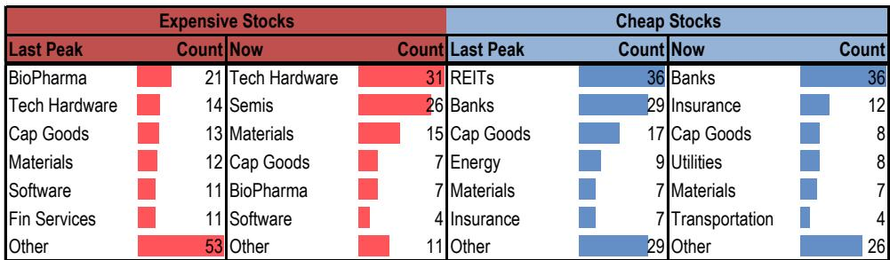

# JPM：中国量化策略-昂贵领涨结构开始变得脆弱

6月MSCI中国指数下跌7.1%，73%的公司收跌。但动量因子和成长因子当月分别上涨9.8%和7.4%。市场不是没有机会，而是机会高度集中在少数公司上。JPM最新量化策略报告指出，这种“昂贵且狭窄”的领涨结构正在变得脆弱。

报告的核心判断并非看空成长股，而是提醒：当市场愿意为少数赢家支付几乎任何价格，而大部分公司持续走弱时，这笔交易的举证责任已经转移。6月的数据显示，昂贵组公司的市盈率中位数达到114.9倍，而便宜组仅为6.3倍，两者估值比超过6倍。这不是一个可以无限维持的价差。

## 1. 这轮估值分化与2020年不同，赢家集中在AI硬件而非生物医药

报告特别对比了当前估值分化与2020年末疫情复苏时的峰值。表面看都是“贵者恒贵、便宜者恒便宜”，但结构完全不同。2020年昂贵组主要由生物制药、科技硬件和资本品构成，行业分布相对分散。而当前昂贵组的集中度更高：科技硬件31只、半导体26只、材料15只，三者合计占昂贵组公司数量的近八成。

这意味着6月的动量与成长行情更像是一场拥挤的FOMO AI交易，而非对成长资产的广泛认可。便宜组的结构则相对稳定，银行、保险、资本品和公用事业仍是主要构成。

> **KC评论：** 报告没有直接说AI交易已经结束，但用“拥挤”和“FOMO”来描述当前结构，暗示了脆弱性。读者需要区分“因为基本面好而贵”和“因为大家都在买而贵”这两种情况。

## 2. 7月初的风格反转不是噪音，而是估值不确定性的自然释放

进入7月，市场风格迅速切换。截至报告数据，动量因子下跌4.7%，成长因子下跌4.5%，而价值因子反弹7.4%，低波动因子上涨8.0%。报告谨慎地指出，短期轮动可能只是噪音，拥挤交易随时可能重新占据主导。但这一变化与当前的市场设定高度一致：当估值拉伸、离散度极端、领涨范围狭窄时，市场不需要一个重大的宏观冲击来触发轮动，只需要读者开始问一个问题——赢家是否已经为“赢太多”定价了。

报告还指出，截面波动率在6月升至过去10年的99百分位，而指数波动率也从29百分位跃升至77百分位。这种“公司分化远大于指数波动”的结构，本身就是市场缺乏共识的信号。

## 3. 防御型高股息质量股是当前最合适的对冲，而非简单做多价值

报告的核心建议不是从成长切换到价值，而是在动量持仓上叠加一个防御型对冲组合。具体筛选标准是：波动率处于最低三分之一、股息率处于最高三分之一、质量评分处于前二分之一、市值处于前二分之一。这一筛选得到31只公司，历史市盈率中位数12.3倍，历史股息率中位数5.5%。

行业分布自然偏向食品饮料、银行、家电、能源和交通运输。报告认为，这一组合在当前环境下具备三个优势：估值足够便宜提供安全垫，股息收入缓冲波动，质量筛选降低价值陷阱不确定性。它不是一个进攻性仓位，而是一个“让读者在参与市场的同时，不至于被极端估值反噬”的配置。

> **KC评论：** 这份报告最有价值的部分不是具体的公司清单，而是提供了一个可复用的观察框架：当市场出现“指数下跌但少数公司创新高”的结构时，用低波动、高股息、高质量三个维度筛选防御型组合，比简单判断风格切换更稳健。报告没有说成长股会明显波动，但给出了一个“如果轮动发生，哪些公司能接住”的答案。

## 4. 多因子组合6月表现验证了这一框架的有效性

报告展示的多因子组合在6月表现稳健：多头组合下跌2.0%，远好于MSCI中国指数的-7.1%；空头组合下跌5.5%，多空整体收益3.5%。7月的多空调整方向也值得关注：多头新增了能源、信息技术、材料和机构，包括中国石油、阳光电源、建滔积层板、中信标的、江西铜业等；空头则新增了五粮液、华泰标的、华虹半导体、长安汽车、海南航空等。

这一调整方向与报告的核心判断一致：在估值极端分化的环境下，资金正在从最拥挤的AI相关硬件和消费白马中撤出，转向估值更低、股息更稳定、质量更可靠的板块。

报告没有给出明确的风格切换时间表，但用数据说明了一个事实：当市场结构变得如此极端时，读者不需要等到拐点确认再行动。提前用低波动高股息质量组合做对冲，至少能在市场波动中保持一定的节奏变化保护。

For informational purposes only. Portions may be generated,translated,summarized,or edited with AI assistance based on source materials and may contain omissions or errors. Please verify independently. This is not investment,legal,tax,accounting,or other professional advice.

For informational purposes only. Portions may be generated,translated,summarized,or edited with AI assistance based on source materials and may contain omissions or errors. Please verify independently. This is not investment,legal,tax,accounting,or other professional advice.

