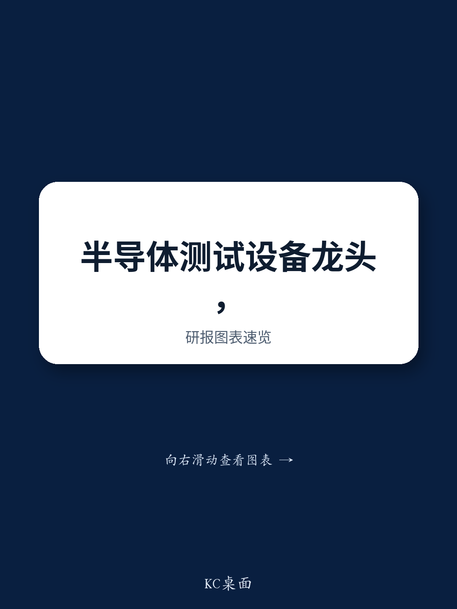

# JPM：中国需求强劲

这份JPM研报的核心判断是：鸿海精密（Hon. Precision）的价值重估，并非来自产能扩张，而是来自AI芯片测试规格的持续升级。报告指出，市场低估了其测试设备ASP（平均售价）在2025-2028年间实现两位数复合增长的可能性，而这一增长的核心驱动力，是AI/HPC芯片对温度控制、封装尺寸和光电共封装的苛刻要求。

鸿海精密2Q26营收超出市场预期12-13%，达到新台币138亿元，同比增长101%。营收结构约为75%来自设备、20%出头来自冷板。设备收入同比接近弹性较高，但出货量增长远低于此，这意味着强劲的ASP增长——这是报告反复强调的核心研究主题。设备规格的持续提升和产品线的扩展，正在将鸿海精密从一家测试设备供应商，转变为AI芯片测试的综合解决方案提供者。

> **KC评论：** 市场往往关注鸿海精密的产能利用率，但这份报告提醒我们，真正驱动其利润增长的，是每台设备能卖得更贵。AI芯片测试对温度控制、多区域温控、光学检测等要求越来越高，这些技术升级直接转化为设备单价提升，而非单纯的数量增长。

## 1. 下半年需求来源明确：ASIC、特斯拉、CPU与中国市场四轮驱动

报告对2H26的需求判断相当具体。特斯拉AI芯片方面，需求来自三家台湾和韩国的OSAT（封测代工厂）的设备采购，以及极高的ATC（自动温度控制）测试设备规格要求，包括FT双温、FT三温和SLT三温。AMD的Venice服务器CPU测试需求显著增强，预计2H26将贡献可观出货量。谷歌TPU和CPU测试需求仍是重要驱动力，鸿海精密为所有项目提供FT测试设备，并为联发科的TPU提供SLT测试设备。中国市场同样保持强劲。整体设备产能仍然紧张，公司正在持续评估和新增生产基地。值得注意的是，京元电子7月10日宣布研究不超过14亿美元设立美国工厂，报告将其解读为鸿海精密的新需求驱动因素。

## 2. SEMICON 2026：新平台发布将触发替换周期与ASP跳升

9月2日至4日的Semicon Taiwan是鸿海精密的关键事件。公司将展示三款新产品：工程多Bin测试设备（可根据测试结果将芯片分入多个输出箱，而非简单的通过/失败，满足AI/HPC芯片对更精细测试结果分割的需求）；大型封装测试设备（3Q26开始出货，预计在2027-28年驱动有意义的替换周期，ASP较现有平台提升两位数百分比）；以及CPO测试插入4的光电共测设备（预计4Q26完成开发并开始试产）。新平台意味着替换需求和价格跳升，这是报告给出的明确判断。

## 3. 被市场忽略的技术升级趋势：从FT/SLT到CP环节的温度控制

报告指出，AI芯片对FT（最终测试）和SLT（系统级测试）中严格的温度控制需求已成为普遍现象，这是鸿海精密的关键需求驱动因素。但更值得关注的是，研究显示，芯片探针卡（CP）环节正在出现更先进的温度控制要求，这是一个尚未被市场充分认知的技术升级趋势。鸿海精密在热卡盘和ATC领域的布局，以及相关的12-24个月中期机会，值得持续跟踪。这意味着，测试规格升级的浪潮正在从后端测试向前端探针环节蔓延，鸿海精密的技术护城河可能比市场预期的更深。

## 4. 估值与不确定性：当前价位提供了一个增强型入场点

鸿海精密报价自1Q26财报电话会议后进入区间震荡，部分读者在约新台币8,000元（38倍2027年预期市盈率）时获利了结，更多是基于估值考量而非基本面。当前报价对应2027/2028年预期市盈率分别为32倍和21倍，报告认为这是一个增强型入场点。研报预计2027/2028年每股收益分别为新台币210元/320元，并认为存在上行空间，驱动力来自产能增加和产品规格升级。CoWoS和FOCoS产能的持续上修将增加AI/HPC芯片产出，支撑测试设备的出货量增长；而测试规格的快速升级（超高TDP、多区域温控、AOI集成、大型封装、CPO等）将带来多年的ASP扩张潜力。

> **KC评论：** 报告给出的牛市情景是，当市场滚动至2028年预期每股收益并给予35-40倍市盈率时，报价可能挑战新台币10,000元。但这一情景的前提是AI需求持续强劲、测试密度不下降、竞争格局不出现变化。其中“测试密度不下降”是一个容易被忽视的不确定性——如果AI芯片的测试复杂度降低，鸿海精密的ASP增长逻辑就会受到挑战。

For informational purposes only. Portions may be generated,translated,summarized,or edited with AI assistance based on source materials and may contain omissions or errors. Please verify independently. This is not investment,legal,tax,accounting,or other professional advice.

For informational purposes only. Portions may be generated,translated,summarized,or edited with AI assistance based on source materials and may contain omissions or errors. Please verify independently. This is not investment,legal,tax,accounting,or other professional advice.
