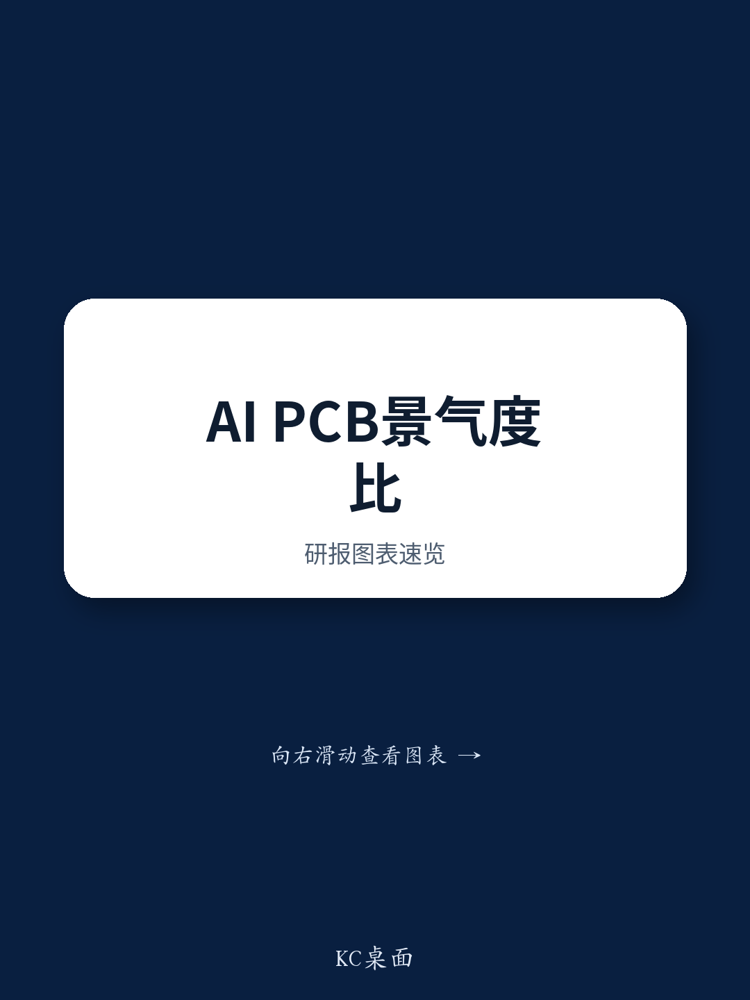

# 研究笔记：大湾区PCB产业链调研要点——AI技术周期持续

这份来自近期大湾区PCB产业链调研的报告，传递了一个与市场普遍关注方向不同的信号：AI相关PCB的技术周期并未松动，但竞争逻辑已经从“谁能进入供应链”切换为“谁能稳定交付”。调研覆盖了多家设备商、制造商和行业专家，核心结论是订单能见度以年为单位，而真正决定市场地位的，是良率稳定性、材料准备和产能爬坡速度。

报告特别指出，某头部平台的新一代PCB已进入量产阶段，新供应商的加入并不自动意味着现有龙头的份额流失。最终分配取决于规模化交付能力，而非早期入围名单。这一判断对当前市场关于“供应商切换即利空”的叙事构成了直接讨论。

## 1. 新一代平台量产启动，新架构仍在验证，但影响已被对冲

调研确认，某头部平台的新一代PCB已进入量产，现有龙头与新供应商均在参与。市场容易将新供应商的进入解读为份额稀释，但报告认为，初期分配可能更均衡，最终份额取决于良率稳定性、材料准备、产能支持与交付速度。换句话说，谁能在大批量生产中保持低缺陷率和高交付效率，谁才能守住位置。

同时，另一新架构仍在测试中，背板复杂度、翘曲控制、材料选择与系统级验证仍是关键环节。但报告强调，即便新架构出现延迟，其对2028年AI PCB整体市场的影响，大概率会被现有平台的更强需求以及ASIC方案的加速采用所对冲。这意味着，单一架构的节奏波动不会改变总量增长的方向。

> **研究评论：** 市场往往对“新供应商进入”或“新平台延迟”做出线性反应，但报告提醒，这两个变量在产业链层面都存在对冲机制。真正需要跟踪的，是每家PCB厂商在量产阶段的良率曲线和交付记录，而非早期定点名单。

## 2. 光模块规格升级与新型设计，正在创造新的工艺需求池

除了AI服务器本身，报告识别出两个正在形成的新需求来源。一是光模块向更高速率升级，对PCB工艺提出更高要求；二是未来新型平台设计，将带动特定制程的需求显著增长。多家PCB厂商已在为此扩产，但报告判断，市场份额最终仍取决于良率表现和大规模交付能力。

这一判断与前述新一代平台的逻辑一脉相承：在AI产业链中，技术认证只是门票，产能执行才是护城河。对于读者而言，区分哪些厂商只是“通过了认证”，哪些厂商已经“证明了量产能力”，比关注技术路线图本身更有意义。

## 3. 材料涨价不确定性出现分化，高端可控、低端吃紧

覆铜板（CCL）的供应紧张与价格上涨，是当前PCB行业利润讨论的焦点。报告调研显示，高端CCL（用于AI应用）的供应相对可控，合同价格涨幅有限，因为客户更看重供应保障，愿意接受价格重新谈判。能够稳定获取高端CCL并保持良率的PCB厂商，在利润端处于更有利位置。

相比之下，低端CCL在供应紧张下价格涨幅更大。消费电子和汽车业务占比高的PCB厂商，面临更明显的利润挤压——不仅CCL供应更紧，而且向下游传导成本的能力更弱。这种分化意味着，AI产业链的利润分配正在向具备高端材料获取能力和工艺控制能力的厂商集中，而低端市场的竞争将更加激烈。

## 4. 国内AI基础设施从2027年起，可能成为增量需求来源

报告还提及一个值得关注的远期变量：国内AI基础设施建设和规格升级，可能从2027年起为高端AI PCB带来增量需求。这一判断的隐含前提是，国内算力研究将从数量扩张转向质量升级，对PCB的层数、材料、工艺要求将逐步向国际标准靠拢。

虽然报告没有展开具体规模，但这一时间节点的设定本身具有参考价值。它意味着，当前全球AI PCB供应链的竞争格局，在未来两年内仍以头部平台和海外云厂商的需求为主导，而国内需求的实质性拉动，可能需要等到2027年之后才会显现。

---

For informational purposes only. Portions may be generated,translated,summarized,or edited with AI assistance based on source materials and may contain omissions or errors. Please verify independently. This is not investment,legal,tax,accounting,or other professional advice.

For informational purposes only. Portions may be generated,translated,summarized,or edited with AI assistance based on source materials and may contain omissions or errors. Please verify independently. This is not investment,legal,tax,accounting,or other professional advice.

