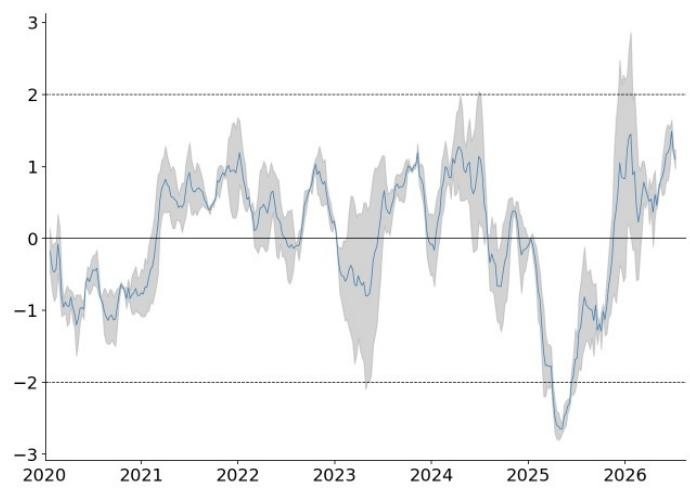
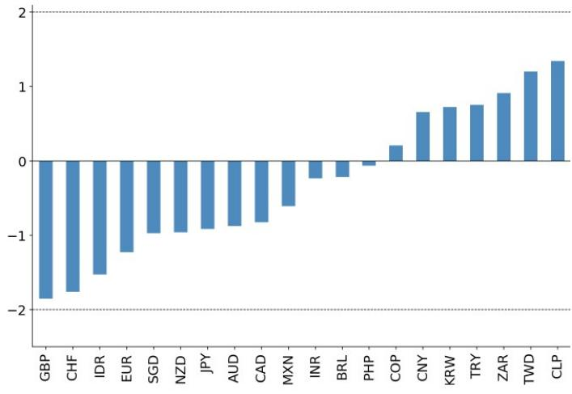
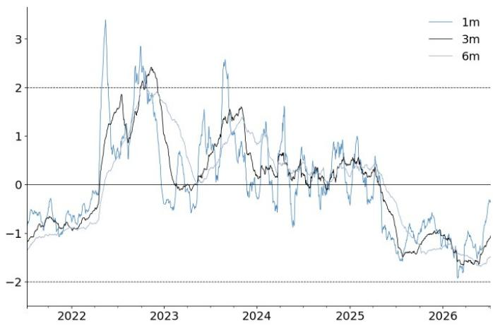
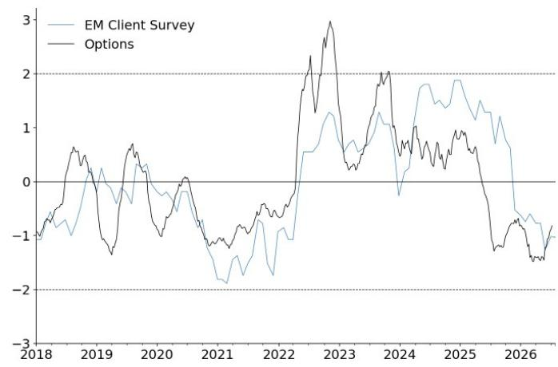
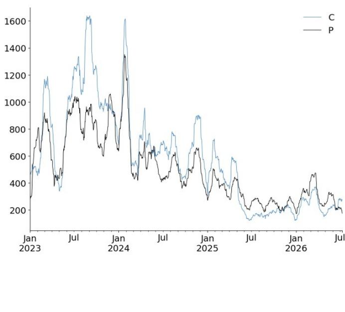
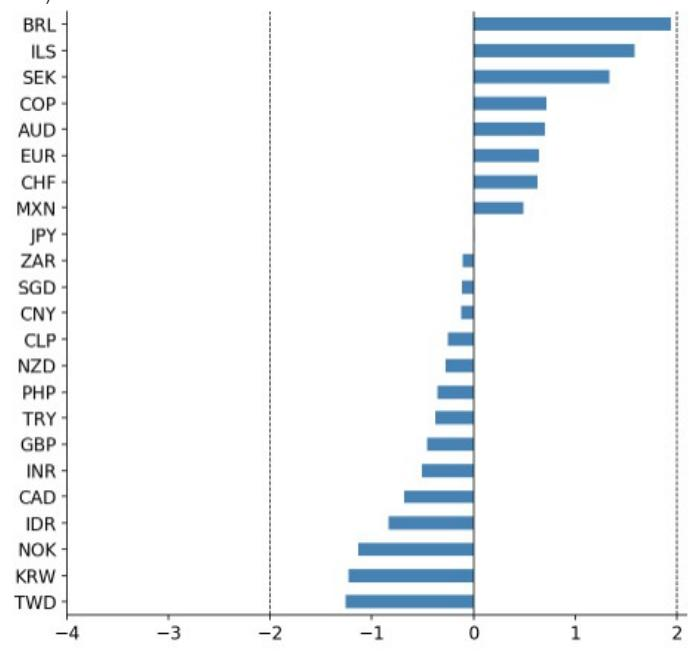
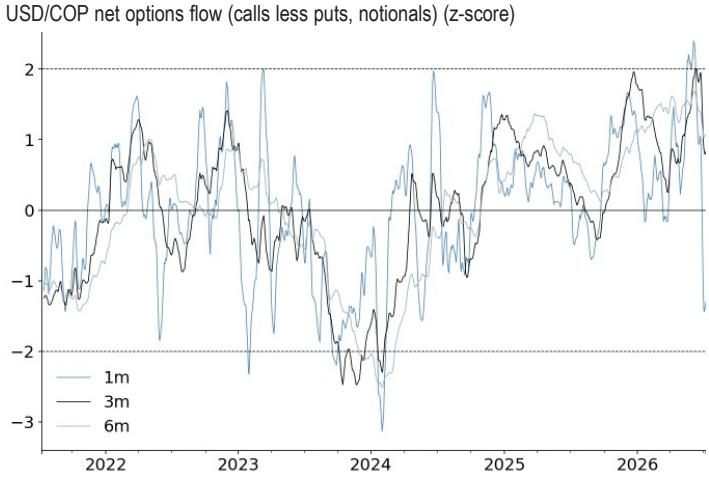

## 全球宏观观察：外汇市场持仓动态

## 日元空头回补初现；美元/人民币下行需求减弱

- 日元空头回补的初步迹象显现。在日本官员就潜在的投资组合调整发表评论后，上周五观察到显著的美元/日元看跌期权需求（图1）。至少在期权领域，这一单日美元/日元下行数据是自2025年8月以来最大规模的此类资金流动。虽然我们怀疑这最终能否逆转日元的结构性趋势，但这仍代表了日元空头去杠杆化的初步迹象，后续可能还有更多持仓调整。图2显示了上周五交易的美元/日元看跌期权执行价分布，中位数为159.75，第10百分位为156.0。

- 市场上仍存在相当规模的日元空头头寸，但尚未达到极端水平。我们近期估计，综合期权和期货数据，美元/日元多头头寸曾高达+1.5个标准差，现已降至+1.1个标准差（图3）。在我们的各项指标中，这仍处于全球外汇持仓的偏空区间（图4），尽管程度不及欧元和瑞士法郎。

图1：上周五美元/日元下行需求为2025年8月以来最大
1日美元/日元净期权资金流（看涨期权减去看跌期权，名义本金）（z-score）

来源：JPM, DTCC, Bloomberg Finance L.P.
图2：新增美元/日元执行价仍主要集中在150上方，但部分已低于156
7月10日美元/日元看跌期权按执行价分布直方图

来源：JPM, DTCC, Bloomberg Finance L.P.

图3：美元/日元多头头寸未达极端水平，已从高点回落，但仍具规模
美元/日元净持仓均值与范围（期货与10周期权资金流均值）

来源：JPM, CFTC, DTCC, Bloomberg Finance L.P.

图4：日元整体处于空头区间，但程度不及部分G10货币
当前各项指标持仓情况（期货、期权及新兴市场客户调查得分均值，适用时）。3年z-score

来源：JPM, CFTC, DTCC, EM Client Survey, Bloomberg Finance L.P.

- 美元/人民币下行需求明显降温。自某个时间节点以来，美元/人民币看跌期权成交量超过看涨期权，市场转向空头——这与2022-2024年持续的美元/人民币多头偏好形成鲜明对比。这一美元/人民币下行需求在2026年第一季度达到顶峰，随后其他人民币持仓指标也出现回落（图6）。但目前，这一需求正在减弱——如图5所示，美元/人民币看涨与看跌期权的平衡正转向中性。当然，这并非美元/人民币空头的全面投降，即使在短期窗口内，我们也未看到市场明确转向多头。同时，由于多种宏观和地缘因素，美元/人民币成交量仍远低于前述2022-2024年期间（图7）。这一点在近期其他美元/亚洲货币下行需求的背景下也值得关注（图8）。

图5：美元/人民币下行需求已降温... 美元/人民币净期权资金流（看涨期权减去看跌期权，名义本金）（z-score）

来源：JPM, DTCC, Bloomberg Finance L.P.

图6：...但尚未转为多头（人民币期权持仓信号近期领先其他指标）

来源：JPM, DTCC, EM Client Survey, Bloomberg Finance L.P.

图7：按历史标准，美元/人民币成交量仍相当低迷
按期权类型划分的总交易量，1个月滚动总和

来源：JPM, DTCC, Bloomberg Finance L.P.

图8：尽管上周美元/韩元和美元/新台币出现看跌需求，美元/人民币下行势头仍较温和
净美元/XXX期权资金流（正值表示美元看涨，负值表示美元看跌）（z-score）

来源：JPM, DTCC, Bloomberg Finance L.P.

- 在5月美元/哥伦比亚比索上行需求强劲之后，6月最后一周出现了美元/哥伦比亚比索看跌需求。图9显示了美元/哥伦比亚比索期权资金流，近期出现从看涨到看跌的明显反转。大部分资金流集中在6月下旬（+3个标准差的美元/哥伦比亚比索看跌需求），此后趋于中性，但仍表明存在一定的持仓调整。

图9：美元/哥伦比亚比索下行需求在6月底强劲出现，此前为上行期

来源：JPM, DTCC, Bloomberg Finance L.P.

## 近期全球宏观观察

• 美元多头头寸上升，6月26日

• 美元/瑞士法郎上行需求激增，6月22日

• 期货持仓显示市场分化，6月14日
