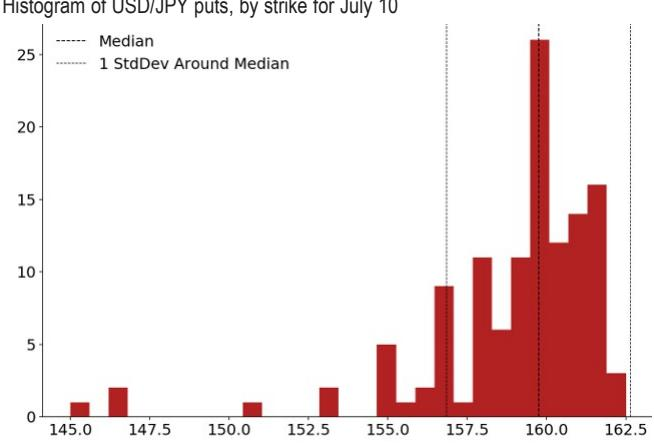
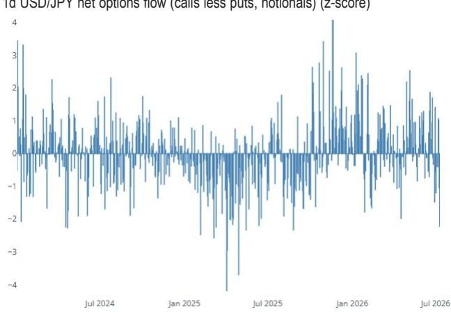

# JPM：外汇仓位监测-日元空头回补初现，美元兑人民币仍在调整需求减弱

这份JPM外汇仓位监测报告提供了一个值得关注的信号：在经历长达数月的日元单边贬值押注后，市场第一次出现了成规模的日元空头回补。上周五，美元兑日元期权市场录得自2025年8月以来最大的单日净看跌需求，量级达到2.5个标准差。触发因素并非宏观环境数据，而是日本官员关于养老产品可能调整组合观察的言论。

但报告同时指出，这轮回补更像是仓位层面的技术性调整，而非结构性反转。日元空头基础仍然庞大，只是从极端位置有所回落。真正值得推敲的，是报告对美元兑人民币市场情绪变化的描述——那里面藏着更微妙的信号。

## 1. 日元空头回补的规模被期权市场放大，但期货市场反应滞后

报告将上周五的期权流量描述为“自2025年8月以来最大”，这个时间点恰好是美联储9月启动降息之前。换句话说，上一次出现同等规模的日元看跌需求，是在全球流动性环境即将转向的节点。而这一次，触发因素来自日本国内的政策预期——GPIF（日本政府养老金研究产品）可能调整其外汇对冲策略。

一个容易被忽略的细节是，期权市场与期货市场的反应速度并不一致。报告估算，综合期权和期货数据后，美元兑日元多头仓位已从此前的+1.5个标准差降至+1.1个标准差。期货市场的日元空头在GPIF消息传出前一周就已开始减少。这说明部分仓位调整可能已经提前完成，上周五的期权流量更像是“补刀”而非起点。

> **KC评论：** 期权市场的2.5个标准差流量看起来很剧烈，但报告明确说“怀疑这能否逆转结构性日元贬值趋势”。关键不在于单日流量大小，而在于仓位调整是否具有持续性。目前期货数据显示空头回补已接近尾声，而非刚刚开始。

## 2. 美元兑人民币的看跌需求正在降温，但市场并未转向看多

报告对美元兑人民币的描述值得单独拎出来。自“解放日”关税事件以来，市场从2022-2024年持续的人民币看跌转向了人民币看涨押注，看跌美元兑人民币的期权成交量持续超过看涨期权。这一趋势在2026年第一季度达到顶峰，随后开始回落。

报告使用的措辞是“降温”而非“逆转”。美元兑人民币期权净流量正在向中性回归，但短期窗口内仍未出现明确的看多信号。更值得注意的是，报告指出美元兑人民币的期权成交量整体仍远低于2022-2024年水平——这意味着市场参与度本身就在下降，而非单纯的仓位方向变化。

与此同时，报告观察到上周其他亚洲货币（台币、韩元）出现了新的美元看跌需求。这种分化暗示，人民币汇率的定价逻辑可能更多受到国内宏观环境和政策信号的牵引，而非单纯的全球美元情绪驱动。

## 3. 哥伦比亚比索的仓位逆转提供了一个对照样本

报告还提到了美元兑哥伦比亚比索的仓位变化：经过5月持续的美元看涨需求后，6月最后一周突然出现3个标准差的美元看跌需求。这种从“一致看多”到“突然反转”的模式，与日元当前的情况形成对比。

哥伦比亚比索的例子说明，当单一方向仓位积累到极端水平后，触发反转所需的催化剂可以很小。日元目前的情况是仓位尚未达到极端（+1.1个标准差），但已经出现了回补迹象。这为观察其他新兴市场货币的仓位不确定性提供了一个参照框架：不是所有仓位调整都会引发趋势反转，但极端仓位本身就是一个需要警惕的信号。

报告的整体基调是克制的。它没有断言日元贬值趋势即将结束，也没有认为人民币看跌情绪已经彻底消散。它提供的是一个仓位层面的快照：市场正在从单边押注中退出，但退出的速度和方向因货币而异。对于关注全球资金流向的读者而言，这份报告的价值不在于给出方向性预测，而在于提供了一个可追踪的仓位变化框架——当期权和期货数据同时指向某个方向时，趋势的惯性可能比想象中更强。

For informational purposes only. Portions may be generated,translated,summarized,or edited with AI assistance based on source materials and may contain omissions or errors. Please verify independently. This is not investment,legal,tax,accounting,or other professional advice.

For informational purposes only. Portions may be generated,translated,summarized,or edited with AI assistance based on source materials and may contain omissions or errors. Please verify independently. This is not investment,legal,tax,accounting,or other professional advice.

