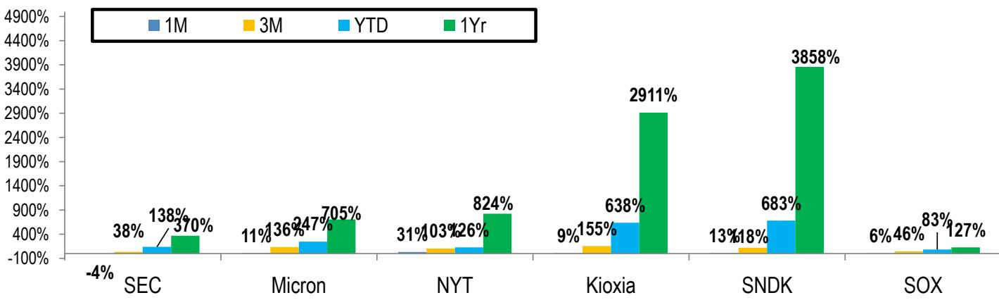
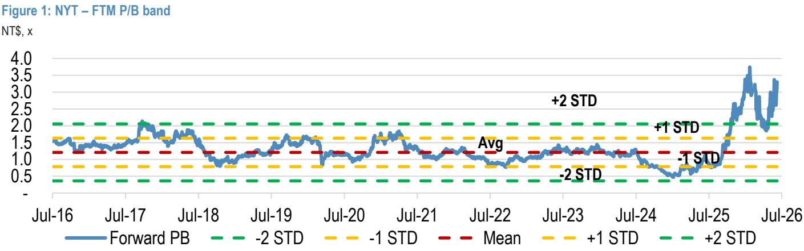
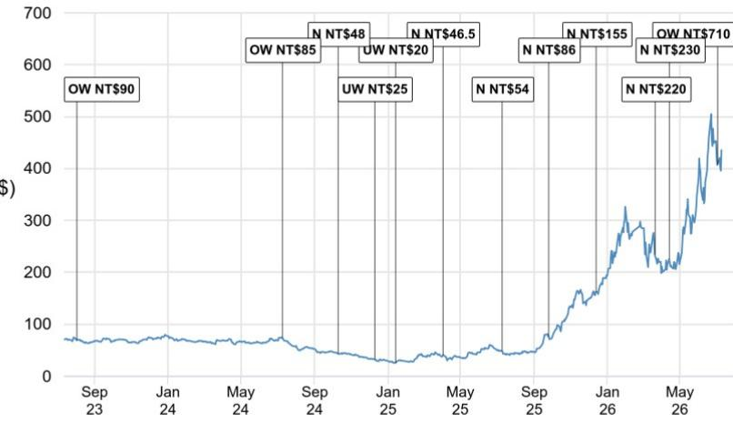

# JPM：南亚科2Q26小幅超预期——不缺订单缺产能

南亚科二季度财报小幅超预期，营业利润608亿新台币，营业利润率74%。这个数字本身已经足够亮眼，但更值得关注的不是利润本身，而是利润的来源——DRAM平均售价环比增长超过60%，而位元出货量基本持平。成本结构几乎没有变化，利润的弹性几乎全部来自定价。换句话说，南亚科正在经历一场由供给短缺驱动的价格重估，而非出货量的扩张。

这家台湾DRAM厂商将2026年位元增长指引从此前的“十几%”上调至“高十几%”，同时维持520亿新台币的全年资本支出计划不变。管理层给出的理由是：行业库存水平低于历史趋势，供需缺口预计将持续到2028年。这与美光近期的判断一致。报告认为，DDR5和DDR4的价格在2026年下半年都将继续走高，因为需求超过供给的环境没有改变。

## 1. 服务器收入占比突破20%，南亚科正在改变产品结构

南亚科历史上服务器计算收入占比一直在10%到15%之间。二季度这一数字首次超过20%。如果计入eSSD的间接服务器敞口，实际比例更高。报告认为这是一个积极的结构性变化——服务器客户通常签订更长期的合同，定价也更稳定，有助于降低公司过去高度依赖消费电子带来的周期性波动。

更值得关注的是南亚科正在通过LPDDR5X堆叠方案进入服务器ARM CPU供应链。管理层在问答中确认，定制化DRAM项目正在与多个客户推进，晶圆对晶圆键合等HBM相关延伸项目也在进行中。虽然对是否进入英伟达Vera Rubin供应链不予置评，但产品组合向服务器倾斜的方向已经明确。

> **KC评论：** 南亚科过去被视为“非主流DRAM厂商”，主要供应DDR3、DDR4等成熟产品。服务器收入占比突破20%意味着它正在从消费电子周期股向数据中心供应链公司转型。这个转变如果持续，市场对其估值框架可能需要重新审视。

## 2. 长期协议正在改变记忆体行业的定价逻辑

管理层在电话会中透露，在供给紧张预计持续多个季度的背景下，客户越来越多地签署多年期长期协议。这些LTA的结构各不相同：有的锁定价格和数量，到期续约；有的锁定数量但价格按季度参考市场行情调整。但共同点是，它们为南亚科提供了更清晰的规划视野。

报告特别指出，新增的“绿地”产能扩张似乎也与超过2028年的多年LTA挂钩。这意味着南亚科在决定大规模资本支出之前，已经拿到了客户的需求承诺。这种模式如果成为行业常态，记忆体行业的盈利周期性可能会比过去二十年明显减弱。

## 3. 4800亿新台币的资本支出计划，信号比数字更重要

南亚科重申2026年资本支出520亿新台币，上半年仅支出69亿，下半年将集中投入约450亿。更引人注目的是中期计划：到2028年新厂一期产能达到3万片晶圆/月，峰值产能4.5万片，总资本支出约4800亿新台币，其中建设成本不到300亿，其余为设备支出，包括预计2028年左右引入的EUV光刻机。

这个数字远高于JPM此前对2026-2028年1720亿新台币的资本支出预估。报告认为，更高的资本支出是南亚科管理层在LTA谈判推进中释放的强烈供给瓶颈解除信号。从2028年起，位元供给增长将显著加速——JPM将2027年和2028年的位元供给增长假设分别从+5%和+27%上调。

## 4. 报价波动中的观察框架：等待CSP资本支出信号

南亚科报价在二季度上涨114%，但6月底美光财报后，记忆体板块情绪转弱，南亚科从高点回落17%。报告认为，在云服务提供商的硬件资本支出指引上调信号明确之前，报价可能继续区间震荡。催化剂包括：CSP资本支出和AI货币化进展更新、亚洲记忆体同行的展望评论、DDR4/DDR5月度价格更新，以及中国DRAM竞争对手IPO后的中期业务计划更新。

报告维持对南亚科的积极看法，认为从中期维度看不确定性回报比仍然有利。核心逻辑是：近期的价格强度、产品组合向服务器改善、LTA进展良好，以及供需缺口延续到2028年的自上而下判断，这些正面因素超过了更高的资本支出带来的谨慎担忧。

> **KC评论：** 南亚科的故事本质上是一个“供给受限+产品升级”的双击。但读者需要区分短期价格弹性和中期产能释放后的供需再平衡。2028年之前，供给瓶颈支撑价格；2028年之后，新产能投产能否被AI和服务器需求消化，才是真正的考验。

For informational purposes only. Portions may be generated,translated,summarized,or edited with AI assistance based on source materials and may contain omissions or errors. Please verify independently. This is not investment,legal,tax,accounting,or other professional advice.

For informational purposes only. Portions may be generated,translated,summarized,or edited with AI assistance based on source materials and may contain omissions or errors. Please verify independently. This is not investment,legal,tax,accounting,or other professional advice.

