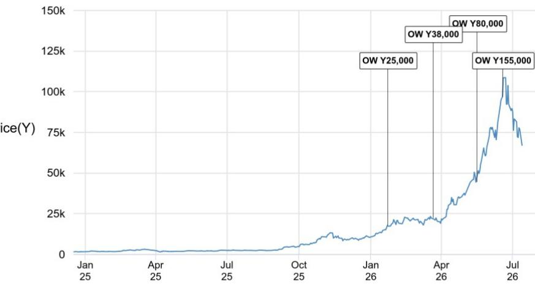
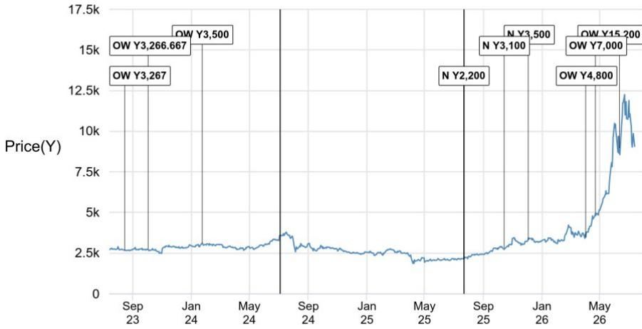
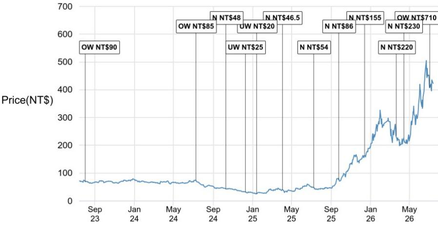
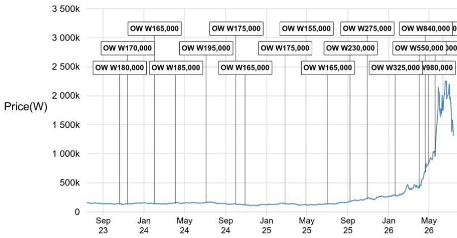
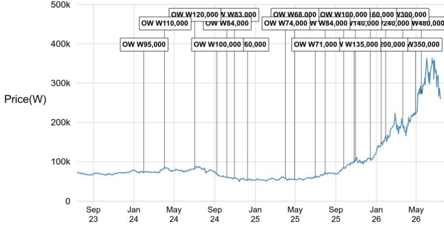
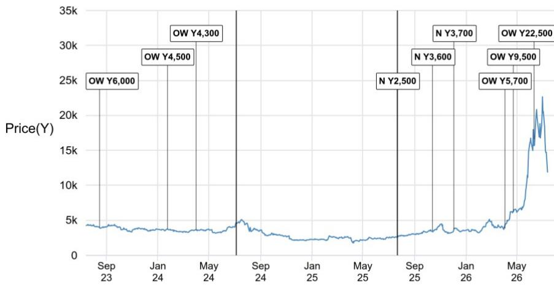

# 亚洲科技行业观察

## 存储器/韩国科技及控股公司读者反馈

我们上周在香港与超过50位市场参与者进行了交流。本文梳理了读者关注的核心议题与反馈，并尝试回应会议中的常见问题。

**读者关注焦点：存储器相关议题，以及六月季度业绩公布前的市场情绪变化。** 在四月/五月价格表现强劲后，亚洲主要存储器公司报价自六月高点至七月十三日收盘已回落约30%（同期MXAP/SOX指数分别变动-6%/-11%），主要由于：i) CSP数据中心硬件资本支出与存储器总可寻址市场之间的预期差距扩大（即卖方对存储器TAM的预期领先于CSP的资本支出规划）；ii) 2026年第二季度后，同比定价动能及环比定价增速放缓；iii) 六月季度每股盈利预期下调（SEC 2026年第二季度营业利润预期在上周业绩公布前已遭下调）。多数交流过的读者认同未来12-24个月存储器基本面存在有利因素，但对当前市场持仓集中度及ETF产品交易活跃度上升带来的波动性表示关注。我们认为，与三个月前市场讨论的议题相比，读者担忧的性质并未发生根本性变化。从更宏观的周期视角看，我们正处于从“基础设施建设：增长动能加速伴随超预期与上调”向“优化阶段：增长精细化与盈利持续性验证”的过渡期。尽管我们预期CSP数据中心硬件资本支出规划将上调，但在实际业绩公布前，上调幅度尚不明确（我们认为这是当前影响存储器市场情绪约70%的因素）。这可能在短期内对存储器市场情绪形成一定影响，直至CSP业绩公布后风险偏好回升。从中期来看，盈利持续性的验证是更重要的价格驱动因素。在亚洲，我们对主要存储器公司维持积极看法。

**通过回应常见问题厘清存储器行业动态与市场情绪。** 本节分享会议中读者提出的关键常见问题。除常规的供需动态问题外，“长期协议”和“HBM定价”是会议的两大核心议题。与三个月/六个月前相比，我们普遍感受到市场对长期协议概念更为乐观，问题也逐步转向理解存储器供应商如何规划与关键客户建立长期合作关系。然而，仍有超过半数的读者对长期协议概念持谨慎态度。在HBM方面，我们感受到自身预期与读者之间存在较大差距。最后，尽管读者认可AI级CPU带来的增长空间，但我们认为这一增长的程度尚未被充分理解。

- **CSP资本支出需上调多少才能支撑存储器价值TAM？** 我们于2026年5月发布的2026E-2027E存储器行业TAM为3480-7200亿美元，这相当于我们美国硬件研究团队所估算CSP硬件资本支出的50-70%。许多读者认为市场（主要是卖方共识）低估了超大规模企业的资本支出，并预期在未来3-6个月内，上述预测期间的资本支出将上调至1万亿/1.5万亿美元。资本支出上调可能降低存储器在资本支出中的价值占比，从而缓解对增长可持续性的担忧。我们认为这也是四月业绩季价格触发因素的重要组成部分。反之，若CSP硬件资本支出上调幅度有限，则可能对存储器供应商的市场情绪产生负面影响。

- **长期协议进展如何？目前及未来长期协议占总出货量的比例是多少？** 我们开始观察到主要存储器公司之间关于长期协议的讨论有所增加，美光在最新业绩中详细阐述了其长期协议结构，包括期限、定价、目标利润率及其他变量。目前尚不清楚韩国存储器公司长期协议占总出货量的具体比例，且比较不同长期协议的质量也颇具挑战。因此，在市场获得清晰的长期协议信息之前，我们可能继续看到关于其对价格上限和利润率影响的各类讨论。我们认为，最终超过一半的合约量将纳入长期协议框架，且存储器公司会力求其底价和利润率不低于AI时代之前的水平。我们继续将长期协议视为盈利持续性的关键要素。

- **长期协议是否会导致平均售价增速放缓并限制利润率提升？** 长期协议为供应商和客户提供了稳固的纽带，以确保出货量可见性和一定的价格区间。尤其在AI硬件资本支出负担仍然较高的情况下，长期协议讨论为双方提供更清晰的框架至关重要。另一方面，随着双方就未来3-5年的定价区间达成一致，价格稳定化是自然且不可避免的趋势。对于最新的长期协议，有观点认为合约定价以最近季度为基准。我们对此不持异议，但认为上行空间仍然存在，原因在于：a) 并非所有长期协议量都已锁定，即使在关键客户中，讨论的量也并非全部通过长期协议锁定，这意味着双方可能在2027E之前以更高价格达成另一份长期协议；b) 我们认为存在比价格上限更具价值的其他要素，如更高的出货量可见性或不同的合约条款；c) 即使长期协议增加，我们预计非长期协议部分的价格将继续上行，从而推高平均价格。长期协议如何转化为实际的近期定价和利润率尚不明确，这也是我们担忧其对短期利润率影响的原因。从中长期来看，我们更关注整个周期的盈利能力，这是反驳部分读者认为存储器具有周期性且价格应在下行周期中修正50-70%的最有力论据。

- **近期存储器定价展望及2027E预测？** 我们维持对2026年第三季度/第四季度约20%/10%的同口径平均售价增长预期。与一至两个月前相比，由于2026年第二季度实际定价趋势（韩国存储器公司实际DRAM价格涨幅低于全球同行），读者对定价预期的范围有所扩大（从环比增长15-20%扩大至10-30%）。我们认为差异可能源于：1) 基数差异（韩国存储器公司三月季度平均售价涨幅显著高于美国/台湾同行）；2) 产品组合差异（面向移动客户的LPDDR出货量较高可能导致混合平均售价涨幅较低；服务器与移动级每GB价格差异高达30-40%）。部分读者询问长期协议组合影响是否也导致价格差异，但这一点尚不明确。展望2027E，我们认为每季度个位数的平均售价增长仍是合理假设，其中一半出货量基于采用2026年合约平均价格的长期协议，另一半基于可能反映供需趋紧的合约定价。

- **HBM平均售价预期差距仍然较大。** 令人惊讶的是，多数买方对明年HBM定价的预期为同比弹性较高，许多读者期待通过HBM平均售价提升来上调每股盈利预期。在我们的估算中，HBM行业平均售价目前约为每Gb 1.8美元，低于非HBM服务器行业平均售价（约2美元/Gb）；因此，从纯粹的经济角度而言，读者的论点有其合理性。然而，我们认为存储器公司在与主要CSP客户沟通时会考虑存储器业务的整体盈利能力，并密切关注客户的存储器支出意愿。需要留意的是，HBM是与AI服务器中GPU安装捆绑的产品，CPU驱动的需求增长是管理代理式AI的次级影响。此外，由于HBM平均售价每年协商一次，存储器公司可以在次年提价。我们认为，维持HBM对整体DRAM行业供需的“交易损失率”概念至关重要，并预测同比25-30%的同口径平均售价增长处于更合理的区间。

- **HBM4量产节奏放缓已被市场充分理解，HBM4E 12Hi关注度提升。** 鉴于多份供应链报告和讨论，NVDA Vera Rubin机架组装延迟及随之而来的HBM4采购计划下调对市场而言并非新信息，已被充分消化。Kyber机架延迟的猜测对市场而言是新的意外因素，但我们尚未看到供应链调整产能运营计划。继韩国存储器公司在2026年第二季度进行一系列HBM4E 12Hi首次客户送样后，读者似乎认可HBM4E主流规格可能为12Hi而非16Hi。在我们2026年5月的HBM供需模型修订中，已反映明年GPU单位组合中12Hi:16Hi的使用比例为65%:35%，这意味着来自NVDA消费的下行风险在2027E仍然有限。相反，正如我们在2026年7月CoWoS假设修订中所见，来自Google TPU和AWS Trainium的需求更为强劲，这意味着整体HBM供需短缺可能在整个预测期内持续。部分读者还指出，AI模型实验室在开发自研芯片并开始直接采购时，可能成为存储器需求的重要驱动力。

- **DRAM和NAND哪个短缺更严重？** 虽然DRAM和NAND均处于紧张状态，但我们认为DRAM的短缺程度（自给率50-60%；供应与订单比率）高于NAND（自给率70-80%）。尽管产能建设趋势有所增加，DRAM仍然紧张，供应商应会看到短缺状况在明年持续恶化，并延续至2028E。与DRAM相比，NAND供需相对不那么紧张，消费电子级需求下调幅度超出预期。另一方面，KV缓存卸载级企业级SSD需求出现异常强劲的上调，存储器公司目前预测500EB及2027E同比增长接近+50%且存在上行风险。读者认为NAND供需可能比表面风险状况相对更好，并预期eSSD细分市场平均售价趋势有利。

- **中国竞争风险评估——读者目前尚未对中国供应表示担忧。** 即使存在各种传闻和产能建设扩张的消息，读者似乎对中国竞争的担忧程度较低。在DRAM方面，似乎没有明显证据表明与领先DRAM生产商的技术差距正在显著缩小。此外，如果中国DRAM供应商将更多产能分配给用于中国生态系统推理芯片建设的HBM，这将缓解其对常规DRAM市场的渗透担忧。同时，据报道领先的中国NAND制造商正同时投资DRAM和NAND用于其新工厂，这对NAND供需动态而言可能是积极发展。总体而言，尽管中国存储器制造商的资本支出预期高于市场增长，但我们不认为这会对我们的存储器行业观点构成重大下行风险，读者普遍认同这一看法。

- **是否面临库存去化风险？** 通常，存储器下行周期始于渠道和客户资产负债表上存储器组件库存的激增。鉴于当前普遍存在的短缺状况，我们看到主要客户的存储器库存有所下降，意外库存去化的风险较小。由于存储器消费不能超过供应量，我们认为存储器采购最终需要正常化，从而缩小理论上的供需缺口。然而，这不应被解读为库存可能立即积累的信号，因为多个终端需求领域正受到供应有限的制约。部分细分市场需求可能在供应改善且定价趋势稳定时快速恢复。最后，部分读者询问电力供应是否会成为瓶颈，并扩大上游半导体与下游数据中心服务器机架安装之间的差距。供应链中的具体前置时间和库存情况尚不明确，我们将密切关注成品服务器机架库存相关风险对存储器采购的影响。

- **对韩国AI大型投资计划看法不一；对存储器设备板块的倾向更为积极。** 读者普遍认为韩国3万亿美元以上AI大型投资计划公告对存储器行业情绪净负面影响，因为初步解读聚焦于缺乏供应纪律。我们认为实际资本支出执行存在许多变数，且在韩国存储器生产商填满龙仁工厂后，长期来看额外的晶圆厂投资将是必要的。值得注意的是，供应瓶颈缓解对于维持上述AI资本支出竞赛同时保持存储器合理价值占比是必要的。从资本支出角度看，考虑到近期和中长期晶圆厂建设进度，我们认为年化资本支出可能比我们公布的预测高出20%或更多。美光在先前2000亿美元支出基础上新增500亿美元资本支出计划，以及三星可能将龙仁工厂基础设施提前最多两年的报道，均表明存储器生产商采取“晶圆厂优先”策略以获得新供应准备和应对多年短缺的灵活性。

- **存储器供应链中还存在哪些瓶颈？** 在存储器子组件行业，我们目前看到存储器级基板和PCB以及控制器IC和DDR4的短缺加剧。这是由于关键客户对存储器规格多样化的需求增加所致。虽然存储器生产商的总TAM不变，但模组SKU的增加将导致对相应组件的采购需求增加。因此，我们认为市场关于存储器级基板降价的猜测不切实际，并将BT基板向ABF基板的迁移视为供需改善的积极因素。上述趋势也有利于第三方NAND控制器IC解决方案提供商和DDR4解决方案提供商。最后，部分读者询问我们是否看到硅晶圆领域也出现供需紧张。

- **MLCC获得存储器之外的第二大关注度，其次是ABF基板，对相对价值交易策略的兴趣较以往有所下降。** 大多数读者理解存储器与MLCC周期的相似性，但继续低估供应瓶颈。我们看多MLCC板块的观点基于：1) AI服务器相关需求强劲推动结构性产品组合改善；2) 供需紧张导致非AI产品MLCC平均售价全面走强。读者的另一个质疑点在于IT MLCC需求可能远弱于预期，这可能推迟短缺时点的到来。在关键催化剂方面，读者正在等待明确的价格上涨信号以支撑当前估值。领先MLCC生产商是否会在即将到来的七月业绩季提供明确的价格上涨路径尚不明确。我们认为这是MLCC板块与存储器板块同步出现较大幅度回调的关键原因。基板板块观点未变；然而，我们观察到类似MLCC的避险情绪。总体而言，对LGE的兴趣水平较低，但部分读者指出其六月季度业绩公布及机器人相关情绪降温后的预期重置可能使该股处于相对安全的位臵。最后，对韩国整体相对价值交易策略的兴趣较三个月前有所下降，因为越来越多的资产净值与存储器半导体价格趋势相关。我们预计，一旦基础资产的股东回报可见性更加清晰，且主要CSP客户数据中心硬件资本支出上调公告后风险偏好回归，板块兴趣将回升。

**图1：全球存储器公司价格表现（含SOX指数）**

来源：Bloomberg Finance L.P.

**表1：覆盖范围内公司估值与财务指标对比**

（表格数据略，保留原格式）

**本文讨论的公司**（除非另有说明，本文所有价格均为2026年7月13日收盘价）
Hanmi Semiconductor(042700.KS/W209,000/UW), ISU Petasys(007660.KS/W101,500/OW), KIOXIA Holdings (285A) (285A.T/¥67,100/OW), LG Corp(003550.KS/W100,200/N), LG Display(034220.KS/W10,480/N), LG Electronics(066570.KS/W188,300/N), LG Innotek(011070.KS/W662,000/OW), Leeno Industrial(058470.KQ/W73,400/N), Murata Manufacturing (6981) (6981.T/¥9,066/OW), Nanya Technology(2408.TW/NT\$423.00/OW), SK Inc(034730.KS/W592,000/OW), SKC(011790.KS/W88,900/UW), Samsung C&T(028260.KS/W364,000/OW), Samsung Electro-Mechanics(009150.KS/W1,315,000/OW), Samsung Electronics(005930.KS/W260,500/OW), Samsung SDS(018260.KS/W192,000/N), Taiyo Yuden (6976)(6976.T/¥11,900/OW)

**分析师认证**：封面标注“AC”的研究分析师证明：(1) 本报告中表达的所有观点准确反映了研究分析师对任何及所有标的证券或发行人的个人观点；(2) 研究分析师的薪酬中没有任何部分直接或间接与本报告中研究分析师提出的具体建议或观点相关。

**重要披露**

• 做市商/流动性提供者：JPM是KIOXIA Holdings (285A), Murata Manufacturing (6981), Nanya Technology, Samsung Electro-Mechanics, Samsung Electronics, Taiyo Yuden (6976)或相关实体金融工具的做市商和/或流动性提供者。

- 管理人/联合管理人：JPM在过去12个月内担任Samsung Electronics或相关实体证券或金融工具公开发行的管理人或联合管理人。

- 实益拥有权（1%或以上）：JPM实益拥有KIOXIA Holdings (285A), Samsung Electro-Mechanics, Samsung Electronics, Taiyo Yuden (6976)或相关实体一类普通股证券的1%或以上。

- 客户：JPM目前拥有或过去12个月内拥有以下实体作为客户：KIOXIA Holdings (285A), Murata Manufacturing (6981), Nanya Technology, Samsung Electro-Mechanics, Samsung Electronics, Taiyo Yuden (6976)或相关实体。

- 客户/投资银行：JPM目前拥有或过去12个月内拥有以下实体作为投资银行客户：Samsung Electronics或相关实体。

- 客户/非投资银行、证券相关：JPM目前拥有或过去12个月内拥有以下实体作为客户，提供的服务为非投资银行、证券相关：Murata Manufacturing (6981), Samsung Electro-Mechanics, Samsung Electronics, Taiyo Yuden (6976)或相关实体。

- 客户/非证券相关：JPM目前拥有或过去12个月内拥有以下实体作为客户，提供的服务为非证券相关：Samsung Electro-Mechanics, Samsung Electronics或相关实体。

- 投资银行报酬：JPM在过去12个月内已收到来自Samsung Electronics或相关实体的投资银行服务报酬。

- 潜在投资银行报酬：JPM预计在未来三个月内将从KIOXIA Holdings (285A), Murata Manufacturing (6981), Samsung Electro-Mechanics, Samsung Electronics, Taiyo Yuden (6976)或相关实体寻求投资银行服务报酬。

- 非投资银行报酬：JPM在过去12个月内已收到来自Murata Manufacturing (6981), Samsung Electro-Mechanics, Samsung Electronics, Taiyo Yuden (6976)或相关实体的非投资银行产品或服务报酬。

- 债务头寸：JPM可能持有KIOXIA Holdings (285A), Murata Manufacturing (6981), Nanya Technology, Samsung Electro-Mechanics, Samsung Electronics, Taiyo Yuden (6976)或相关实体的债务证券头寸。

**公司特定披露**：JPM与其研究报告中所覆盖的公司开展业务并寻求业务往来。因此，读者应注意，公司可能存在影响本报告客观性的利益冲突。读者应将本报告仅视为其做出投资决策的单一因素。重要披露，包括价格图表和信用意见历史表，可通过访问https://www.jpmm.com/research/disclosures、致电1-800-477-0406或发送电子邮件至research.disclosure.inquiries@JPM.com获取。

**KIOXIA Holdings (285A) (285A.T, 285A JP) 价格图表**

| 日期 | 评级 | 价格 (¥) | 目标价 (¥) |
|---|---|---|---|
| 23-Jan-26 | OW | 17910 | 25,000 |
| 22-Mar-26 | OW | 22360 | 38,000 |
| 17-May-26 | OW | 44450 | 80,000 |
| 19-Jun-26 | OW | 96900 | 155,000 |

来源：Bloomberg Finance L.P. 和 JPM；价格数据已根据股票分割和股息进行调整。覆盖起始日期：2026年1月23日。所有股价均为前一个交易日收盘价。

**Murata Manufacturing (6981) (6981.T, 6981 JP) 价格图表**

| 日期 | 评级 | 价格 (¥) | 目标价 (¥) |
|---|---|---|---|
| 16-Aug-23 | OW | 2691 | 3,267 |
| 03-Oct-23 | OW | 2732 | 3,266.667 |
| 24-Jan-24 | OW | 3112 | 3,500 |
| 22-Jul-25 | N | 2165 | 2,200 |
| 14-Oct-25 | N | 2842 | 3,100 |
| 04-Dec-25 | N | 3315 | 3,500 |
| 03-Apr-26 | OW | 3478 | 4,800 |
| 23-Apr-26 | OW | 4911 | 7,000 |
| 12-Jun-26 | OW | 8967 | 15,200 |

来源：Bloomberg Finance L.P. 和 JPM；价格数据已根据股票分割和股息进行调整。覆盖起始日期：2002年1月24日。所有股价均为前一个交易日收盘价。覆盖中断：2024年7月4日至2025年7月22日。

**Nanya Technology (2408.TW, 2408 TT) 价格图表**

来源：Bloomberg Finance L.P. 和 JPM；价格数据已根据股票分割和股息进行调整。覆盖起始日期：2018年6月11日。所有股价均为前一个交易日收盘价。

| 日期 | 评级 | 价格 (NT$) | 目标价 (NT$) |
|---|---|---|---|
| 03-Aug-23 | OW | 69.10 | 90 |
| 10-Jul-24 | OW | 73.00 | 85 |
| 11-Oct-24 | N | 43.50 | 48 |
| 10-Dec-24 | UW | 32.50 | 25 |
| 14-Jan-25 | UW | 25.40 | 20 |
| 03-Apr-25 | N | 41.10 | 46.5 |
| 10-Jul-25 | N | 48.40 | 54 |
| 25-Sep-25 | N | 76.00 | 86 |
| 14-Dec-25 | N | 162.00 | 155 |
| 22-Mar-26 | N | 234.00 | 220 |
| 14-Apr-26 | N | 225.50 | 230 |
| 03-Jul-26 | OW | 407.00 | 710 |

**Samsung Electro-Mechanics (009150.KS, 009150 KS) 价格图表**

来源：Bloomberg Finance L.P. 和 JPM；价格数据已根据股票分割和股息进行调整。覆盖起始日期：2004年10月11日。所有股价均为前一个交易日收盘价。

**Samsung Electronics (005930.KS, 005930 KS) 价格图表**

来源：Bloomberg Finance L.P. 和 JPM；价格数据已根据股票分割和股息进行调整。覆盖起始日期：2011年10月9日。所有股价均为前一个交易日收盘价。

| 日期 | 评级 | 价格 (W) | 目标价 (W) |
|---|---|---|---|
| 20-Oct-23 | OW | 142900 | 180,000 |
| 13-Nov-23 | OW | 134400 | 170,000 |
| 01-Feb-24 | OW | 139600 | 165,000 |
| 04-Apr-24 | OW | 148000 | 185,000 |
| 04-Jul-24 | OW | 154900 | 195,000 |
| 02-Oct-24 | OW | 132500 | 175,000 |
| 29-Oct-24 | OW | 121200 | 165,000 |
| 25-Feb-25 | OW | 143700 | 175,000 |
| 29-Apr-25 | OW | 121300 | 155,000 |
| 03-Jul-25 | OW | 134500 | 165,000 |
| 08-Sep-25 | OW | 178200 | 230,000 |
| 29-Oct-25 | OW | 232500 | 275,000 |
| 21-Jan-26 | OW | 276500 | 325,000 |
| 02-Apr-26 | OW | 442500 | 550,000 |
| 21-Apr-26 | OW | 683000 | 840,000 |
| 30-Apr-26 | OW | 833000 | 980,000 |
| 20-May-26 | OW | 956000 | 1,450,000 |
| 12-Jun-26 | OW | 1808000 | 2,400,000 |

| 日期 | 评级 | 价格 (W) | 目标价 (W) |
|---|---|---|---|
| 01-Feb-24 | OW | 72700 | 95,000 |
| 03-Apr-24 | OW | 85000 | 110,000 |
| 03-Jul-24 | OW | 81800 | 120,000 |
| 08-Sep-24 | OW | 68900 | 100,000 |
| 08-Oct-24 | OW | 61000 | 84,000 |
| 31-Oct-24 | OW | 59100 | 83,000 |
| 10-Dec-24 | N | 53400 | 60,000 |
| 03-Apr-25 | OW | 58800 | 74,000 |
| 30-Apr-25 | OW | 55800 | 68,000 |
| 02-Jul-25 | OW | 60200 | 71,000 |
| 01-Aug-25 | OW | 71400 | 84,000 |
| 25-Sep-25 | OW | 85400 | 100,000 |
| 27-Oct-25 | OW | 98900 | 135,000 |
| 30-Oct-25 | OW | 101700 | 140,000 |
| 14-Dec-25 | OW | 108500 | 160,000 |
| 16-Jan-26 | OW | 145000 | 200,000 |
| 29-Jan-26 | OW | 164300 | 240,000 |
| 22-Mar-26 | OW | 199800 | 300,000 |
| 30-Apr-26 | OW | 226500 | 350,000 |
| 17-May-26 | OW | 273500 | 480,000 |

覆盖起始日期：2001年9月24日。所有股价均为前一个交易日收盘价。覆盖中断：2024年7月4日至2025年7月22日。

**Taiyo Yuden (6976) (6976.T, 6976 JP) 价格图表**

| 日期 | 评级 | 价格 (¥) | 目标价 (¥) |
|---|---|---|---|
| 16-Aug-23 | OW | 4007 | 6,000 |
| 24-Jan-24 | OW | 3742 | 4,500 |
| 01-Apr-24 | OW | 3625 | 4,300 |
| 22-Jul-25 | N | 2628 | 2,500 |
| 14-Oct-25 | N | 3474 | 3,600 |
| 04-Dec-25 | N | 3699 | 3,700 |
| 03-Apr-26 | OW | 3861 | 5,700 |
| 23-Apr-26 | OW | 6264 | 9,500 |
| 12-Jun-26 | OW | 16630 | 22,500 |

来源：Bloomberg Finance L.P. 和 JPM；价格数据已根据股票分割和股息进行调整。
图表显示JPM对这些股票的持续覆盖；当前分析师可能并非在整个期间内均覆盖这些股票。JPM评级或名称：OW = 增持，N = 中性，UW = 减持，NR = 未评级

**股票研究评级、名称及分析师覆盖范围说明：**

JPM使用以下评级体系：增持（在本报告所示目标价期间内，我们预期该股票将跑赢研究分析师或其团队覆盖范围内股票的平均总回报）；中性（在本报告所示目标价期间内，我们预期该股票将与研究分析师或其团队覆盖范围内股票的平均总回报表现一致）；减持（在本报告所示目标价期间内，我们预期该股票将跑输研究分析师或其团队覆盖范围内股票的平均总回报）。NR为未评级。在此情况下，JPM已因缺乏充分基本面依据或法律、监管或政策原因而移除该股票的评级及（如适用）目标价。先前的评级及（如适用）目标价不应再被依赖。NR名称并非推荐或评级。部分覆盖股票有评级但无目标价；在此情况下，我们预期该股票将跑赢/表现一致/跑输研究分析师或其团队在相关区域覆盖范围内股票的平均总回报。在我们的亚洲（除澳大利亚和印度外）及英国中小盘股票研究中，每只股票的预期总回报与基准国家市场指数的预期总回报进行比较，而非与研究分析师的覆盖范围进行比较。如果本报告的重要披露部分未显示，认证研究分析师的覆盖范围可在JPM研究网站https://上找到。

**覆盖范围：Kwon, Jay**：LG Corp (003550.KS), LG Display (034220.KS), LG Electronics (066570.KS), LG Innotek (011070.KS), Nanya Technology (2408.TW), SK Inc (034730.KS), SK hynix (000660.KS), SKC (011790.KS), Samsung C&T (028260.KS), Samsung Electro-Mechanics (009150.KS), Samsung Electronics (005930.KS), Samsung SDS (018260.KS)

**JPM股票研究评级分布，截至2026年7月4日**

|  | 增持（买入） | 中性（持有） | 减持（卖出） |
|---|---|---|---|
| JPM全球股票研究覆盖* | 53% | 36% | 12% |
| 投行客户** | 83% | 80% | 73% |
| JPMS股票研究覆盖* | 51% | 37% | 12% |
| 投行客户** | 95% | 92% | 87% |

*请注意，由于四舍五入，百分比可能未加总至100%。
**在过去12个月内JPM提供投资银行服务的各“买入”、“持有”和“卖出”类别中标的公司的百分比。

仅就FINRA评级分布规则而言，我们的增持评级属于报告评级类别；中性评级属于持有评级类别；减持评级属于报告评级类别。请注意，标有NR的股票未包含在上述表格中。此信息截至最近一个日历季度末。

**股票估值与风险**：有关覆盖公司或目标价的估值方法和风险，请参阅最新的公司特定研究报告，联系主要分析师或您的JPM代表，或发送电子邮件至research.disclosure.inquiries@JPM.com。有关所用专有模型的实质性信息，请参阅公司特定研究报告中的财务摘要和公司概况表，这些资料可在我们客户网站的公司页面上获取。本报告还阐述了其背后的实质性假设。

**研究交流历史**：过去12个月内JPM研究交流的历史可通过研究与评论页面访问，您也可以按分析师姓名、行业或金融工具进行搜索。

**分析师薪酬**：负责编写本报告的研究分析师的薪酬基于多种因素，包括研究和分析的质量和准确性、客户反馈、竞争因素以及公司整体收入。

**非美国分析师注册**：除非另有说明，本报告封面列出的非美国分析师是非JPM Securities LLC美国关联公司的员工，可能未根据FINRA规则注册为研究分析师，可能不是JPM Securities LLC的关联人士，并且可能不受FINRA规则2241或2242关于与覆盖公司沟通、公开露面以及研究分析师账户持有证券交易的限制。

**其他披露**

JPM是JPM Chase & Co.及其全球子公司和关联公司投资银行业务的营销名称。

**英国MiFID FICC研究豁免**：英国客户应参阅英国MiFID研究豁免以了解JPM实施FICC研究豁免的详细信息以及相关FICC研究分类的指导。

所有向客户提供的研究材料均同时在我们的客户网站JPM Markets上提供，除非相关法律特别允许。并非所有研究内容都会重新分发、通过电子邮件发送或提供给第三方聚合商。有关特定股票的所有可用研究材料，请联系您的销售代表。

本研究材料中对中国的任何长格式名称引用为：中国大陆；香港特别行政区（中国）；台湾（中国）；澳门特别行政区（中国）。

JPM可能不时撰写关于受美国、欧盟、英国或其他相关司法管辖区政府当局实施或管理的经济或金融制裁所针对的发行人或证券的文章。本报告中的任何内容均无意被解读为鼓励、促进、推动或以其他方式批准对这类受制裁证券的投资或交易。客户在做出投资决定时应了解自身的法律和合规义务。

本研究报告中讨论的任何数字或加密资产均受快速变化的监管环境影响。有关加密资产（包括比特币和以太坊）的相关监管建议，请参阅https://www.JPM.com/disclosures/cryptoasset-disclosure。

本研究报告的作者可能未获许可在您的司法管辖区开展受监管活动，如果未获许可，则不会声称能够这样做。

**交易所交易基金**：JPM Securities LLC是几乎所有美国上市ETF的授权参与者。如果本报告中提及任何ETF，JPMS可能因分销这些ETF份额而赚取佣金和基于交易的报酬，并可能因执行其他交易相关服务（如向ETF份额卖空者提供证券借贷）而赚取费用。JPMS还可能为ETF本身提供服务，包括担任ETF的经纪商或交易商。此外，JPMS的关联公司可能为ETF提供服务，包括信托、托管、管理、借贷、指数计算和/或维护及其他服务。

**期权和期货相关研究**：如果本文所含信息涉及期权或期货相关研究，此类信息仅提供给已收到适当期权或期货风险披露文件的人士。请联系您的JPM代表或访问https://www.theocc.com/components/docs/riskstoc.pdf获取期权清算公司的标准化期权特征和风险，或访问https://www.finra.org/sites/default/files/2020-08/Security_Futures_Risk_Disclosure_Statement_2020.pdf获取证券期货风险披露声明。

**银行间报价利率及其他基准利率的变更**：某些利率基准目前或未来可能受到持续的国际、国内及其他监管指导、改革和改革提案的影响。更多信息，请参阅：https://www.JPM.com/global/disclosures/interbank_offered_rates

**私人银行客户**：如果您作为JPM Chase & Co.及其子公司提供的私人银行业务的客户接收研究，则研究由JPM私人银行提供，而非JPM的任何其他部门，包括但不限于JPM企业与投资银行及其全球研究部门。

**负责研究和分发研究的法律实体**：编写本材料的Reg AC研究分析师姓名下方标识的法律实体是负责编写本研究的法律实体。如果多位Reg AC研究分析师编写本材料且其姓名下方标识了不同的法律实体，则这些法律实体共同负责编写本研究。如果分析师姓名下列出多个法律实体，则第一个法律实体负责编写，除非另有说明。来自不同JPM关联公司的研究分析师可能对本材料的编写做出了贡献，但可能未获许可在您的司法管辖区开展受监管活动。除非下文法律实体披露中另有说明，本材料已由负责编写的法律实体分发，或者如果分析师姓名下列出多个法律实体，则第一个法律实体负责分发。如有任何疑问，请联系您所在司法管辖区的相关研究分析师或分发本研究材料的实体。

**法律实体披露及国家/地区特定披露**：

**阿根廷**：JPM Chase Bank N.A Sucursal Buenos Aires受阿根廷共和国中央银行和阿根廷国家证券委员会监管。

**澳大利亚**：JPM Securities Australia Limited受澳大利亚证券和投资委员会监管，是ASX Limited的市场参与者、ASX Clear Pty Limited的清算和结算参与者以及ASX Clear (Futures) Pty Limited的清算参与者。本材料由JPMSAL在澳大利亚仅向“批发客户”发行和分发。所有涵盖金融产品的列表可通过访问https://www.jpmm.com/research/disclosures获取。JPM力求覆盖与国内外读者基础相关的所有全球行业分类标准行业以及各种市值规模的公司。如适用，在对标的公司进行公开尽职调查过程中，研究分析师团队可能通过公司拜访、与公司代表讨论、管理层演示等公司接触方式履行此类尽职调查。JPMSAL发布的研究已按照JPM澳大利亚研究独立性政策编制，该政策可在以下链接获取：JPM Australia - Research Independence Policy。

**巴西**：Banco JPM S.A.受巴西证券委员会和巴西中央银行监管。

**加拿大**：JPM Securities Canada Inc.是一家注册投资交易商，受加拿大投资监管组织和安大略省证券委员会监管，是加拿大交易所的参与会员。本材料由JPM Securities Canada Inc.在加拿大分发。

**智利**：Inversiones JPM Limitada是一家在智利注册的非监管实体。

**中国**：JPM Securities (China) Company Limited已获中国证监会批准开展证券投资咨询业务。

**哥伦比亚**：Banco JPM Colombia S.A.受哥伦比亚金融监管局监管。本材料中对哥伦比亚境外实体提供的产品或服务的任何引用仅用于描述目的。此类引用不构成也不应被解释为在哥伦比亚领土内的促销活动或金融产品或服务的提供。

**迪拜国际金融中心**：JPM Chase Bank, N.A., Dubai Branch受迪拜金融服务
