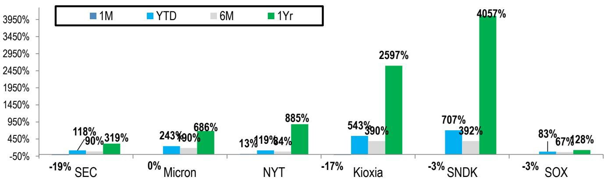
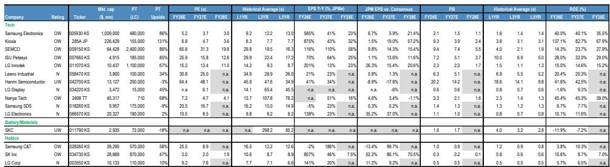

# JPM：亚洲科技读者对内存板块的观察反馈

上周JPM亚洲科技团队在香港与超过50位读者交流后发现，市场对内存板块的情绪已从三个月前的“增长加速”阶段，进入了一个更微妙的过渡期。从6月高点至7月13日，主要亚洲内存公司累计下跌约30%，而同期的MSCI亚太指数和费城半导体指数分别仅下跌6%和11%。这一跌幅并非来自基本面出现变化，而是来自一个核心矛盾的放大：卖方对内存TAM的预期，已经跑在了CSP实际资本开支的前面。

报告认为，当前市场正处于从“基础设施建设的增长加速”向“优化阶段的盈利耐久性验证”切换的关口。短期来看，CSP二季度业绩的披露将成为关键催化剂——如果资本开支指引上调幅度足够大，内存公司的risk-on交易可能重新启动；如果上调幅度有限，则可能被市场解读为谨慎信号。

## 1. 内存TAM与CSP资本开支的“预期差”是短期情绪的核心变量

JPM对2026至2027年内存行业TAM的预测为3480亿至7200亿美元，这相当于其美国硬件研究团队对同期CSP硬件资本开支预测的50%至70%。许多读者认为，市场对超大规模厂商的资本开支存在系统性低估，并预期未来3至6个月内，相关预测可能上调至1万亿至1.5万亿美元。

> **KC评论：** 这里的关键不是TAM本身的大小，而是TAM占CSP资本开支的比例。如果CSP资本开支上调，内存的价值占比会自然下降，反而缓解了市场对“内存吃太多”的担忧。这正是4月业绩季报价反弹的主要触发因素。

报告明确指出，目前约70%的内存情绪驱动力来自CSP实际业绩披露前的预期博弈。这意味着，在CSP财报落地之前，内存公司的波动可能持续。

## 2. LTA不是价格天花板，而是盈利耐久性的锚点

读者对长期供应协议（LTA）的态度正在发生变化。三个月前市场对LTA普遍持怀疑态度，而现在更多读者开始理解其运作逻辑，但仍有超过半数的人保持谨慎。美光在最新财报中详细披露了LTA的期限、定价、目标利润率等变量，这在行业内尚属首次。

报告认为，最终超过一半的合约量将纳入LTA框架，而内存厂商的目标是让LTA下的地板价和利润率不低于AI时代之前的水平。对于LTA是否会导致ASP增速节奏变化的问题，JPM给出了三个反驳点：一是并非所有LTA量都已锁定，部分客户可能以更高价格签订2027年的新合约；二是LTA带来的量能见度和“照付不议”条款本身具有价值；三是非LTA部分的价格仍会继续上涨，推动整体均价上行。

## 3. HBM定价预期差巨大，但内存厂商的谈判逻辑可能被低估

一个让报告团队感到意外的发现是，多数买方对明年HBM ASP的预期是同比增长2倍。从纯宏观环境角度看，这一诉求有其合理性——目前HBM行业ASP约为每Gb 1.8美元，低于非HBM服务器DRAM的约2美元/Gb。但报告认为，内存厂商在与CSP客户谈判时，考虑的是整体DRAM和NAND业务的综合盈利能力，而非单一产品。

HBM作为与GPU捆绑销售的产品，其ASP每年重新谈判一次，而传统内存则面临3至5年的LTA周期。JPM预测25%至30%的同比ASP增长是一个更合理的区间。此外，市场对HBM4的延迟已有充分预期，但HBM4E 12Hi成为主流的趋势正在被读者接受——报告在模型中已将12Hi与16Hi的GPU用量比例设为65%比35%，这意味着英伟达需求的节奏变化不确定性有限，而来自谷歌TPU和AWS Trainium的需求正在成为新的增长极。

## 4. DRAM比NAND更紧缺，但NAND的eSSD需求正在超预期

从供应自给率来看，DRAM目前仅为50%至60%，而NAND为70%至80%。尽管DRAM产能每年增加约39万片晶圆，但短缺状况预计将持续到2028年。相比之下，NAND的消费电子级需求下调幅度超出预期，但企业级SSD（eSSD）需求正在经历异常强劲的上修——内存厂商目前预测2027年eSSD的同比增长接近50%，且存在进一步上行的可能。

> **KC评论：** 读者通常更关注DRAM的供需，但报告提示了一个容易被忽略的结构性变化：eSSD的ASP正在被美国CSP客户主动补贴。这意味着NAND板块的盈利弹性可能比市场预期的更大。

## 5. 中国竞争不确定性未被市场定价为重大威胁

尽管有苹果测试中国内存供应商、中国厂商激进扩产等消息，读者对中国竞争的担忧并不强烈。在DRAM领域，领先厂商已进入1cm节点并向1dnm演进，而中国竞争对手仍停留在1znm至1anm阶段，技术差距未见明显缩小。更重要的是，如果中国DRAM供应商将更多产能转向HBM以满足本土AI推理芯片需求，反而会缓解其对传统DRAM市场的渗透不确定性。

报告还指出，中国NAND厂商正在新工厂中同时研究DRAM和NAND产能，这一动向对NAND的供需动态可能形成正面影响——因为产能分流反而会限制NAND的供给增量。

---

For informational purposes only. Portions may be generated,translated,summarized,or edited with AI assistance based on source materials and may contain omissions or errors. Please verify independently. This is not investment,legal,tax,accounting,or other professional advice.

For informational purposes only. Portions may be generated,translated,summarized,or edited with AI assistance based on source materials and may contain omissions or errors. Please verify independently. This is not investment,legal,tax,accounting,or other professional advice.

