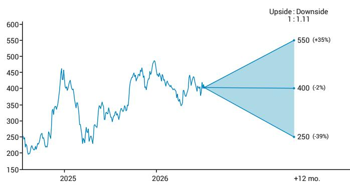

TARGET | ESTIMATE CHANGE

## Raising estimates again

We raise estimates again after Q2's significant auto volume beat. The strength of Q2 volume in China and Europe seems to validate both the unique value proposition of Tesla vehicles and the risk of vehicle commoditization over time. Underproduction should help Q2 cash flow but low implied Cybercab output also suggests more delays in ramping up Robotaxis. We raise Q2 EBIT to $1.45bn (5.1% margin), outer years' EBIT by ~ 6% and PT to $400.

Volume performance in Q2 beat the most optimistic expectations, confirming the value proposition of Tesla vehicles in terms of price and efficiency despite relatively modest product innovation in recent years. This in turn appears to validate Tesla's view on cars becoming commodities and the logic of winding down investment in personal vehicles, but not too fast pending new growth areas.

With reported Q2 deliveries (480.1k units, o/w Models 3/Y 467.8k) largely exceeding consensus of 406k and the 415k estimates we had set mid June, we increase auto revenue further to $21bn including $250m and $500m for ZEV and Leasing. Non repeat of Q1's fx and warranty benefit should keep Auto GM slightly below Q1 (JEFe 18%). Slightly better BESS deployment helps take our group revenue to $28.7bn and Group EBIT to $1.45bn. We assume cash burn $3.0bn on capex climbing $6.9bn, implying a slower ramp in capex and some WC easing after Q1 inventory build, translating into liquidity ~$41.7bn. Apparent low unit production of Cybercab (Production/deliveries of 8,822/12,364 units respectively in "Others") suggest the scaling robotaxis is not imminent.

We raise FY 2026 EBIT 4% to $6.2bn factoring higher volume partly driven by higher priced LWB Model Y, and keep FCF outflow ~$7.5bn including capex of $23bn. We raise outer years EBIT ~6% and remain below consensus by continuing to factor losses from Robotaxis and Optimus in early years.

The relationship between earnings and valuation remains tenuous at best but the multi-year trajectory of growth and earnings has started to shift. We appreciate the vision of Space X and Tesla as proxies for long-term US strategies of independence and leadership in space, energy, manufacturing or semiconductors. We continue to see logic in a merger with SpaceX, on a relatively short timeframe to avoid potential delays in joint investments. At current prices, we calculate a nil-premium merger would translate into Elon Musk retaining a 55.3% voting stake in the combined entity, leaving room for a potential premium for Tesla shareholders.

<table><tr><td>FY (Dec)</td><td>2025E</td><td>2026E</td><td>2027E</td><td>2028E</td></tr><tr><td>Rev. (MM)</td><td>94,827.0</td><td>104,863.3</td><td>123,711.8</td><td>139,403.1</td></tr><tr><td>Cons. Rev.</td><td>94,124.9</td><td>114,701.3</td><td>131,593.6</td><td>-</td></tr><tr><td>EBIT (MM)</td><td>4,355.0</td><td>6,202.7</td><td>7,777.3</td><td>8,323.4</td></tr><tr><td>Cons. EPS</td><td>1.40</td><td>2.47</td><td>3.07</td><td>-</td></tr></table>

<table><tr><td>RATING</td><td>HOLD</td></tr><tr><td>PRICE</td><td>$407.76^</td></tr><tr><td>PRICE TARGET | % TO PT</td><td>↑$400.00 ($375.00) | -2%</td></tr><tr><td>52W HIGH-LOW</td><td>$498.83 - $297.82</td></tr><tr><td>FLOAT (%) | ADV MM (USD)</td><td>74.5% | 18,922.57</td></tr><tr><td>MARKET CAP</td><td>$1.4T</td></tr><tr><td>TICKER</td><td>TSLA</td></tr></table>

^Prior trading day's closing price unless otherwise noted.

<table><tr><td>FY (Dec)</td><td colspan="2">CHANGE TO JEFe</td><td colspan="2">JEF vs CONS</td></tr><tr><td></td><td>2025</td><td>2026</td><td>2025</td><td>2026</td></tr><tr><td>REV</td><td>NA</td><td>NM</td><td>+1%</td><td>-9%</td></tr><tr><td>EPS</td><td>NA</td><td>+3%</td><td>-23%</td><td>-38%</td></tr><tr><td>2025 ($)</td><td>Q1</td><td>Q2</td><td>Q3</td><td>Q4</td></tr><tr><td>EPS</td><td>--</td><td>--</td><td>--</td><td>1.08</td></tr><tr><td>PREV</td><td></td><td></td><td></td><td></td></tr></table>

Philippe Houchois \* | Equity Analyst
44 (0) 20 7029 8983 | philippe.houchois@JEF.com

Owen Paterson ^ | Equity Analyst
+44 (0)20 7548 4745 | opaterson@JEF.com

Vanessa Jeffriess ^ | Equity Analyst
44 (0)20 7548 4123 | vjeffriess@JEF.com

Michael Aspinall ^ | Equity Analyst
+44 (0) 20 7029 8431 | maspinall@JEF.com

## The Long View: Tesla, Inc.

## Investment Thesis

\- TSLA's operating performance confirms that the EV gap with Legacy OEMs is stagnating and still reducing vs Chinese competitors. However, growth has picked up on competitive pricing.

\- The IPO of SpaceX is likely to lead to a merger as strategies converge, investment needs are high and Elon Musk seems determined to maintain controlling voting stakes.

\- Shares have been pricing a successful Robotaxi business which is now emerging slowly

\- We believe TSLA can self-fund developments in AI (FSD, Dojo), Optimus robots, and stationary storage.

• Governance remains a significant risk.

Risk/Reward - 12 Month View  

## Base Case, \$400, -2%

\- TSLA has made SDVs and BEVs both possible and mainstream. Part of a broader strategic mission Tesla is attempting to lead in energy storage, Robotaxis and Humanoids.

\- The process is not smooth and Tesla has been ex-growth for 3 years and seen a shap decline in EBIT/FCF with re-investment set to drive -ve FCF.

\- Vision and tech innovation have disconnected valuation from operating performance.

\- \$400 PT - Mix on DCF-based auto/manufacturing activities and EV/sales multiples for Robotaxi business model, Energy, and peer transaction for Optimus.

## Upside Scenario, \$550, +35%

\- Continued breakthrough in battery tech/cost improves hardware gross margin $>20\%$ and return to DD OP margin.

\- Validation of FSD through autonomy and scaling of a vertically integrated robotaxi business model Acceleration of FCF generation through improved working capital or stabilization of capex.

## Downside Scenario, \$250, -39%

\- Product competition negatively affects sales and residual values.

\- Expansion capex requirement in excess of \$20bn in 2026-27 to fund growth (no capex productivity improvement).

• Further delays in achieving autonomous driving

\- Tesla no longer self-funded and needs to raise capital

• EBIT margin durably <5%

## Sustainability Matters

Top Material Issue(s): 1) TSLA is leading the industry's transition to cleaner energy through EV powertrains, but also with a new model on vertical integration, product design (structural battery), low product complexity (product range and options), and streamlined manufacturing all contributing to resource and capital efficiency. Battery efficiency and cost reduction are critical to a shift to more renewable sources of energy. As a frontrunner in the development of autonomous driving, TSLA has incurred a number of delays. 2) Governance remains a concern, from a lack of oversight, a concentration of power, and unconventional communication from CEO Elon Musk.

Company Target(s): 1) Aim to sell 20m EVs per year by 2030 and deploy 1,500 GWh of energy storage per year. 2) Accelerate transition to renewable energy, particularly solar, through the ecosystem.

## Catalysts

\- Launch of Robotaxi service to validate FSD as truly autonomous software.

\- Validation of TSLA network (low capex/opex business model)

\- Pace of growth in stationary and other applications

• Changes in governance and mgmt structure

Exhibit 1 - Changes in divisional estimates

<table><tr><td></td><td>Actual</td><td>New</td><td>Old</td><td>% chg</td><td>New</td><td>Old</td><td>% chg</td><td>New</td><td>Old</td><td>% chg</td></tr><tr><td>Divisional breakdown</td><td>2025</td><td>2026e</td><td>2026e</td><td>2026e</td><td>2027e</td><td>2027e</td><td>2027e</td><td>2028e</td><td>2028e</td><td>2028e</td></tr><tr><td>Units</td><td>1,636,129</td><td>1,722,000</td><td>1,717,000</td><td>0.3%</td><td>1,953,000</td><td>1,828,000</td><td>6.8%</td><td>2,110,000</td><td>1,960,000</td><td>7.7%</td></tr><tr><td>ASP, $k</td><td>41.7</td><td>42.5</td><td>42.1</td><td>0.9%</td><td>42.8</td><td>41.7</td><td>2.5%</td><td>42.0</td><td>40.9</td><td>2.6%</td></tr><tr><td>ZEV, $m</td><td>1,993</td><td>1,000</td><td>1,000</td><td>-</td><td>500</td><td>500</td><td>-</td><td>300</td><td>300</td><td>-</td></tr><tr><td>Group Revenue</td><td>94,827</td><td>104,863</td><td>104,903</td><td>(0.0%)</td><td>123,712</td><td>113,930</td><td>8.6%</td><td>139,403</td><td>125,166</td><td>11.4%</td></tr><tr><td>Automotive</td><td>69,526</td><td>74,487</td><td>73,611</td><td>1.2%</td><td>83,977</td><td>76,711</td><td>9.5%</td><td>88,819</td><td>80,423</td><td>10.4%</td></tr><tr><td>Service &amp; Other</td><td>12,530</td><td>15,066</td><td>16,304</td><td>(7.6%)</td><td>17,950</td><td>17,877</td><td>0.4%</td><td>19,920</td><td>19,598</td><td>1.6%</td></tr><tr><td>Energy generation and storage</td><td>12,771</td><td>15,131</td><td>14,989</td><td>0.9%</td><td>19,670</td><td>19,342</td><td>1.7%</td><td>25,571</td><td>25,145</td><td>1.7%</td></tr><tr><td>Robotaxis</td><td></td><td>180</td><td>180</td><td></td><td>1,215</td><td>1,215</td><td></td><td>3,594</td><td></td><td></td></tr><tr><td>Humanoids</td><td></td><td>-</td><td>-</td><td></td><td>900</td><td>900</td><td></td><td>1,500</td><td></td><td></td></tr><tr><td>Recurring EBIT</td><td>4,849</td><td>6,203</td><td>5,950</td><td>4.3%</td><td>7,777</td><td>7,444</td><td>4.5%</td><td>8,323</td><td>7,700</td><td>8.1%</td></tr><tr><td>Margin</td><td>5.1%</td><td>5.9%</td><td>5.7%</td><td>24bp</td><td>6.3%</td><td>6.5%</td><td>(25bp)</td><td>6.0%</td><td>6.2%</td><td>(18bp)</td></tr><tr><td>Non-recurring items incl in EBIT</td><td>(494)</td><td>-</td><td>-</td><td>-</td><td>-</td><td>-</td><td>-</td><td>-</td><td>-</td><td>-</td></tr><tr><td>GAAP EBIT</td><td>4,355</td><td>6,203</td><td>5,950</td><td>4.3%</td><td>7,777</td><td>7,444</td><td>4.5%</td><td>8,323</td><td>7,700</td><td>8.1%</td></tr><tr><td></td><td></td><td>-</td><td>-</td><td></td><td>-</td><td>-</td><td></td><td>-</td><td></td><td></td></tr><tr><td>FCF</td><td>6,220</td><td>(7,483)</td><td>(7,748)</td><td>(3.4%)</td><td>(6,159)</td><td>(4,971)</td><td>23.9%</td><td>(4,090)</td><td>(3,488)</td><td>17.2%</td></tr></table>

Source: Tesla, JEFe

Exhibit 2 - Tesla - P&L estimates

<table><tr><td>P&amp;L</td><td>2023</td><td>2024</td><td>2025</td><td>2026e</td><td>2027e</td><td>2028e</td></tr><tr><td>Group revenue</td><td>96,773</td><td>97,690</td><td>94,827</td><td>104,863</td><td>123,712</td><td>139,403</td></tr><tr><td>% change</td><td>18.8%</td><td>0.9%</td><td>-2.9%</td><td>10.6%</td><td>18.0%</td><td>12.7%</td></tr><tr><td>COGS</td><td>(79,113)</td><td>(80,240)</td><td>(77,733)</td><td>(82,826)</td><td>(98,739)</td><td>(113,236)</td></tr><tr><td>Gross profit</td><td>17,660</td><td>17,450</td><td>17,094</td><td>22,037</td><td>24,973</td><td>26,167</td></tr><tr><td>% revenue</td><td>18.2%</td><td>17.9%</td><td>18.0%</td><td>21.0%</td><td>20.2%</td><td>18.8%</td></tr><tr><td>P&amp;L R&amp;D</td><td>(3,969)</td><td>(4,540)</td><td>(6,411)</td><td>(7,865)</td><td>(8,784)</td><td>(8,922)</td></tr><tr><td>% revenue</td><td>4.1%</td><td>4.6%</td><td>6.8%</td><td>7.5%</td><td>7.1%</td><td>6.4%</td></tr><tr><td>SG&amp;A</td><td>(4,800)</td><td>(5,150)</td><td>(5,834)</td><td>(7,970)</td><td>(8,412)</td><td>(8,922)</td></tr><tr><td>% revenue</td><td>5.0%</td><td>5.3%</td><td>6.2%</td><td>7.6%</td><td>6.8%</td><td>6.4%</td></tr><tr><td>EBIT</td><td>8,891</td><td>7,076</td><td>4,355</td><td>6,203</td><td>7,777</td><td>8,323</td></tr><tr><td>Margin</td><td>9.2%</td><td>7.2%</td><td>4.6%</td><td>5.9%</td><td>6.3%</td><td>6.0%</td></tr><tr><td>Net interest</td><td>910</td><td>1,219</td><td>1,342</td><td>1,359</td><td>1,168</td><td>1,045</td></tr><tr><td>Other</td><td>172</td><td>695</td><td>(419)</td><td>-</td><td>-</td><td>-</td></tr><tr><td>EBT</td><td>9,973</td><td>8,990</td><td>5,278</td><td>7,562</td><td>8,945</td><td>9,368</td></tr><tr><td>Tax</td><td>5,001</td><td>(1,837)</td><td>(1,423)</td><td>(2,155)</td><td>(2,549)</td><td>(2,670)</td></tr><tr><td>Tax rate</td><td>50.1%</td><td>20.4%</td><td>27.0%</td><td>28.5%</td><td>28.5%</td><td>28.5%</td></tr><tr><td>Net income</td><td>14,997</td><td>7,091</td><td>3,794</td><td>5,407</td><td>6,396</td><td>6,698</td></tr><tr><td>Minority</td><td>(23)</td><td>62</td><td>61</td><td>-</td><td>-</td><td>-</td></tr><tr><td>NOSH</td><td>3,485</td><td>3,498</td><td>3,528</td><td>3,528</td><td>3,528</td><td>3,528</td></tr><tr><td>EPS diluted, GAAP</td><td>4.30</td><td>2.03</td><td>1.08</td><td>1.53</td><td>1.81</td><td>1.90</td></tr></table>

Exhibit 3 - Cash flow and Balance sheet estimates

<table><tr><td>Industrial Cash flow</td><td>2023</td><td>2024</td><td>2025</td><td>2026e</td><td>2027e</td><td>2028e</td></tr><tr><td>Cash earnings</td><td>15,504</td><td>14,842</td><td>14,105</td><td>16,421</td><td>19,104</td><td>21,304</td></tr><tr><td>Net change in WC (operating)</td><td>824</td><td>3,442</td><td>3,485</td><td>(833)</td><td>(520)</td><td>(301)</td></tr><tr><td>Other</td><td>(3,072)</td><td>(3,361)</td><td>(2,843)</td><td>-</td><td>-</td><td>-</td></tr><tr><td>Operating cash flow</td><td>13,256</td><td>14,923</td><td>14,747</td><td>15,587</td><td>18,584</td><td>21,002</td></tr><tr><td>Capex, net</td><td>(8,899)</td><td>(11,348)</td><td>(8,527)</td><td>(23,070)</td><td>(24,742)</td><td>(25,093)</td></tr><tr><td>FCF</td><td>4,357</td><td>3,575</td><td>6,220</td><td>(7,483)</td><td>(6,159)</td><td>(4,090)</td></tr><tr><td>other investments</td><td>(6,685)</td><td>(7,445)</td><td>(6,951)</td><td>-</td><td>-</td><td>-</td></tr><tr><td>Distribution</td><td>-</td><td>-</td><td>-</td><td>-</td><td>-</td><td>-</td></tr><tr><td>fx</td><td>4</td><td>(141)</td><td>171</td><td>-</td><td>-</td><td>-</td></tr><tr><td>Change in net cash/(debt)</td><td>265</td><td>(158)</td><td>579</td><td>(7,483)</td><td>(6,159)</td><td>(4,090)</td></tr><tr><td>Net industrial liquidity (debt)</td><td>23,864</td><td>28,350</td><td>36,530</td><td>29,047</td><td>22,889</td><td>18,799</td></tr></table>

<table><tr><td>Group balance sheet</td><td>2023</td><td>2024</td><td>2025</td><td>2026e</td><td>2027e</td><td>2028e</td></tr><tr><td>Intangibles</td><td>431</td><td>394</td><td>381</td><td>381</td><td>381</td><td>381</td></tr><tr><td>PP&amp;E</td><td>29,725</td><td>35,836</td><td>40,643</td><td>57,890</td><td>75,769</td><td>92,627</td></tr><tr><td>Operating leases</td><td>10,169</td><td>10,741</td><td>10,939</td><td>7,550</td><td>9,777</td><td>-</td></tr><tr><td>Other non-current assets</td><td>9,760</td><td>9,139</td><td>8,695</td><td>4,374</td><td>4,155</td><td>3,947</td></tr><tr><td>Inventories</td><td>13,626</td><td>12,017</td><td>12,392</td><td>13,615</td><td>15,960</td><td>17,994</td></tr><tr><td>Trade receivables</td><td>3,508</td><td>4,418</td><td>4,576</td><td>4,884</td><td>5,762</td><td>6,493</td></tr><tr><td>Cash &amp; equivalents</td><td>16,398</td><td>16,139</td><td>16,513</td><td>9,030</td><td>2,872</td><td>(1,218)</td></tr><tr><td>Other financial assets</td><td>12,696</td><td>20,424</td><td>27,546</td><td>27,546</td><td>27,546</td><td>27,546</td></tr><tr><td>Other current assets</td><td>3,388</td><td>5,362</td><td>7,615</td><td>7,615</td><td>7,615</td><td>7,615</td></tr><tr><td>Total assets</td><td>106,618</td><td>122,070</td><td>137,233</td><td>137,363</td><td>153,438</td><td>170,637</td></tr><tr><td>Total debt</td><td>5,230</td><td>8,213</td><td>8,376</td><td>8,376</td><td>8,376</td><td>8,376</td></tr><tr><td>Trade payables</td><td>14,431</td><td>12,474</td><td>13,371</td><td>14,069</td><td>16,772</td><td>19,235</td></tr><tr><td>Other liabilities</td><td>24,224</td><td>28,696</td><td>34,324</td><td>33,516</td><td>34,135</td><td>35,072</td></tr><tr><td>Total equity</td><td>61,758</td><td>71,920</td><td>80,397</td><td>89,814</td><td>100,804</td><td>112,617</td></tr></table>

Source: Tesla. JEFe

## Company Description

Tesla, Inc.

TSLA manufactures fully electric passenger vehicles, sells battery storage units and has been developing autonomous vehicle technology as well as humanoid robots. As an OEM, TSLA is more vertically integrated than most peers and has been driving innovation for a number of years through the integration of software, industrial design, artificial intelligence and manufacturing efficiency. TSLA sells its vehicles and storage units directly to consumers. TSLA currently manufactures Models S and X, 3 and Y and Cybertruck in plants located in Fremont, Shanghai, Berlin and Austin. In 2024, TSLA sold ~1.8m vehicles. The company was founded in 2003 and is headquartered in Austin, Texas, USA.

## Company Valuation/Risks

## Tesla, Inc.

Price target based on DCF and also factoring in TSLA pursuing additional growth in storage/generation OEMs. Risks include delays in production ramp-up, investment in autonomous driving and unconventional governance under CEO Elon Musk.

## Analyst Certification:

I, Philippe Houchois, certify that all of the views expressed in this research report accurately reflect my personal views about the subject security(ies) and subject company(ies). I also certify that no part of my compensation was, is, or will be, directly or indirectly, related to the specific recommendations or views expressed in this research report.

I, Owen Paterson, certify that all of the views expressed in this research report accurately reflect my personal views about the subject security(ies) and subject company(ies). I also certify that no part of my compensation was, is, or will be, directly or indirectly, related to the specific recommendations or views expressed in this research report.

I, Vanessa Jeffriess, certify that all of the views expressed in this research report accurately reflect my personal views about the subject security(ies) and subject company(ies). I also certify that no part of my compensation was, is, or will be, directly or indirectly, related to the specific recommendations or views expressed in this research report.

I, Michael Aspinall, certify that all of the views expressed in this research report accurately reflect my personal views about the subject security(ies) and subject company(ies). I also certify that no part of my compensation was, is, or will be, directly or indirectly, related to the specific recommendations or views expressed in this research report.

Registration of non-US analysts: Philippe Houchois is employed by JEF GmbH, a non-US affiliate of JEF LLC and is not registered/qualified as a research analyst with FINRA. This analyst(s) may not be an associated person of JEF LLC, a FINRA member firm, and therefore may not be subject to the FINRA Rule 2241 and restrictions on communications with a subject company, public appearances and trading securities held by a research analyst.

Registration of non-US analysts: Owen Paterson is employed by JEF International Limited, a non-US affiliate of JEF LLC and is not registered/qualified as a research analyst with FINRA. This analyst(s) may not be an associated person of JEF LLC, a FINRA member firm, and therefore may not be subject to the FINRA Rule 2241 and restrictions on communications with a subject company, public appearances and trading securities held by a research analyst.

Registration of non-US analysts: Vanessa Jeffriess is employed by JEF International Limited, a non-US affiliate of JEF LLC and is not registered/qualified as a research analyst with FINRA. This analyst(s) may not be an associated person of JEF LLC, a FINRA member firm, and therefore may not be subject to the FINRA Rule 2241 and restrictions on communications with a subject company, public appearances and trading securities held by a research analyst.

Registration of non-US analysts: Michael Aspinall is employed by JEF International Limited, a non-US affiliate of JEF LLC and is not registered/qualified as a research analyst with FINRA. This analyst(s) may not be an associated person of JEF LLC, a FINRA member firm, and therefore may not be subject to the FINRA Rule 2241 and restrictions on communications with a subject company, public appearances and trading securities held by a research analyst.

As is the case with all JEF employees, the analyst(s) responsible for the coverage of the financial instruments discussed in this report receives compensation based in part on the overall performance of the firm, including investment banking income. We seek to update our research as appropriate, but various regulations may prevent us from doing so. Aside from certain industry reports published on a periodic basis, the large majority of reports are published at irregular intervals as appropriate in the analyst's judgement.

## Investment Recommendation Record

## (Article 3(1)e and Article 7 of MAR)

Recommendation Published

July 12, 2026 12:31 P.M.

Recommendation Distributed

July 12, 2026 12:31 P.M.

## Explanation of JEF Ratings

Buy - Describes securities that we expect to provide a total return (price appreciation plus yield) of 15% or more within a 12-month period.

Hold - Describes securities that we expect to provide a total return (price appreciation plus yield) of plus 15% or minus 10% within a 12-month period.

Underperform - Describes securities that we expect to provide a total return (price appreciation plus yield) of minus 10% or less within a 12-month period. The expected total return (price appreciation plus yield) for Buy rated securities with an average security price consistently below \$10 is 20% or more within a 12-month period as these companies are typically more volatile than the overall stock market. For Hold rated securities with an average security price consistently below \$10, the expected total return (price appreciation plus yield) is plus or minus 20% within a 12-month period. For Underperform rated securities with an average security price consistently below \$10, the expected total return (price appreciation plus yield) is minus 20% or less within a 12-month period.

NR - The investment rating and price target have been temporarily suspended. Such suspensions are in compliance with applicable regulations and/or JEF policies.

CS - Coverage Suspended. JEF has suspended coverage of this company.

NC - Not covered. JEF does not cover this company.

Restricted - Describes issuers where, in conjunction with JEF engagement in certain transactions, company policy or applicable securities regulations prohibit certain types of communications, including investment recommendations.

Monitor - Describes securities whose company fundamentals and financials are being monitored, and for which no financial projections or opinions on the investment merits of the company are provided.

## Valuation Methodology

JEF' methodology for assigning ratings may include the following: market capitalization, maturity, growth/value, volatility and expected total return over the next 12 months. The price targets are based on several methodologies, which may include, but are not restricted to, analyses of market risk, growth rate, revenue stream, discounted cash flow (DCF), EBITDA, EPS, cash flow (CF), free cash flow (FCF), EV/EBITDA, P/E, PE/growth, P/CF, P/FCF, premium (discount)/average group EV/EBITDA, premium (discount)/average group P/E, sum of the parts, net asset value, dividend returns, and return on equity (ROE) over the next 12 months.

## JEF Franchise Picks

JEF Franchise Picks include stock selections from among the best stock ideas from our equity analysts over a 12 month period. Stock selection is based on fundamental analysis and may take into account other factors such as analyst conviction, differentiated analysis, a favorable risk/reward ratio and investment themes that JEF analysts are recommending. JEF Franchise Picks will include only Buy rated stocks and the number can vary depending on analyst recommendations for inclusion. Stocks will be added as new opportunities arise and removed when the reason for inclusion changes, the stock has met its desired return, if it is no longer rated Buy and/or if it triggers a stop loss. Stocks having 120 day volatility in the bottom quartile of S&P stocks will continue to have a 15% stop loss, and the remainder will have a 20% stop. Franchise Picks are not intended to represent a recommended portfolio of stocks and is not sector based, but we may note where we believe a Pick falls within an investment style such as growth or value.

## Risks which may impede the achievement of our Price Target

This report was prepared for general circulation and does not provide investment recommendations specific to individual investors. As such, the financial instruments discussed in this report may not be suitable for all investors and investors must make their own investment decisions based upon
