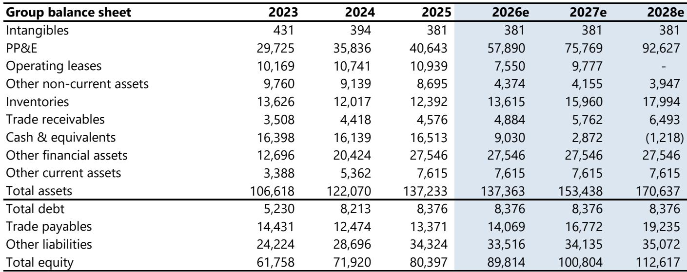
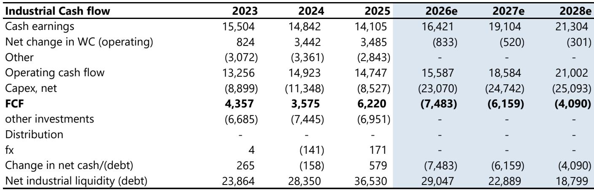
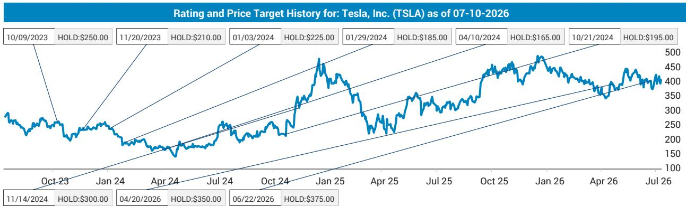

# JEF：特斯拉相关数据观察

Q2交付量480,128辆，高于市场预期的40.6万辆和JEF自己在6月中旬设定的41.5万辆目标。这一数字反映了特斯拉车型在价格和效率方面的特点，也与其关于汽车将走向商品化的判断相呼应。但JEF同时指出，Cybercab极低的产量显示，Robotaxi的规模化并非短期可实现。

报告将Q2息税前利润预期上调至14.5亿美元（对应5.1%的利润率），并将远期年份息税前利润上调约6%。然而，这份上调并未改变一个核心观察：特斯拉的盈利与估值之间的关系仍值得关注，尽管增长和盈利多年来的变化趋势已开始出现调整。

## 1. 交付量超预期，但产品创新节奏并未加快

Q2交付量的表现，是在特斯拉近年来产品创新相对温和的背景下实现的。JEF认为，这与其关于汽车将逐步商品化的判断相符，也解释了为何特斯拉有意调整对个人乘用车的关注节奏，转而等待新领域成型。报告特别提到，中国和欧洲市场的交付情况，说明特斯拉车型的性价比优势依然存在，但这一优势能否持续，取决于公司能否在下一代平台上重新定义差异化。

> **KC评论：** 交付量超预期并不等于产品力跃升。JEF的观察是，特斯拉正在用定价策略维持需求，同时主动降低对传统汽车业务的资本配置。这张图表的另一面是，如果新增长点（Robotaxi、Optimus）不能如期接棒，汽车业务的利润率可能面临长期调整。

## 2. Cybercab产量极低，Robotaxi规模化仍需时间

在“其他”车型分类中，Cybercab的产量和交付量分别仅为8,822辆和12,364辆。JEF认为，这一数据表明，Robotaxi的规模化并非短期可实现的目标。报告在远期盈利预测中，继续假设Robotaxi和Optimus在早期阶段会产生亏损，这也是其盈利预测低于市场共识的主要原因。2026年息税前利润预期为62亿美元，仍比市场共识低约38%。

## 3. 现金流与资本开支：短期改善，远期承压

Q2的产能不足反而有助于现金流表现，但JEF预计全年资本开支将攀升至69亿美元，2026年更将跃升至约230亿美元。这意味着，从2026年起，特斯拉将进入持续的负自由现金流状态，直至2028年仍无法转正。报告认为，公司有能力通过自身业务为AI、自动驾驶、储能和机器人研发提供资金，但这一判断的前提是，汽车业务的现金生成能力不会出现意外变化。

## 4. 与SpaceX合并的逻辑正在强化

JEF在报告中延续了一个此前已提出的观点：特斯拉与SpaceX的合并具有战略逻辑。两家公司在空间、能源、制造和半导体领域的长期战略目标高度重合，且研发需求巨大。报告测算，按当前价格计算，若以零溢价合并，埃隆·马斯克将在合并后实体中保留约55.3%的投票权，这为特斯拉股东争取一定溢价留出了空间。但报告也承认，这一判断的时间窗口相对较短，以避免联合研发出现延迟。

For informational purposes only. Portions may be generated,translated,summarized,or edited with AI assistance based on source materials and may contain omissions or errors. Please verify independently. This is not investment,legal,tax,accounting,or other professional advice.

For informational purposes only. Portions may be generated,translated,summarized,or edited with AI assistance based on source materials and may contain omissions or errors. Please verify independently. This is not investment,legal,tax,accounting,or other professional advice.

