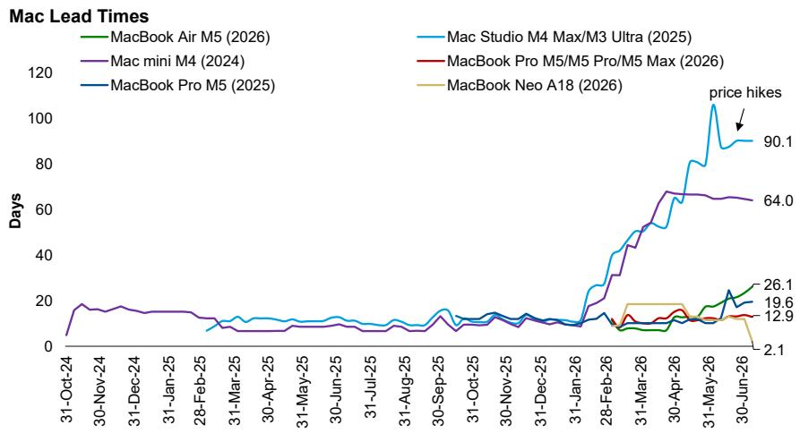
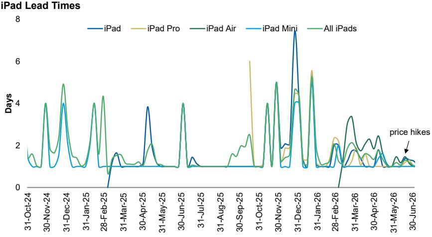
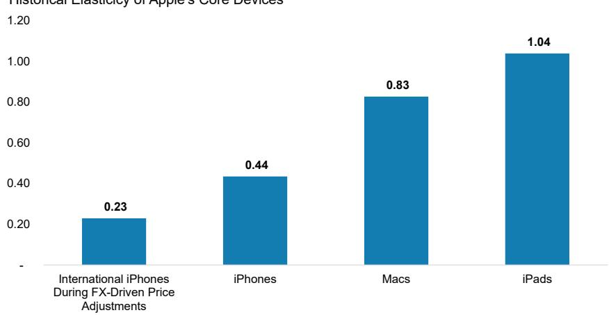
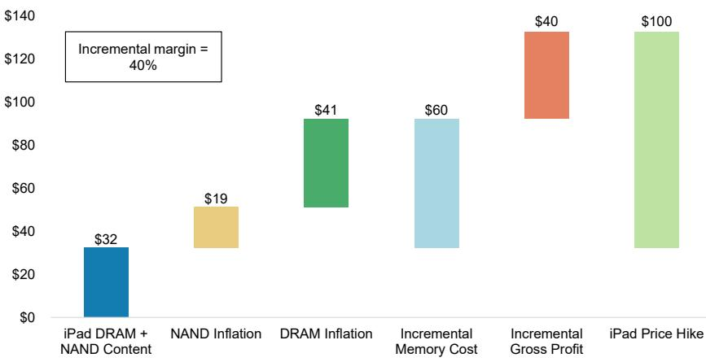
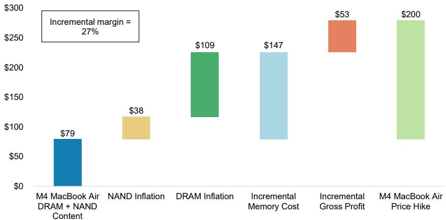
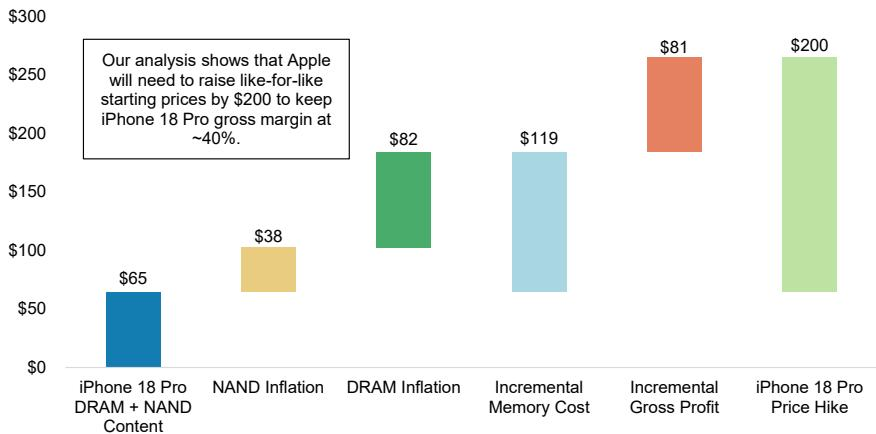
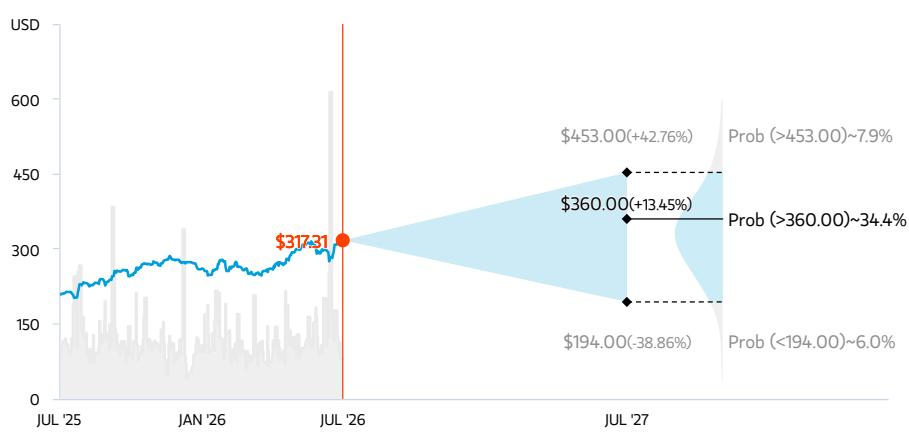
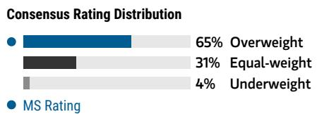
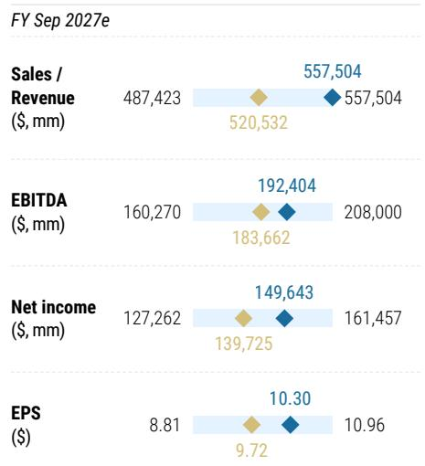

IT Hardware | United States of America

# Higher Prices Begets Higher Earnings

Analysis of historical elasticity suggests rev upside for iPad/Mac given recent price hikes, while our BOM analysis implies price hikes are likely protecting margins. As such, we expect \$200 iPhone price hikes in Sept. All else equal, this could drive 2-4% upside to F3Q EPS / 1% upside to FY27 EPS.

AlphaWise α

## Key Takeaways

We estimate historical elasticity of iPhone is 0.2-0.5 – making it Apple's most inelastic product – while Mac/iPad elasticity is 0.8-1.0.

Stable Mac/iPad lead times and iPhone build plans suggest recent price increases have not changed consumers' purchasing behavior or Apple's manufacturing plans.

Non-iPhone pricing actions indicate Apple is prioritizing margin preservation as memory costs rise sharply.

We now view a \$200 like-for-like iPhone 18 starting price increase (vs. iPhone 17) as more likely than the \$100-150 increase in our model.

\- Stable margins, premium mix and pricing actions support 2-4% C3Q26 EPS upside and \~1% FY27 EPS upside, all else equal.

The market is increasingly focused on the impact of price hikes on Apple fundamentals. Our analysis suggests higher prices = higher earnings power. Our analysis suggests Apple's core product (i.e. iPhone, Mac, and iPad) demand has been somewhat inelastic, with iPhone being the most inelastic product within Apple's product ecosystem, followed by Mac and then iPad. This generally means that recent price increases are unlikely to materially disrupt demand, especially considering supply challenges at peers. Importantly, recent pricing increases across Apple's non-iPhone portfolio also suggest Apple is likely prioritizing margin preservation as memory costs rise. Notably, despite these pricing actions, we have not observed any meaningful changes in Mac or iPad lead times (Exhibit 1 and Exhibit 2), while our supply chain checks also suggest iPhone build plans have remained largely unchanged in the last several weeks. Taken together, we believe Apple's strategy of raising prices and protecting margins could lead to 2-4% upside to F3Q26 EPS and \~1% upside to FY27 MSe EPS, all else equal. While Apple shares have recovered to pre-WWDC levels (\$310+), our OW thesis remains intact. We continue to see a longer-term path toward an AI-driven replacement cycle as Apple Intelligence and Siri AI functionality steadily improves, while a stronger near-term product roadmap – including the first-ever Apple Foldable, an improved iPhone Air 2, and the anticipated 20th anniversary iPhone lineup – should support healthy

<table><tr><td colspan="2">MS &amp; CO. LLC</td></tr><tr><td colspan="2">Erik W Woodring</td></tr><tr><td colspan="2">Equity Analyst</td></tr><tr><td>Erik.Woodring@morganstanley.com</td><td>+1 212 296-8083</td></tr><tr><td colspan="2">Dylan Liu</td></tr><tr><td colspan="2">Research Associate</td></tr><tr><td>Dylan.Liu@morganstanley.com</td><td>+1 212 761-4519</td></tr><tr><td colspan="2">Maya C Neuman</td></tr><tr><td colspan="2">Research Associate</td></tr><tr><td>Maya.Neuman@morganstanley.com</td><td>+1 212 761-1946</td></tr><tr><td colspan="2">Rauf Ural</td></tr><tr><td colspan="2">Research Associate</td></tr><tr><td>Rauf.Ural@morganstanley.com</td><td>+1 212 761-5958</td></tr></table>

## Apple, Inc. (AAPL.O, AAPL US)

<table><tr><td>Stock Rating</td><td>Overweight</td></tr><tr><td>Industry View</td><td>Cautious</td></tr><tr><td>Price target</td><td>$360.00</td></tr><tr><td>Shr price, close (Jul 13, 2026)</td><td>$317.31</td></tr><tr><td>Mkt cap, curr (mm)</td><td>$4,670,887</td></tr><tr><td>52-Week Range</td><td>$323.45-201.50</td></tr></table>

<table><tr><td>Fiscal Year Ending</td><td>09/25</td><td>09/26e</td><td>09/27e</td><td>09/28e</td></tr><tr><td>EPS ($)**</td><td>7.46</td><td>8.89</td><td>10.30</td><td>11.07</td></tr><tr><td>Prior EPS ($)**</td><td>-</td><td>-</td><td>-</td><td>-</td></tr><tr><td>P/E</td><td>34.1</td><td>35.7</td><td>30.8</td><td>28.7</td></tr><tr><td>EPS ($)§</td><td>-</td><td>8.77</td><td>9.72</td><td>10.84</td></tr><tr><td>Div yld (%)</td><td>0.4</td><td>0.3</td><td>0.4</td><td>0.4</td></tr></table>

Unless otherwise noted, all metrics are based on MS ModelWare framework
\*\* = Based on consensus methodology
§ = Consensus data is provided by Refinitiv Estimates
e = MS estimates

## QUARTERLY EPS (\$)

<table><tr><td>Quarter</td><td>2025</td><td>2026e Prior</td><td>2026e Current</td><td>2027e Prior</td><td>2027e Current</td></tr><tr><td>Q1</td><td>2.40</td><td>-</td><td>2.84a</td><td>-</td><td>2.86</td></tr><tr><td>Q2</td><td>1.65</td><td>-</td><td>2.01a</td><td>-</td><td>2.49</td></tr><tr><td>Q3</td><td>1.57</td><td>-</td><td>1.89</td><td>-</td><td>2.45</td></tr><tr><td>Q4</td><td>1.85</td><td>-</td><td>2.15</td><td>-</td><td>2.49</td></tr></table>

e = MS estimates, a = Actual Company reported data

For analyst certification and other important disclosures, refer to the Disclosure Section, located at the end of this report.

iPhone demand through FY27 and FY28. Three upcoming catalysts to watch: (1) June quarter results and September quarter guidance (which we'll preview more formally), (2) the September (iPhone 18 Pro/Pro Max/Foldable) iPhone launch, and (3) the public beta release of Siri AI.

Exhibit 1: While Mac Studio and Mac mini lead times remain elevated due to processor supply constraint, lead times for newly released Macs are largely stable W/W as of July 9

  
Source: Apple.com, MS

Exhibit 2: iPad lead times are 1-2 days as of July 9, fairly accessible compared to Mac  
  
Source: Apple.com, MS

First, we dug deep into the history books to find all examples of Apple price hikes across mainstream Hardware devices. We estimate elasticity is between 0.2-1.0. Working with our Sector Quant team, we analyzed the relationship between pricing and unit shipments across prior product cycles and estimate historical Apple mainstream Hardware elasticity at roughly 0.2-1.0 (Exhibit 3). While far from a perfect exercise – for example, Apple has not meaningfully increased like-for-like iPhone pricing in 5+ years, leaving us with a limited sample size – the analysis nonetheless suggests that Apple's mainstream hardware, notably iPhone, demand has historically been relatively resilient to price increases. Mac and iPad, of course, exhibit greater price elasticity given they tend to be more

discretionary purchases vs. iPhone. Although our sample sizes limit precision, the broader takeaway is that Apple's flagship products on aggregate have historically maintained resilient demand levels even as pricing moves higher. If these relationships remain intact, higher pricing should be a net positive for revenue/revenue growth.

Exhibit 3: Despite the limited sample size, our Sector Quant team's work suggests that iPhones (0.2-0.4) and Macs (0.8) have historically exhibited relatively inelastic demand, while iPads (1.0) have shown roughly unitary price elasticity.

Historical Elasticity of Apple's Core Devices

  
Source: Company data, IDC, MS

Second, our analysis of the iPad and Mac bill-of-materials (BOM) suggest recent price hikes are likely meant to protect gross margins. While we do not have detailed BOM estimates across the entire product portfolio, leveraging IDC shipment data by storage configuration and our understanding of device DRAM content, we calculate that the incremental margin associated with a \$100-200 pricing increase on iPads – assuming the price increase is solely intended to offset memory cost inflation – would fall in the high-20% range in FY27 (Exhibit 4). That is broadly consistent with our estimate of historical iPad gross margins. To put this into context, we use the most popular (i.e. highest shipments, according to IDC) iPad and Mac models as examples and contextualize the incremental gross margin for Apple's price hikes, and our estimates would lead us to the same conclusion – Apple is more likely to protect gross margin than gross profit dollars for its non-iPhone products (Exhibit 5 and Exhibit 6). For context, our model assumes Apple's average DRAM cost per bit rises \~190% Y/Y in FY27 (or \~370% above average FY25 levels), while NAND cost per bit increases \~180% Y/Y on average (or \~280% above average FY25 levels). We acknowledge Apple's actual memory procurement costs could increase faster than our assumptions imply. However, our checks suggest Apple has been building memory inventory wherever possible, implying a lag between higher procurement costs and P&L recognition. This timing dynamic matters because it means today's pricing actions may only partially offset future cost pressures. If memory costs remain elevated – or move higher still – Apple could ultimately require additional pricing actions in FY28 to maintain its margin profile, although it is clearly too early to draw firm conclusions about pricing strategy two years out.

Exhibit 4: Apple raised device prices 15-30% across Mac, iPad and Accessories on June 25th, 2026.

<table><tr><td>Product family</td><td>Starting Price on 6/24/26</td><td>Starting Price on 6/25/26</td><td>Change</td><td>% of Change</td></tr><tr><td>MacBook Neo</td><td>$599</td><td>$699</td><td>$100</td><td>17%</td></tr><tr><td>MacBook Air</td><td>$1,099</td><td>$1,299</td><td>$200</td><td>18%</td></tr><tr><td>14-inch MacBook Pro</td><td>$1,699</td><td>$1,999</td><td>$300</td><td>18%</td></tr><tr><td>Mac mini (M4 Pro)</td><td>$1,399</td><td>$1,599</td><td>$200</td><td>14%</td></tr><tr><td>iPad (2025)</td><td>$349</td><td>$449</td><td>$100</td><td>29%</td></tr><tr><td>iPad Air</td><td>$599</td><td>$749</td><td>$150</td><td>25%</td></tr><tr><td>iPad Pro</td><td>$999</td><td>$1,199</td><td>$200</td><td>20%</td></tr><tr><td>Mac Studio (M4 Max)</td><td>$1,999</td><td>$2,499</td><td>$500</td><td>25%</td></tr><tr><td>Mac Studio (Ultra)</td><td>$3,999</td><td>$5,299</td><td>$1,300</td><td>33%</td></tr><tr><td>HomePod</td><td>$299</td><td>$349</td><td>$50</td><td>17%</td></tr><tr><td>HomePod mini</td><td>$99</td><td>$129</td><td>$30</td><td>30%</td></tr><tr><td>Apple TV</td><td>$129</td><td>$199</td><td>$70</td><td>54%</td></tr><tr><td>Vision Pro</td><td>$3,499</td><td>$3,699</td><td>$200</td><td>6%</td></tr><tr><td>iPhone</td><td>No change</td><td>No change</td><td>$0</td><td>NA</td></tr><tr><td>Apple Watch</td><td>No change</td><td>No change</td><td>$0</td><td>NA</td></tr><tr><td>AirPods</td><td>No change</td><td>No change</td><td>$0</td><td>NA</td></tr></table>

Source: Apple.com, MS

Exhibit 5: We estimate that a \$100 like-for-like pricing increase for iPad (2025) implies a 40% incremental gross margin, higher than our mid-20% assumptions for iPad.

iPad 2025 (128GB) Incremental Gross Profit Waterfall  
  
Source: Company data, IDC, MS estimates

Exhibit 6: We estimate that a \$200 like-for-like pricing increase for M4 MacBook Air implies a 27% incremental gross margin, largely in-line with our assumptions for Mac.

M4 MacBook Air (256GB) Incremental Gross Profit Waterfall

  
Source: Company data, IDC, MS estimates

Given these factors, what becomes the implication for iPhone 18 pricing vs. our current base case? iPhone pricing remains one of the most heavily debated topics in our investor conversations – particularly after Apple's non-iPhone pricing increases two weeks ago, which shifted the debate from "whether Apple will raise prices" to "how much will Apple raise prices?". Incorporating both demand elasticity and Apple's apparent willingness – as evidenced by its recent non-iPhone pricing actions – to preserve gross margins through pricing, we now believe a \$200 like-for-like starting price increase, particularly for the Pro models, is more likely than the \$100 increase currently embedded in our model. For the iPhone, we estimate per unit memory costs will be \$140-160 higher Y/Y in FY27. Assuming no change in model mix, a \$200 like-for-like price increase would imply an incremental margin of about 30%, below the iPhone's T3Y average gross margin of 41%. On the surface, this suggests some gross margin pressure is possible in C2H26 (and have modeled it as such).

However, we see three important potential offsets – (1) premium model mix should be higher in C2H26, as the lower-priced iPhone 18 base model, iPhone Air 2, and iPhone 18e are not expected to launch until spring 2027; (2) we expect the foldable iPhone to be margin accretive and provide an additional margin tailwind beginning in C4Q26; (3) lower-priced iPhone models are also likely to be re-priced around late C1Q27 alongside the anticipated spring product iPhone launch cycle. As a result, while underlying component costs are rising meaningfully, we believe Apple could keep iPhone margins broadly stable through FY27, barring another significant step-up in memory pricing during CY27. Again, taking iPhone 18 Pro (256GB) as an example, a \$200 like-for-like pricing increase would indicate an incremental gross margin of \~40%, largely in line with the overall iPhone gross margin profile (Exhibit 7). This also implies that the incremental margin would fall below 40% level for higher storage SKU models if Apple ends up raising prices by \$200 across all iPhone 18 Pro storage SKUs.

Exhibit 7: To protect iPhone gross margins, we estimate that Apple will need to raise iPhone 18 Pro starting price by \$200.

iPhone 18 Pro (256GB) Incremental Gross Profit Waterfall

  
Source: Company data, MS estimates

Finally, what does all of this mean for September-quarter guidance and FY27 earnings power, all else equal? While we are not changing our model today, we see upside risk to our current forecasts driven by higher revenue, relatively stable margins, and therefore, higher EPS. To be fair, the memory cost assumptions embedded in our current gross margin outlook may prove too conservative, with some third-party research firms suggesting memory costs for iPhone 18 Pro could be as much as 4x those of iPhone 17 Pro (we assume \~3x). As a result, even with higher device pricing, incorporating a steeper memory cost trajectory would not necessarily lead to higher gross margin estimates. That said, the outlook is relatively straightforward for non-iPhone products. Apple has already implemented like-for-like price increases across portions of its product portfolio in late C2Q26, and assuming no significant shift in model mix, non-iPhone Products gross margins should remain broadly stable into FY27. For the September quarter specifically, Apple will begin absorbing higher component costs before meaningful iPhone 18 Pro and Pro Max shipments commence. However, given the lagged recognition of rising inventory costs, we believe a \$200 starting price increase should still be margin accretive during the launch quarter, when inventory costs have yet to fully reflect elevated memory pricing. Combined with a Y/Y richer mix of premium models – including the new Foldable iPhone – we believe Apple can work towards a stable Products gross-margin profile in FY27. Based on these factors, we estimate there could be 2-4% upside to our current C3Q26 EPS and \~1% upside to our current FY27 base-case EPS forecast of \$10.30, all else being equal (Exhibit 8).

Exhibit 8: We expect pricing increases to add 1% of FY27 earnings power for Apple

<table><tr><td></td><td>MS FY27Base Case</td><td>&quot;Low Case&quot;</td><td>&quot;High Case&quot;</td></tr><tr><td colspan="4">Assumptions</td></tr><tr><td colspan="4">Demand Elasticity</td></tr><tr><td>iPhone</td><td></td><td>0.5</td><td>0.2</td></tr><tr><td>Mac</td><td></td><td>0.8</td><td>0.8</td></tr><tr><td>iPad</td><td></td><td>1.0</td><td>1.0</td></tr><tr><td colspan="4">Like-for-like Price Hike ($)</td></tr><tr><td>iPhone</td><td></td><td>$200</td><td>$200</td></tr><tr><td>Mac</td><td></td><td>$200</td><td>$250</td></tr><tr><td>iPad</td><td></td><td>$100</td><td>$150</td></tr><tr><td colspan="4">Financial Impact</td></tr><tr><td colspan="4">Shipments (M Units)</td></tr><tr><td>iPhone</td><td>268</td><td>265</td><td>267</td></tr><tr><td>Mac</td><td>33</td><td>29</td><td>28</td></tr><tr><td>iPad</td><td>56</td><td>46</td><td>41</td></tr><tr><td colspan="4">Average Selling Price ($)</td></tr><tr><td>iPhone</td><td>$1,152</td><td>$1,179</td><td>$1,179</td></tr><tr><td>Mac</td><td>$1,169</td><td>$1,369</td><td>$1,420</td></tr><tr><td>iPad</td><td>$569</td><td>$669</td><td>$719</td></tr><tr><td colspan="4">Revenue ($B)*</td></tr><tr><td>iPhone</td><td>$309</td><td>$312</td><td>$314</td></tr><tr><td>Mac</td><td>$39</td><td>$39</td><td>$39</td></tr><tr><td>iPad</td><td>$32</td><td>$31</td><td>$30</td></tr><tr><td>Apple FY27 EPS</td><td>$10.30</td><td>$10.38</td><td>$10.42</td></tr><tr><td>vs. Base Case</td><td></td><td>0.8%</td><td>1.1%</td></tr></table>

Source: IDC, MS estimates

## Risk Reward – Apple, Inc. (AAPL.O)

More Near-Term Cost Uncertainties Before a Catalyst-Laden 2H

## PRICE TARGET \$360.00

Our \$360 PT is based on 9.1x EV/Sales FY27 multiple, which is derived from a regression of tech and consumer platform peers. Our price target implies \~35x P/E on \$10.30 FY27 EPS.

Consensus Price Target Distribution

Source: Refinitiv, MS

## RISK REWARD CHART AND OPTIONS IMPLIED PROBABILITIES (12M)

## OVERWEIGHT THESIS

With the most elongated iPhone replacement cycles, new AI features rolling out around the world, and a renewed focus on device form factor changes, we believe Apple can accelerate iPhone growth starting in FY26, with replacement cycles peaking as aged installed base starts to upgrade. When combined with consistent, double digit services growth and moderate operating leverage, we believe Apple can earn \$8.89 in FY26 and \$10.30 by FY27. Memory cost dynamic could create uncertainties in the near term. Longer-term, investments in AI, payments, cloud, health, and home, and long runway to grow spend per user from \$1/day today are key arguments for sustained long-term growth and value creation.

  
Source: Refinitiv, MS  
Key: — Historical Stock Performance ● Current Stock Price ◆ Price Target

Source: Refinitiv, MS, MS Institutional Equities Division. The probabilities of our Bull, Base, and Bear case scenarios playing out were estimated with implied volatility data from the options market as of 13 Jul 2026. All figures are approximate risk-neutral probabilities of the stock reaching beyond the scenario price in either three-months' or one-years' time. View explanation of Options Probabilities methodology here

## Risk Reward Themes

<table><tr><td>Disruption:</td><td>Positive</td></tr><tr><td>New Data Era:</td><td>Positive</td></tr><tr><td>Pricing Power:</td><td>Positive</td></tr></table>

View descriptions of Risk Rewards Themes here

## BULL CASE

\$453.00

11x EV/Sales FY27; \~41x Bull FY27 P/E of \$11.02

iPhone replacement cycles accelerate in FY26/FY27 with Robotics as an long-term upside. Consumer demand returns, and stronger than expected iPhone 17 upgrade intentions + mix shift to higher end iPhones drives mid-teens Y/Y iPhone revenue growth, while rising component costs are mitigated given Apple's bargaining power against consumers and the supply chain. Our bull case valuation implies a 41.1x P/E multiple on FY27 Bull EPS, which embeds \$22 per share of upside from its Robotics efforts.

## BASE CASE

## \$360.00 BEAR CASE

9.1x EV/Sales FY27 or \~35x FY27 EPS of \$10.30

Services and margins remain resilient, while investors start to expect stronger iPhone cycles ahead. Revenue grows 15% Y/Y in FY27, driven by 10%+ Services growth and mid-teens % Products growth. GM may contract Y/Y in FY27 driven by higher Product revenue mix and memory costs, while Apple leverages the supply chain and repricing to mitigate the cost impact. The iPhone replacement cycle is peaking and creates pent up demand for upgrades in FY27.

\$194.00

6.3x EV/Sales FY27; 24.6x FY27 Bear EPS of \$7.89

iPhone 17 cycle disappoints as consumer spending weakens more than expected amidst synthetic price increases. Growth slows further across the portfolio as discretionary income is pressured by hard landing, leading to just LSD of Product rev growth and decelerating Services rev growth in FY26. With revenue slightly growing but margin contracting, FY26 EPS will only grow MSD to \~\$7.36. Our bear case valuation implies a 24.6x FY27 P/E, below T5Y avg of 26.0x due to plateauing Services profit mix.

## Risk Reward – Apple, Inc. (AAPL.O)

## KEY EARNINGS INPUTS

<table><tr><td>Drivers</td><td>Sep 2025</td><td>Sep 2026e</td><td>Sep 2027e</td><td>Sep 2028e</td></tr><tr><td>Total Revenue Growth (Y/Y) (%)</td><td>6.4</td><td>16.6</td><td>14.9</td><td>5.8</td></tr><tr><td>iPhone Revenue Growth (Y/Y) (%)</td><td>4.2</td><td>23.6</td><td>19.1</td><td>4.2</td></tr><tr><td>Services Revenue Growth (Y/Y) (%)</td><td>13.5</td><td>14.0</td><td>12.1</td><td>11.3</td></tr><tr><td>Gross Margin (%)</td><td>46.9</td><td>48.0</td><td>47.5</td><td>48.0</td></tr><tr><td>EPS Growth (Y/Y) (%)</td><td>10.6</td><td>19.1</td><td>15.9</td><td>7.5</td></tr></table>

## INVESTMENT DRIVERS

\- Positive iPhone build revisions / clearer signs of accelerating replacement cycles

• Services revenue growth reacceleration

\- Apple Intelligence feature and distribution expansion

\- New product launches in home, health and AI

## GLOBAL REVENUE EXPOSURE

<table><tr><td rowspan="9"></td><td>0-10%</td><td>APAC, ex Japan, Mainland China and India</td></tr><tr><td>0-10%</td><td>India</td></tr><tr><td>0-10%</td><td>Japan</td></tr><tr><td>0-10%</td><td>Latin America</td></tr><tr><td>0-10%</td><td>MEA</td></tr><tr><td>0-10%</td><td>UK</td></tr><tr><td>10-20%</td><td>Europe ex UK</td></tr><tr><td>10-20%</td><td>Mainland China</td></tr><tr><td>30-40%</td><td>North America</td></tr></table>

Source: MS Estimate View explanation of regional hierarchies here

## MS ALPHA MODELS

<table><tr><td>3/5BEST</td><td>24 MonthHorizon</td><td>1/5MOST</td><td>3 MonthHorizon</td></tr></table>

Source: Refinitiv, FactSet, MS; 1 is the highest favored Quintile and 5 is the least favored Quintile

## RISKS TO PT/RATING

## RISKS TO UPSIDE

\- iPhone 17 outperforms expectations

\- Apple Intelligence adoption surprises to the upside

• Apple pulls forward form factor changes

• Services growth re-accelerates despite tougher compares

• Gross margins surprise positively

## RISKS TO DOWNSIDE

\- Weak consumer spending limits iPhone upgrade rates

• Higher memory input costs

\- Limited progress on AI features

\- Geopolitical tensions

\- Increased regulation, particularly with App Store

## OWNERSHIP POSITIONING

<table><tr><td>Inst. Owners, % Active</td><td>47.5%</td><td colspan="4"></td></tr><tr><td>HF Sector Long/Short Ratio</td><td>2.1x</td><td colspan="4"></td></tr><tr><td>HF Sector Net Exposure</td><td>29.5%</td><td colspan="4"></td></tr></table>

Refinitiv; MSPB Content. Includes certain hedge fund exposures held with MSPB. Information may be inconsistent with or may not reflect broader market trends. Long/Short Ratio = Long Exposure / Short exposure. Sector % of Total Net Exposure = (For a particular sector: Long Exposure - Short Exposure) / (Across all sectors: Long Exposure – Short Exposure).

## MS ESTIMATES VS. CONSENSUS

  
Mean MS Estimates Source: Refinitiv, MS

## Apple (AAPL) Financial Model

Exhibit 9: Apple Income Statement

<table><tr><td rowspan="2">($ in millions)</td><td colspan="4">2025A</td><td colspan="4">2026E</td><td colspan="4">2027E</td></tr><tr><td>Dec-24</td><td>Mar-25</td><td>Jun-25</td><td>Sep-25</td><td>Dec-25</td><td>Mar-26</td><td>Jun-26</td><td>Sep-26</td><td>Dec-26</td><td>Mar-27</td><td>Jun-27</td><td>Sep-27</td></tr><tr><td>Revenues</td><td>124,300</td><td>95,359</td><td>94,036</td><td>102,466</td><td>143,756</td><td>111,184</td><td>108,771</td><td>121,635</td><td>150,274</td><td>134,142</td><td>135,287</td><td>137,802</td></tr><tr><td>iPhone</td><td>69,138</td><td>46,841</td><td>44,582</td><td>49,025</td><td>85,269</td><td>56,994</td><td>54,207</td><td>62,581</td><td>85,657</td><td>75,145</td><td>74,791</td><td>72,997</td></tr><tr><td>iPad</td><td>8,088</td><td>6,402</td><td>6,581</td><td>6,952</td><td>8,595</td><td>6,914</td><td>6,848</td><td>7,892</td><td>9,223</td><td>7,106</td><td>7,444</td><td>8,043</td></tr><tr><td>Mac</td><td>8,987</td><td>7,949</td><td>8,046</td><td>8,726</td><td>8,386</td><td>8,399</td><td>8,839</td><td>9,702</td><td>9,529</td><td>9,304</td><td>9,293</td><td>10,500</td></tr><tr><td>Wearables, Home and Accessories</td><td>11,747</td><td>7,522</td><td>7,404</td><td>9,013</td><td>11,493</td><td>7,901</td><td>7,796</td><td>9,106</td><td>12,227</td><td>8,381</td><td>8,454</td><td>9,952</td></tr><tr><td>Services</td><td>26,340</td><td>26,645</td><td>27,423</td><td>28,750</td><td>30,013</td><td>30,976</td><td>31,081</td><td>32,354</td><td>33,639</td><td>34,205</td><td>35,305</td><td>36,309</td></tr><tr><td>Cost of Sales</td><td>66,025</td><td>50,492</td><td>50,318</td><td>54,125</td><td>74,525</td><td>56,403</td><td>56,503</td><td>64,734</td><td>79,353</td><td>69,530</td><td>71,170</td><td>72,523</td></tr><tr><td>Gross Profit</td><td>58,275</td><td>44,867</td><td>43,718</td><td>48,341</td><td>69,231</td><td>54,781</td><td>52,268</td><td>56,901</td><td>70,921</td><td>64,612</td><td>64,117</td><td>65,279</td></tr><tr><td>Gross Margin</td><td>46.9%</td><td>47.1%</td><td>46.5%</td><td>47.2%</td><td>48.2%</td><td>49.3%</td><td>48.1%</td><td>46.8%</td><
