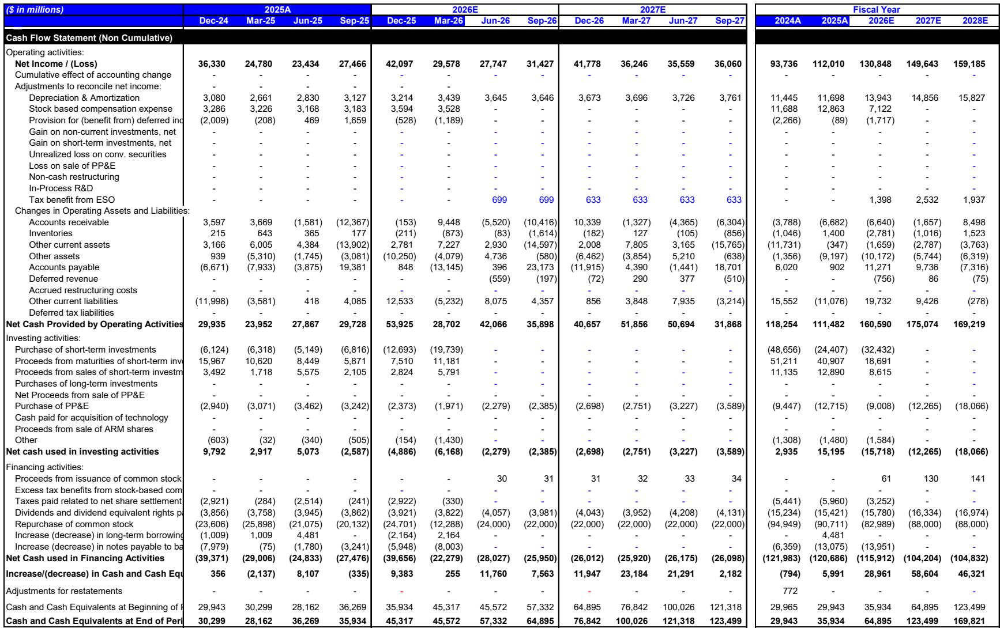
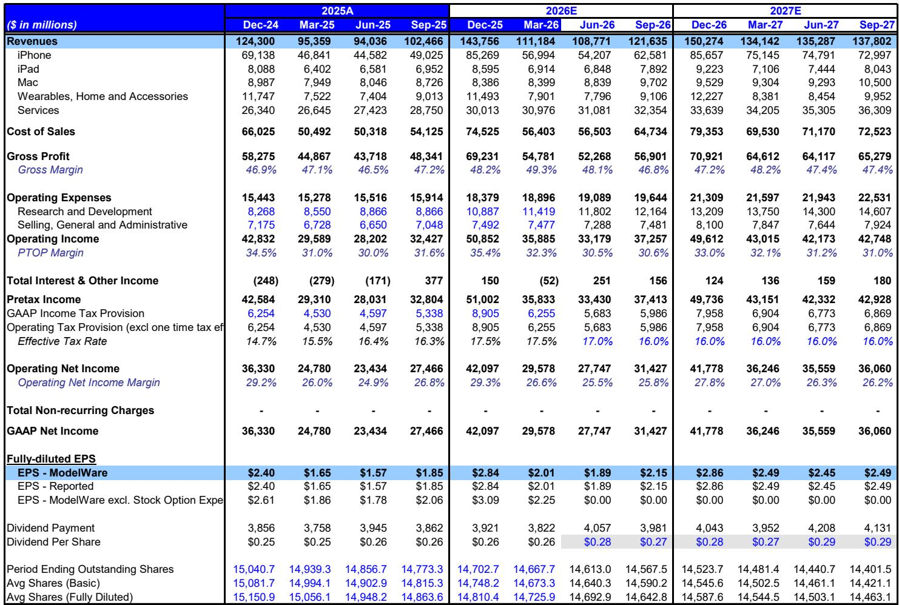
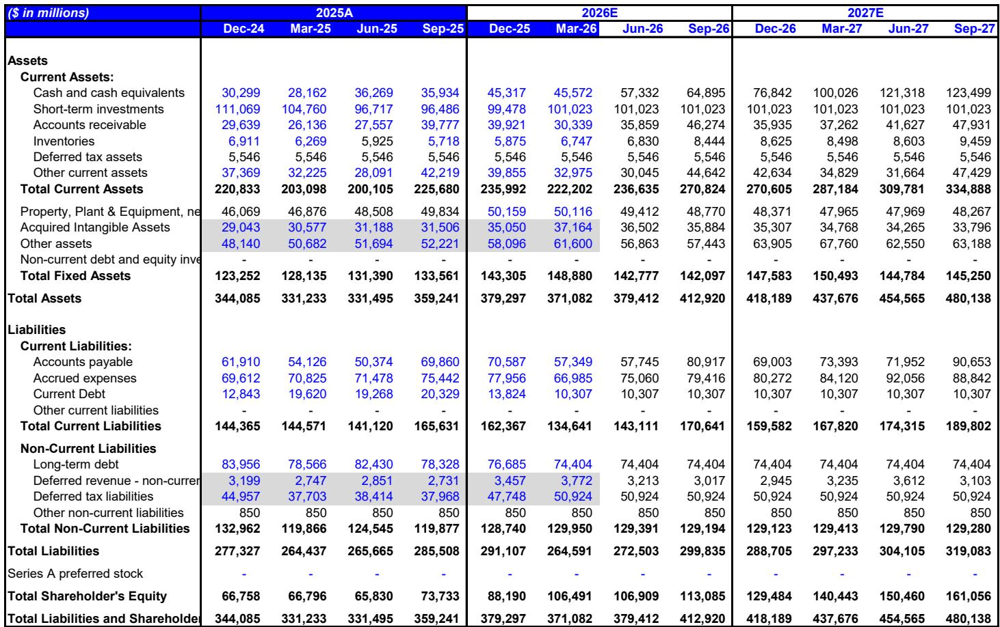

# Apple’s Price Hikes Will Boost Earnings, Not Break Demand

On June 25, 2026, Apple raised prices across its Mac, iPad, and accessories lines by 15 to 30 percent in a single day. The iPhone was conspicuously absent from that list. Yet the logic behind those increases—and the data on how customers have responded to past price moves—points to a clear conclusion: Apple is entering a phase where higher prices will translate directly into higher earnings per share, not into destroyed demand. The company is betting that its core hardware has become too essential for customers to walk away, and the evidence suggests that bet will pay off.

The market has been fixated on whether Apple can raise prices without losing unit volume. That is the wrong question. The right question is how much pricing power Apple actually possesses—and the answer, based on a rigorous analysis of historical elasticity, is that Apple possesses more than most observers assume. iPhone demand has been the most inelastic of any Apple product, with a historical elasticity range of 0.2 to 0.5. Mac and iPad are more elastic at 0.8 to 1.0, but even those figures mean that a 10 percent price increase would reduce unit demand by only 8 to 10 percent—a trade-off that still leaves revenue higher.

Two additional facts reinforce this thesis. First, lead times for newly released Mac and iPad models have remained stable since the June price increases, and supply chain checks show iPhone build plans have not changed. Second, Apple's bill-of-materials analysis reveals that the recent non-iPhone price hikes are designed primarily to offset surging memory costs, not to extract monopoly rents. Together, these signals suggest Apple is prioritizing margin preservation over volume growth—and that strategy is about to extend to the iPhone.

## A $200 iPhone 18 Price Increase Is Now the Most Likely Outcome, and It Will Be Margin Accretive

The debate among observers has shifted from whether Apple will raise iPhone prices to how much. The evidence now points decisively toward a $200 like-for-like starting price increase for the iPhone 18, particularly for the Pro models, compared with the $100 to $150 increase currently embedded in consensus models.

The logic rests on two pillars. First, iPhone demand elasticity is the lowest in Apple's portfolio. A $200 increase on a device with an average selling price above $1,100 represents roughly an 18 percent rise. At an elasticity of 0.3, that would reduce unit shipments by only about 5 percent—a loss more than offset by the higher revenue per device. Second, Apple's own behavior with non-iPhone products reveals a clear willingness to pass through cost increases to protect margins. The company raised iPad and Mac prices by 15 to 30 percent in June, and our BOM analysis shows those increases are calibrated to maintain gross margins in the high-20 percent range—consistent with historical iPad and Mac margins.

For the iPhone specifically, the math is compelling. Per-unit memory costs for the iPhone 18 Pro are estimated to be $140 to $160 higher year over year. A $200 price increase would imply an incremental gross margin of roughly 30 percent. That is below the iPhone's trailing-three-year average gross margin of 41 percent, but three important offsets exist: premium model mix will be higher in the second half of 2026, the foldable iPhone will be margin-accretive, and lower-priced models such as the iPhone 18e are likely to be repriced in early 2027. The net result is that Apple can keep iPhone margins broadly stable through fiscal 2027, barring a further step-up in memory costs.

## Memory Cost Inflation Is the Real Driver, and Apple’s Inventory Strategy Creates a Timing Advantage

The price increases are not arbitrary. They are a direct response to what is shaping up to be the most severe memory cost inflation Apple has faced in years. Our model assumes Apple's average DRAM cost per bit rises approximately 190 percent year over year in fiscal 2027, or roughly 370 percent above average fiscal 2025 levels. NAND cost per bit increases approximately 180 percent year over year, or about 280 percent above fiscal 2025 levels.

These are not theoretical projections. Third-party research firms have suggested that memory costs for the iPhone 18 Pro could be as much as four times those of the iPhone 17 Pro, compared with our assumption of roughly three times. If those estimates prove accurate, even the $200 price increase may not fully protect margins. However, Apple has been building memory inventory wherever possible, creating a lag between higher procurement costs and their recognition in the profit-and-loss statement. This timing dynamic is critical: it means the price increases Apple implemented in June will hit the P&L before the full weight of memory cost inflation does. For the September quarter specifically, when iPhone 18 Pro and Pro Max shipments begin, inventory costs will not yet fully reflect elevated memory pricing, making the price increase margin-accretive during the launch quarter.

A limitation worth noting: Apple's actual memory procurement costs could rise faster than our assumptions imply, and today's pricing actions may only partially offset future cost pressures. If memory costs remain elevated or move higher, Apple could require additional pricing actions in fiscal 2028. But for the next 12 to 18 months, the timing works in Apple's favor.

## A Decision Framework: How to Evaluate Apple’s Pricing Power in Your Portfolio

For those trying to assess whether Apple's pricing strategy is sustainable, a structured framework is more useful than chasing headlines. The following three-step approach synthesizes the evidence from the report into actionable questions.

**Step 1: Assess elasticity by product category.** iPhone demand has historically been the most inelastic, with an elasticity of 0.2 to 0.5. Mac and iPad are more elastic at 0.8 to 1.0, but even at the higher end, a price increase still yields higher total revenue. The key question is whether the current cycle is different—whether AI features, form factor changes, or competitive dynamics have shifted elasticity. The evidence so far suggests no: lead times are stable, build plans are unchanged, and Apple's installed base remains large and loyal.

**Step 2: Compare price increases to component cost inflation.** The BOM analysis shows that Apple's price hikes are calibrated to offset specific cost pressures, not to expand margins. For iPad and Mac, the incremental margin from a $100 to $200 price increase falls in the high-20 percent range, consistent with historical product margins. For iPhone, a $200 increase implies roughly 30 percent incremental margin, below the 41 percent average but supported by mix shifts and the foldable launch. If component costs stabilize or decline, Apple would have room to keep prices high and expand margins.

**Step 3: Evaluate the timing lag between cost recognition and pricing.** Apple's inventory build creates a window of several quarters during which higher prices are recognized before higher costs hit the P&L. This means the September quarter and early fiscal 2027 could show margin improvement even as underlying cost pressures mount. The risk is that the lag reverses in late fiscal 2027 or fiscal 2028, requiring additional price increases. But for the near term, the timing dynamic is a tailwind.

This framework leads to a straightforward conclusion: Apple's price increases are not a desperate move to prop up a weakening business. They are a deliberate, data-backed strategy to preserve margins in the face of rising costs, and the demand data suggests customers will absorb them.

## The Earnings Upside Is Real but Concentrated in the Near Term

All else equal, the combination of higher prices and resilient demand implies 2 to 4 percent upside to the current consensus for the September quarter of fiscal 2026 and approximately 1 percent upside to the full-year fiscal 2027 EPS estimate of $10.30.

The upside is concentrated for a reason. The September quarter benefits most directly from the timing lag between price increases and cost recognition. As inventory turns over and higher memory costs flow through the P&L in later quarters, the margin benefit narrows. By fiscal 2028, Apple may need additional pricing actions or a meaningful shift in product mix to maintain its margin profile.

Three catalysts will determine whether the upside materializes: the June quarter results and September quarter guidance, the September iPhone 18 launch including the foldable model, and the public beta release of Siri AI functionality. Each of these events provides a data point on whether demand elasticity is holding, whether memory costs are tracking to expectations, and whether the AI-driven replacement cycle is accelerating.

The broader strategic implication is that Apple is entering a new pricing regime. For years, the company relied on volume growth and services revenue to drive earnings. Now, with component costs rising and the installed base approaching replacement-cycle age, pricing power has become the primary lever. The data suggests Apple has more of that power than the market currently prices in.

*For informational purposes only. Portions may be generated, translated, summarized, or edited with AI assistance based on source materials and may contain omissions or errors. Please verify independently. This is not investment, legal, tax, accounting, or other professional advice.*

For informational purposes only. Portions may be generated, translated, summarized, or edited with AI assistance based on source materials and may contain omissions or errors. Please verify independently. This is not investment, legal, tax, accounting, or other professional advice.

