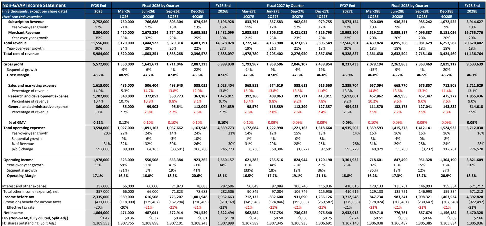
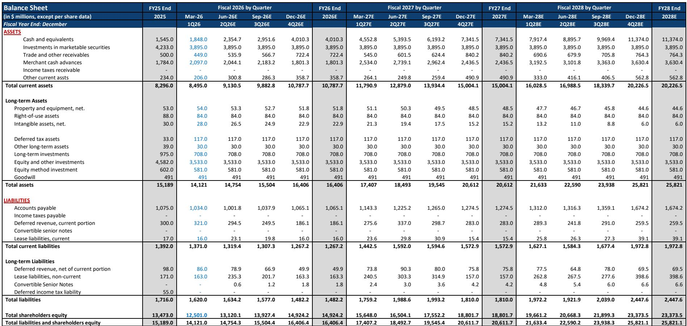
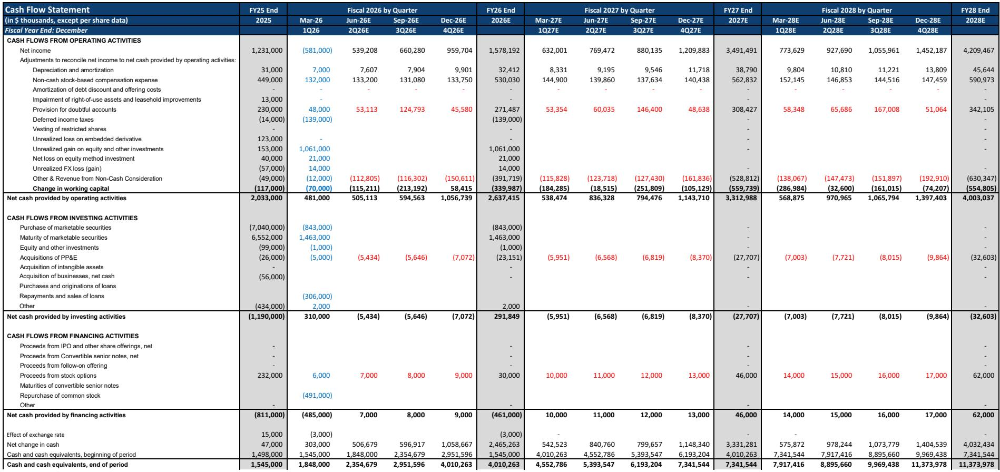

# Shopify Is Not Just an E-Commerce Platform—It Is Becoming the Operating System for Agentic Commerce

Shopify has reached an inflection point where three independent catalysts—near-term GMV acceleration, a restructured partner incentive model that improves long-term unit economics, and an impending price increase—converge with a structural shift in how commerce will be conducted. The company is upgrading from a position that is not merely about beating next quarter's numbers. It reflects a deeper strategic reconfiguration: Shopify is positioning itself as the infrastructure layer for agentic commerce, the emerging paradigm where AI agents intermediate the buyer journey from discovery through checkout.

The argument for this upgrade rests on three distinct and mutually reinforcing pillars. First, third-party web traffic data to shop.app subdomains shows a 94% correlation with reported GMV, and current traffic patterns imply material upside to consensus expectations for second-quarter GMV growth of 27% year-over-year. Second, the newly announced partner commission restructuring, effective August 2026, fundamentally shifts incentives toward acquiring larger merchants and cross-selling higher-value offerings, while capping long-term payout exposure. Third, the company is positioned to raise subscription prices for the first time since 2023, a move that would flow almost entirely to the bottom line and add 3-4% to 2027 revenue estimates.

Each of these catalysts operates on a different time horizon, but together they create a coherent narrative: near-term revenue beat, medium-term margin expansion, and long-term structural tailwinds from agentic commerce. The following sections unpack each catalyst, explain the mechanism behind it, and translate the analysis into a decision framework for observers.

## Near-Term GMV Growth Is Likely to Beat Consensus, and Third-Party Data Provides a Leading Indicator

The most immediate catalyst for the upgrade is the evidence that Shopify's second-quarter GMV will exceed current consensus expectations. The research team analyzed web traffic to shop.app subdomains and found a 94% correlation with reported GMV dollars between the first quarter of 2023 and the first quarter of 2026. This is not a loose association; it is a statistically robust relationship that makes web traffic a reliable leading indicator for GMV.

The current traffic data suggests that GMV growth in the second quarter will be materially above the consensus estimate of 27% year-over-year. The analysis assumes continued pressure on GMV per visit, which has declined by an average of 32% year-over-year in 2025, and a 1.5% quarter-over-quarter decline in line with historical seasonality. Even under these conservative assumptions, the implied GMV exceeds what the consensus view is currently modeling. The implication is clear: the company is gaining transaction volume faster than the market expects, and this volume will translate into both subscription revenue and merchant solutions revenue.

Why does this matter beyond the immediate earnings beat? Because GMV growth is the most important leading indicator for Shopify's long-term revenue trajectory. The company's Merchant Solutions revenue—which includes payment processing, shipping, and capital offerings—is monetized as a take rate on GMV. Higher GMV today means higher take-rate revenue tomorrow, and it signals that the platform is deepening its role in merchants' operations. A beat in the second quarter would also reset the baseline for forward estimates, creating a compounding effect on the revenue trajectory for the remainder of the year.

## The Partner Commission Restructuring Aligns Incentives with Long-Term Value Creation, Not Annuity-Like Revenue Streams

Shopify announced changes to partner commissions that will take effect in August 2026, and the structure of the new model reveals a deliberate strategic intent. Under the current system, partners earn a recurring commission on the GMV generated by the merchants they refer, creating an annuity-like revenue stream that persists indefinitely. The new model caps payouts at four years, after which the commission drops to zero. Partners are compensated more generously in the first four years—104% higher for an Advanced plan merchant generating $750,000 in annual eligible online GMV, and 137% higher for a Plus plan merchant generating $10 million in annual eligible online GMV—but the total ten-year payout is 18% lower for the smaller merchant and 10% higher for the larger merchant.

The strategic logic behind this restructuring is multi-layered. First, by front-loading commissions, Shopify creates a stronger incentive for partners to acquire larger merchants, because the absolute payout in the first four years scales with the merchant's GMV. Second, the four-year cap forces partners to focus on new logo acquisition and cross-selling rather than sitting on a passive revenue stream from existing merchants. Third, the cap on long-term payouts improves Shopify's unit economics on partner-driven deals, because the commission expense terminates after four years rather than persisting for the life of the merchant relationship.

The risk is that partners may reduce their focus on Shopify if the long-term payout looks less attractive. But the analysis suggests that the breakeven point between the old and new models occurs at approximately eight years for smaller merchants and eleven years for larger merchants. Given that partner relationships with merchants often last fewer than eight years, the new model may actually be more lucrative for most partners in practice. The more important point is that Shopify is using the restructuring to shift the partner ecosystem toward higher-value activities: acquiring larger merchants, investing in post-launch merchant success, and cross-selling offerings like B2B, point-of-sale, and Shopify Components. This is a supply-side strategy that improves both growth and margins over time.

## A Price Increase Is Probable and Would Deliver High-Margin Revenue Growth with Minimal Merchant Friction

Shopify last raised prices on non-Plus subscription tiers in 2023 by 33-34%, and on Plus plans in 2024 by 25%. Since then, the company has rolled out a substantial number of new features, most notably Sidekick, an AI-powered assistant that helps merchants manage their stores, analyze data, and automate tasks. Shopify has absorbed the costs related to Sidekick utilization, meaning that merchants are receiving incremental value without paying incremental price.

Management has discussed the possibility of a price increase without committing to a specific timeline or structure—whether it would be platform-wide or consumption-based. But the conditions are clearly aligned. Merchants are using Sidekick and realizing value. The competitive landscape has not forced Shopify to keep prices flat. And the company has a demonstrated track record of executing price increases without causing churn, as evidenced by the 2023 and 2024 increases.

The financial impact of a price increase would be significant and highly incremental to profitability. A price increase on non-Plus SKUs similar in magnitude to the 2023 increase would add approximately 3-4% to total revenue in 2027. More importantly, because subscription revenue carries very high incremental margins, the vast majority of that increase would drop to the bottom line. A 3-4% revenue tailwind that flows through at 80%+ incremental margins translates into a much larger percentage impact on earnings per share.

The strategic implication is that Shopify has pricing power. The company can raise prices because it is delivering value that merchants cannot easily replicate elsewhere. The platform's ecosystem of apps, payment processing, fulfillment, and now AI tools creates switching costs that make merchants reluctant to leave. A price increase would not only boost near-term financials but also validate the thesis that Shopify is becoming an indispensable operating system for commerce, not just a point solution for storefronts.

## Agentic Commerce Represents a Structural Tailwind That Could Reshape the Competitive Landscape

The most consequential long-term catalyst is the emergence of agentic commerce—a paradigm in which AI agents handle the entire buyer journey from discovery to checkout. In this model, consumers do not browse websites or apps; they instruct an agent to find and purchase a product, and the agent executes the transaction on their behalf. This shift re-architects the e-commerce stack, with value accruing to platforms that control transaction rails and merchant relationships rather than to platforms that control consumer-facing interfaces.

Shopify is uniquely positioned to become the infrastructure layer for agentic commerce. The company already processes transactions for millions of merchants, manages product catalogs, handles checkout, and integrates with payment networks. As agents intermediate more of the buyer journey, they will need to connect to a commerce platform that can execute transactions reliably and securely. Shopify's API-first architecture, its extensive app ecosystem, and its merchant relationships make it the natural "agent enablement" toolkit for merchants who want to participate through agentic channels.

The financial impact of agentic commerce could be substantial. If agentic commerce shifts just 1-4% of global e-commerce GMV away from closed marketplaces and big-box platforms toward independent merchants—driven by agent-optimized discovery, better long-tail matching, and merchant-controlled checkout—this implies $9-72 billion of GMV flowing toward the independent merchant ecosystem in 2028. Assuming Shopify merchants capture 10-35% of this re-routed volume, that would represent $0.9-25 billion of incremental GMV on the Shopify platform, before considering any lift from higher conversion or purchase frequency. This would drive an uplift of approximately 1-4% to the 2028 GMV forecast.

The key insight is that agentic commerce is not a threat to Shopify; it is an opportunity. Closed marketplaces like Amazon benefit from controlling the consumer experience and intermediating discovery. In an agentic commerce world, discovery is handled by the agent, and the transaction is routed to the merchant that offers the best combination of price, availability, and trust. Independent merchants on Shopify become more competitive in this environment because agents can find them and transact with them directly. Shopify benefits from the mix-shift toward independent merchants, and it benefits from being the platform that enables those transactions.

## A Decision Framework for Evaluating Shopify's Case

For those evaluating whether to act on this upgrade, the following framework organizes the key variables into a coherent analytical structure. The framework has three dimensions: near-term catalysts, medium-term structural changes, and long-term secular trends.

The near-term dimension focuses on the second-quarter GMV beat. The key variable to monitor is the correlation between shop.app subdomain traffic and reported GMV. If the traffic data continues to show strength, the probability of a beat increases, and the company's valuation should re-rate accordingly. The risk is that the correlation weakens or that the assumed GMV per visit decline is too optimistic. Observers should track the traffic data as it becomes available and compare it to the consensus GMV growth estimate of 27%.

The medium-term dimension focuses on the partner commission restructuring and the price increase. The key variable for the partner restructuring is the pace at which partners adapt to the new model. If partners accelerate their focus on larger merchants and cross-selling, the revenue growth trajectory should improve starting in late 2026. The key variable for the price increase is the timing and magnitude. If management announces a price increase in the second half of 2026, the 2027 revenue estimates should be revised upward, and the company's valuation should reflect that. The risk is that management delays the price increase or implements a smaller increase than expected.

The long-term dimension focuses on agentic commerce adoption. The key variable is the rate at which consumers adopt agent-based shopping. If adoption accelerates, Shopify's GMV should benefit from the mix-shift toward independent merchants. The risk is that agentic commerce develops in a way that favors closed marketplaces over independent merchants, or that Shopify fails to capture its share of the re-routed volume.

The most important insight from this framework is that the three dimensions are independent but reinforcing. A near-term beat validates the platform's momentum. A price increase demonstrates pricing power. Partner restructuring improves unit economics. And agentic commerce provides a structural growth tailwind. Together, they create a compound case for re-rating that is not dependent on any single catalyst.

*For informational purposes only. Portions may be generated, translated, summarized, or edited with AI assistance based on source materials and may contain omissions or errors. Please verify independently. This is not professional advice.*

For informational purposes only. Portions may be generated, translated, summarized, or edited with AI assistance based on source materials and may contain omissions or errors. Please verify independently. This is not professional advice.

