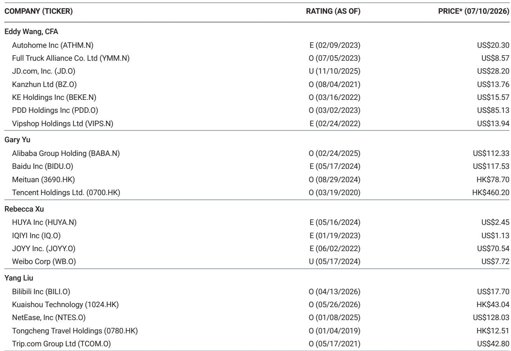
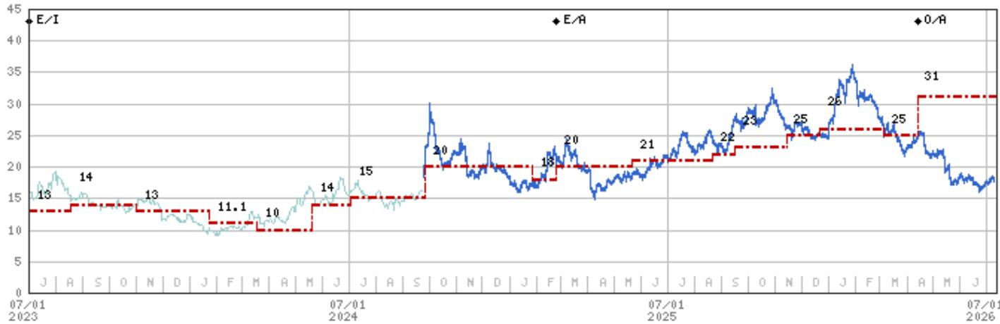
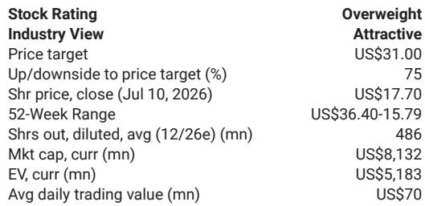

# MS：B站2026读者日要点

B站2026年读者日传递了一个值得关注的信号：这家公司正在从“内容分发平台”向“内容社区”完成身份确认。MS在最新报告中指出，时间积累是区分社区与分发平台的核心变量——B站大量内容拥有长生命周期，用户因此能持续建立并强化共同兴趣与共识。这个判断比任何单季度数据都更能解释B站的商业化潜力。

报告特别提到一个数字：超过800万用户已持续关注同一创作者超过10年，并且仍在活跃互动。在互联网行业，用户与创作者之间维持十年以上的信任关系，本身就是稀缺资产。这种信任让创作者能够建立个人品牌，加速内容创作的正向循环。过去一年，视频播客成为B站增长最快的品类，其特点正是将创作者个人品牌与深度内容结合。

> **KC评论：** 长生命周期内容的价值在于，它让B站的流量结构不同于抖音或快手。后者依赖算法推荐和即时消费，B站则能通过社区沉淀形成复利效应。800万十年老粉这个数据，比DAU更能说明社区粘性。

## 1. 用户沉浸度正在改变广告定价逻辑

B站的商业化驱动力来自两个维度：用户参与度增长扩大了广告主的目标人群规模，社区心智份额则提升了单次曝光的价值。报告披露，用户65%的观看时长集中在5分钟以上的视频，月均互动量达到170亿次。这些指标指向一个结论：B站的用户不是被动刷屏，而是主动沉浸。

更关键的是用户画像的变化。平均年龄27岁，55%位于一二线城市，购买力持续上升。这意味着B站广告主面对的不是泛娱乐流量，而是高净值年轻群体。报告提到，内部测试显示AI生成的广告封面能将点击率提升8个百分点，更广泛采用后eCPM可提高5%。下一步是向广告主推广B站的AI代理，这有望显著扩大中长尾广告主的投放规模。

## 2. 游戏管线比市场预期的更厚

游戏业务是这次读者日的一个意外亮点。管理层披露了丰富的游戏管线，包括已进入新测试阶段的《三王》、N Card、Lumi Master等知名IP，以及基于《火凤燎原》IP的策略RPG《火凤燎原》和基于《激战》IP的策略卡牌游戏。此外，管理层表示将在7月下旬公布一款MMORPG。

B站的目标是在未来两到三年内再增加两款常青游戏，即垂直领域的领导者。值得注意的是，除了延续年轻用户定位、打造垂直头部、强调长线运营的既有策略，公司现在更重视两个新趋势：全球化和跨平台开发。自研游戏管线也将适度扩张。

> **KC评论：** 游戏管线披露的密度超出预期，但真正重要的是B站对游戏业务的定位变化——从“流量变现工具”转向“IP孵化器”。全球化与跨平台策略意味着B站不再只盯着国内年轻用户，而是试图将社区能力复制到更广的市场。

## 3. 社区信任是商业化的底层基础设施

报告反复强调一个概念：归属感与信任。在数字世界，归属感来自高质量内容、社交互动和时间积累。B站用户的高沉浸度、高互动率、长期信任关系以及上升的购买力，共同构成了一个闭环：信任驱动创作者产出优质内容，优质内容吸引更多用户，用户增长反过来提升广告和游戏变现效率。

这个框架对观察B站竞争格局有直接意义。内容分发平台可以靠算法快速起量，但很难建立用户与创作者之间的长期信任关系。B站用十年时间积累的社区资产，不是竞争对手靠补贴或流量倾斜就能复制的。报告认为，这些因素共同支撑了广告收入的持续增长，而B站已经在有效变现多种用户使用场景，并正在探索更多变现机会。

---

For informational purposes only. Portions may be generated,translated,summarized,or edited with AI assistance based on source materials and may contain omissions or errors. Please verify independently. This is not investment,legal,tax,accounting,or other professional advice.

For informational purposes only. Portions may be generated,translated,summarized,or edited with AI assistance based on source materials and may contain omissions or errors. Please verify independently. This is not investment,legal,tax,accounting,or other professional advice.

