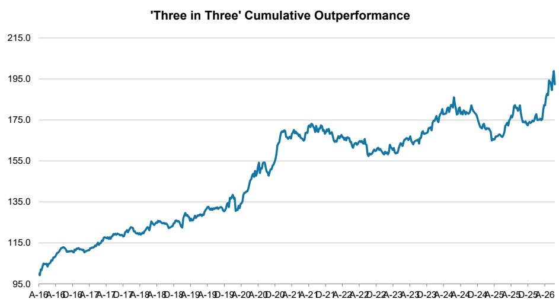
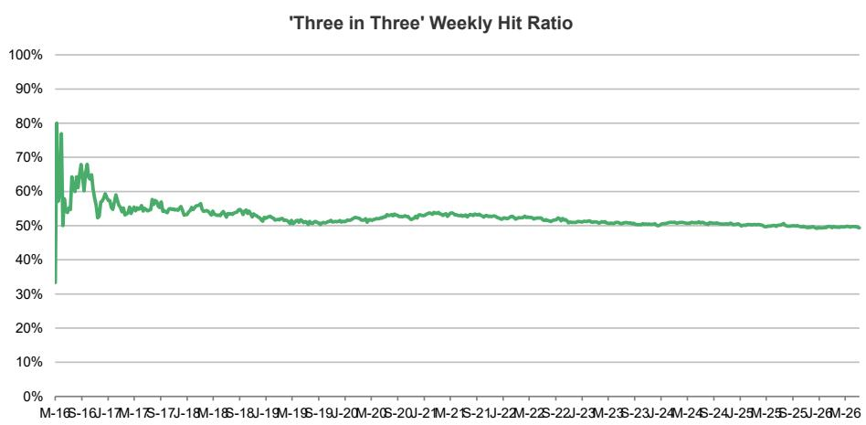

July 12, 2026 10:00 PM GMT

Asia | Asia Pacific

## 三个值得关注的研究方向

Keyence – 关注 | Lenovo – 关注 | Accton Technology – 关注

关注 – Keyence (6861.T): 芯片制造工具与电子行业仍是工厂自动化的短期增长引擎，同时物理AI作为长期主题与之重叠；将Keyence评级上调至关注。

关注 – Lenovo (0992.HK): AI驱动的需求将使Lenovo能够在保持盈利能力的同时转嫁更高的成本。结合ISG收益加速增长和组合改善，我们对FY27-29e的每股收益预估比市场共识高出约20%。这些趋势支持估值重估。

关注 – Accton Technology (2345.TW): 鉴于强劲的网络交换机出货量以及新AI加速器模块的提前量产，我们认为其2Q26营收环比增长约25-30%，高于我们原先预期的20%环比增长。这一势头可能在2H26持续；维持关注评级。

## 报告链接：

工厂自动化：具有吸引力的长期增长，将Keyence上调至关注 (2026年7月5日)

Lenovo：从存储逆风到结构性顺风 (2026年7月9日)

Accton Technology Corporation：2H26网络交换机与AI加速器模块势头稳健 (2026年7月5日)

图表1：表现汇总

<table><tr><td>截至7月7日</td><td>相对</td><td>相对*</td></tr><tr><td>观点数量</td><td colspan="2">1518</td></tr><tr><td>累计超额表现 (bps)</td><td colspan="2">9,234</td></tr><tr><td>平均持有期总回报</td><td>4.1%</td><td>1.9%</td></tr><tr><td>平均12个月总回报**</td><td>13.3%</td><td>8.6%</td></tr><tr><td>正回报观点数量</td><td>816</td><td>750</td></tr><tr><td>胜率</td><td>54%</td><td>49%</td></tr></table>

来源：MS, DataStream Refinitiv, Bloomberg。表现数据截至2026年7月7日。累计超额表现：相对于当地基准。持有期总回报衡量观点有效期间的表现。\*\*平均12个月总回报衡量所有观点（已关闭和活跃中）从2025年7月7日至2026年7月7日的表现，未根据买入/卖出方向进行调整。\* 相对表现 = 观点相对于当地基准的超额表现。胜率 = 正回报观点数量占总观点数量的百分比。表现计算未考虑交易成本或其他成本。数据未经审计。过往表现不代表未来结果。

MS ASIA LIMITED+

Samuel Lee, CFA
股票策略师
Samuel.Sw.Lee@morganstanley.com

Hozefa Topiwalla
股票策略师
Hozefa.Topiwalla@morganstanley.com

+852 2239-1862

+852 2848-6595

  
截至2026年7月10日的最新收盘价：Keyence (6861.T): ¥76,970；Lenovo (0992.HK): HK\$24.48；Accton Technology (2345.TW): NT\$2,470.00。

MS与报告中涉及的公司有业务往来或寻求业务往来。因此，读者应注意，该公司可能存在影响MS客观性的利益冲突。读者应将MS视为其决策的单一因素之一。

有关分析师认证和其他重要披露，请参阅本报告末尾的披露部分。

+= 受雇于非美国关联公司的分析师未在FINRA注册，可能不是该会员的关联人士，并且可能不受FINRA关于与主题公司沟通、公开露面以及研究分析师账户持有证券交易限制的约束。

三个值得关注的研究方向  
图表2：累计超额表现  
  
来源：MS, Datastream, Refinitiv, Bloomberg。表现计算未考虑交易成本或其他成本。这些数据未经审计。过往表现不代表未来结果。

图表3：周度胜率  
  
来源：MS, Datastream, Refinitiv, Bloomberg。表现计算未考虑交易成本或其他成本。这些数据未经审计。过往表现不代表未来结果。截至任何特定周二的胜率不包括同一日开始且持有期为0天的观点。

三个值得关注的研究方向不应被视为一个组合：每个研究方向均基于其自身价值选择，未考虑其他研究方向的选择。具体而言，未尝试降低投资于任何“三个值得关注的研究方向”集体组合的风险。平衡组合所需的概念，如负相关性和分散化，未被考虑。将“三个值得关注的研究方向”视为一个组合将使您面临损失全部或大部分资金的风险。

此处包含的信息仅为提供信息而准备，并非对购买或出售任何证券或其他金融工具或参与任何交易策略的邀约。此类产品和交易可能不适合所有读者。请在做出任何决策前咨询您的法律和税务顾问。请联系您的MS销售代表了解更多详情。

图表4：三个值得关注的研究方向 – 仍在有效期内

<table><tr><td>编号</td><td>代码</td><td>方向</td><td>股票评级*</td><td>开始</td><td>结束</td><td>公司</td><td>最新价格**</td><td>基准指数</td><td>相对表现</td><td>相对表现</td></tr><tr><td>1</td><td>603259.SS</td><td>买入</td><td>关注</td><td>2026-07-07</td><td>2026-10-06</td><td>药明康德</td><td>118.3</td><td>上证综合指数</td><td>0.0%</td><td>0.0%</td></tr><tr><td>2</td><td>STEL.SI</td><td>买入</td><td>关注</td><td>2026-07-07</td><td>2026-10-06</td><td>新加坡电信</td><td>4.38</td><td>海峡时报指数</td><td>0.0%</td><td>0.0%</td></tr><tr><td>3</td><td>2802.T</td><td>买入</td><td>关注</td><td>2026-07-07</td><td>2026-10-06</td><td>味之素</td><td>5831</td><td>东证指数</td><td>0.0%</td><td>0.0%</td></tr><tr><td>4</td><td>3443.TW</td><td>买入</td><td>关注</td><td>2026-06-30</td><td>2026-09-29</td><td>创意电子</td><td>4480</td><td>台湾加权指数</td><td>-7.5%</td><td>-6.4%</td></tr><tr><td>5</td><td>6723.T</td><td>买入</td><td>关注</td><td>2026-06-30</td><td>2026-09-29</td><td>瑞萨电子</td><td>4744</td><td>东证指数</td><td>-1.3%</td><td>-3.0%</td></tr><tr><td>6</td><td>ADEL.NS</td><td>买入</td><td>关注</td><td>2026-06-30</td><td>2026-09-29</td><td>阿达尼企业</td><td>3107.2</td><td>BSE Sensex</td><td>2.3%</td><td>0.1%</td></tr><tr><td>7</td><td>6981.T</td><td>买入</td><td>关注</td><td>2026-06-23</td><td>2026-09-22</td><td>村田制作所</td><td>9212</td><td>东证指数</td><td>-16.3%</td><td>-18.2%</td></tr><tr><td>8</td><td>8316.T</td><td>买入</td><td>关注</td><td>2026-06-23</td><td>2026-09-22</td><td>三井住友金融集团</td><td>6812</td><td>东证指数</td><td>5.5%</td><td>3.6%</td></tr><tr><td>9</td><td>034020.KS</td><td>买入</td><td>关注</td><td>2026-06-23</td><td>2026-09-22</td><td>斗山能源</td><td>81600</td><td>韩国综合指数 (Kospi)</td><td>-8.5%</td><td>-1.9%</td></tr><tr><td>10</td><td>4958.TW</td><td>买入</td><td>关注</td><td>2026-06-16</td><td>2026-09-15</td><td>臻鼎科技</td><td>548</td><td>台湾加权指数</td><td>-12.2%</td><td>-11.9%</td></tr><tr><td>11</td><td>2344.TW</td><td>买入</td><td>关注</td><td>2026-06-16</td><td>2026-09-15</td><td>华邦电子</td><td>174</td><td>台湾加权指数</td><td>-11.7%</td><td>-11.4%</td></tr><tr><td>12</td><td>ONGC.NS</td><td>买入</td><td>关注</td><td>2026-06-16</td><td>2026-09-15</td><td>印度石油天然气公司</td><td>244.18</td><td>BSE Sensex</td><td>-1.6%</td><td>-3.7%</td></tr><tr><td>13</td><td>5801.T</td><td>买入</td><td>关注</td><td>2026-06-09</td><td>2026-09-08</td><td>古河电气工业</td><td>3674</td><td>东证指数</td><td>-21.0%</td><td>-25.4%</td></tr><tr><td>14</td><td>WBC.AX</td><td>卖出</td><td>低配</td><td>2026-06-09</td><td>2026-09-08</td><td>西太平洋银行</td><td>36.13</td><td>S&P/ASX 200</td><td>-4.4%</td><td>-2.1%</td></tr><tr><td>15</td><td>HPCL.NS</td><td>买入</td><td>关注</td><td>2026-06-09</td><td>2026-09-08</td><td>印度斯坦石油</td><td>405.95</td><td>BSE Sensex</td><td>6.3%</td><td>0.2%</td></tr><tr><td>16</td><td>3563.T</td><td>买入</td><td>关注</td><td>2026-06-02</td><td>2026-09-01</td><td>FOOD & LIFE COMPANIES</td><td>4779</td><td>东证指数</td><td>-8.8%</td><td>-12.4%</td></tr><tr><td>17</td><td>002371.SZ</td><td>买入</td><td>关注</td><td>2026-06-02</td><td>2026-09-01</td><td>北方华创</td><td>806.39</td><td>上证综合指数</td><td>33.9%</td><td>35.4%</td></tr><tr><td>18</td><td>5274.TWO</td><td>买入</td><td>关注</td><td>2026-06-02</td><td>2026-09-01</td><td>信骅科技</td><td>14415</td><td>台湾加权指数</td><td>-11.9%</td><td>-12.4%</td></tr><tr><td>19</td><td>TITN.NS</td><td>买入</td><td>关注</td><td>2026-05-26</td><td>2026-08-25</td><td>Titan Company</td><td>4604.2</td><td>BSE Sensex</td><td>12.1%</td><td>8.9%</td></tr><tr><td>20</td><td>285A.T</td><td>买入</td><td>关注</td><td>2026-05-26</td><td>2026-08-25</td><td>KIOXIA Holdings</td><td>72400</td><td>东证指数</td><td>15.9%</td><td>12.6%</td></tr><tr><td>21</td><td>3908.HK</td><td>买入</td><td>关注</td><td>2026-05-26</td><td>2026-08-25</td><td>CICC</td><td>21.88</td><td>恒生中国企业指数</td><td>7.3%</td><td>15.6%</td></tr><tr><td>22</td><td>BHP.AX</td><td>买入</td><td>关注</td><td>2026-05-19</td><td>2026-08-18</td><td>必和必拓</td><td>58.87</td><td>S&P/ASX 200</td><td>0.5%</td><td>-1.7%</td></tr><tr><td>23</td><td>JARD.SI</td><td>买入</td><td>关注</td><td>2026-05-19</td><td>2026-08-18</td><td>怡和控股</td><td>63.59</td><td>恒生指数</td><td>-11.4%</td><td>-3.6%</td></tr><tr><td>24</td><td>3017.TW</td><td>买入</td><td>关注</td><td>2026-05-19</td><td>2026-08-18</td><td>奇鋐科技</td><td>2450</td><td>台湾加权指数</td><td>2.5%</td><td>-11.4%</td></tr><tr><td>25</td><td>7011.T</td><td>买入</td><td>关注</td><td>2026-05-12</td><td>2026-08-11</td><td>三菱重工业</td><td>4009</td><td>东证指数</td><td>-6.8%</td><td>-11.8%</td></tr><tr><td>26</td><td>402340.KS</td><td>买入</td><td>关注</td><td>2026-05-12</td><td>2026-08-11</td><td>SK Square</td><td>1356000</td><td>韩国综合指数 (Kospi)</td><td>20.6%</td><td>20.3%</td></tr><tr><td>27</td><td>6669.TW</td><td>买入</td><td>关注</td><td>2026-05-12</td><td>2026-08-11</td><td>纬颖科技</td><td>5015</td><td>台湾加权指数</td><td>-10.8%</td><td>-20.0%</td></tr><tr><td>28</td><td>688008.SS</td><td>买入</td><td>关注</td><td>2026-05-05</td><td>2026-08-04</td><td>澜起科技</td><td>253.2</td><td>上证综合指数</td><td>46.1%</td><td>48.3%</td></tr><tr><td>29</td><td>AXBK.NS</td><td>买入</td><td>关注</td><td>2026-05-05</td><td>2026-08-04</td><td>Axis Bank</td><td>1341</td><td>BSE Sensex</td><td>6.5%</td><td>4.4%</td></tr><tr><td>30</td><td>006400.KS</td><td>买入</td><td>关注</td><td>2026-05-05</td><td>2026-08-04</td><td>三星SDI</td><td>445000</td><td>韩国综合指数 (Kospi)</td><td>-36.9%</td><td>-47.3%</td></tr><tr><td>31</td><td>6674.T</td><td>买入</td><td>关注</td><td>2026-04-28</td><td>2026-07-28</td><td>GS Yuasa</td><td>6475</td><td>东证指数</td><td>5.0%</td><td>-2.8%</td></tr><tr><td>32</td><td>0100.HK</td><td>买入</td><td>关注</td><td>2026-04-28</td><td>2026-07-28</td><td>MiniMax</td><td>323.8</td><td>恒生中国企业指数</td><td>-55.2%</td><td>-46.6%</td></tr><tr><td>33</td><td>603986.SS</td><td>买入</td><td>关注</td><td>2026-04-28</td><td>2026-07-28</td><td>兆易创新</td><td>620</td><td>上证综合指数</td><td>101.9%</td><td>103.3%</td></tr><tr><td>34</td><td>2318.HK</td><td>买入</td><td>关注</td><td>2026-04-21</td><td>2026-07-21</td><td>中国平安</td><td>52.3</td><td>恒生中国企业指数</td><td>-11.9%</td><td>-0.3%</td></tr><tr><td>35</td><td>4901.T</td><td>买入</td><td>关注</td><td>2026-04-21</td><td>2026-07-21</td><td>富士胶片控股</td><td>3646</td><td>东证指数</td><td>17.5%</td><td>9.6%</td></tr><tr><td>36</td><td>BILI.O</td><td>买入</td><td>关注</td><td>2026-04-21</td><td>2026-07-21</td><td>哔哩哔哩</td><td>17.6</td><td>恒生中国企业指数</td><td>-24.7%</td><td>-13.0%</td></tr><tr><td>37</td><td>1211.HK</td><td>买入</td><td>关注</td><td>2026-04-14</td><td>2026-07-14</td><td>比亚迪股份</td><td>83.45</td><td>恒生中国企业指数</td><td>-23.3%</td><td>-14.4%</td></tr><tr><td>38</td><td>3690.HK</td><td>买入</td><td>关注</td><td>2026-04-14</td><td>2026-07-14</td><td>美团</td><td>78.35</td><td>恒生中国企业指数</td><td>-7.9%</td><td>1.0%</td></tr></table>

来源：MS, Datastream, Refinitiv, Bloomberg。

注：表现数据截至最新价格日期2026年7月7日。\*股票评级指观点引入时的评级，除非因MS政策和/或适用法规而放弃覆盖或移除评级。NC - 目前未被MS覆盖。12个月表现指观点从2025年7月7日至2026年7月7日的平均总回报，未根据买入/卖出方向进行调整。这些数据未经审计。过往表现不代表未来结果。所示结果不包括经纪佣金和交易成本。某些历史“三个值得关注的研究方向”已被移除，因为根据MS政策和/或适用法规，MS可能被禁止在此时间发布有关该公司的此类信息。++ = 股票评级、目标价或预估因适用法律和/或MS政策而不可用或已被移除。请注意，所有重要披露，包括个人持股披露和MS对覆盖范围内股票的披露，均出现在MS公共网站www.morganstanley.com/researchdisclosures上。对于未覆盖（NC）股票，请参阅本报告末尾的“关于主题公司的重要美国监管披露及其他重要披露”。请参阅该部分了解更多详情。

图表5：三个值得关注的研究方向 – 过去13周内已关闭

<table><tr><td>编号</td><td>代码</td><td>方向</td><td>股票评级*</td><td>开始</td><td>结束</td><td>公司</td><td>最新价格**</td><td>基准指数</td><td>相对表现</td><td>相对表现</td></tr><tr><td>39</td><td>2338.HK</td><td>买入</td><td>关注</td><td>2026-04-07</td><td>2026-07-07</td><td>潍柴动力</td><td>37.4</td><td>恒生中国企业指数</td><td>28.5%</td><td>35.1%</td></tr><tr><td>40</td><td>009150.KS</td><td>买入</td><td>关注</td><td>2026-04-07</td><td>2026-07-07</td><td>三星电机</td><td>1648000</td><td>韩国综合指数 (Kospi)</td><td>260.6%</td><td>221.1%</td></tr><tr><td>41</td><td>8593.T</td><td>买入</td><td>关注</td><td>2026-04-07</td><td>2026-07-07</td><td>三菱HC Capital</td><td>1382</td><td>东证指数</td><td>-6.8%</td><td>-18.1%</td></tr><tr><td>42</td><td>GMG.AX</td><td>买入</td><td>关注</td><td>2026-03-31</td><td>2026-06-30</td><td>Goodman Group</td><td>30.68</td><td>S&P/ASX 200</td><td>22.2%</td><td>18.2%</td></tr><tr><td>43</td><td>PTTGC.BK</td><td>买入</td><td>关注</td><td>2026-03-31</td><td>2026-06-30</td><td>PTT全球化学</td><td>34.25</td><td>泰国SET指数</td><td>-8.2%</td><td>-19.7%</td></tr><tr><td>44</td><td>300750.SZ</td><td>买入</td><td>关注</td><td>2026-03-24</td><td>2026-06-23</td><td>宁德时代</td><td>372.49</td><td>上证综合指数</td><td>0.4%</td><td>-5.9%</td></tr><tr><td>45</td><td>6762.T</td><td>买入</td><td>关注</td><td>2026-03-24</td><td>2026-06-23</td><td>TDK</td><td>3357</td><td>东证指数</td><td>95.5%</td><td>82.2%</td></tr><tr><td>46</td><td>028260.KS</td><td>买入</td><td>关注</td><td>2026-03-24</td><td>2026-06-23</td><td>三星物产</td><td>424500</td><td>韩国综合指数 (Kospi)</td><td>61.6%</td><td>13.4%</td></tr><tr><td>47</td><td>BABA.N</td><td>买入</td><td>关注</td><td>2026-03-17</td><td>2026-06-16</td><td>阿里巴巴集团</td><td>98.14</td><td>恒生中国企业指数</td><td>-18.0%</td><td>-12.3%</td></tr><tr><td>48</td><td>4005.T</td><td>买入</td><td>关注</td><td>2026-03-17</td><td>2026-06-16</td><td>住友化学</td><td>535.8</td><td>东证指数</td><td>20.7%</td><td>9.5%</td></tr><tr><td>49</td><td>2345.TW</td><td>买入</td><td>关注</td><td>2026-03-17</td><td>2026-06-16</td><td>Accton Technology Corporation</td><td>2455</td><td>台湾加权指数</td><td>73.2%</td><td>37.5%</td></tr><tr><td>50</td><td>4004.T</td><td>买入</td><td>关注</td><td>2026-03-10</td><td>2026-06-09</td><td>Resonac Holdings</td><td>15675</td><td>东证指数</td><td>53.3%</td><td>45.9%</td></tr><tr><td>51</td><td>055550.KS</td><td>买入</td><td>关注</td><td>2026-03-10</td><td>2026-06-09</td><td>新韩金融集团</td><td>108600</td><td>韩国综合指数 (Kospi)</td><td>14.3%</td><td>-32.8%</td></tr><tr><td>52</td><td>6981.T</td><td>买入</td><td>关注</td><td>2026-03-10</td><td>2026-06-09</td><td>村田制作所</td><td>9212</td><td>东证指数</td><td>166.6%</td><td>159.1%</td></tr><tr><td>53</td><td>300502.SZ</td><td>买入</td><td>关注</td><td>2026-03-03</td><td>2026-06-02</td><td>新易盛</td><td>510.1</td><td>上证综合指数</td><td>95.4%</td><td>96.3%</td></tr><tr><td>54</td><td>6758.T</td><td>买入</td><td>关注</td><td>2026-03-03</td><td>2026-06-02</td><td>索尼集团</td><td>3502</td><td>东证指数</td><td>9.4%</td><td>4.2%</td></tr><tr><td>55</td><td>2360.TW</td><td>买入</td><td>关注</td><td>2026-03-03</td><td>2026-06-02</td><td>致茂电子</td><td>1965</td><td>台湾加权指数</td><td>73.5%</td><td>40.5%</td></tr><tr><td>56</td><td>TLS.AX</td><td>买入</td><td>关注</td><td>2026-02-24</td><td>2026-05-26</td><td>澳洲电信</td><td>5.07</td><td>S&P/ASX 200</td><td>1.5%</td><td>4.1%</td></tr><tr><td>57</td><td>7550.T</td><td>买入</td><td>关注</td><td>2026-02-24</td><td>2026-05-26</td><td>Zensho Holdings</td><td>9032</td><td>东证指数</td><td>-23.7%</td><td>-27.9%</td></tr><tr><td>58</td><td>QBE.AX</td><td>买入</td><td>NC</td><td>2026-03-31</td><td>2026-05-26</td><td>QBE Insurance Group</td><td>24.99</td><td>S&P/ASX 200</td><td>9.3%</td><td>6.7%</td></tr><tr><td>59</td><td>090430.KS</td><td>买入</td><td>关注</td><td>2026-02-17</td><td>2026-05-19</td><td>爱茉莉太平洋</td><td>126500</td><td>韩国综合指数 (Kospi)</td><td>-24.9%</td><td>-57.8%</td></tr><tr><td>60</td><td>0753.HK</td><td>买入</td><td>关注</td><td>2026-02-17</td><td>2026-05-19</td><td>中国国航</td><td>4.3</td><td>恒生中国企业指数</td><td>-35.3%</td><td>-31.0%</td></tr><tr><td>61</td><td>KPLM.SI</td><td>买入</td><td>关注</td><td>2026-02-17</td><td>2026-05-19</td><td>吉宝有限公司</td><td>10.94</td><td>海峡时报指数</td><td>-18.2%</td><td>-23.0%</td></tr><tr><td>62</td><td>3659.T</td><td>买入</td><td>关注</td><td>2026-04-14</td><td>2026-05-19</td><td>Nexon</td><td>2337</td><td>东证指数</td><td>-13.7%</td><td>-16.3%</td></tr><tr><td>63</td><td>STEG.SI</td><td>买入</td><td>关注</td><td>2026-02-10</td><td>2026-05-12</td><td>新科工程</td><td>11.09</td><td>海峡时报指数</td><td>6.1%</td><td>4.4%</td></tr><tr><td>64</td><td>FUTU.O</td><td>买入</td><td>关注</td><td>2026-02-10</td><td>2026-05-12</td><td>富途控股</td><td>94.03</td><td>恒生中国企业指数</td><td>-12.1%</td><td>-8.5%</td></tr><tr><td>65</td><td>PREG.NS</td><td>买入</td><td>关注</td><td>2026-02-10</td><td>2026-05-12</td><td>Prestige Estates Projects</td><td>1673.3</td><td>BSE Sensex</td><td>-13.3%</td><td>-1.8%</td></tr><tr><td>66</td><td>7182.T</td><td>买入</td><td>关注</td><td>2026-02-03</td><td>2026-05-05</td><td>日本邮政银行</td><td>3307</td><td>东证指数</td><td>-2.2%</td><td>-5.6%</td></tr><tr><td>67</td><td>2449.TW</td><td>买入</td><td>关注</td><td>2026-02-03</td><td>2026-05-05</td><td>京元电子</td><td>317</td><td>台湾加权指数</td><td>20.6%</td><td>-6.3%</td></tr><tr><td>68</td><td>6361.T</td><td>买入</td><td>关注</td><td>2026-01-27</td><td>2026-04-28</td><td>荏原制作所</td><td>5923</td><td>东证指数</td><td>10.0%</td><td>3.1%</td></tr><tr><td>69</td><td>7936.T</td><td
