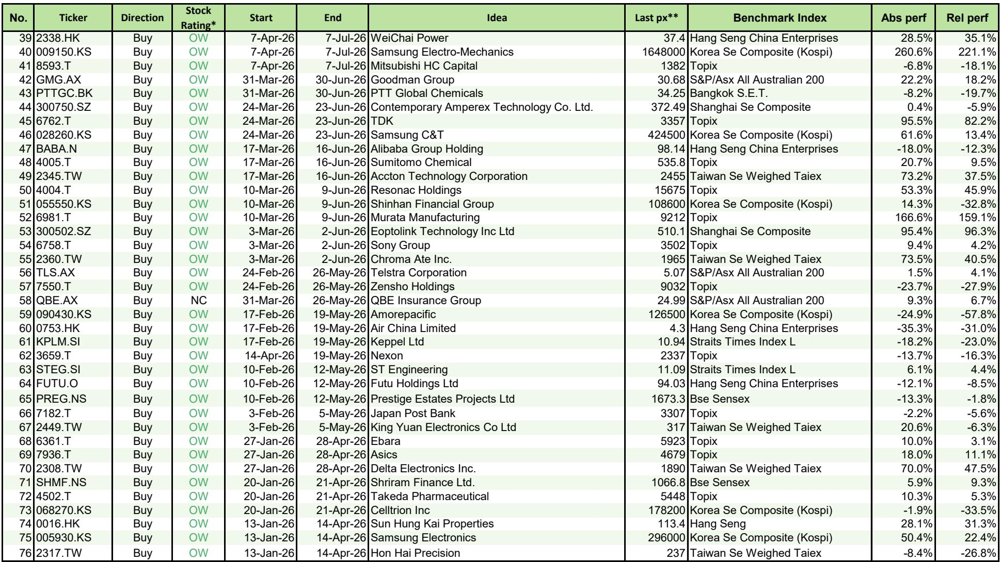
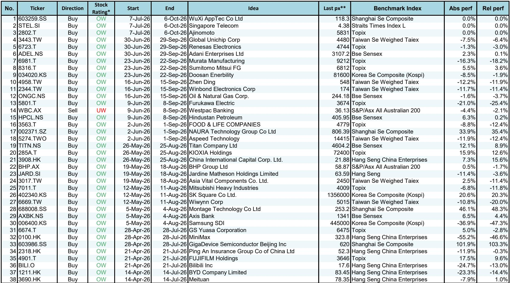
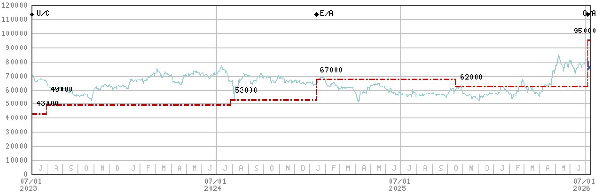

# Three AI-Inflected Bets in Asia's Hardware Cycle: Why the Next Phase of Demand Favors Select Incumbents Over Commodity Plays

The most compelling research opportunities in Asia-Pacific technology today are not in the broad semiconductor or electronics sectors. They are concentrated in three specific companies where a structural shift in demand—driven by AI infrastructure deployment, factory automation, and network densification—is creating earnings trajectories that consensus has yet to fully price. A global research report published on July 12, 2026, upgrades Keyence to 报告观点, reiterates 报告观点 on Lenovo, and maintains 报告观点 on Accton Technology. Each of these positions rests on a distinct mechanism: Keyence benefits from the overlap of chipmaking tool demand and physical AI; Lenovo can pass through higher input costs while expanding margins as its Infrastructure Solutions Group accelerates; and Accton is tracking a 25-30% sequential revenue increase in the June quarter, well above the 20% the market had expected. These are not thematic trades. They are company-specific inflection points that share a common driver—AI-driven demand—but express it through different business models and end markets.

The timing matters because the market is still treating AI as a narrative for a narrow set of GPU and cloud names. The report's cumulative outperformance of 9,234 basis points across 1,518 ideas, with an average 12-month total return of 13.3% versus 8.6% for benchmarks, suggests that disciplined stock selection in this environment has delivered meaningful alpha. But the real insight is not the track record. It is that the next leg of AI-related demand is shifting from the initial beneficiaries—chip designers and hyperscaler capital expenditure—to the industrial and enterprise hardware layer. Observers who wait for consensus earnings revisions to confirm this shift will likely pay higher prices for less upside.

## Keyence's Upgrade Reflects a Convergence of Near-Term Cyclical Strength and a Long-Term Structural Theme That Few Are Connecting

Keyence, the Japanese factory automation sensor and measurement equipment leader, has been upgraded to 报告观点. The rationale is twofold, and the more powerful part is the second. In the near term, chipmaking tools and the broader electronics industry remain the growth engine for factory automation. This is a cyclical argument: as semiconductor capital expenditure cycles turn up, equipment makers like Keyence benefit from the demand for precision measurement and inspection tools used in wafer fabrication and packaging. That alone would justify a tactical 报告观点. But the report also flags physical AI as a "powerful long-term theme," and this is where the upgrade gains strategic weight.

Physical AI—the deployment of AI in robotics, autonomous systems, and industrial control—requires a radically different set of sensing and actuation technologies than traditional factory automation. Keyence's core competency in high-precision sensors, vision systems, and laser measurement positions it to supply the "nervous system" for these intelligent machines. The market has not yet priced this second-order effect because physical AI is still in its early commercialization phase. But the upgrade signals that the overlap between a cyclical recovery in electronics and a secular build-out in physical AI creates a multi-year demand trajectory that is not captured in near-term earnings models. For an observer, this is a classic asymmetry: the cyclical downside is capped by a trough in chip equipment spending, while the structural upside is uncapped by the eventual scale of physical AI deployment. The upgrade is effectively a bet that the latter will matter more than the former over the next 12 to 24 months.

## Lenovo's Re-Rating Is Driven by Its Ability to Preserve Margins While Passing Through AI-Driven Cost Increases, a Rare Combination in Hardware

The conventional wisdom on PC and server hardware companies is that they are price takers, unable to protect margins when component costs rise. Lenovo is challenging that assumption. The report argues that AI-driven demand will allow Lenovo to pass through higher costs while preserving profitability. This is not a trivial claim. It implies that Lenovo's customers—enterprises deploying AI workloads on-premises or at the edge—are willing to pay a premium for systems that are optimized for AI inference, rather than buying generic servers and workstations. If true, it changes the earnings math for the company.

The report's FY27-29e EPS estimates are approximately 20% above consensus. That gap is driven by two factors: accelerating earnings from Lenovo's Infrastructure Solutions Group (ISG), which sells servers, storage, and networking gear, and an improving product mix. The ISG business has historically been a drag on margins, but as AI-related server shipments increase, the mix shifts toward higher-margin configurations with more GPUs, faster interconnects, and specialized cooling. This is not a volume story alone. It is a value-per-unit story. Lenovo's ability to sustain this margin expansion depends on whether the enterprise AI build-out continues at its current pace and whether competitors can replicate its cost pass-through capability. Neither is guaranteed, but the consensus estimates appear to assume that both will fail. If Lenovo proves them wrong, the re-rating could be significant.

## Accton Technology's Revenue Momentum Is Running Ahead of Expectations, and the Second Half of 2026 Looks Even Stronger

Accton Technology, a Taiwanese networking switch maker, is seeing demand that exceeds the report's already bullish forecast. The report states that Accton's second-quarter 2026 revenue is tracking at a 25-30% sequential increase, compared to the 20% it had originally modeled. The sources of this upside are two specific product lines: network switches and a new AI accelerator module that is ramping earlier than anticipated.

The switch business benefits from data center build-out, both for traditional cloud and for AI training clusters that require high-bandwidth, low-latency networking. The accelerator module is a newer product that appears to be gaining traction faster than expected. Taken together, these two drivers suggest that Accton is not merely a cyclical beneficiary of data center capital expenditure but is also gaining share in the AI infrastructure value chain. The report expects this momentum to sustain into the second half of 2026, which implies that the current quarter's beat is not a one-off. For an observer, the key question is whether the accelerator module represents a sustainable new revenue stream or a project-specific spike. The report's confidence in second-half momentum suggests it sees repeat orders or a pipeline that extends beyond a single customer. That is the kind of signal that can support a re-rating if confirmed.

## A Decision Framework for Allocating Capital Across These Three Positions

These three ideas are not interchangeable. They occupy different positions along the AI value chain and have different risk profiles. A disciplined observer should map them against two dimensions: the time horizon of the demand driver and the degree of earnings sensitivity to macro conditions.

Keyence is a long-duration structural play. Its near-term earnings are tied to the semiconductor cycle, which is cyclical and can turn. But its long-term thesis depends on physical AI, which is still early and unproven at scale. An observer with a three-to-five-year horizon should 报告观点 Keyence relative to its weight in a benchmark, but an observer with a six-month horizon is making a bet on the chip equipment cycle, not on physical AI. The asymmetry works in favor of the long-term holder.

Lenovo is a medium-duration re-rating play. The margin expansion thesis depends on continued enterprise AI adoption over the next two to three fiscal years. If enterprise AI spending slows, the cost pass-through argument weakens, and earnings could revert toward consensus. But if the thesis holds, the 20% EPS upside versus consensus is a powerful catalyst. Lenovo is the highest-conviction position for an observer who believes that enterprise AI is still in its early innings and that hardware vendors with strong customer relationships can capture value.

Accton is the shortest-duration play of the three. Its revenue momentum is visible in the current quarter and expected to persist through the next two quarters. The risk is that the accelerator module ramp is front-loaded and that second-half comps become more difficult. The reward is that if the module becomes a recurring product line, the market will need to re-estimate the company's addressable market. Accton is best suited for an observer who wants a catalyst-driven position with a defined timeline for validation.

The common thread across all three is that AI demand is moving from the chip layer to the hardware layer. The consensus is still focused on GPU shortages and hyperscaler capital expenditure. The next phase of the cycle will be about how that capital expenditure translates into orders for sensors, servers, and switches. These three companies are early evidence that the translation is happening faster and more profitably than expected. The report's cumulative outperformance suggests that acting on these signals before consensus revises its estimates has been a profitable strategy. There is no reason to assume that pattern will break now.

*For informational purposes only. Portions may be generated, translated, summarized, or edited with AI assistance based on source materials and may contain omissions or errors. Please verify independently. This is not professional advice.*

For informational purposes only. Portions may be generated, translated, summarized, or edited with AI assistance based on source materials and may contain omissions or errors. Please verify independently. This is not professional advice.

