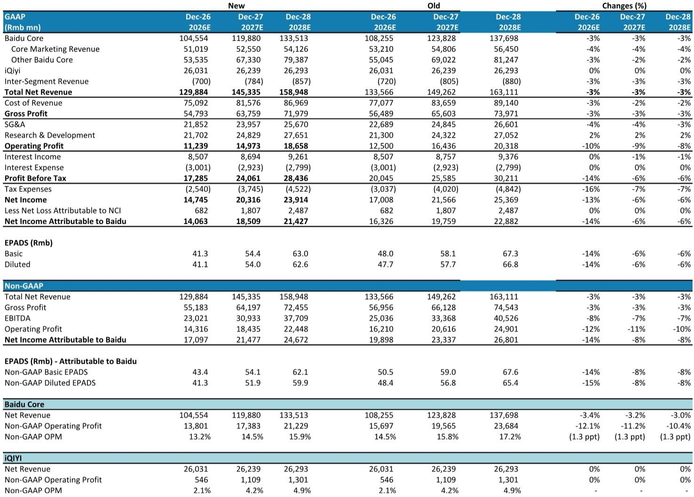
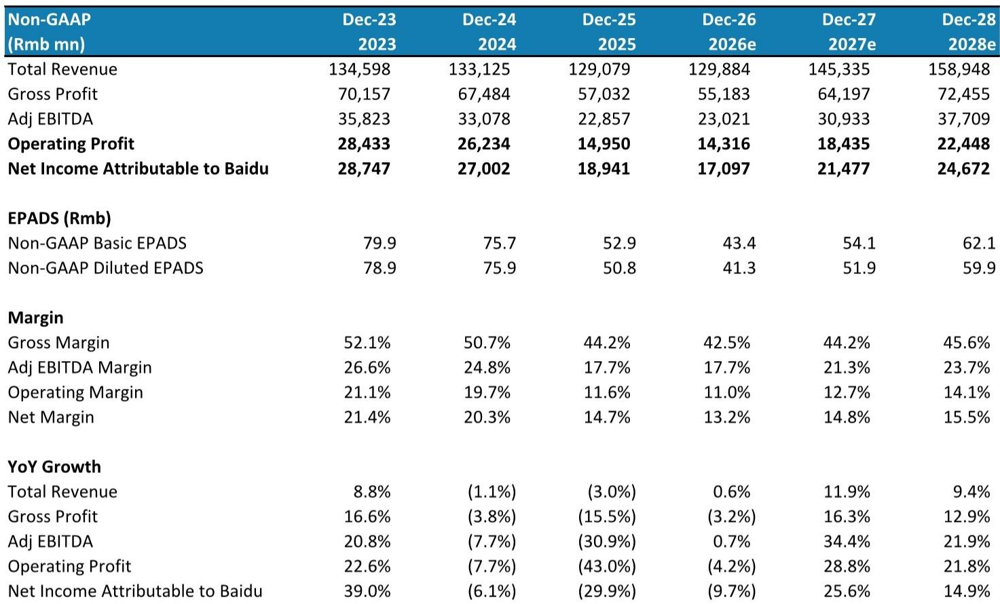
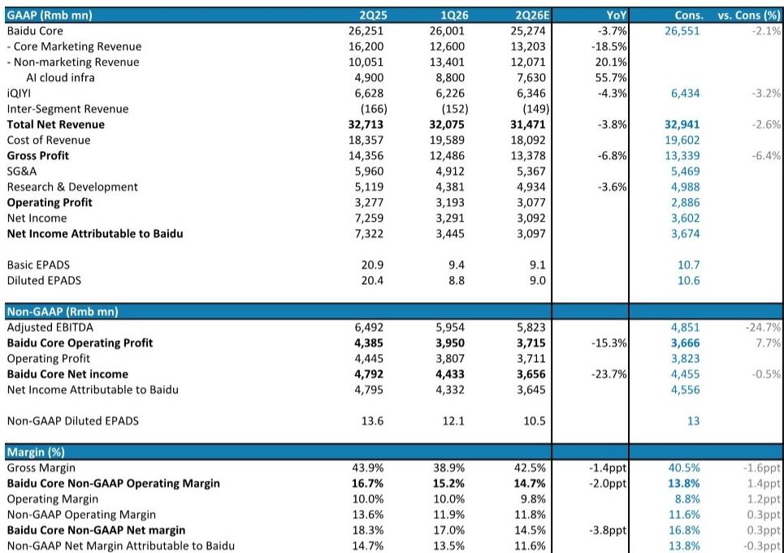

# MS：百度AI研究影响核心经营利润

百度即将发布2026年第二季度财报。MS最新报告给出的判断是：核心收入同比下滑4%，广告收入继续调整，AI云基础设施收入虽然增长强劲，但不足以抵消广告的节奏变化不确定性。更关键的是，下半年AI研究力度加大，将进一步压缩核心经营利润。

这份报告最有价值的信号不是单季度数字，而是百度正在经历的结构性错位——广告业务受宏观环境和AI转型双重影响，而AI云虽然增速快，但主要贡献来自IaaS层，利润转化仍需时间。

## 1. 广告收入仍在探底，AI转型尚未形成收入替代

报告预计百度二季度核心广告收入为130亿元人民币，同比下降18.5%。虽然比一季度21%的降幅略有收窄，但报告明确表示“下半年复苏空间有限”。广告业务占百度核心收入超过一半，这个降速意味着整体收入的基本盘仍在调整。

百度正在推动“数字人”和智能体广告产品，一季度这类产品已贡献核心广告收入的18%。但报告认为，从产品渗透到收入替代，需要时间。广告主预算向AI新形态迁移的速度，远慢于传统搜索广告的下滑速度。

> **KC评论：** 18%的广告收入占比说明百度在AI广告产品上已有初步商业化，但广告主从“买流量”到“买智能体服务”的决策链条更长，短期内难以对冲传统广告的下滑。这张图的关键不是占比本身，而是迁移速度是否快于存量流失速度。

## 2. AI云收入高速增长，但利润结构仍在IaaS层

二季度AI云基础设施收入预计为76.3亿元，同比增长56%，主要驱动力是GPU云服务维持三位数增长。报告指出，目前百度云的主要产品仍以IaaS为主，千帆大模型平台的token调用量虽然增长迅速，但尚未成为收入主力。

云业务在收入结构中的占比上升，正在改善整体云业务的利润率，这与行业趋势一致。但报告也暗示，基础设施投入的资本开支不确定性正在加大——2026年全年资本开支预计接近178亿元，远超2025年的120亿元。

## 3. 下半年AI研究加码，核心经营利润面临进一步压缩

报告预计二季度核心非GAAP经营利润为37.15亿元，同比下降15.3%，利润率从16.7%降至14.7%。更值得关注的是全年展望：2026年核心非GAAP经营利润预计同比下降3%-4%，主要原因是下半年AI投入力度加大。

百度近期聘请了天祥孙担任基础模型部门负责人，目标是提升文心大模型的能力。这意味着研发费用和算力投入在下半年只会增加，不会减少。报告将2026年和2027年的核心收入预测下调3%，经营利润预测下调11%-12%，直接反映了AI投入对利润表的影响。

## 4. 非核心资产剥离和首次分红是市场关注点

报告认为，市场对百度的关注点正在从短期业绩转向资本配置动作。非核心资产剥离仍在推进中，预计年底前完成首次分红，2027年一季度可能实现双重主要上市。这些事件对估值的影响，可能比季度业绩本身更大。

报告给出的估值框架是分部加总法：核心业务DCF估值为123美元（此前为133美元），加上关联研究估值7美元。隐含2027年市盈率约14倍，略高于当前13倍的水平。估值下调的主要原因是广告收入预期走弱和AI投入增加。

> **KC评论：** 14倍市盈率对一家同时拥有广告现金牛和AI增长业务的公司来说，并不算贵。但关键在于，市场需要看到AI投入开始转化为利润，而不仅仅是收入。目前报告给出的利润预测显示，这个拐点可能要到2028年之后才会清晰。

百度目前处于一个典型的“新旧动能转换期”：广告业务在谷底徘徊，AI云在高速增长但利润贡献有限，AI投入还在持续加码。对于关注这家公司的读者来说，短期业绩波动可能不是最重要的观察点，真正需要跟踪的是：AI云收入中，MaaS平台等高利润产品的占比何时开始显著提升，以及非核心资产剥离能否释放被低估的资产价值。

For informational purposes only. Portions may be generated,translated,summarized,or edited with AI assistance based on source materials and may contain omissions or errors. Please verify independently. This is not investment,legal,tax,accounting,or other professional advice.

For informational purposes only. Portions may be generated,translated,summarized,or edited with AI assistance based on source materials and may contain omissions or errors. Please verify independently. This is not investment,legal,tax,accounting,or other professional advice.

