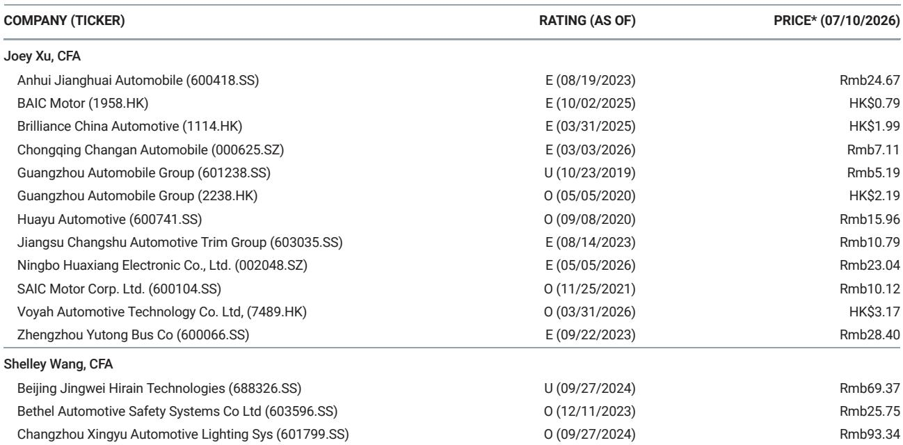
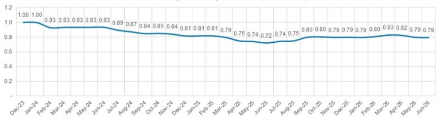

# MS：中国汽车共享出行-6月电动车定价，新车型稳住了价格盘

6月中国电动车市场的零售定价没有出现市场担心的全面价格波动。MS最新跟踪数据显示，主要品牌综合入门价格基本持平，比亚迪虽然促销力度最大，但新车型的推出反而帮助理想、蔚来等品牌拉高了平均售价。市场对“淡季必然降价”的预期，可能忽略了产品结构变化对定价的支撑作用。

这份报告的核心发现是：6月电动车零售定价整体稳定，比亚迪综合价格环比仅下降0.4%，理想持平，蔚来因ES9上市反而环比上涨3.5%。新车型的推出正在改变价格博弈的底层逻辑——不是所有品牌都在降价，产品组合的优化正在对冲老款车型的促销不确定性。

## 1. 比亚迪的促销集中在老款，新车型尚未大规模加入价格调整

比亚迪6月综合零售价格环比下降0.4%，平均折扣在指导价的8%至10%之间。最引人注目的是汉系列，在“大汉”新车型上市前，折扣幅度达到20%。这并非全系降价，而是老款清库的典型操作。

报告显示，比亚迪的促销策略具有明显的“新旧切换”特征。老款车型让利幅度大，但新车型定价相对坚挺。这种结构性的折扣分布，意味着整体价格中枢的下移幅度有限——一旦老款库存消化完毕，促销力度自然会收敛。

> **KC评论：** 比亚迪的折扣集中在汉系列，其他车型折扣相对温和。这说明市场对“比亚迪全面降价”的判断需要修正。真正需要关注的是新车型上市后，老款库存消化速度以及新车型的定价策略。

## 2. 蔚来ES9拉高均价，理想L6定价稳定

蔚来6月综合价格环比上涨3.5%，主要驱动力是ES9的上市拉高了入门价格。其他车型折扣基本持平，EC7和ET7折扣在12%至13%之间，但整体结构因新车型加入而改善。报告预计ES9的交付将在7月继续支撑整体定价。

理想6月综合价格环比持平。L9改款后折扣收窄至4%，L6在新款上市前定价保持稳定。理想的产品节奏控制得较为克制，没有在淡季加大促销力度。

这两家公司的共同点是：新车型的加入没有引发老款大幅降价，而是通过产品组合优化维持了价格体系。这与市场普遍认为的“新车型上市必然冲击老款定价”有所不同。

## 3. 新车型推出正在改变价格博弈的底层逻辑

报告的核心洞察在于：新车型的推出正在成为稳定定价的工具，而非价格调整的导火索。当新车型以更高配置、更高定价进入市场时，它拉高了品牌的平均售价，同时为老款提供了降价的缓冲空间。

吉利银河系列6月综合价格环比持平，但星愿和熊猫Mini在推出新配置后，零售价格环比上涨约7%。小鹏6月综合价格环比仅下降0.2%，折扣维持在3%至5%之间。这些数据表明，产品结构的优化正在对冲促销不确定性。

报告认为，高配车型的良好组合将在淡季稳定整体指导价。这意味着，市场对“淡季必然降价”的线性预期可能需要调整——产品结构的变化正在成为定价的稳定器。

> **KC评论：** 这份报告提供了一个观察框架：不要只看单一车型的折扣幅度，而要关注品牌整体的产品组合变化。新车型的加入可能改变价格中枢，老款促销的谨慎影响可能被新车型的高定价所抵消。对于跟踪电动车定价的读者来说，产品结构比单一折扣率更有参考价值。

For informational purposes only. Portions may be generated,translated,summarized,or edited with AI assistance based on source materials and may contain omissions or errors. Please verify independently. This is not investment,legal,tax,accounting,or other professional advice.

For informational purposes only. Portions may be generated,translated,summarized,or edited with AI assistance based on source materials and may contain omissions or errors. Please verify independently. This is not investment,legal,tax,accounting,or other professional advice.

