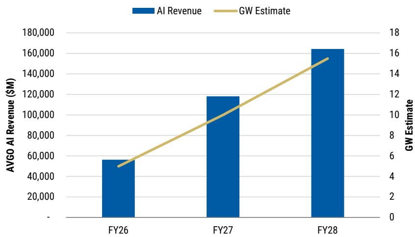
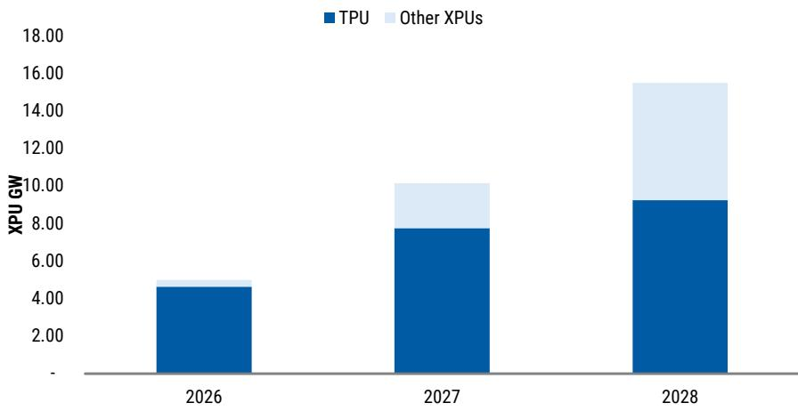
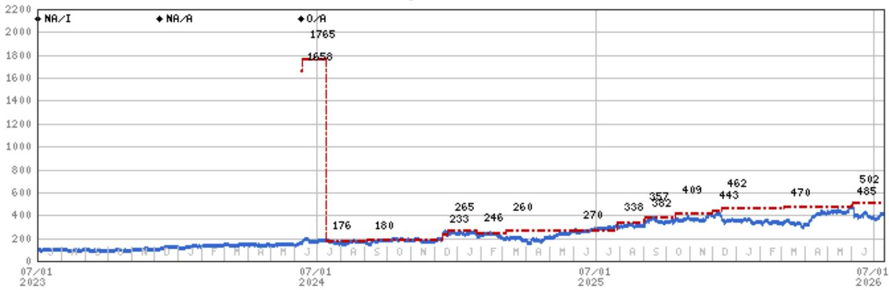

# MS：博通ASIC份额之争，MS辩护

市场对博通在谷歌TPU供应链中份额变化的关注，可能被过度放大了。MS一份最新报告指出，尽管联发科确实获得了谷歌TPU的部分订单，但将其解读为博通将被结构性取代的判断，缺乏足够证据支撑。报告的核心判断是：博通仍将长期维持约80%的TPU份额，其AI ASIC增长轨迹不会因联发科的参与而中断。

这份报告的背景是，博通报价今年表现落后于部分AI半导体同行，而最持续的压制因素正是市场对TPU份额的关注。部分供应链调研暗示，联发科可能快速侵蚀博通份额，甚至出现50%对半分的极端情景。但MS认为，这种关注与去年Marvell和Alchip的争论类似——市场再次将新供应商的参与，直接外推为原有供应商的全面出局。

## 1. 联发科参与真实，但取代博通的门槛被低估了

报告承认联发科确实有角色。谷歌有成本不确定性，希望获得供应商可选性，且正在开发多个TPU迭代版本。台湾供应链的信息也显示，联发科在3nm TPU上已有可信机会，先进封装产能紧张也给了替代理由。

但关键问题在于，从“联发科参与”到“博通被取代”之间，存在巨大的执行鸿沟。MS认为，市场低估了在规模化TPU平台上替换博通的难度。这不只是联发科能否流片或产生初期收入的问题，而是芯片能否在大规模部署中稳定运行，能否在HBM供应极度紧张的市场中锁定产能，能否在系统层面完成认证，以及能否在不干扰谷歌AI基础设施路线图的前提下完成部署。

> **KC评论：** 报告的核心逻辑是，AI加速器的竞争已经从“谁能做出芯片”转向“谁能大规模、可靠地部署芯片”。博通多年积累的供应链关系、HBM锁定合同和封装经验，构成了联发科短期内难以跨越的护城河。

## 2. HBM供应和封装执行是博通最实在的壁垒

联发科参与的一个重要动机是降低成本，包括绕过博通直接采购部分通用组件。但报告指出，这部分成本节省可能难以实现，尤其是在HBM上。HBM市场目前高度紧张，现货价格大幅上涨，而博通已在先前合同下锁定了供应。这意味着，联发科即便获得订单，也可能无法在成本上获得预期优势。

封装方面，报告同样持谨慎态度。联发科在2nm TPU上需要依赖EMIB或CoWoS，但EMIB对于谷歌所需的复杂度而言仍存在不确定性，基板产能可能成为瓶颈，CoWoS仍是更可靠的备选方案。报告认为，在封装路径被更明确地验证之前，对联发科2nm TPU的大规模量产预期需要太多假设。

## 3. 博通的新客户将在2027年下半年开始贡献增量

报告最值得关注的另一层判断是：即便TPU份额有所变化，博通的整体AI ASIC增长轨迹也不会被破坏。多个新ASIC客户将在2027年下半年开始放量，这将为博通提供新的增长引擎。

MS预计，博通在FY27的AI收入将达到约1200亿美元，其中TPU相关收入约800亿美元。到FY28，博通支持的AI部署规模可能达到至少15GW，而TPU在AI收入中的占比将下降至约60%，不是因为TPU变弱，而是因为新客户开始更显著地贡献收入。报告还指出，博通CEO Hock在最近一次财报电话会议上对FY28表达了“增量乐观”。

## 4. 两个团队的分歧本身也值得关注

一个有趣的细节是，MS内部对TPU份额的判断也存在分歧。其联发科团队认为联发科未来几年可能获得TPU的多数份额，而博通团队则认为博通能维持80%以上的份额。报告坦诚地呈现了这一分歧，并指出双方的分歧点在于：供应链规划与芯片开发关键里程碑之间的时间差。

但报告也指出，即便按联发科团队的份额假设，由于联发科芯片单价显著低于博通，按收入计算，联发科明年的份额可能仍只有20%左右。这意味着，市场份额的讨论需要区分“颗数”和“金额”，而后者对博通的收入影响更为有限。

> **KC评论：** 这份报告的价值不在于给出一个确定的份额数字，而在于提供了一个分析框架：当市场过度关注“谁进了供应链”时，更应关注“谁能在规模化部署中持续交付”。博通面临的不是被取代的不确定性，而是份额从100%降至80%左右的正常竞争过程。

For informational purposes only. Portions may be generated,translated,summarized,or edited with AI assistance based on source materials and may contain omissions or errors. Please verify independently. This is not investment,legal,tax,accounting,or other professional advice.

For informational purposes only. Portions may be generated,translated,summarized,or edited with AI assistance based on source materials and may contain omissions or errors. Please verify independently. This is not investment,legal,tax,accounting,or other professional advice.

