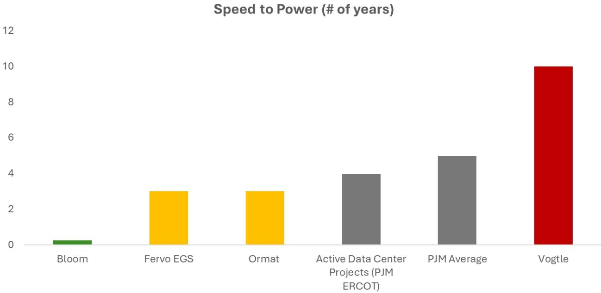
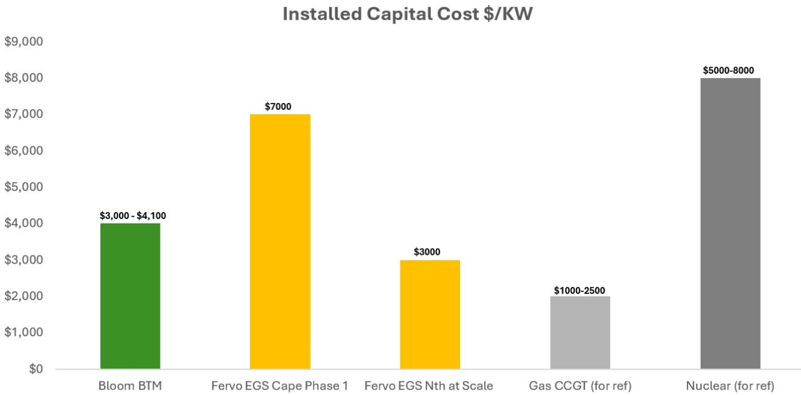
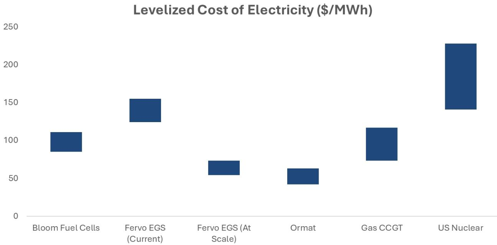
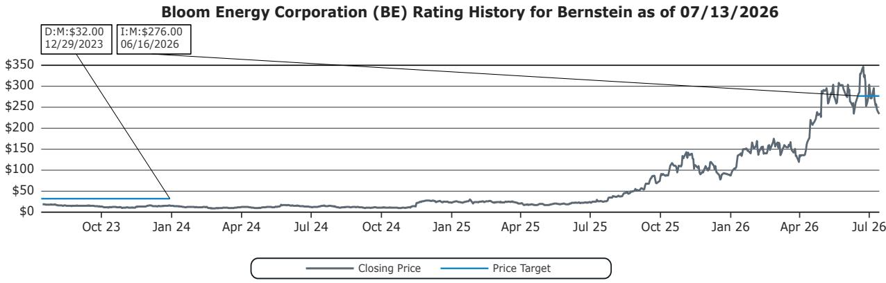
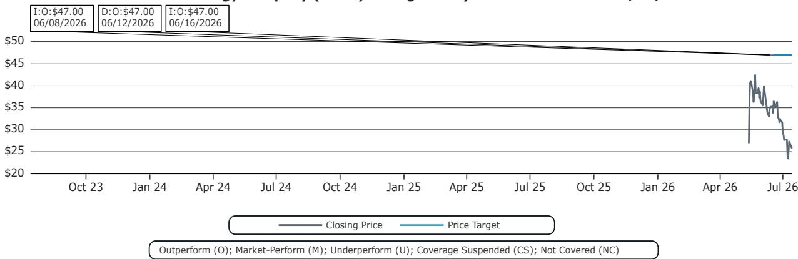
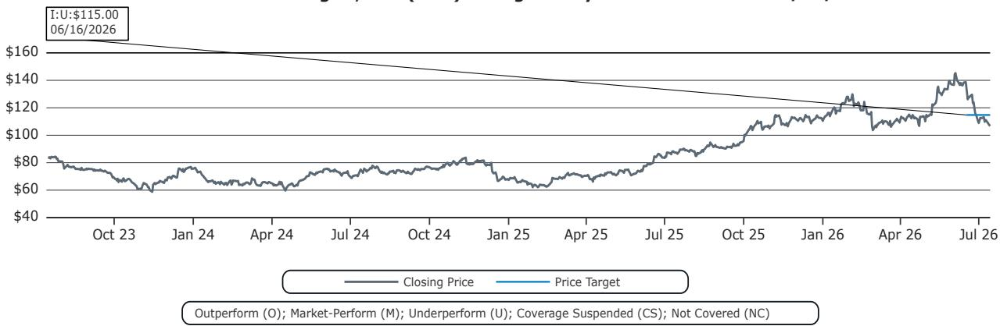

# Americas Energy & Transition

## Americas Power & Energy Transition: Paying for speed vs. scale - The BTM/FTM/BYOG Framework for BE, FRVO, and ORA's Hyperscaler Deals

  
Sunaina Ocalan
.+1 917 344 8503
sunaina.ocalan@bernsteinsg.com

Anshika Bajpai

+1 917 344 8306

anshika.bajpai@bernsteinsg.com

Raphael Lee
+1 917 344 8355
raphael.lee@bernsteinsg.com

- BE, FRVO, and ORA now all have live, named hyperscaler or utility-anchored deals, but they sit in three structurally different boxes: Bloom is true behind-the-meter (BTM, zero interconnection exposure, ~90-day deployment); Ormat and most of Fervo's contracted volume are front-of-meter (FTM, grid-delivered, still queue-exposed); and Bloom's AEP deal is a third, hybrid category — utility-financed onsite generation ("BYOG") that could scale further than either pure model.

- Bloom wins on speed and optionality —55- 90 days vs. 3–8 years for standard interconnection — but pays for it: illustrative LCOE of $85–115/MWh driven by natural gas fuel exposure and a recurring stack-replacement cost.

- Fervo's economics are a bet on its learning curve: Cape Station 1 wells were at ~$7,000/kW, with the holy grail is hitting its stated $3,000/kW target — which would make FTM geothermal cost-competitive with BTM fuel cells without the fuel-price exposure.

- Ormat is the smallest, lowest-risk mover — brownfield uprate-style economics on existing geothermal assets — but its NV Energy Clean Transition Tariff deals are capped by resource availability (13–150 MW), not technology cost, and we don’t think will scale to gigawatt volumes the way Bloom or Fervo can.

As PJM, ERCOT, and FERC push interconnection reform (fast-track cycles, Order 2023, Batch Zero), the queue-bypass premium BTM currently commands should compress over the back half of this decade.

## BERNSTEIN TICKER TABLE

<table><tr><td rowspan="2"></td><td colspan="4">10 Jul 2026</td><td>TTM</td><td colspan="4">Reported EPS</td><td colspan="3">Reported P/E (x)</td></tr><tr><td colspan="2"></td><td rowspan="2">Closing Price</td><td rowspan="2">Price Target</td><td rowspan="2">Rel. Perf.</td><td rowspan="2">Cur</td><td rowspan="2">2025A</td><td rowspan="2">2026E</td><td rowspan="2">2027E</td><td rowspan="2">2025A</td><td rowspan="2">2026E</td><td rowspan="2">2027E</td></tr><tr><td>Ticker</td><td>Rating</td><td>Cur</td></tr><tr><td>BE (Bloom Energy)</td><td>M</td><td>USD</td><td>244.61</td><td>276.00</td><td>843.0%</td><td>USD</td><td>0.82</td><td>2.30</td><td>4.27</td><td>296.9</td><td>106.2</td><td>57.3</td></tr><tr><td>FRVO (Fervo)</td><td>O</td><td>USD</td><td>27.13</td><td>47.00</td><td>NA</td><td>USD</td><td>(0.25)</td><td>(0.10)</td><td>(0.16)</td><td>(109.2)</td><td>(277.2)</td><td>(172.3)</td></tr><tr><td>ORA (Ormat Technologies)</td><td>U</td><td>USD</td><td>109.77</td><td>115.00</td><td>4.9%</td><td>USD</td><td>2.02</td><td>2.26</td><td>2.48</td><td>54.4</td><td>48.5</td><td>44.2</td></tr><tr><td>SPX</td><td></td><td></td><td>7,515.34</td><td></td><td></td><td></td><td></td><td></td><td></td><td></td><td></td><td></td></tr></table>

O - Outperform, M - Market-Perform, U - Underperform, NR - Not Rated, CS - Coverage Suspended

BE estimate is Adjusted EPS; BE valuation is Adjusted P/E (x);

Source: Bloomberg, Bernstein estimates and analysis.

## INVESTMENT IMPLICATIONS

We are Market-Perform on Bloom, Outperform on Fervo, and Underperform on Ormat

## DETAILS

## 1. THE FRAMEWORK

Three structurally distinct models are now competing for the same hyperscaler capital, and the distinctions matter more than the shared "data center power" label suggests.

EXHIBIT 1: Different models of powering up

<table><tr><td>Model</td><td>Definition</td><td>Interconnection exposure</td><td>Representative deal</td><td>Typical speed</td></tr><tr><td>BTM (behind-the-meter)</td><td>Generation sited and consumed on the customer's side of the utility meter; the utility interconnection process for that load is bypassed entirely.</td><td>None for the covered load — no generation or large-load interconnection queue involved.</td><td>Bloom/Oracle Project Jupiter — up to 2.8 GW MSA, full onsite power for the New Mexico AI campus.</td><td>~55-90 days from order to energized (Bloom's stated figure).</td></tr><tr><td>FTM (front-of-meter)</td><td>Generation interconnects to the grid and sells through a utility or ISO; the customer's load is served via a PPA sleeve, not a direct wire.</td><td>Full generation-interconnection queue exposure, plus transmission/delivery risk to the load.</td><td>Ormat/Switch Salt Wells (13 MW); Ormat/Google NV Energy portfolio (150 MW); most of Fervo's SCE and NV Energy contracted volume.</td><td>2-4+ years from contract to energized power, even under expedited tariff structures.</td></tr><tr><td>BYOG (hybrid) ("bring your own generation")</td><td>Utility contracts for and finances dedicated onsite/near-site generation to serve a large load its own grid capacity cannot accommodate — capital sits on the utility's books, physically resembles BTM.</td><td>Utility-managed; avoids the large-load queue but the utility itself absorbs project and fuel-supply risk.</td><td>Bloom/AEP — $2.65B, up to 1 GW, 20-year offtake, announced Jan. 2026.</td><td>Faster than standard interconnection; slower than pure BTM given utility procurement processes.</td></tr></table>

## Source: Bernstein Analysis, Company filings

BTM revenue is largely insulated from the interconnection crisis that is otherwise the sector's central bottleneck (see prior notes on PJM capacity auctions and the interconnection queue). FTM revenue is not — it is simply competing for the same constrained queue slots as everyone else, with a corporate offtaker's name attached. BYOG is the wildcard: it turns the utility itself into the entity racing the queue on the customer's behalf, which is a different risk profile (utility credit, utility execution) than either pure model.

EXHIBIT 2: Speed to Power: BTM vs. FTM, vs. the last standard nuclear plant built in the US for reference  
  
Source: Bernstein Analysis, Company filings, Deal announcements for Bloom

## 2. WHERE BE, FRVO, AND ORA SIT

## Bloom Energy – BTM plus a new BYOG wrinkle

Bloom's ~2.8 GW Oracle master services agreement (April 2026, 1.2 GW already contracted for 2026–2027 delivery) is textbook BTM: fuel cells sited at Oracle's Project Jupiter campus, DC-coupled via Bloom's native 800V DC architecture directly into IT racks, bypassing both the AC/DC conversion stack and the grid interconnection process for that load. The January 2026 AEP agreement ($2.65B, up to 1 GW, 20-year offtake) is a different animal: AEP is contracting for Bloom capacity to serve large loads its own grid cannot accommodate quickly enough. The generation is still physically onsite/near-site, but the offtake counterparty is a utility, not the end customer — a hybrid structure with the utility bearing the credit and financing risk rather than the hyperscaler.

## Fervo Energy – FTM at scale, betting on the cost curve

Fervo's March 2026 Geothermal Framework Agreement with Google — up to 3 GW through 2033, with 1 GW prioritized in the first two years — is FTM: power is delivered through utility intermediaries (NV Energy, Southern California Edison) under conventional PPA structures, meaning every megawatt is still subject to generation-interconnection review even where NV Energy's Clean Transition Tariff is designed to streamline the commercial and regulatory path. Fervo's IPO filing discloses Cape Station is being built today at roughly $7,000/kW — competitive with nuclear, but more than three times the cost of a gas plant — with a stated target of cutting that to $3,000/kW through repeatable drilling and pad design.

## Ormat – the smallest, most de-risked mover

Ormat's two 2026 data center deals — the 13 MW Switch PPA at its existing Salt Wells plant (January 2026) and the up to 150 MW Google/NV Energy portfolio PPA (February 2026) — are also FTM, and notably conservative: Salt Wells is a brownfield upgrade to an already-interconnected facility, the geothermal equivalent of CEG's Braidwood/Byron uprate playbook rather than a greenfield EGS bet. Both deals run through NV Energy's Clean Transition Tariff and await PUCN approval (expected second half of 2026), with the Google portfolio not online until 2028–2030. Ormat is monetizing existing, de-risked assets at small scale.

EXHIBIT 3: Installed Capex - Fuel cells vs. EGS vs. gas or nuclear for reference  
  
Source: Bernstein Analysis, Fervo S1 filing, Lazard LCOE 2025

## 3. ILLUSTRATIVE ECONOMICS: PAYING FOR SPEED VS. PAYING FOR SCALE

Bloom's installed cost runs $3,100–4,000/kW pre-incentive, falling to roughly $2,200–2,800/kW after the restored Section 48E investment tax credit (30%, technology-neutral, in effect through 2033). Layering in natural gas fuel cost (running ~10% above a combined-cycle plant given Bloom's ~54% electrical efficiency, close to CCGT heat rates) and a recurring stack-replacement reserve (roughly $1,000/kW every five - seven years, about 30% of system cost), an illustrative LCOE lands in the $82–115/MWh range — pre- vs. post-ITC. That is a real premium to grid wholesale power in most markets, and Bloom's own pitch is explicit that the value proposition is speed and reliability (up to five-nines availability), not lowest-cost energy.

Fervo's math is the mirror image. At today's ~$7,000/kW, Cape Station's illustrative LCOE is comparable to Bloom's — roughly $92–112/MWh — but with no fuel-price exposure and a resource that doesn't degrade. If Fervo hits its stated $3,000/kW target, that LCOE compresses to roughly $48–60/MWh, cheaper than Bloom's post-ITC case and competitive with new gas. Cape Station Phase I is Fervo's first commercial-scale project, and the company has to demonstrate the learning curve. Ormat's brownfield economics are directionally the cheapest of the three (existing infrastructure, no new wells), but the model doesn't scale the way Fervo's repeatable GeoBlock design is designed to.

EXHIBIT 4: Directional LCOE for Fuel Cells and EGS  
  
Source: Bernstein Analysis, Lazard LCOE 2025

## 4. WHO ACTUALLY WINS THE QUEUE-BYPASS RACE?

Short-run (2026–2028 delivery): Bloom. The gap between a 90-day BTM deployment and a 3–4-year FTM interconnection wait for even the most privileged data center projects in PJM and ERCOT is the whole story. Hyperscalers with near-term capacity gaps — Oracle's Project Jupiter is the clearest example — have no substitute for BTM at this horizon, and AEP's willingness to underwrite Bloom capacity as a utility-financed BYOG asset suggests utilities themselves are starting to view onsite generation as a capacity-planning tool rather than a customer workaround.

Medium-run (2028–2033 delivery): If Fervo can demonstrate EGS at scale at $3,000/KW, FTM geothermal becomes both cheaper than BTM fuel cells and free of fuel-price risk, which should pull incremental hyperscaler capital toward Fervo on any deal with a delivery date past 2028 — provided the interconnection queue for that specific project clears on schedule, which is the load-bearing assumption Google's Nevada 115 MW deal (targeting 2030) and the broader Google GFA are making. Ormat's brownfield model wins on risk-adjusted terms but is structurally capped by how many uprate-able geothermal assets actually exist near data center clusters — in our view, it is a scarce, not a scalable, source of supply.

Structural risk to the entire BTM premium: interconnection reform is a real, funded policy priority — PJM's fast-track cycles, FERC Order 2023 cluster studies, and ERCOT's Batch Zero process are all explicitly aimed at cutting queue times. If any of these reforms bite meaningfully before 2030, the speed premium that justifies Bloom's $82–115/MWh over FTM alternatives narrows, and premium should flow toward whichever FTM name has the better underlying cost curve — which, on current disclosures, points to Fervo if it executes.

## 5. RISK AND CATALYSTS

<table><tr><td>Risk</td><td>Detail</td><td>Why it matters</td></tr><tr><td>Bloom's gas-price and 45V exposure</td><td>BTM LCOE is directly geared to natural gas prices; hydrogen fuel-flexibility optionality depends on 45V credit economics that remain a smaller, less certain lever than the 48E ITC.</td><td>A sustained rise in gas prices would erode Bloom's cost advantage relative to grid power in exactly the markets where hyperscalers have the most FTM alternatives.</td></tr><tr><td>Fervo's journey ahead</td><td>Cape Station Phase I is Fervo's first commercial-scale project; the $3,000/kW target is a company target that needs to be achieved when EGS gets to scale</td><td>If Fervo's cost curve stall, the medium-run "FTM wins" case for geothermal weakens and BTM's premium continues.</td></tr><tr><td>Interconnection reform pace</td><td>PJM fast-track, FERC Order 2023, and ERCOT Batch Zero are all designed to cut queue times but are early in implementation.</td><td>Faster-than-expected reform compresses BTM's speed premium; slower-than-expected reform extends Bloom's runway and the case for further utility BYOG deals.</td></tr><tr><td>48E ITC and tax-credit transferability</td><td>Bloom's post-ITC economics depend on continued 48E availability and monetization mechanics (direct pay, transferability) remaining intact.</td><td>Any legislative or IRS-guidance change to 48E treatment would move Bloom's illustrative LCOE back toward the pre-incentive end of the range.</td></tr></table>

## BOTTOM LINE

BE, FRVO, and ORA are not really competing in the same race. Bloom is selling speed and is priced accordingly; Ormat is selling low-risk incrementalism on a resource base that we don't believe lends itself to scale (unless they crack the EGS puzzle); Fervo is the only one of the three underwriting a cost-curve bet, and it is the name most exposed to execution risk and most rewarded if that bet pays off. For a coverage universe organized around "who wins the interconnection bypass," the honest answer is that Bloom wins today, Fervo wins the argument if Cape Station's cost curve proves out by 2028, and Ormat wins on risk-adjusted return without ever needing to be the largest name in the room. We'd treat Fervo's Phase I commissioning (Q4 2026 target) and any updated cost disclosure toward its $3,000/kW target as the single highest-signal near-term catalyst for the FTM side of this framework.

## I. REQUIRED DISCLOSURES

References to "Bernstein" or the "Firm" in these disclosures relate to the following entities: Bernstein Institutional Services LLC (April 1, 2024 onwards), Bernstein & Co., LLC (pre April 1, 2024), Bernstein Autonomous LLP, BSG France S.A. (April 1, 2024 onwards), Bernstein (Hong Kong) Limited 盛博香港有限公司, Bernstein (Canada) Limited, Bernstein (India) Private Limited (SEBI registration no. INH000006378), Bernstein (Singapore) Private Limited, Bernstein Japan KK (サンフォード・C・バーンスタイン株式会社) and analysts employed by SG Africa Technologies & Services to produce Bernstein under a Global Services Agreement in place between Bernstein and SG.

Bernstein is part of a joint venture between SG (SG) and AllianceBernstein, L.P. (AB). Unless specifically noted otherwise, for purposes of these disclosures, references to Bernstein's “affiliates” relate to both SG and AB and their respective affiliates.

## VALUATION METHODOLOGY

## Bloom Energy Corporation

We reach our target price of $276/sh by applying a 11x revenue multiple on 2027-28 estimated revenue of $6.9B.

## Fervo Energy Company

EV to EBITDA. We use 2035 Adjusted EBITDA and an EV/EBITDA multiple of 10.5x and discount it back to 2027 for a price target of $47

## Ormat Technologies, Inc.

We use a 14.5x multiple on 2027-28 estimated adjusted EBITDA of $658MM to arrive at our target price of $115/sh.

## RISKS

## Bloom Energy Corporation

Key downside risks to our price target include grid upgrades limiting demand for Bloom's onsite power solution, and lower than expected data center demand. Higher than expected demand for onsite power and contracting activity are upside risks.

## Fervo Energy Company

Downside risks to our price target include: Lack of power demand growth, or weaker than anticipated power prices for future PPAs Competing technologies → Fuel cells, Solar plus battery storage Permitting challenges and changes to overall government support Unexpected operational challenges as phase I project ramps Capital project over runs on future phases Inability to drive down future project costs Heat transfer/ faster than expected cooling

## Ormat Technologies, Inc.

Upside risks to our price target include 1) the inability of competitors to prove and scale enhanced geothermal technology; 2) greater than anticipating PPA contracting for behind the meter power with hyperscalers for the long term; 3) the development and commercialization of EGS by Ormat themselves before competitors; and 4) significant upside from storage margins if key electricity markets get further constrained.

## RATINGS DEFINITIONS, BENCHMARKS AND DISTRIBUTION

## EQUITY RATINGS DEFINITIONS

## Bernstein brand

The Bernstein brand rates stocks based on forecasts of relative performance for the next 12 months versus the S&P 500 for stocks listed on the U.S. and Canadian exchanges, versus the Bloomberg Europe Developed Markets Large and Mid Cap Price Return Index EUR (EDME) for stocks listed on the European exchanges and emerging markets exchanges outside of the Asia

Pacific region, versus the Bloomberg Japan Large and Mid Cap Price Return Index USD (JPL) for stocks listed on the Japanese exchanges, and versus the Bloomberg Asia ex-Japan Large and Mid Cap Price Return Index (ASIAX) for stocks listed on the Asian (ex-Japan) exchanges -unless otherwise specified.

The Bernstein brand has three categories of ratings:

- Outperform: Stock will outpace the market index by more than 15 pp

• Market-Perform: Stock will perform in line with the market index to within +/-15 pp

• Underperform: Stock will trail the performance of the market index by more than 15 pp

Coverage Suspended: Coverage of a company under the Bernstein brand has been suspended. Ratings and price targets are suspended temporarily, are no longer current, and should therefore not be relied upon.

Not Rated: A rating assigned when the stock cannot be accurately valued, or the performance of the company accurately predicted, at the present time. The covering analyst may continue to publish research reports on the company to update investors on events and developments.

Not Covered (NC) denotes companies that are not under coverage.

Bernstein brand stock ratings are based on a 12-month time horizon.

## Autonomous brand – common stocks

The Autonomous brand rates common stocks as indicated below. As our benchmarks we use the Bloomberg Europe 600 Financials Price Return Index (E600BK) and Bloomberg Europe Dev Mkt Financials Large and Mid Cap Price Ret Index EUR (EDMFI) index for developed European banks and Payments, the Bloomberg Europe 600 Insurance Price Return Index (E600IN) for European insurers, the S&P 500 and S&P Financials for US banks and Payments coverage, S5LIFE for US Insurance, the S&P Insurance Select Industry (SPSIINS) for US Non-Life Insurers coverage, and the Bloomberg Emerging Markets Financials Large, Mid and Small Cap Price Return Index (EMLSF) for emerging market banks and insurers and Payments. Ratings are stated relative to the sector (not the market).

The Autonomous brand has three categories of common stock ratings:

- Outperform (OP): Stock will outpace the relevant index by more than 10 pp

- Neutral (N): Stock will perform in line with the market index to within +/-10 pp

• Underperform (UP): Stock will trail the performance of the relevant index by more than 10 pp

Coverage Suspended: Coverage of a company under the Autonomous research brand has been suspended. Ratings and price targets are suspended temporarily, are no longer current, and should therefore not be relied upon.

Not Rated: A rating assigned when the stock cannot be accurately valued, or the performance of the company accurately predicted, at the present time. The covering analyst may continue to publish research reports on the company to update investors on events and developments.

Those denoted as ‘Feature’ (e.g., Feature Outperform FOP, Feature Under Outperform FUP) are our core ideas.

Not Covered (NC) denotes companies that are not under coverage.

Autonomous brand common stock ratings are based on a 12-month time horizon.

## Autonomous brand – preferred stocks

The Autonomous brand has three categories of preferred stock ratings:

- Outperform (OP): The total return of the preferred instrument is expected to outperform preferred securities of other issuers operating in similar sectors or rating categories over the next six months.

- Neutral (N): The total return of the preferred instrument is expected to perform in line with preferred securities of other issuers operating in similar sectors or rating categories over the next six months.

- Underperform (UP): The total return of the preferred instrument is expected to underperform preferred securities of other issuers operating in similar sectors or rating categories over the next six months.

Autonomous preferred stock ratings are based on a 6-month time horizon.

## AUTONOMOUS CREDIT RESEARCH

Where this report contains investment recommendations for credit instruments, as defined in article 3(1)(35) of the Market Abuse Regulation, the information below is presented to comply with its disclosure requirements.

The report may also include reference(s) to published opinions by other Autonomous or Bernstein analysts covering the equity securities of the issuer(s) referenced herein. Please note an investment recommendation for credit instruments published by the author(s) of this report may differ from the published view of the analyst covering equity securities for the issuer(s) contained in this report and vice versa.

## CREDIT RATINGS DEFINITIONS

The Autonomous brand has three categories of credit ratings:

- Credit Outperform (C-OP): The total return of the Reference Credit Instrument is expected to outperform the credit spread of bonds of other issuers operating in similar sectors or rating categories over the next six months.

- Credit Neutral (C-N): The total return of the Reference Credit Instrument is expected to perform in line with the credit spread of bonds of other issuers operating in similar sectors or rating categories over the next six months.

- Credit Underperform (C-UP): The total return of the Reference Credit Instrument is expected to underperform the credit spread of bonds of other issuers operating in similar sectors or rating categories over the next six months.

Autonomous credit ratings are based on a 6-month time horizon.

A list of all investment recommendations produced by the author(s) of this report alongside credit ratings history are available upon request.

It is at the sole discretion of the Firm as to when to initiate, update and cease research coverage. The Firm has established, maintains and relies on information barriers to control the flow of information contained in one or more areas (i.e. the private side) within the Firm, and into other areas, units, groups or affiliates (i.e. public side) of the Firm

DISTRIBUTION OF EQUITY RATINGS/INVESTMENT BANKING SERVICES

<table><tr><td>Equity Rating</td><td>Market Abuse Regulation (MAR) and FINRA Rating Category</td><td>Global Rating Distribution</td><td>Investment Banking Relationships*</td></tr><tr><td>Outperform</td><td>BUY</td><td>51.2%</td><td>15.3%</td></tr><tr><td>Market-Perform (Bernstein Brand) Neutral (Autonomous Brand)</td><td>HOLD</td><td>35.8%</td><td>16.2%</td></tr><tr><td>Underperform</td><td>SELL</td><td>13.1%</td><td>13.6%</td></tr></table>

## PRICE CHARTS / RATINGS AND PRICE TARGET HISTORY

Outperform (O); Market-Perform (M); Underperform (U); Coverage Suspended (CS); Not Covered (NC)  

Fervo Energy Company (FRVO) Rating History for Bernstein as of 07/13/2026  

Ormat Technologies, Inc. (ORA) Rating History for Bernstein as of 07/13/2026  
  
All price target and closing price data in the chart(s) above are denominated in the currency noted in the Ticker Table of this report.

## CONFLICTS OF INTEREST

Bernstein Autonomous LLP or BSG France SA, beneficially, has either a net long or short position of 0.5% or more of the total issued share capital of a class of common equity securities of the following MiFID eligible securities: Bloom Energy Corporation.

SG and/or its affiliates beneficially own 0.5% or more of [the total issued share capital/any class of common equity securities] with a net [long/short] position of: Bloom Energy Corporation.

Bernstein and/or affiliates have received compensation for investment banking services in the past twelve months from Fervo Energy Company.

Bernstein has received compensation for non-investment banking securities-related products or services in the previous twelve months from the following clients: Fervo Energy Company.

Bernstein and/or affiliates expect to receive or intend to seek compensation for investment banking services in the next three months from Fervo Energy Company.

Certain affiliates of Bernstein act as market maker or liquidity provider in the equities securities of: Bloom Energy Corporation and Ormat Technologies, Inc..

Bernstein and/or affiliates had an investment banking client relationship during the past twelve months with Fervo Energy Company.

Affiliates of Bernstein managed or co-managed in the past twelve months a public offering of securities of Fervo Energy Company.

## OTHER MATTERS

The legal entity(ies) employing the analyst(s) listed in this report, and their location, can be determined by the country code of their phone number, as follows:

+1 Bernstein Institutional Services LLC; New York, New York, USA

+44 Bernstein Autonomous LLP; London UK

+212 SG Africa Technologies & Services; Casablanca, Morocco

+33 BSG France S.A.; Paris, France

+34 BSG France S.A.; Madrid, Spain

+41 Bernstein Autonomous LLP; Geneva, Switzerland

+49 BSG France S.A.; Frankfurt, Germany

+91 Bernstein (India) Private Limited; Mumbai, India

+852 Bernstein (Hong Kong) Limited 盛博香港有限公司; Hong Kong, China

+65 Bernstein (Singapore) Private Limited; Singapore

+81 Bernstein Japan KK; Tokyo, Japan

Where this report has been prepared by research analyst(s) employed by a non-US affiliate, such analyst(s), is/are (unless otherwise expressly noted below) not registered as associated persons of Bernstein Institutional Services LLC or any other SEC-registered broker-dealer and are not licensed or qualified as research analysts with FINRA. Accordingly, such analyst(s) may not be subject to FINRA's restrictions regarding (among other things) communications by research analysts with a subject company, interactions between research analysts and investment banking personnel, participation by research analysts in solicitation and marketing activities relating to investment banking transactions, public appearances by research analysts, and trading securities held by a research analyst account.

Where this report has been prepared by research analyst(s) employed by SG Africa Technologies & Services (part of the SG group of companies), it has been prepared on behalf of a Bernstein company under a Global Services Agreement in place between Bernstein and SG.

## CERTIFICATION

Each research analyst listed in this report, who is primarily responsible for the preparation of the content of this report, certifies that all of the views expressed in this publication accurately reflect that analyst's personal views about any and all of the subject securities or issuers and that no part of that analyst's compensation was, is, or will be, directly or indirectly, related to the specific recommendations or views in this publication.

## II. ADDITIONAL GLOBAL CONFLICT DISCLOSURES

It is at the sole discretion of the Firm as to when to initiate, update and cease research coverage. The Firm has established, maintains and relies on information barriers to control the flow of information contained in one or more areas (i.e., the private side) within the Firm, and into other areas, units, groups or affiliates (i.e., public side) of the Firm.

## III. OTHER IMPORTANT INFORMATION AND DISCLOSURES

Separate branding is maintained for “Bernstein” and “Autonomous” research products.

- Bernstein produces a number of different types of research products including, among others, fundamental analysis and quantitative analysis under both the “Autonomous” and “Bernstein” brands. Recommendations contained within one type of research product may differ from recommendations contained within other types of research products, whether as a result of differing time horizons, methodologies or otherwise. Furthermore, views or recommendations within a research product issued under one brand may differ from views or recommendations under the same type of research product issued under the other brand. The Research Ratings System for the two brands and other information related to those Rating Systems are included in the previous section.

- Autonomous operates as a separate business unit within the following entities: Bernstein Institutional Services LLC, Bernstein Autonomous LLP, Bernstein (Hong Kong) Limited 盛博香港有限公司 and Bernstein (India) Private Limited. For information relating to “Autonomous” branded products (including certain Sales materials) please visit: www.autonomous.com. For information relating to Bernstein branded products please visit: www.bernsteinresearch.com.

Analysts are compensated based on aggregate contributions to the research franchise as measured by account penetration, productivity and proactivity of investment ideas. No analysts are compensated based on performance in, or contributions to, generating investment banking revenues.

This report has been produced by an independent analyst as defined in Article 3 (1)(34)(i) of EU 596/2014 Market Abuse Regulation (“MAR”) and the same article of MAR as it forms part of United Kingdom domestic law by virtue of the European Union (Withdrawal) Act 2018.

To our readers in the United States: Bernstein Institutional Services LLC, a broker-dealer registered with the U.S. Securities and Exchange Commission (“SEC”) and a member of the U.S. Financial Industry Regulatory Authority, Inc. (“FINRA”) is distributing this publication in the United States and accepts responsibility for its contents. Where this material contains an analysis of debt product(s), such material is intended only for institutional investors and is not subject to the US independence and disclosure standards applicable to debt research prepared for retail investors.

Bernstein Institutional Services LLC may act as principal for its own account or as agent for another person (including an affiliate) in sales or purchases of any security which is a subject of this report. This report does not purport to meet the objectives or needs of any specific individuals, entities or accounts.

To our readers in Canada: If this publication pertains to a Canadian domiciled company, it is being distributed in Canada by Bernstein (Canada) Limited, which is licensed and regulated by the Canadian Investment Regulatory Organization. If the publication pertains to a non-Canadian domiciled company, it is being distributed by Bernstein Institutional Services LLC, which is licensed and regulated by both the SEC and FINRA, into Canada under the International Dealers Exemption.

This document may not be passed onto any person in Canada unless that person qualifies as "permitted client" as defined in Section 1.1 of NI 31-103.

To our readers in Brazil: This report has been prepared by Bernstein Institutional Services LLC, and Banco BTG Pactual S.A. ("BTG") is responsible for the distribution of this report in Brazil.

To readers in the United Kingdom: This publication has been issued or approved for issue in the United Kingdom by Bernstein Autonomous LLP, authorised and regulated by the Financial Conduct Authority and located at 60 London Wall, London EC2M 5SH, +44 (0)20-7170-5000. Registered in England & Wales No OC343985.

This document is for distribution only to persons who (i) have professional experience in matters relating to investments falling within Article 19(5) of the Financial Services and Markets Act 2000 (Financial Promotion) Order 2005 (as amended, the “Financial Promotion Order”), (ii) are persons falling within Article 49(2)(a) to (d) (“high net worth companies, unincorporated associations, etc.”) of the Financial Promotion Order, (iii) are outside the United Kingdom, or (iv) are persons to whom an invitation or inducement to engage in investment activity (within the meaning of section 21 of the FSMA) in connection with the issue or sale of any securities may otherwise lawfully be communicated or caused to be communicated (all such persons together being referred to as “relevant persons”). This document is directed only at relevant persons and must not be acted on or relied on by persons who are not relevant persons. Any investment or investment activity to which this document relates is available only to relevant persons and will be engaged in only with relevant persons.

To our readers in the member states of the EEA: This publication is being distributed by BSG France SA, which is authorised and regulated by the Autorité de Contrôle Prudentiel et de Résolution (ACPR) and Autorité des Marchés Financiers (
