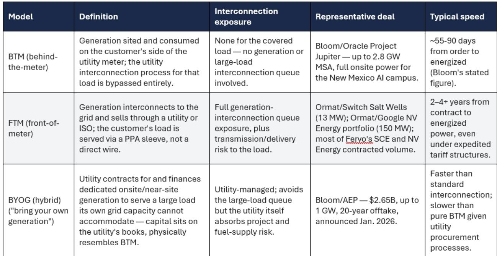
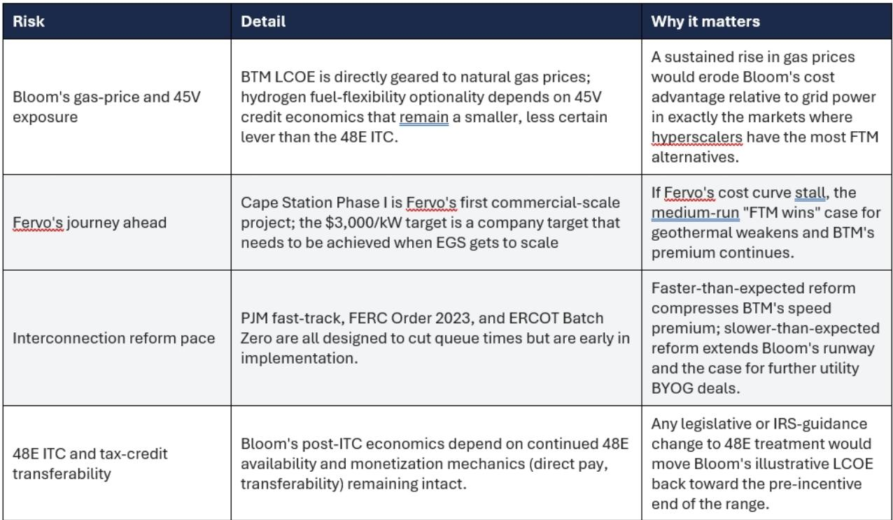

# Bernstein：美洲能源转型-为速度还是规模付费

美国数据中心电力需求的增长，正在催生一个结构性的供给缺口。传统电网扩容动辄三到八年，而超大规模客户需要的供电交付周期是按季度计算的。Bernstein最新一份研究，将Bloom Energy、Fervo Energy和Ormat Technologies这三家公司的数据中心供电合同，放进同一个分析框架——BTM（表后）、FTM（表前）和BYOG（自带发电）——并指出，这三家公司虽然都在为同一个客户群服务，但它们的商业模式、不确定性暴露和宏观环境回报路径完全不同。

Bloom Energy是目前相对少见能真正绕过电网互联瓶颈的公司。其与Oracle签署的约2.8 GW主服务协议，是典型的BTM模式：燃料电池直接部署在Oracle的Project Jupiter园区，通过Bloom自有的800V直流架构直接接入IT机架，完全绕过了交流/直流转换和电网互联流程。Bernstein的数据显示，从下单到通电，Bloom的典型交付周期是55到90天。相比之下，即便是最优先的数据中心项目，在PJM和ERCOT等市场走完标准互联流程也需要三到四年。

但速度是有代价的。Bernstein估算，Bloom的LCOE（平准化度电成本）在每兆瓦时82到115美元区间，这包含了天然气燃料成本和每五到七年约1000美元/千瓦的电池堆更换储备。这个价格显著高于多数市场的批发电价。Bloom的特点不是最便宜的电，而是最快的电和最可靠的供电（可达五个九的可用性）。

## 1. Fervo赌的是成本曲线，不是速度

Fervo今年3月与Google签署的地热框架协议——最高3 GW，2033年前交付，前两年优先1 GW——是标准的FTM模式。电力通过NV Energy和Southern California Edison等公用事业中间商以常规PPA结构交付，这意味着每一兆瓦仍需经过发电互联审查，即便NV Energy的清洁转型电价旨在简化商业和监管路径。

Bernstein指出，Fervo的Cape Station一期项目目前建设成本约为7000美元/千瓦，与核电相当，但超过天然气电站的三倍。公司设定的目标是，通过可重复的钻井和井场设计，将成本压缩至3000美元/千瓦。如果这一目标实现，Fervo的LCOE将从目前的约92-112美元/兆瓦时降至约48-60美元/兆瓦时，低于Bloom的税后成本，且没有燃料价格不确定性。

> **KC评论：** Bernstein的框架实际上在问一个关键问题：当互联改革（PJM快轨、FERC Order 2023、ERCOT Batch Zero）开始压缩BTM的速度溢价时，哪家公司的成本曲线能接住这个溢价？Fervo的3000美元/千瓦目标，是这个问题的核心变量。

## 2. Ormat走的是最小不确定性路线，但规模天花板明显

Ormat的两笔数据中心交易——1月与Switch签署的13 MW PPA（利用现有Salt Wells电站的褐地升级），以及2月与Google/NV Energy签署的150 MW组合PPA——同样是FTM模式，但风格保守。Salt Wells是对已互联设施的扩容升级，类似于CEG的Braidwood/Byron升级策略，而非绿地EGS（增强型地热系统）赌注。两笔交易均通过NV Energy的清洁转型电价执行，尚待PUCN批准（预计2026年下半年），Google组合项目要到2028-2030年才能上线。

Bernstein认为，Ormat的褐地宏观环境性是三家中最便宜的——利用现有基础设施，无需新钻井——但这一模式受限于可升级地热资产的地理分布。在数据中心集群附近，这样的资产数量有限。Ormat是稀缺供给，而非可规模化供给。

## 3. BYOG模式：一个可能改变格局的混合体

Bloom今年1月与美国电力公司（AEP）签署的26.5亿美元、最高1 GW、20年期购电协议，代表了一个新类别——BYOG。AEP以公用事业身份为Bloom的发电容量付费，用于服务其电网无法快速容纳的大型负荷。发电设施仍位于用户侧或附近，但购电方是公用事业而非终端客户，信用和融资不确定性由公用事业承担。

Bernstein认为，BYOG模式可能比纯BTM或纯FTM都更具扩展性。AEP的参与表明，公用事业本身开始将现场发电视为容量规划工具，而非客户规避电网的手段。如果更多公用事业效仿，Bloom的潜在市场将从超大规模客户扩展到整个公用事业容量规划领域。

## 4. 互联改革的节奏，是决定谁赢的关键变量

Bernstein在报告中明确了一个结构性不确定性：PJM的快轨周期、FERC Order 2023的集群研究、ERCOT的Batch Zero流程，都旨在缩短互联排队时间。如果这些改革在2030年前取得实质性进展，BTM当前享有的速度溢价将收窄。届时，溢价将流向成本曲线更优的FTM玩家——按当前披露的信息，指向Fervo，前提是它能兑现成本目标。

短期（2026-2028年交付），Bloom是相对少见选择。中期（2028-2033年交付），如果Fervo能证明EGS在3000美元/千瓦成本下的可规模化，FTM地热将同时具备成本优势和燃料价格免疫性。Ormat在不确定性调整后的回报上胜出，但永远不需要成为房间里最大的名字。

Bernstein将Fervo的Cape Station一期投产（目标2026年第四季度）及其成本披露，视为FTM侧最重要的近期催化剂。

For informational purposes only. Portions may be generated,translated,summarized,or edited with AI assistance based on source materials and may contain omissions or errors. Please verify independently. This is not investment,legal,tax,accounting,or other professional advice.

For informational purposes only. Portions may be generated,translated,summarized,or edited with AI assistance based on source materials and may contain omissions or errors. Please verify independently. This is not investment,legal,tax,accounting,or other professional advice.

