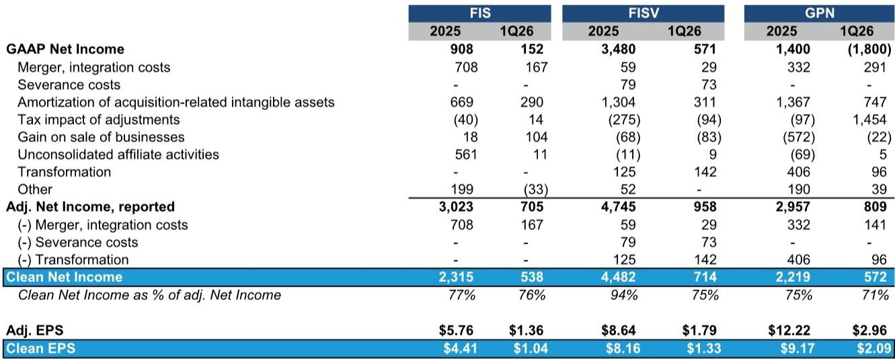
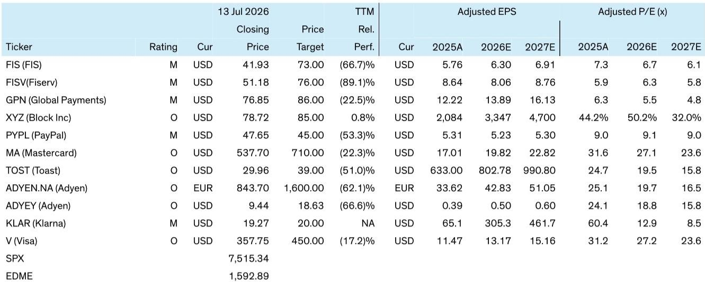
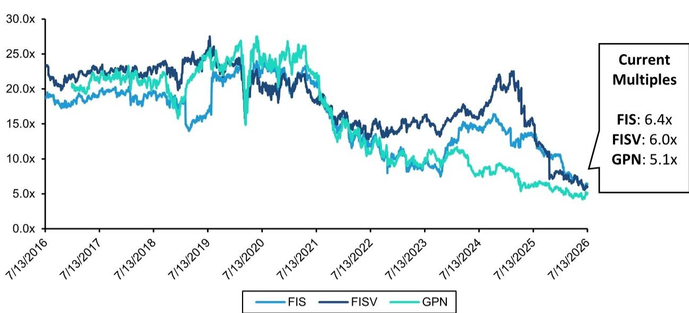

# 支付处理行业的真实估值差距：为何看似极低的市盈率掩盖了更昂贵的现实

美国三家最大的支付处理公司——FIS、Fiserv和Global Payments——目前基于未来十二个月盈利的估值倍数分别为6.4倍、6.0倍和5.1倍，接近各自公司历史最低水平。对于普通观察者而言，这些倍数似乎暗示着一个被定价为不可逆转衰退的困境行业，一个愿意押注转机的潜在深度价值机会。但这种表面解读具有危险的片面性。当构成这些倍数的盈利经过经常性加回项目（如转型成本、整合费用和人为偏低的税率）调整后，真实估值图景会偏移数个倍数。以干净的EV/NOPAT（企业价值/税后净营业利润）为基础，FIS 2026年预估倍数为14.3倍，Fiserv为10.8倍，Global Payments为11.3倍。报告倍数与干净倍数之间的差距并非会计上的趣闻；它是读者在做出任何配置决策前必须面对的核心战略事实。

当前时点之所以重要，是因为支付处理行业正同时承受结构性压力：有机增长放缓、借记卡交换费监管不确定性，以及一波大规模并购导致资产负债表负债累累。在这种环境下，依赖非GAAP盈利作为估值锚点不仅不精确，而且具有误导性。这些公司自身已扩大了“调整后”的定义，将既非非经常性、也非真正超出常规经营范围的费用纳入其中。转型计划、平台现代化和组织重组已成为成本结构的永久特征。读者需要回答的问题不是这些股票在表面数字上是否便宜，而是在考虑杠杆和正常化税收后，干净的盈利能力能否支撑当前的企业价值。

## 报告盈利与干净盈利之间的差距持续且显著，平均占调整后净利润的20-30%

衡量盈利质量问题最直接的方法，是将报告的非GAAP净利润与剔除未通过真正非经常性测试项目的干净版本进行比较。对于FIS，干净净利润占调整后净利润的比例在2025年全年为77%，2026年第一季度为76%。Global Payments的相应数字分别为75%和71%。Fiserv在全年指标上表现较好，达到94%，但该数字在2026年第一季度骤降至75%，原因是与转型相关的加回项目激增。模式很清晰：这些公司正在排除那些以足够规律性重复发生、应被视为持续经营一部分的成本。

这些调整的具体构成揭示了战略问题。Fiserv仅在2026年第一季度就加回了超过1.4亿美元的转型费用，与其“One Fiserv”计划相关。Global Payments在同一季度加回了9600万美元，用于其所谓的“Genius构建重组”，尽管报告指出这是一个更长期的加回项目，涵盖持续的内部转型和上市策略调整。FIS一直在加回企业转型和平台现代化费用，2024年为2.62亿美元，2025年为1.57亿美元，2026年第一季度为9300万美元。这些并非一次性事件。它们是管理层选择归类为调整项的结构性投资，从而抬高了报告的每股盈利。

对读者而言，含义很直接：一只以6倍非GAAP盈利交易的股票，如果其中25%的盈利来自无法无限期持续的加回项目，那么它不一定是便宜货。干净的倍数是评估商业模式是否能在所用资本上产生足够回报的更相关指标。

## 偏低的调整后税率进一步扭曲了报告倍数，不能简单照单全收

第二个较少被讨论的盈利膨胀来源是这些公司应用于其非GAAP结果的调整后税率。例如，FIS预计2026年调整后税率约为12%，2027年为13%。这些税率远低于美国法定公司税率21%，也远低于大多数大型、以国内业务为主的公司的实际税率。报告直接质疑了这些低税率的可持续性，而答案对估值具有实质性影响。

当使用正常化的20%税率而非公司报告的调整后税率计算干净的NOPAT时，得出的倍数会向上移动。以2026年为例，FIS从非GAAP市盈率6.7倍变为干净的EV/NOPAT 14.3倍。Global Payments从5.6倍变为11.3倍。仅税率假设就占了差距的很大一部分。接受公司提供的调整后税率而不加审视的读者，实际上是在假设推动低税率的税收优惠——无论是来自股票薪酬、海外收入结构还是历史亏损结转——将无限期持续。这一假设是激进的，尤其是在监管机构对企业避税行为审查日益严格，且这些公司自身产生的国内收入份额不断增长、更不易进行税收优化的背景下。

战略启示是，该行业的估值分析必须将税收假设视为一个需进行敏感性分析的变量，而非固定输入。假设正常化税率的读者，将对这些股票是否为所承担风险提供了足够补偿得出截然不同的看法。

## 自由现金流转化率远低于调整后盈利，引发对资本配置能力的质疑

报告盈利与干净盈利之间的差距，因自由现金流转化率的持续不足而进一步加剧。2025年全年，干净自由现金流占调整后净利润的比例，FIS为53%，Fiserv为90%，Global Payments为67%。2026年第一季度的情况更具揭示性：Fiserv仅将12%的调整后净利润转化为干净自由现金流，而Global Payments则出现了负50%的负转化。即使在调整后基础上，三家公司的转化率均低于100%，这意味着报告的盈利并未完全转化为可用于减债、分红或股票回购的现金。

现金流疲弱对部分读者正在追求的股票回购逻辑有直接影响。Global Payments已在执行积极的回购计划，报告估计到2027年底，Global Payments可能回购其现有市值约30%的股份。然而，FIS和Fiserv面临不同的约束：两家公司都处于近期收购后的去杠杆过程中。净债务与EBITDA比率仍然较高，在这些比率降至令评级机构和银行监管机构满意的水平之前，有意义的回购并不可行。报告明确指出，读者可能需要等待更长时间才能看到FIS和Fiserv大规模返还资本。

这在该群体内部造成了战略分化。Global Payments可以利用其现金流和资产负债表能力积极减少股份数量，这即使经营表现平平，也能为每股盈利提供机械性提升。FIS和Fiserv则无法做到这一点，这意味着它们的股权回报将更依赖于有机收入增长和利润率扩张——在当前环境下，这两者都更难实现。因此，股票回购叙事在这三家公司中并不均衡，将它们视为同质群体的读者可能高估了FIS和Fiserv的近期回报潜力。

## 评估支付处理公司的决策框架：盈利质量与资本回报的三项测试

鉴于调整的复杂性和公司间的差异，读者需要一种结构化的方法来评估这些股票，而非依赖表面倍数。以下框架将分析提炼为三个顺序测试。

首先，计算干净盈利：从报告的非GAAP净利润开始，减去所有转型成本、重组费用、交易后第一年之后的并购整合费用，以及任何已连续出现至少三个季度的其他调整项。对得出的干净营业利润应用20%的正常化税率，以得到干净的NOPAT。这是应用于估值的盈利基础，而非管理层报告的非GAAP数字。

其次，将干净自由现金流与干净净利润进行比较。如果转化率持续低于70%，则意味着业务相对于其报告盈利正在消耗现金，这限制了任何分红或回购承诺的可信度。2026年第一季度的数据表明，三家公司均在不同程度上未通过此测试，其中Fiserv和Global Payments的转化率尤其疲弱。

第三，评估资本回报的资产负债表能力。在干净基础上计算净债务与EBITDA的比率，并将其与公司设定的目标进行比较。如果公司仍在去杠杆，如FIS和Fiserv，则假设至少未来12至18个月内回购将非常有限。如果公司已达到目标杠杆区间，如Global Payments似乎已做到，那么回购潜力是真实的，但必须对照为其提供资金的现金流的可持续性进行评估。

将这一框架应用于三家公司，可以揭示一个清晰的层级。Global Payments提供了最具吸引力的近期回购故事，但其干净盈利质量在群体中最弱，且第一季度干净自由现金流为负。Fiserv全年干净盈利占报告盈利的比例最高，但第一季度盈利质量和自由现金流转化率的恶化发出了警示信号。FIS在报告盈利与干净盈利之间的差距最大，自由现金流转化率最低，资产负债表约束较强，使其在风险调整基础上吸引力最低，即使其表面倍数看似很低。

基本洞见是，这些股票并非普遍便宜。它们在管理层精心设计以显得有吸引力的指标上便宜，但一旦将经常性调整和税收假设正常化，它们便以公允至充分的估值交易。该行业可能仍为耐心资本提供机会，但这些机会要求读者愿意看穿非GAAP的表面数字，深入理解这些企业实际如何产生现金并部署现金的复杂现实。

*仅供参考。部分内容可能基于源材料通过AI辅助生成、翻译、总结或编辑，可能存在遗漏或错误。请独立核实。本文不构成投资、法律、税务、会计或其他专业建议。*

仅供参考。部分内容可能基于源材料通过AI辅助生成、翻译、总结或编辑，可能存在遗漏或错误。请独立核实。本文不构成投资、法律、税务、会计或其他专业建议。

