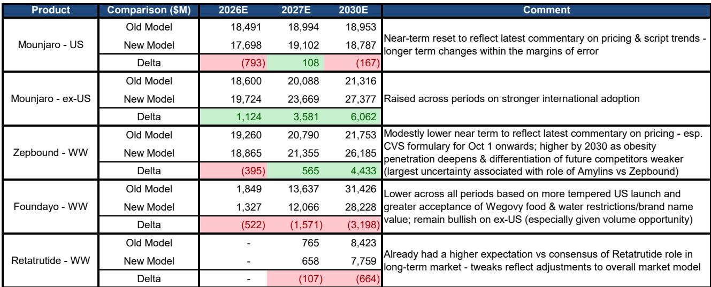
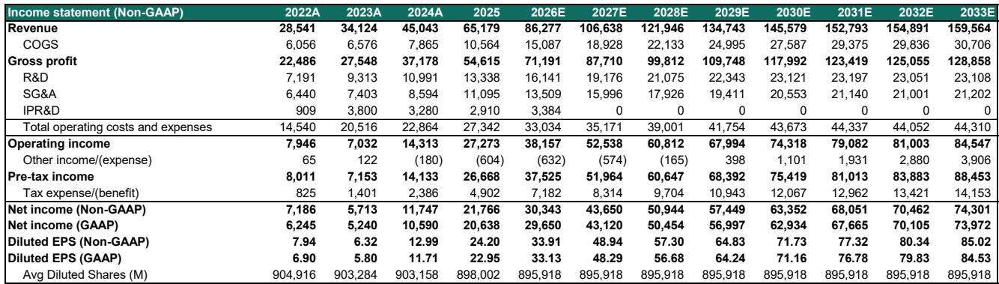
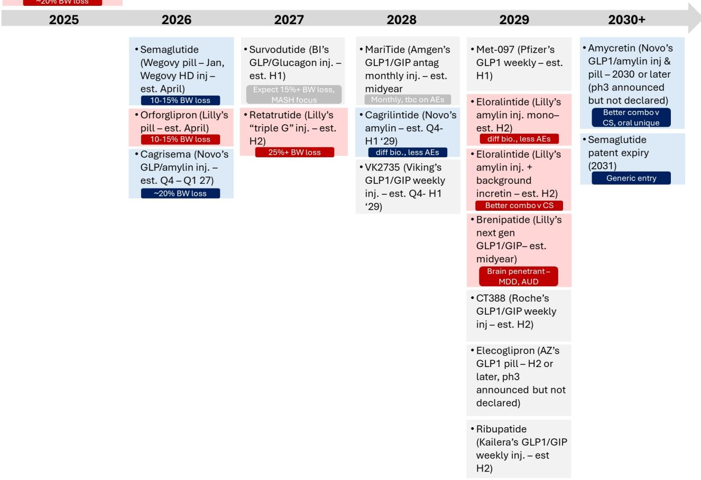

# Bernstein：礼来GLP-1市场模型与TRx渠道动态及长期TAM渗透

一份来自Bernstein的最新模型更新，将美国GLP-1市场的2031年总规模锚定在约1020亿美元，并认为礼来将占据其中约70%的价值。这个判断本身并不令人意外——礼来目前已是该领域的领导者。但真正值得关注的，是Bernstein在模型中埋下的几个结构性变量：口服药的市场天花板、医保覆盖的渗透节奏，以及专利悬崖后的市场重塑。

报告更新了从2026年到2035年的处方量和患者级模型，覆盖了2型糖尿病和肥胖/超重两大适应症。Bernstein估计，到2031年，约每两位2型糖尿病患者中就有一位在使用肠促胰素类药物（目前约为四分之一），而肥胖/超重人群的渗透率将从当前水平升至约23%。这意味着，未来五年的增长并非来自新适应症的突破，而是现有适应症内渗透率的持续加深。

## 1. 口服药不是颠覆者，但会在2029年达到22%的峰值

市场对口服GLP-1的期待一直很高，尤其是礼来的Foundayo（orforglipron）和诺和诺德的Wegovy口服版。Bernstein的模型给出了一个相对克制的判断：口服药的市场份额将在2029年达到约22%的峰值，此后逐步回落。注射剂仍将长期占据约79%以上的市场价值。

这个判断背后有两个关键假设。其一，口服药的便利性优势会被疗效和依从性部分抵消——患者可能更倾向于每周一次的注射，而非每日口服。其二，Bernstein对Foundayo在美国的预期进行了下调，理由是“更温和的美国上市节奏”以及市场对Wegovy品牌价值和饮食限制的接受度。但值得注意的是，报告强调Foundayo约47%的2031年美国收入预测来自糖尿病适应症，而这一领域“被市场低估了”。

> **KC评论：** 口服药的市场份额峰值在2029年，这个时间点恰好与多个口服GLP-1产品的上市和爬坡周期重合。读者容易高估口服药对注射剂的替代速度，但Bernstein的模型提示，注射剂在疗效和患者粘性上的优势可能比想象中更持久。

## 2. 医保覆盖的“桥接”模式：2027年才是真正放量之年

2025年7月启动的BRIDGE模式，是Medicare首次将肥胖药物纳入覆盖范围。Bernstein对潜在受益人群（约1800万至2000万肥胖/超重患者）和支付价格（政府向制造商支付约245美元，患者自付约50美元）有较高置信度，但对渗透速度持谨慎态度。

报告明确指出，2026年的渗透率可能低于预期，2027年才是这一渠道的主要增长年份。原因在于，BRIDGE模式覆盖的是年龄更大、合并症更多的患者群体，他们的用药意愿和依从性存在不确定性。这个判断与市场对“医保放量即爆发”的乐观预期形成了对比。

## 3. 2031年专利悬崖之后，市场将进入“品牌差异化+订阅模式”的新阶段

Bernstein的模型延伸到了2031年之后——届时司美格鲁肽的美国专利将到期，仿制药以50至150美元的低价进入市场。报告认为，这将推动市场的“重大演变”，但并非简单的价格战。

关键在于，礼来等原研企业将如何维持品牌差异化。Bernstein提出了一个值得关注的假设：原研企业可能推出会员制或订阅模式，通过增强客户粘性来锁定患者对“广泛原研产品组合”的使用。这意味着，未来的竞争不仅是分子层面的，更是商业模式层面的。如果订阅模式成立，礼来凭借Mounjaro、Zepbound、Foundayo、Retatrutide等多产品组合，将拥有比单一产品竞争对手更强的议价能力。

## 4. 美国之外：被低估的增长引擎

报告对礼来国际市场的判断与市场共识存在显著分歧。Bernstein预计，Foundayo在2027年国际市场收入将达到71亿美元，而市场共识仅为19亿美元；2028年预计为117亿美元，共识为46亿美元。这个差距的核心逻辑是：国际市场渗透率仍处于“初级阶段”，且价格弹性更高。

目前，礼来在国际肠促胰素市场已占据53.2%的份额，且市场同比增长77%。Bernstein认为，随着Foundayo在2027年初进入多个市场，以及Mounjaro在国际市场的持续放量，礼来国际业务将保持两位数增长。到2033年，约40%的礼来肠促胰素收入将来自美国以外。

这个判断的不确定性在于，国际市场的数据透明度远低于美国，模型依赖IQVIA MIDAS数据和礼来自身的披露，存在较大误差空间。但报告认为，正是这种信息不对称，使得国际市场成为“被低估的增长来源”。

---

Bernstein的模型更新，本质上是在回答一个问题：当GLP-1市场从“爆发期”进入“渗透期”，哪些变量将决定赢家的最终份额？答案指向三个方向：口服药的真实替代率、医保覆盖的渗透节奏，以及专利到期后的商业模式创新。礼来目前在产品组合和商业能力上占据领先，但真正的考验在于，它能否在2027年之后，将规模优势转化为可持续的议价权和患者粘性。

For informational purposes only. Portions may be generated,translated,summarized,or edited with AI assistance based on source materials and may contain omissions or errors. Please verify independently. This is not investment,legal,tax,accounting,or other professional advice.

For informational purposes only. Portions may be generated,translated,summarized,or edited with AI assistance based on source materials and may contain omissions or errors. Please verify independently. This is not investment,legal,tax,accounting,or other professional advice.

