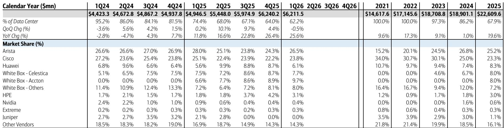
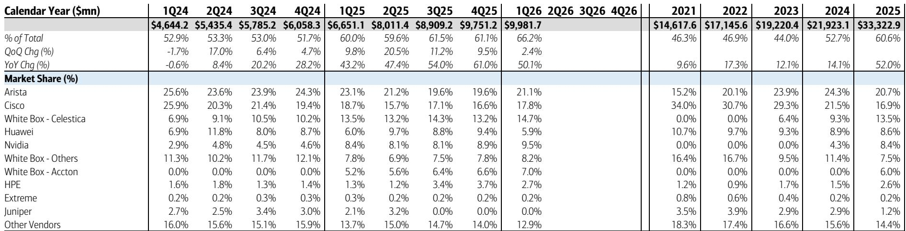
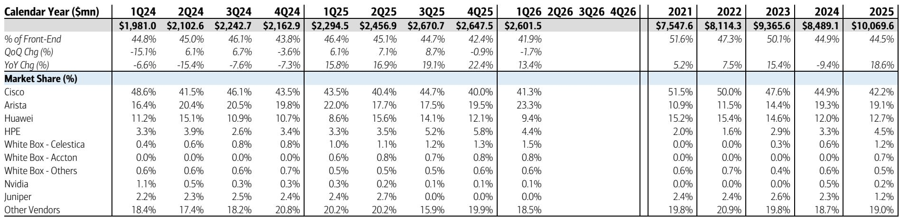

# AI基础设施投入正以超出多数人认知的速度重塑交换设备市场

2026年第一季度，交换设备市场同比增长36.1%，但这一整体数字背后隐藏的结构性变化，远比增长率本身更为重要。数据中心交换设备目前占整个市场的66%，而历史上这一比例约为45%。这一转变重新定义了哪些公司能够胜出、哪些技术至关重要，以及市场参与者应如何评估竞争格局。这并非周期性的上升，而是资本向AI基础设施的永久性重新配置，即便个别支出周期有所波动，这一趋势仍将持续。

最值得关注的数字并非数据中心交换设备50%的增长，而是这一增长的构成。AI后端交换设备同比增长121%，目前占数据中心总需求的38%，而一年前这一比例为26%。前端交换设备增速从去年的11.8%加速至25.6%，证实了AI建设正在拉动相邻网络层的需求。与此同时，园区交换设备——传统企业网络的核心——增长了15.1%，表现健康，但在超大规模企业资本支出预计2026年同比增长85%的市场中，其结构性意义相对有限。

结论清晰：交换设备市场如今已成为AI基础设施的故事主线。若将其视为多元化的网络设备行业，将误判变化的速度、赢家与风险。

## 超大规模企业的增长引擎正在加速而非见顶，并重塑供应商格局

前四大超大规模企业在第一季度占数据中心交换设备市场的41%，同比增长90.4%。作为对比，同一细分市场在2024年第一季度仅增长1.6%。这一加速并非一次性追赶，而是反映了向AI及非AI基础设施资本配置的有意且持续增加。前五大超大规模企业预计2026年资本支出同比增长85%，超过2025年已处于高位的72%增幅。

需求的集中带来了直接的竞争后果。赢得超大规模企业业务的供应商获得不成比例的收入增长，而依赖企业或园区市场的供应商则面临较慢的增长轨迹。数据实时印证了这一点。Arista以21.1%的份额领跑整体数据中心交换设备市场，较上一季度的19.6%有所上升。思科的数据中心份额从16.6%升至17.8%。间接服务超大规模企业需求的白牌制造商Celestica，其份额从13.2%增至14.7%。

这一模式并非随机。那些将产品路线图与超大规模企业需求——更高端口速度、开放架构及AI专用网络结构设计——对齐的供应商正在获得优势。而那些仍固守传统企业交换模式的供应商，则在市场增长最快的细分领域失去份额。

## 思科进入AI后端交换设备市场标志着竞争格局的关键转变

第一季度最令人意外的发展或许是思科成为AI后端交换设备领域的有力竞争者。思科在这一细分市场的份额从一年前的零增长至2026年第一季度的7.9%。更引人注目的是，在超大规模企业后端细分市场中，思科的份额达到13.2%，与Arista的13.2%和英伟达的13%持平。这主要归因于思科在Meta的800G叶交换机层的渗透。

这一发展之所以重要，原因有三。首先，它表明后端交换设备市场尚未定型。尽管英伟达在AI计算领域占据主导地位，Celestica在后端交换设备中以26.3%的份额领先，但拥有可靠技术和现有超大规模企业关系的新进入者仍有空间。其次，思科在Meta的成功表明，超大规模企业愿意实现后端交换设备供应商的多元化，随着它们寻求避免在关键网络层对单一供应商的依赖，这一趋势可能加速。第三，思科的进入给Arista和英伟达带来捍卫其地位的压力，可能导致更激进的定价或更快的产品周期。

更广泛的意义在于，后端交换设备市场尽管具有周期性特征，但并未显示出增长放缓的迹象。121%的同比增长由持续的AI数据中心建设驱动，而思科这样的大型现有企业的进入，验证了这一需求的规模与持续性。

## 前端交换设备增长超出隐含指引，可能带来意外上行

第一季度前端数据中心交换设备同比增长25.6%，较去年的11.8%增速大幅加快。这一细分市场处理通用数据中心流量而非AI专用工作负载，正受益于AI基础设施投资的溢出效应。当超大规模企业为AI建设新数据中心时，它们也会扩展连接这些设施与更广泛互联网及企业客户的前端网络。

前端增长的构成强化了这一解读。占前端需求32%的超大规模企业同比增长51%，高于2025年第一季度的25.2%增速。占前端需求42%的企业客户增长较为温和，为13.4%。超大规模企业的加速是主要驱动力。

这一趋势的战略重要性在于实际增长与隐含指引之间的差异。Arista对前端交换设备的隐含指引预计2026年无增长，但该细分市场仅第一季度就同比增长19.1%。这一差距表明，要么Arista刻意保守，要么市场整体表现超出预期。无论哪种情况，都为拥有前端业务的供应商创造了潜在上行空间，尤其是如果超大规模企业的建设势头持续。

## 园区交换设备正经历结构性升级周期，利好现有企业

园区交换设备虽不再是交换设备市场的增长引擎，但正显示出持久的复苏迹象。该细分市场第一季度同比增长15.1%，基础增长率估计为10-11%，远高于历史1-2%的水平。这一加速由产品推出和更新周期驱动，而非一次性追赶需求。

园区交换设备的竞争格局与数据中心截然不同。思科以53.5%的份额占据主导地位，其次是HPE的12.1%和Arista的3.3%。这些份额的稳定掩盖了一个重要催化剂：思科Catalyst 4000系列于2026年达到服务终止，Catalyst 6000系列将于2027年底达到服务终止。这些产品退役将迫使企业客户升级，鉴于思科庞大的安装基础，该公司有望抓住这一更新周期的大部分份额。

对于市场观察者而言，园区细分市场提供了不同类型的机遇。其增长速度慢于数据中心，但更具可预测性，升级周期更清晰，供应商关系更稳固。风险在于，园区交换设备占总市场的比例持续缩小，使其成为拥有多元化业务的公司相关性较低的增长驱动因素。

## 评估交换设备市场敞口的决策框架

交换设备市场已不再是一个单一行业。它是三个不同的子市场——AI后端、通用数据中心前端和园区——每个市场都有不同的增长率、竞争结构和研究意义。一个有用的框架涉及三个问题。

首先，公司对超大规模企业需求的敞口如何？超大规模企业敞口较高的公司，如Arista（数据中心份额21.1%）和Celestica（14.7%），受益于85%的资本支出增长轨迹。超大规模企业敞口较低的公司则面临结构性增长劣势。

其次，公司是否拥有可靠的AI后端交换设备技术？该细分市场121%的增长使其成为最具吸引力的子市场，但进入壁垒很高。Celestica的26.3%份额和英伟达的24.5%份额反映了它们的先发优势。然而，思科近期的进入表明市场并未封闭。

第三，公司的园区业务是面临更新周期利好还是份额侵蚀风险？思科53.5%的园区份额以及Catalyst服务终止事件创造了多年的升级机遇。园区份额较小的竞争对手则面临挑战，难以取代根深蒂固的现有企业。

这一框架解释了为何整体市场份额数据可能具有误导性。一家保持整体份额稳定的公司，可能在数据中心领域失利而在园区领域获胜，反之亦然。战略问题不在于供应商是赢是输，而在于何处以及为何。

*仅供参考。部分内容可能基于源材料通过AI辅助生成、翻译、总结或编辑，可能存在遗漏或错误。请独立核实。本文不构成任何专业建议。*

仅供参考。部分内容可能基于源材料通过AI辅助生成、翻译、总结或编辑，可能存在遗漏或错误。请独立核实。本文不构成任何专业建议。

