# 全球权益市场波动观察

## 个股波动与指数波动接近历史极端水平

随着美国权益市场各板块和因子持续剧烈波动，以及人工智能相关领域价格行为延续活跃态势，个股已实现波动率已升至接近上世纪90年代末互联网泡沫后期的水平，当前正值财报季。然而，指数波动率仍相对温和，这导致两者之间出现了历史性的分化。如果市场定价（不仅仅是价格行为）进一步向泡沫区域移动，这种分化可能继续扩大，甚至可能超越互联网泡沫时期的极端水平。这种显著分化的关键驱动因素是什么？简而言之，半导体板块。具体而言，MU和AMD等大型个股的不稳定性推高了个股波动率，而半导体板块与其他大型股和软件板块的相关性持续下降，使得指数层面的相关性降至接近历史低点，从而抑制了指数波动率。有趣的是，半导体板块波动率的上升及其与其他关键权益品种相关性的下降，与其BRI水平的上升同步发生。在此背景下，因相关性回升而导致指数波动率上升的风险在历史上显得尤为突出，尤其是在即将到来的权益市场季节性挑战期。为对冲这一风险，我们关注VIX看涨价差策略。

## SX5E与SXXP看跌期权切换策略：为欧洲周期性板块提供低成本对冲

近期SX5E隐含波动率的下降，使其与STOXX 600的波动率价差收窄至历史低位，隐含波动率价差目前已低于近期的已实现波动率价差。这也使得SX5E与SXXP看跌期权切换策略的成本降低，该策略目前暗示的"隐含贝塔"低于该指数经验观察到的周期性特征。鉴于SX5E在科技、非必需消费和工业等周期性板块的权重较高，看跌期权切换策略提供了一种相对低溢价的方式来对冲欧洲周期性板块的下行风险，尤其是在SX5E从历史高点回撤主要由工业和科技板块走弱驱动的情况下。

## 台积电财报前瞻与日经指数对冲成本优化

在台积电财报发布前，把握上行机会，同时控制下行风险。强劲的销售势头支持我们正面的基本面观点，但市场对人工智能资本支出相关担忧高度敏感，使得周四财报发布前的风险回报比显得不对称。我们建议将现金权益敞口转换为期权结构，该结构将下行风险限制在1.3%，同时保留显著的上行凸性。较高的上行波动率进一步支持看涨比率策略，特别是考虑到我们预期市场将呈现更有序的上涨，且事件后波动率将降低。另外，较高的波动率使得日经指数对冲成本昂贵，但丰富的下行波动率创造了将保护成本降低高达74%的机会。鉴于日经指数对人工智能和全球宏观风险的敏感性上升，我们将其视为对冲潜在10%-20%调整的有吸引力的工具。

## 本期GEVI其他内容

- 筛选第二季度财报季前欧洲市场中的低成本盈利伽马机会
- 尽管伊朗局势升级，大宗商品与权益市场推动全球跨资产压力指标下行

## 2026年7月14日

权益衍生品
全球

BofA
数据分析

全球权益衍生品研究
BofAS

Riddhi Prasad >> 权益挂钩分析师 MLI (英国)

Arjun Goyal
权益挂钩分析师
BofAS

Nitin Saksena
权益挂钩分析师
BofAS

Lars Naeckter >>
权益挂钩分析师
BofA (DIFC)

Vittoria Volta >> 权益挂钩分析师 BofASE (法国)

Meriem Hafid >> 研究分析师 BofASE (法国)

Benjamin Bowler
权益挂钩分析师
BofAS
benjamin.bowler@bofa.com

Abhinandan Deb >> 权益挂钩分析师 MLI (英国)

Nicholas Dunne
权益挂钩分析师
BofAS

分析师团队页面请参见团队名单

图表1：3个月波动率（两周变化）
水平及变化（括号内）以波动率点数计

<table><tr><td></td><td>隐含</td><td>已实现</td></tr><tr><td>S&P500</td><td>14.5 (-1.7)</td><td>13.1 (-2.1)</td></tr><tr><td>ESTX50</td><td>15.5 (-0.8)</td><td>16.7 (-2.7)</td></tr><tr><td>FTSE</td><td>12.5 (0.0)</td><td>12.3 (-1.5)</td></tr><tr><td>DAX</td><td>16.1 (-0.6)</td><td>16.9 (-2.1)</td></tr><tr><td>NKY</td><td>30.7 (-3.2)</td><td>31.0 (-3.1)</td></tr><tr><td>HSCEI</td><td>22.2 (-0.5)</td><td>20.2 (0.4)</td></tr><tr><td>KOSPI</td><td>72.0 (-3.4)</td><td>65.0 (-0.5)</td></tr><tr><td>EEM US</td><td>33.5 (-0.5)</td><td>32.1 (-1.0)</td></tr><tr><td>XIN9I</td><td>21.7 (-1.6)</td><td>19.0 (1.3)</td></tr></table>

来源：BofA全球研究

BofA全球研究

报告末尾附有缩写词列表

## BofA GFSI™ 跨资产风险全景

## 大宗商品与权益市场压力回落但仍处高位

GFSI在过去两周继续下降，从2026年6月26日的-0.16降至2026年7月10日的-0.20。值得注意的是，压力下降主要发生在6月29日至7月3日这一周，随后GFSI因上周伊朗冲突再度升级而上升。该指数相对于历史水平仍处于低位，位于2000年以来的第23个百分位。

除利率外，所有资产类别的压力在过去两周均有所下降，其中大宗商品和权益市场的降幅最大（图表4）。事实上，压力降幅最大的前八名中有七个是大宗商品或权益市场的子成分，日经指数隐含波动率的压力降幅最大（图表3）。铜隐含波动率的压力降幅位列第三，铜和日经指数的隐含波动率压力均处于其历史最高十分位（图表6）。黄金和原油隐含波动率也位列压力降幅最大的前八名，大宗商品波动率在所有跨资产波动率和价差中降幅最大（图表3和图表7）。尽管近期压力有所下降，大宗商品和权益市场仍是压力最大的两个资产类别，并且是相对少见压力高于长期中位数水平的类别（图表4）。

在其他资产类别中，外汇和信用压力下降，而利率压力略有上升（图表4）。英镑兑美元隐含波动率是权益和大宗商品之外相对少见进入压力降幅前八名的子成分，英镑因英国政治风险下降而走强，此前安迪·伯纳姆将成为下一任首相已成定局。与此同时，欧洲子成分引领利率压力上升，Euribor-OIS和欧元利率隐含波动率录得压力增幅前两名（图表3）。巧合的是，欧洲是过去两周相对少见压力上升的地区（图表5）。

- GFSI在2026年第二季度的平均值为-0.10。这低于2026年第一季度的平均值+0.01，与2025年全年平均值相当。值得注意的是，自2025年第二季度关税导致GFSI平均值为+0.18以来，压力已显著下降。

- 原油隐含波动率压力在7月8日飙升至+0.66，当时伊朗和美国发生敌对行动。截至周五，压力降至+0.43（图表2）

## 图表2：最新* GFSI子成分压力水平

Tibor-OIS压力最大，而次投资级外国主权债券利差压力最小

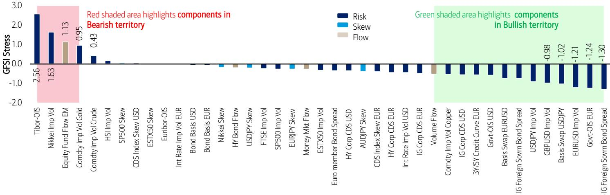  
来源：BofA全球研究。*最新数据截至2026年7月10日。免责声明：上述标识为BofA GFSI的指标仅为指示性指标，未经BofA全球研究事先书面同意，不得用于参考目的或作为任何金融工具或合约的业绩衡量标准，或由第三方出于任何其他目的依赖。该指标并非为充当基准而创建。

## 图表3：GFSI子成分压力变化** 

Euribor-OIS在过去两周压力增幅最大，而日经指数隐含波动率压力降幅最大  
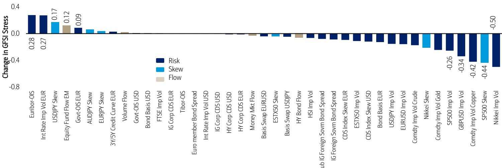  
来源：BofA全球研究。**最新数据截至2026年6月5日。变化区间：2026年6月26日至2026年7月10日。  
BofA全球研究

GFSI风险配置器（使用看涨、看跌和中性权重分别为2、0、1）截至2026年7月10日建议22.0%的超配头寸（而2026年6月26日为17.1%的超配头寸）。截至2026年7月10日，看涨、看跌和中性GFSI成分的百分比分别为31.7%、9.8%和58.5%。

图表4：过去两周大宗商品压力降幅最大
相比之下，利率压力略有上升

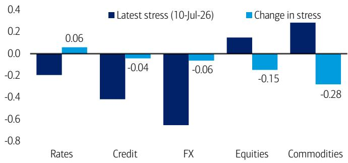  
来源：BofA全球研究。变化区间：2026年6月26日至2026年7月10日。  
BofA全球研究

图表5：过去两周日本引领区域压力下行
与此同时，欧洲是相对少见压力上升的地区  
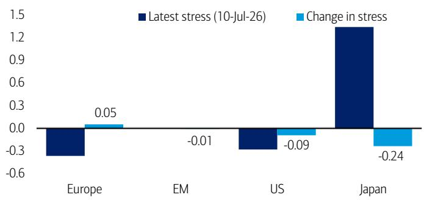  
来源：BofA全球研究。变化区间：2026年6月26日至2026年7月10日。  
BofA全球研究  
图表6：压力变动最大的前十名（相对于历史）
铜隐含波动率经历了历史性的压力下降

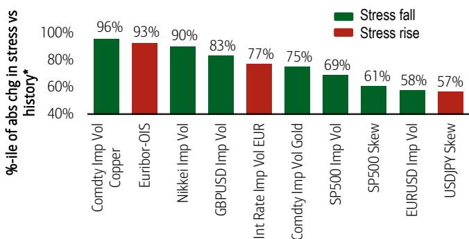  
来源：BofA全球研究。*压力10日变动的百分位数相对于所有历史10日变动（最早自2000年1月3日）。条形颜色代表压力上升（红色）或下降（绿色）。10日变动（2026年6月26日至2026年7月10日）。

图表7：跨资产波动率和价差中压力变动最大的项目
过去两周大宗商品波动率压力降幅最大  
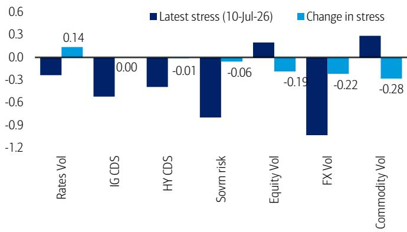  
来源：BofA全球研究。变化区间：2026年6月26日至2026年7月10日。  
BofA全球研究

## BofA泡沫风险指标全景 KOSPI、日经指数和纳斯达克BRI水平温和回落

BofA泡沫风险指标（BRI）是一个基于价格的衡量指标，旨在检测类似泡沫的资产动态。受前四阶矩描述统计分布的方式启发，BRI将资产的回报、波动率、动量和脆弱性提炼为一个0到1范围内的单一泡沫风险读数；1代表极端的泡沫式价格行为，0代表无泡沫。历史上的资产泡沫在形成和见顶时均表现出较高的BRI水平（详情请参见我们的《2026年年度展望》）。

图表8：KOSPI、日经指数和纳斯达克/美国科技股的BRI水平温和回落，但相对于其他主要资产和市场仍处于高位
BofA泡沫风险指标（截至2026年7月10日）涵盖全球权益指数、美国权益板块、大宗商品和加密货币（条形图：短期至长期子指标的范围）

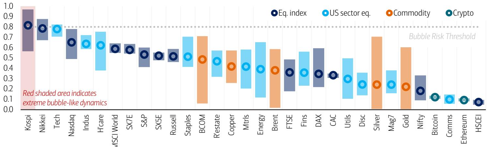  
来源：BofA全球研究。数据截至2026年7月10日。基础代码：SPX, NDX, RTY, SX5E, SX7E, CAC, DAX, UKX, NKY, HSCEI, KOSPI2, NIFTY, MXWD, IXB, IXCPR, IXE, IXM, IXI, IXT, IXR, IXRE, IXU, IXV, IXY, BM7P, BCOM, CO1, XAU, XAG, HG1, XBTUSD, XETUSD。免责声明：标识为BofA泡沫风险指标的指标仅为指示性指标，未经BofA全球研究事先书面同意，不得用于参考目的或作为任何金融工具或合约的业绩衡量标准，或由第三方出于任何其他目的依赖。该指标并非为充当基准而创建。  
BofA全球研究  
图表9：在热门权益主题中，半导体和网络安全股仍显示出相对较高的泡沫式动态...  
热门权益主题中的最高BRI读数（截至2026年7月10日）

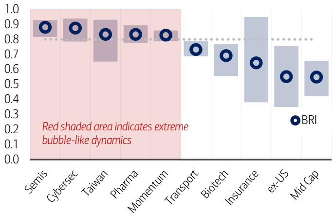  
来源：BofA全球研究。数据截至2026年7月10日。基础代码：ICESEMIT, NQCYBRN, FTTWN, DJSPHMT, SP500MUT, SPTSCUT, SPSIBITR, SPSIINST, GPVAN2TR, CRSPMIT。参见图表8中的免责声明。  
图表10：...尽管半导体和网络安全BRI水平（以及大多数热门权益主题）在过去一周有所回落
热门权益主题BRI最大1周变化（截至2026年7月10日）

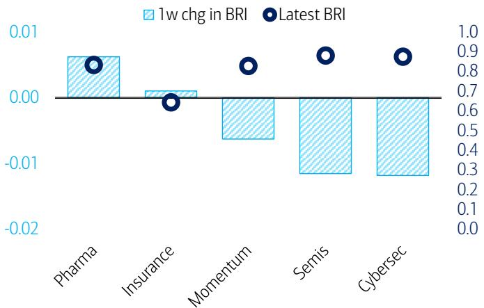  
来源：BofA全球研究。数据截至2026年7月10日。基础代码：DJSPHMT, SPSIINST, SP500MUT, ICESEMIT, NQCYBRN。参见图表8中的免责声明。  
BofA全球研究  
BofA全球研究

图表11：标普500成分股显示出日益活跃的价格行为，无论是从股票数量来看...
BRI高于0.8的标普500成分股数量  
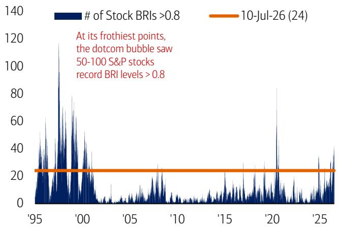  
来源：BofA全球研究。数据自1995年1月1日至2026年7月10日。股票BRI使用自纳入标普500以来的数据计算。参见图表8中的免责声明。  
BofA全球研究

图表12：...以及按总指数权重衡量时
BRI高于0.8的标普500成分股总权重  
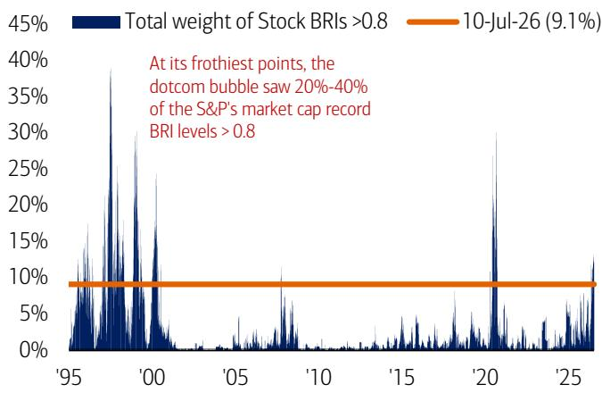  
来源：BofA全球研究。数据自1995年1月1日至2026年7月10日。股票BRI使用自纳入标普500以来的数据计算。参见图表8中的免责声明。  
BofA全球研究

图表13：在标普500成分股中，AMAT、WDAY、HPE和CSCO等科技股的泡沫风险指标排名最高
BRI读数最高的标普500成分股（截至2026年7月10日）  
  
来源：BofA全球研究。数据截至2026年7月10日。注：股票BRI使用自纳入标普500以来的数据计算。参见图表8中的免责声明。请注意，BRI是一个纯粹基于价格的指标，旨在量化泡沫式价格行为的程度。它不是对股票的基本面观点，应仅作为基本面和持仓指标的补充。

## 图表14：美国出口商、欧盟半导体和中国科技本土化股票等全球主题显示出泡沫式价格行为，其BRI水平较高

选定BofA自定义篮子*的泡沫风险指标（截至2026年7月10日）

<table><tr><td>篮子</td><td>代码</td><td>BRI</td></tr><tr><td colspan="3">AMRS</td></tr><tr><td>美国出口商</td><td>MLUXPORT</td><td>0.90</td></tr><tr><td>美国人工智能计算</td><td>MLUCOMPU</td><td>0.86</td></tr><tr><td>美国网络安全篮子</td><td>MLCYBRS</td><td>0.86</td></tr><tr><td>美国TMT存储篮子</td><td>MLUMEMOR</td><td>0.85</td></tr><tr><td>美国硬件</td><td>MLUSHRDW</td><td>0.84</td></tr><tr><td>美国周期性股（不含大宗商品）</td><td>MLCYCLX</td><td>0.83</td></tr><tr><td>美国800V直流电转型</td><td>MLU800V</td><td>0.82</td></tr><tr><td>美国人工智能受益者</td><td>MLUSAI</td><td>0.81</td></tr><tr><td>美国管理式医疗</td><td>MLDIMNGC</td><td>0.80</td></tr><tr><td>美国TMT动量因子</td><td>MLUPTMMO</td><td>0.80</td></tr><tr><td>美国医疗保健动量因子</td><td>MLUPHCMO</td><td>0.79</td></tr><tr><td>美国数据中心建设商</td><td>MLDATACB</td><td>0.79</td></tr><tr><td>美国质量因子</td><td>MLUPQUAL</td><td>0.77</td></tr><tr><td>美国运输</td><td>MLUTRANS</td><td>0.75</td></tr><tr><td>美国金融动量因子</td><td>MLUPFINM</td><td>0.75</td></tr><tr><td>美国TMT供应短缺</td><td>MLUTMTSP</td><td>0.74</td></tr><tr><td>美国工业动量因子</td><td>MLUPINMO</td><td>0.71</td></tr><tr><td>美国TMT持久复合增长股</td><td>MLUTMTDC</td><td>0.69</td></tr><tr><td>美国中小盘半导体</td><td>MLSEMISM</td><td>0.69</td></tr><tr><td>美国高效增长</td><td>MLUEGROW</td><td>0.66</td></tr><tr><td>美国婴儿潮一代消费</td><td>MLUBOOM</td><td>0.66</td></tr><tr><td>美国电网赋能者</td><td>MLUGRID</td><td>0.65</td></tr><tr><td>美国人工智能基础设施</td><td>MLAIINFR</td><td>0.65</td></tr><tr><td>美国TMT盈利增长</td><td>MLUTMTPG</td><td>0.64</td></tr><tr><td>美国动量因子</td><td>MLUPMOMO</td><td>0.61</td></tr><tr><td>美国中国进口商</td><td>MLCHIMPT</td><td>0.61</td></tr><tr><td>美国共识增长做空股</td><td>MLDIMSGR</td><td>0.60</td></tr><tr><td>加拿大基础设施与国防</td><td>MLCAINFR</td><td>0.59</td></tr><tr><td>美国非必需消费动量因子</td><td>MLUPCDMO</td><td>0.59</td></tr><tr><td>美国硬资产、低过时率（HALO）</td><td>MLUHALO</td><td>0.59</td></tr><tr><td>美国债券代理</td><td>MLEBOND</td><td>0.58</td></tr><tr><td>美国PMI敏感工业股</td><td>MLUINDUS</td><td>0.57</td></tr><tr><td>美国商业生物技术</td><td>MLUSCBIO</td><td>0.56</td></tr><tr><td>美国贝塔因子</td><td>MLUPBETA</td><td>0.55</td></tr><tr><td>美国医疗补助</td><td>MLELECHC</td><td>0.54</td></tr><tr><td>美国价值因子</td><td>MLUPVALU</td><td>0.54</td></tr><tr><td>美国零售信号</td><td>MLRETAIL</td><td>0.53</td></tr><tr><td>美国人工智能管弦乐篮子</td><td>MLUAIORC</td><td>0.53</td></tr><tr><td>美国周期性工业股（不含人工智能）</td><td>MLUICXAI</td><td>0.53</td></tr><tr><td>美国软件</td><td>MLUSSOFT</td><td>0.53</td></tr><tr><td>美国残差波动率因子</td><td>MLUPVOLA</td><td>0.52</td></tr><tr><td>美国必需消费动量因子</td><td>MLUPSTMO</td><td>0.52</td></tr><tr><td>美国硬着陆</td><td>MLHLAND</td><td>0.52</td></tr><tr><td>美国海外收入</td><td>MLFORER</td><td>0.50</td></tr><tr><td>美国再融资风险</td><td>MLREFIN</td><td>0.50</td></tr><tr><td>美国小盘盈利股</td><td>MLSMEARN</td><td>0.50</td></tr><tr><td>美国休闲旅游</td><td>MLDILEIS</td><td>0.49</td></tr><tr><td>美国低利息覆盖率</td><td>MLLINTC</td><td>0.49</td></tr><tr><td>美国可再生能源</td><td>MLUSRNEW</td><td>0.49</td></tr><tr><td>美国不着陆</td><td>MLNLAND</td><td>0.47</td></tr><tr><td>美国国家冠军企业</td><td>MLUCHAMP</td><td>0.46</td></tr><tr><td>美国人工智能采纳者</td><td>MLUADOPT</td><td>0.46</td></tr><tr><td>美国高质量收益</td><td>MLHQYLD</td><td>0.46</td></tr><tr><td>美国共识高贝塔做空股</td><td>MLDIHBHS</td><td>0.46</td></tr><tr><td>国内税收政策</td><td>MLUTAXD</td><td>0.45</td></tr><tr><td>美国液化天然气</td><td>MLUELNG</td><td>0.44</td></tr><tr><td>美国回流篮子</td><td>MLRSHORE</td><td>0.44</td></tr><tr><td>美国欧盟敞口</td><td>MLUSEURO</td><td>0.43</td></tr><tr><td>美国制药超大规模篮子</td><td>MLURXHYP</td><td>0.42</td></tr></table>

<table><tr><td>篮子</td><td>代码</td><td>BRI</td></tr><tr><td>美国电力超级周期</td><td>MLUSPOWR</td><td>0.40</td></tr><tr><td>美国真正防御型股</td><td>MLTRUDEF</td><td>0.40</td></tr><tr><td>美国助推器（周期性股）</td><td>MLBOOSTR</td><td>0.40</td></tr><tr><td>美国国内收入</td><td>MLDOMSTC</td><td>0.40</td></tr><tr><td>美国受监管公用事业</td><td>MLUREGU</td><td>0.39</td></tr><tr><td>美国共识小盘做空股</td><td>MLDIRSRT</td><td>0.39</td></tr><tr><td>美国高违约风险</td><td>MLUHDFLX</td><td>0.38</td></tr><tr><td>美国滞胀</td><td>MLSTGFL8</td><td>0.38</td></tr><tr><td>美国国防、能源、基础设施与安全</td><td>MLUDEIS</td><td>0.37</td></tr><tr><td>美国消费者中国关税敞口</td><td>MLCTARIF</td><td>0.37</td></tr><tr><td>美国公用事业增长篮子</td><td>MLUSGUTE</td><td>0.37</td></tr><tr><td>美国铜敞口篮子</td><td>MLUSCOPP</td><td>0.36</td></tr><tr><td>美国建筑产品</td><td>MLUBUILD</td><td>0.36</td></tr><tr><td>美国弱资产负债表</td><td>MLWEAK</td><td>0.35</td></tr><tr><td>美国量子计算</td><td>MLUQUANT</td><td>0.34</td></tr><tr><td>美国共识价值做空股</td><td>MLDIMSVL</td><td>0.34</td></tr><tr><td>美国新建工程</td><td>MLNCONST</td><td>0.34</td></tr><tr><td>美国高油价"风险"</td><td>MLOILRSK</td><td>0.34</td></tr><tr><td>美国软着陆</td><td>MLSLAND</td><td>0.34</td></tr><tr><td>美国能源动量因子</td><td>MLUPENMO</td><td>0.33</td></tr><tr><td>美国太空竞赛</td><td>MLUSPACE</td><td>0.33</td></tr><tr><td>巴西选举篮子</td><td>MLBZELEC</td><td>0.33</td></tr><tr><td>美国长期债务到期</td><td>MLLTMATS</td><td>0.32</td></tr><tr><td>美国增长因子</td><td>MLUPGROW</td><td>0.32</td></tr><tr><td>美国中小盘公用事业</td><td>MLUSUTES</td><td>0.31</td></tr><tr><td>美国电池生态系统</td><td>MLUSBATT</td><td>0.29</td></tr><tr><td>美国新云篮子</td><td>MLUNEOCL</td><td>0.29</td></tr><tr><td>美国公用事业防御型收益</td><td>MLUSRUTE</td><td>0.27</td></tr><tr><td>美国共识大盘做空股</td><td>MLDISSRT</td><td>0.27</td></tr><tr><td>美国消费品</td><td>MLGOODS</td><td>0.24</td></tr><tr><td>美国材料动量因子</td><td>MLUPMAMO</td><td>0.24</td></tr><tr><td>美国Z世代篮子</td><td>MLUGENZ</td><td>0.23</td></tr><tr><td>美国健康篮子</td><td>MLUWELL</td><td>0.23</td></tr><tr><td>美国低收入消费</td><td>MLSPREE</td><td>0.23</td></tr><tr><td>美国消费者服务</td><td>MLSERVE</td><td>0.21</td></tr><tr><td>美国高端消费者</td><td>MLDIHEC</td><td>0.21</td></tr><tr><td>美国旧经济</td><td>MLOLDEC</td><td>0.21</td></tr><tr><td>美国强资产负债表</td><td>MLSTRNG</td><td>0.21</td></tr><tr><td>美国加密货币敞口</td><td>MLDICRYP</td><td>0.21</td></tr><tr><td>美国中等收入消费</td><td>MLUMIDCG</td><td>0.20</td></tr><tr><td>美国国防技术</td><td>MLUDEFTC</td><td>0.19</td></tr><tr><td>美国国防电子</td><td>MLUDELEC</td><td>0.19</td></tr><tr><td>美国防御型工业股</td><td>MLUDINDU</td><td>0.17</td></tr><tr><td>美国大宗商品综合体</td><td>MLCOMMOD</td><td>0.16</td></tr><tr><td>美国无人机生态系统</td><td>MLUDRONE</td><td>0.15</td></tr><tr><td>美国金穹顶篮子</td><td>MLUGDOME</td><td>0.14</td></tr><tr><td>美国国防承包商</td><td>MLDEFCON</td><td>0.13</td></tr><tr><td>美国GLP-1颠覆风险</td><td>MLXGLP1</td><td>0.12</td></tr><tr><td>美国水生态系统</td><td>MLUH2O</td><td>0.12</td></tr><tr><td>美国核能敞口</td><td>MLUSNUCL</td><td>0.09</td></tr><tr><td>美国私募股权基金</td><td>MLDIPPTPE</td><td>0.06</td></tr><tr><td>美国TMT防御型股</td><td>MLUTMTDF</td><td>0.06</td></tr><tr><td>美国独立电力生产商</td><td>MLUIPPS</td><td>0.06</td></tr><tr><td>美国另类资产管理人</td><td>MLUALTS</td><td>0.04</td></tr><tr><td>美国私人信贷代理</td><td>MLPRCRED</td><td>0.03</td></tr><tr><td colspan="3">EMEA</td></tr><tr><td>欧盟半导体及半导体设备</td><td>MLD1EUSM</td><td>0.86</td></tr><tr><td>欧盟存储</td><td>MLEUBYTE</td><td>0.74</td></tr><tr><td>欧盟旅游篮子</td><td>MLD1TRAV</td><td>0.69</td></tr><tr><td>欧洲再通胀</td><td>MLD1REFL</td><td>0.66</td></tr></table>

<table><tr><td>篮子</td><td>代码</td><td>BRI</td></tr><tr><td>欧盟电网</td><td>MLEUGRID</td><td>0.62</td></tr><tr><td>英国银行</td><td>MLD1UKBK</td><td>0.61</td></tr><tr><td>意大利银行</td><td>MLEUITBK</td><td>0.61</td></tr><tr><td>欧盟美国消费者敞口</td><td>MLEUSCON</td><td>0.60</td></tr><tr><td>欧盟高美元敞口</td><td>MLEUAMER</td><td>0.60</td></tr><tr><td>欧盟钢铁</td><td>MLESTEEL</td><td>0.59</td></tr><tr><td>欧盟人工智能电力激增</td><td>MLESURGE</td><td>0.59</td></tr><tr><td>欧盟人工智能采纳者</td><td>MLEADOPT</td><td>0.59</td></tr><tr><td>英国国内股（不含房屋建筑商）</td><td>MLUKDOMX</td><td>0.58</td></tr><tr><td>石油与天然气（不含可再生能源）</td><td>MLD1OILX</td><td>0.55</td></tr><tr><td>欧盟共识多头</td><td>MLD1LSEU</td><td>0.55</td></tr><tr><td>欧盟HALO篮子</td><td>MLEUHALO</td><td>0.54</td></tr><tr><td>欧盟滞胀</td><td>MLEUSTAG</td><td>0.53</td></tr><tr><td>欧盟股票中国敞口</td><td>MLD1CHEX</td><td>0.53</td></tr><tr><td>欧盟周期性股</td><td>MLEUCYCL</td><td>0.47</td></tr><tr><td>欧盟新能源秩序</td><td>MLEUNEOE</td><td>0.45</td></tr><tr><td>欧盟铜矿商</td><td>MLEUCOPP</td><td>0.43</td></tr><tr><td>欧盟非必需消费</td><td>MLEUCONS</td><td>0.42</td></tr><tr><td>欧盟短周期工业</td><td>MLEINSCY</td><td>0.42</td></tr><tr><td>英国国内名称</td><td>MLUKDOMS</td><td>0.41</td></tr><tr><td>欧盟周期性化工</td><td>MLECCHEM</td><td>0.38</td></tr><tr><td>欧盟最大动量顶部</td><td>MLEMOMOL</td><td>0.35</td></tr><tr><td>欧盟共识做空</td><td>MLD1MSEU</td><td>0.35</td></tr><tr><td>欧盟安全DEIS</td><td>MLEUDEIS</td><td>0.34</td></tr><tr><td>欧盟乌克兰复苏</td><td>MLERBUKR</td><td>0.34
