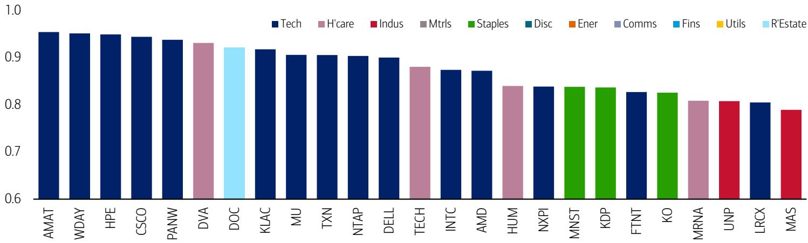
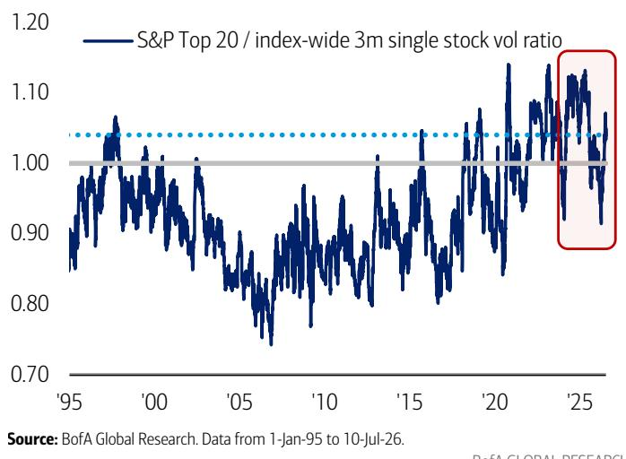
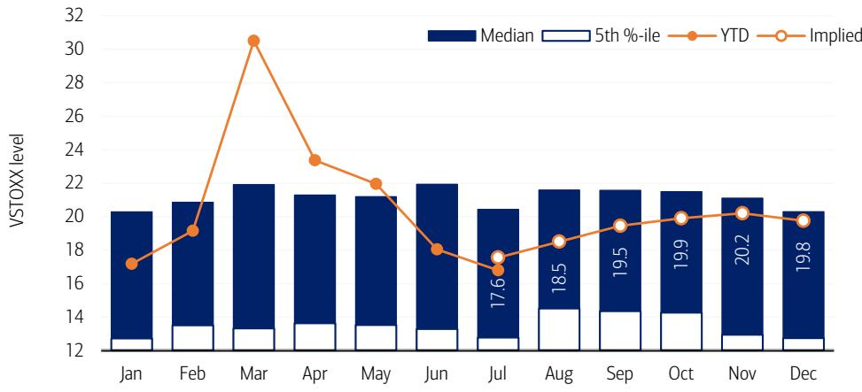

# BofA：全球权益波动率洞察-公司vs指数波动率达90年代科网极值

美国市场的波动率正在出现一个罕见的裂口。BofA最新一期全球权益波动率洞察指出，公司已实现波动率已升至1990年代末科网泡沫后期的水平，但指数波动率却相对温和。两者之间的背离幅度已经处于历史极端区间，如果估值继续向泡沫区域推进，这一裂口可能进一步扩大，甚至超越科网泡沫时期的极值。

驱动这一背离的核心力量是半导体板块。BofA团队观察到，MU、AMD等大型半导体公司的不稳定性直接推高了公司波动率，而半导体与其他大型科技股及软件板块之间的相关性持续下降，使得指数层面的相关性降至接近历史最低水平，从而压制了指数波动率。报告特别指出，半导体波动率上升与其BRI（泡沫不确定性指标）走高同步发生。在这一结构下，一旦相关性回升，指数波动率面临的上行不确定性将变得格外突出，尤其是考虑到接下来一段时间对权益市场而言在历史上属于季节性挑战期。

> **KC评论：** 公司与指数波动率的裂口，本质上是市场定价从“整体叙事”转向“公司分化”的体现。半导体与其他板块的脱钩，意味着市场不再将所有大型科技股视为同一类资产。对于关注组合不确定性管理的读者而言，这一裂口本身就是一个值得追踪的先行信号。

## 1. 欧洲周期股的尾部对冲成本正在变得异常便宜

BofA报告还捕捉到欧洲市场一个值得关注的结构性变化。欧洲斯托克50指数（SX5E）的隐含波动率近期显著回落，使其与斯托克600指数之间的波动率价差收窄至历史低位，目前隐含波动率价差已经低于近期已实现波动率价差。这意味着，通过SX5E与斯托克600之间的看跌期权互换来对冲欧洲周期板块节奏变化不确定性的成本，正处于一个相对低廉的水平。

考虑到SX5E在科技、可选消费和工业等周期板块上的权重偏高，这一工具提供了一种低溢价的对冲路径。报告提到，SX5E从历史高点回落的过程中，工业与科技板块是主要影响。如果市场对欧洲周期板块的担忧继续升温，这一价差结构可能不会维持太久。

## 2. 台积电财报前的不确定性回报不对称，以及日经指数对冲成本的压缩机会

BofA对台积电即将发布的财报给出了一个明确的交易框架：保留上行敞口，限制节奏变化不确定性。报告认为，强劲的销售动能支撑了基本面正面看法，但市场对AI资本开支的任何风吹草动都高度敏感，这使得财报前的不确定性回报呈现不对称特征。BofA建议将现金公司敞口转换为期权结构，将节奏变化限制在1.3%以内，同时保留显著的上行凸性。

与此同时，日经指数的对冲成本目前处于高位，但BofA指出，高企的节奏变化波动率反而创造了压缩保护成本的机会——通过特定结构可以将对冲成本削减最高74%。报告认为，日经指数对AI和全球宏观不确定性的敏感度正在上升，使其成为对冲10%至20%级别回调的一个有吸引力的载体。

## 3. 泡沫不确定性指标显示，半导体与网络安全仍是泡沫特征最明显的主题

BofA的BRI（泡沫不确定性指标）是一个纯粹基于价格行为的度量工具，通过收益、波动率、动量和脆弱性四个维度评估资产的泡沫特征。截至7月10日，KOSPI、日经和纳斯达克/美国科技板块的BRI读数虽然较此前有所回落，但仍处于高位。在热门主题中，半导体和网络安全公司的BRI读数依然最高，尽管过去一周有所下降。

更值得关注的是，标普500成分股中BRI超过0.8的公司数量及其总权重，均处于历史高位。报告列出的BRI最高公司中，AMAT、WDAY、HPE和CSCO等科技公司排名靠前。在全球主题层面，美国出口商、欧盟半导体以及中国科技本地化等主题的BRI读数也处于较高水平。这些数据共同指向一个判断：市场定价中的泡沫特征并未消退，只是从全面扩散转向了局部集中。

> **KC评论：** BRI是一个价格行为指标，不是基本面判断。它不告诉你哪些公司被高估，而是告诉你哪些资产的定价行为在历史上与泡沫形成期相似。对于关注市场结构的读者，BRI的分布变化比单一读数更有意义——当泡沫特征从宽基指数向少数主题收敛时，往往意味着市场正在进入一个更脆弱的阶段。

---

For informational purposes only. Portions may be generated,translated,summarized,or edited with AI assistance based on source materials and may contain omissions or errors. Please verify independently. This is not investment,legal,tax,accounting,or other professional advice.

For informational purposes only. Portions may be generated,translated,summarized,or edited with AI assistance based on source materials and may contain omissions or errors. Please verify independently. This is not investment,legal,tax,accounting,or other professional advice.

