# Walmart (WMT): 价格投入担忧过度；全渠道盈利能力支撑上行空间

市场参与者近期对Walmart在价格方面的投入有所关注，尤其是在相关公告发布之后。WMT作为价格领导者，价格投入并非新策略。我们预计WMT将继续通过价格投入和扩大价格差距来获取市场份额。同时，我们认为关于价格投入对利润率影响的担忧有些过度，因为WMT正在利用相关退款来支持价格投入并抵消运输成本上涨。

更长期的讨论焦点仍在于WMT通过全渠道举措提升盈利能力的潜力。我们估算，在完全加载且无补贴的基础上，WMT美国核心电商业务在FY26的EBIT利润率为-6%。通过自动化履约和优化配送路线，我们预计到FY2030年，该业务在无补贴基础上有望实现盈利。核心电商盈利能力的改善可能为WMT美国业务利润率提升贡献约+100个基点。

与此同时，我们保守预计WMT美国零售媒体业务将从目前占GMV的4%增长至约5%，而其美国GMV将从目前的1150亿美元近乎弹性较高。随着零售媒体收入从约40亿美元增长至110亿美元，这可能为WMT美国EBIT利润率贡献约75个基点。综合来看，我们预计WMT美国业务板块的EBIT利润率有望达到7%。

## 研究观察

我们维持对Walmart的积极看法。近期因价格投入担忧引发的回调，提供了一个值得关注的观察点。

<table><tr><td>调整后每股收益</td><td>F26A</td><td>F27E</td><td>F28E</td><td>财务数据</td><td>F26A</td><td>F27E</td><td>F28E</td><td>年复合增长率</td></tr><tr><td>WMT (美元)</td><td>2.64</td><td>3.09</td><td>3.60</td><td>报告每股收益</td><td>2.73</td><td>3.10</td><td>3.60</td><td>14.8%</td></tr><tr><td></td><td></td><td></td><td></td><td>收入 (百万)</td><td>706,413</td><td>751,540</td><td>789,292</td><td>5.7%</td></tr></table>

从现值角度看，未来4年每股收益有1.25美元的上行空间。将此加回至未来12个月的一致预期，WMT的交易估值约为27倍，低于其历史平均水平约29倍。

<table><tr><td>收盘日期</td><td></td><td></td><td colspan="2">2026年7月13日</td></tr><tr><td>WMT收盘价 (美元)</td><td></td><td></td><td colspan="2">114.78</td></tr><tr><td>目标价 (美元)</td><td></td><td></td><td colspan="2">145.00</td></tr><tr><td>上行/(下行)空间</td><td></td><td></td><td colspan="2">26%</td></tr><tr><td>52周区间</td><td></td><td></td><td colspan="2">135.16/94.38</td></tr><tr><td>SPX</td><td></td><td></td><td colspan="2">7,515.34</td></tr><tr><td>财年截止</td><td></td><td></td><td colspan="2">一月</td></tr><tr><td>股息率</td><td></td><td></td><td colspan="2">0.9%</td></tr><tr><td>市值 (美元) (百万)</td><td></td><td></td><td colspan="2">913,428</td></tr><tr><td>企业价值 (美元) (百万)</td><td></td><td></td><td colspan="2">983,523</td></tr><tr><td>表现</td><td>年初至今</td><td>1个月</td><td>6个月</td><td>12个月</td></tr><tr><td>相对 (%)</td><td>3.0</td><td>(5.2)</td><td>(4.6)</td><td>21.6</td></tr><tr><td>SPX (%)</td><td>9.8</td><td>1.1</td><td>7.9</td><td>20.1</td></tr><tr><td>相对 (%)</td><td>(6.8)</td><td>(6.3)</td><td>(12.6)</td><td>1.5</td></tr><tr><td colspan="5">来源：彭博，Bernstein估算与分析。</td></tr></table>

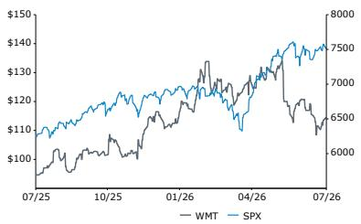  
价格表现，1年

<table><tr><td>估值指标</td><td>F26A</td><td>F27E</td><td>F28E</td></tr><tr><td>调整后市盈率 (倍)</td><td>43.5</td><td>37.2</td><td>31.9</td></tr><tr><td>报告市盈率 (倍)</td><td>42.0</td><td>37.0</td><td>31.9</td></tr><tr><td>报告PEG (倍)</td><td>8.1</td><td>2.2</td><td>1.9</td></tr><tr><td>企业价值/销售额 (倍)</td><td>1.4</td><td>1.3</td><td>1.2</td></tr><tr><td>企业价值/自由现金流 (倍)</td><td>65.9</td><td>82.0</td><td>63.8</td></tr><tr><td>调整后PEG (倍)</td><td>8.4</td><td>2.2</td><td>1.9</td></tr></table>

## 详细分析

## 关于价格投入的短期关注

市场参与者近期对Walmart在价格方面的投入有所关注。WMT作为价格领导者，其美国食品杂货的同店通胀率持续低于CPI家庭食品通胀率，且差距在扩大（图表1）。价格投入对WMT而言并非新举措，近年来每季度都有数千项降价活动（图表2）。因此，Walmart美国和山姆会员店美国近年来持续获得市场份额。我们预计WMT将继续通过价格投入和扩大与竞争对手的价格差距来获取份额。

关于价格投入增加对利润率的影响，我们认为这些担忧有些过度。Walmart已宣布预计相关退款将占美国净销售额略低于50个基点，约30亿美元。这为其夏季降价活动提供了充足的资金支持。Walmart此前预计第一季度汽油价格上涨带来的年度成本增加约10亿美元。自5月以来，价格已有所回落，实际影响可能低于预期。

我们的观点是，WMT在定价方面有足够的空间进行调整，既不影响其底线，又能保持市场份额的增长势头。更长期的讨论焦点仍在于WMT通过全渠道举措提升盈利能力的潜力——下一部分将详细讨论。

图表1：WMT仍是价格领导者，其美国食品杂货同店通胀率低于CPI家庭食品通胀率，且差距在扩大。

| 季度 | 季度结束 | WMT美国食品杂货同店通胀率 (%) | CPI家庭食品平均 (%) | 差距：CPI-WMT |
|------|----------|------------------------------|----------------------|----------------|
| FY25 Q4 | 2025年1月31日 | 1.7% | 1.7% | 0.0% |
| FY26 Q1 | 2025年4月30日 | 1.5% | 2.0% | 0.5% |
| FY26 Q2 | 2025年7月31日 | 1.5% | 2.3% | 0.8% |
| FY26 Q3 | 2025年10月31日 | 1.3% | 2.7% | 1.4% |
| FY26 Q4 | 2026年1月31日 | 0.6% | 2.1% | 1.5% |
| FY27 Q1 | 2026年4月30日 | 0.6% | 2.5% | 1.9% |

来源：公司报告，Haver，Bernstein分析

图表2：价格投入对WMT而言并非新举措，近年来每季度都有数千项降价活动。

| 季度 | 季度结束 | 降价数量 | 相关表述 |
|------|----------|----------|----------|
| FY25 Q4 | 2025年1月31日 | 5800 | 一如既往，我们正努力帮助降低价格...我们通过降价来降低价格的举措仍在继续... |
| FY26 Q1 | 2025年4月30日 | 5000 | 我们将尽最大努力保持价格尽可能低... |
| FY26 Q2 | 2025年7月31日 | 7400 | 关于我们的美国定价决策，考虑到关税相关的成本压力，我们正在按计划行事... |
| FY26 Q3 | 2025年10月31日 | 7400 | 目前Walmart美国约有7,400项活跃降价，其中超过一半在食品杂货类别... |
| FY26 Q4 | 2026年1月31日 | 6200 | 随着我们通过降价和每日低价策略在食品杂货类别中降低价格... |
| FY27 Q1 | 2026年4月30日 | 7200 | 我们继续在价格方面进行投入，延长降价活动... |

来源：公司报告，Bernstein分析

图表3：因此，Walmart美国近年来持续获得市场份额...

大众零售商同比市场份额变化 vs. 核心零售销售 (基点)  
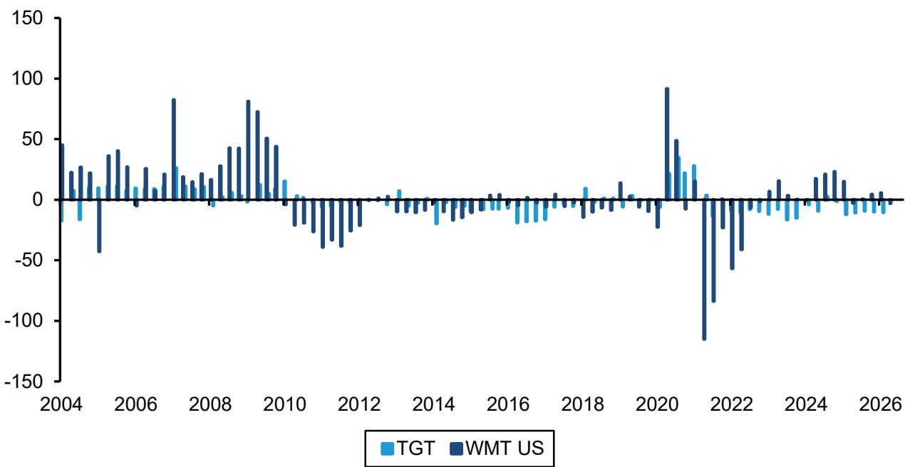  
来源：FRED - 圣路易斯联储，公司披露，Bernstein分析

图表4：...山姆会员店的市场份额增长更为显著。

会员店同比市场份额变化 vs. 核心零售销售 (基点)  
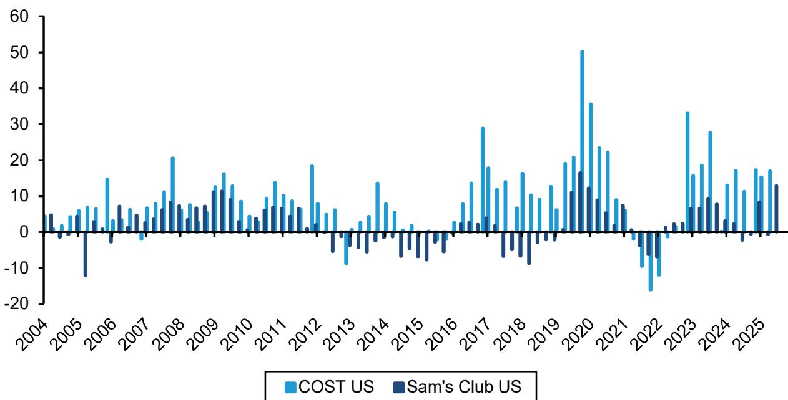  
来源：FRED - 圣路易斯联储，公司披露，Bernstein分析

## 美国电商：核心电商亏损减少与零售媒体增长带来的上行空间

我们的分析表明，如果Walmart在电商领域的投入取得成效，且该渠道在无补贴基础上实现EBIT利润率转正，那么Walmart美国业务的利润率从FY26到FY30可能扩大约+200个基点。

我们估算，在完全加载且无补贴的基础上（不含零售媒体和会员贡献），WMT美国核心电商业务在FY26的EBIT利润率为-6%，高于FY25的-7%。这一数字未由公司披露，是基于假设实体店利润率为7%、美国零售媒体EBIT贡献为27亿美元、Walmart+会员EBIT贡献为13亿美元估算得出。

我们预计到FY30，电商可能占WMT美国销售额的约30%。这意味着从FY26到FY30，电商增长的年复合增长率为15%，假设WMT美国净销售额以5%的年复合增长率增长。这将由Walmart的第三方市场平台驱动，我们预计其增长速度将远快于第一方业务（图表5-图表8）。

图表5：根据eMarketer的线上渗透率估算，并假设在电商领域获得一定份额，WMT美国的电商渗透率到FY30可能增长至约30%。

WMT美国隐含电商渗透率 vs. 实际/估算

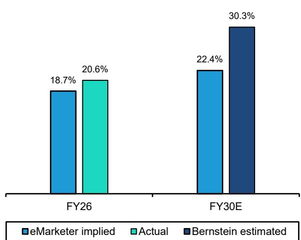  
来源：eMarketer，公司披露，Bernstein分析与估算

图表6：这意味着到FY30，电商增长的年复合增长率为15%，假设WMT美国净销售额以5%的年复合增长率增长。

WMT美国估算净销售额 (十亿美元) 与增长年复合增长率

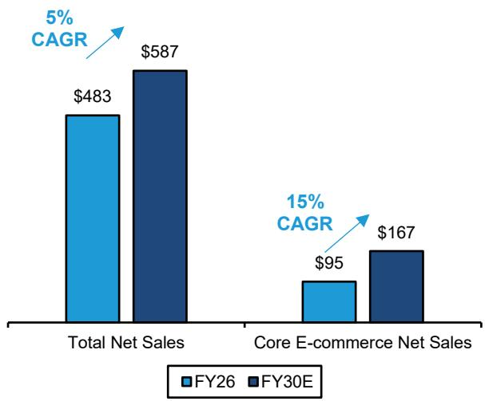  
来源：eMarketer，公司披露，Bernstein分析与估算

图表7：假设到FY30，第三方业务占WMT美国电商GMV的约30%...

第三方占WMT美国电商GMV的比例

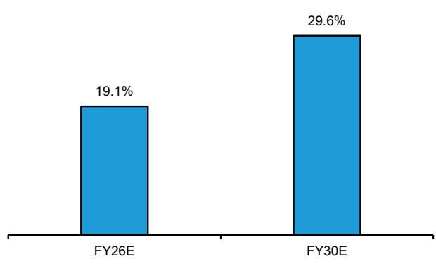  
来源：公司披露，Bernstein分析与估算

图表8：...WMT美国的第三方业务增长速度可能远快于第一方业务，这将有助于其电商增长势头。

WMT美国电商GMV (十亿美元) 按第一方和第三方划分

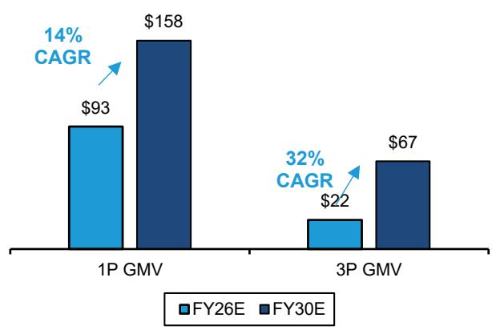  
来源：公司披露，Bernstein分析与估算

## 核心电商：Walmart在盈利能力提升方面仍有较大空间

在核心电商方面，随着WMT继续降低履约和配送成本，我们看到了进一步的改善空间，这可能为WMT美国EBIT利润率从FY26到FY30的扩张贡献约100个基点（图表9-图表10）。

在履约方面，WMT预计将基本完成自动化履约能力的建设，这可能使WMT在这些自动化履约中心的成本更接近行业领先水平。同时，WMT正积极以更具成本效益的方式扩大当日达配送范围。今年，Walmart似乎正在美国开发一个"暗店"网络，类似于山姆会员店在中国所做的。这将使Walmart能够在其大卖场覆盖范围之外的大都市区域推出当日达配送服务。

在配送方面，我们认为WMT仍有空间通过提高密度和优化路线来进一步降低配送成本。加急配送（需额外付费）渗透率的提高显然有所帮助。长期来看，自动驾驶车辆可能结构性降低最后一公里配送的劳动力成本，进一步推动成本下降。

图表9：我们估算，在考虑替代收入流之前，Walmart美国电商业务目前的负贡献利润率为-2%...

Walmart整体电商单位经济性 (FY26估算)  
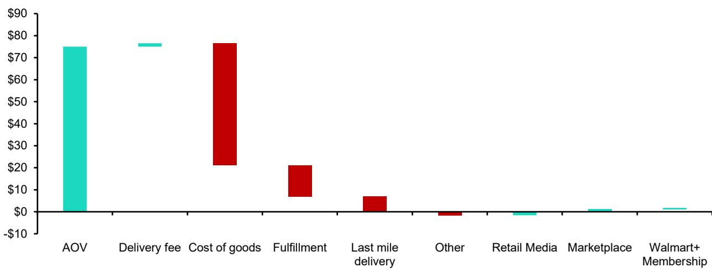  
来源：公司披露，行业来源，Bernstein分析与估算

图表10：...随着WMT进一步降低履约和配送成本，到FY30在无补贴基础上可能改善至约5%。

Walmart美国电商盈利能力改善路径 (预测，FY30)  
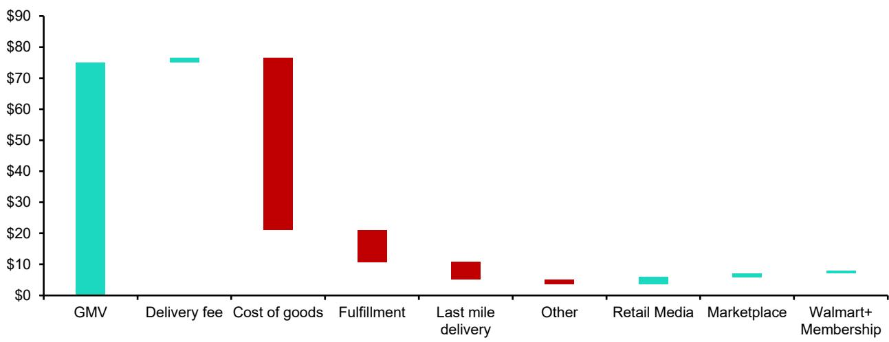  
来源：公司披露，行业来源，Bernstein分析与估算

## 零售媒体：在增长的市场中占据更大份额

我们预计Walmart的电商GMV将从FY26的约1150亿美元增长至未来4年的2250亿美元，主要由第三方业务增长驱动。目前，亚马逊在美国的广告收入约占GMV的7-8%。显然，凭借其覆盖范围和SKU基础，它在在线广告领域拥有优势地位。

我们不期望Walmart在短期内缩小这一差距。然而，Walmart在提升零售媒体能力方面正在取得进展——不断增长的第三方市场平台、不断扩大的全渠道零售媒体平台，以及整理版利用Vizio，都将增强Walmart作为广告合作伙伴的吸引力。

Walmart近期宣布收购Vibe.co，一家联网电视广告平台。Vibe的核心能力是与品牌合作，通过一套帮助监控活动的工具来改善其CTV效果，并最终提供广告支出回报率等指标。将Vibe.co的能力整合到Vizio和Walmart Connect中，从广告生态系统的角度来看是合理的，并将有助于Walmart实现"广告商在Walmart Connect和更广泛的联网电视生态系统中更广泛地采用CTV广告媒体，特别是中小企业和中端市场广告商，包括Walmart的第三方市场卖家。"

我们预计这将带来更高的附加率。我们保守估计，到FY30，Walmart能够将其附加率从4%提升至5%，同时GMV近乎弹性较高。如果Walmart能够实现这一目标，零售媒体的增长可能为Walmart美国业务贡献约75个基点的利润率扩张（图表12）。

图表11：我们假设Walmart Connect可以增长至GMV的5%，意味着未来5年的增长年复合增长率约为27%。

| | FY26E | FY30E | 年复合增长率 |
|---|-------|-------|------------|
| 净销售额 | 482,975 | 616,412 | 5.0% |
| 第一方GMV | 93,000 | 158,548 | 14.3% |
| 第一方GMV渗透率 | 19% | 26% | |
| 第三方GMV | 22,000 | 66,667 | 31.9% |
| 第三方GMV渗透率 | 5% | 11% | |
| 总GMV | 115,000 | 225,215 | 18.3% |
| 总GMV渗透率 | 24% | 37% | |
| Walmart Connect | 4,376 | 11,261 | 26.7% |
| 占GMV比例 | 4% | 5% | |

来源：公司披露，Bernstein分析与估算

## 会员业务：80%利润率，与电商净销售额同步增长

如上所述，我们预计电商净销售额在FY26至FY30年间将以约15%的年复合增长率增长。我们预计这将来自美国消费者基础的更大渗透，而非价格或购物篮规模的持续增长。换句话说，如果电商增长，我们预计会员业务将以类似速度增长，因为更多人采用该服务。以80%的EBIT利润率估算，我们预计这将为合并EBIT利润率增加11个基点，因为会员收入在此期间从约16.5亿美元增长至29亿美元。

## 总体而言，我们预计Walmart美国业务板块的EBIT利润率有望达到7%...

...由核心电商利润率改善和高利润率替代收入流（如零售媒体）的增长驱动（图表12-图表13）。

图表12：虽然电商增长对EBIT利润率构成压力，但更高效的履约和配送模式，以及电商带来的高利润率辅助收入流，可能使Walmart到FY2030年实现7%的EBIT利润率。

Walmart美国EBIT利润率桥接 - FY26至FY30E  
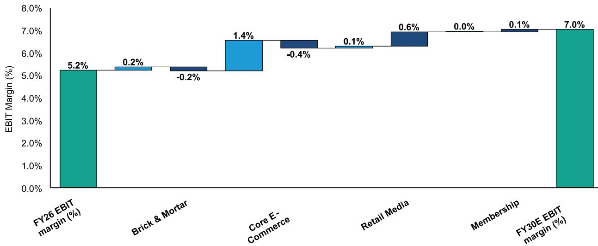  
来源：公司披露，Bernstein分析与估算

图表13：这假设电商增长年复合增长率为15%，且核心电商在无补贴基础上达到1%的EBIT利润率。

WMT美国FY30 EBIT利润率情景分析

| | | WMT美国电商销售增长年复合增长率 (FY26-30) | | | | | |
|---|---------|---------|---------|---------|---------|---------|---------|
| | | 5% | 10% | 12% | 15% | 17% | 20% | 25% |
| WMT美国核心电商 | -2.5% | 6.7% | 6.4% | 6.3% | 6.1% | 5.9% | 5.7% | 5.3% |
| FY30 EBIT利润率 | 0.0% | 7.3% | 7.0% | 6.9% | 6.8% | 6.6% | 6.5% | 6.2% |
| (无补贴) | 0.5% | 7.4% | 7.1% | 7.0% | 6.9% | 6.8% | 6.6% | 6.4% |
| | 1.0% | 7.5% | 7.3% | 7.2% | 7.0% | 6.9% | 6.8% | 6.6% |
| | 1.5% | 7.6% | 7.4% | 7.3% | 7.2% | 7.1% | 7.0% | 6.7% |
| | 2.0% | 7.7% | 7.5% | 7.4% | 7.3% | 7.2% | 7.1% | 6.9% |
| | 2.5% | 7.8% | 7.6% | 7.6% | 7.5% | 7.4% | 7.3% | 7.1% |

来源：公司披露，Bernstein分析

图表14：将这一7%的EBIT利润率折现回当前，表明WMT可能并不像看上去那么昂贵。

| FY26-FY30E EBIT增长的贡献 | |
|--------------------------------|-------|
| 增量实体店EBIT贡献 | 3,000 |
| 增量电商EBIT贡献 | 13,455 |
| 隐含每股收益贡献 | 1.64 |
| 隐含每股收益贡献的净现值 | 1.25 |
| | 当前 | "真实"盈利潜力 |
| 未来12个月一致预期每股收益 | $ 2.99 | $ 4.24 |
| 未来12个月市盈率 | 38.4倍 | 27.1倍 |

来源：公司披露，彭博，Bernstein分析与估算

图表15：长期观察者可能以约27倍的估值来评估Walmart的盈利潜力，而非约38.5倍的远期收益——低于其长期平均估值水平。

WMT NTM相对市盈率  
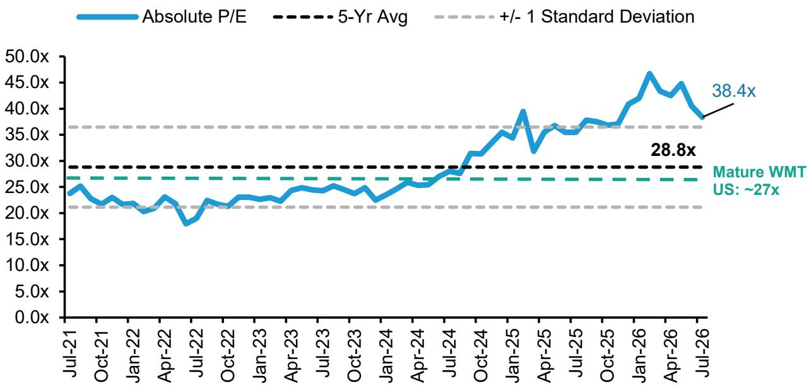  
来源：彭博，公司披露，Bernstein分析与估算

## 相关研究

- 美国大众零售：购物之旅！2026年SDC会议的店铺参观要点
- 美国大众零售：人工智能...迟早...WMT在AI时代定位最佳
- 美国零售业：市场定价如何？多阶段增长视角下的市场预期
- 美国零售业：复合增长型公司和故事型公司的合理倍数是多少？
- Walmart vs. Amazon：Walmart能否在电商领域追赶亚马逊？
- Walmart vs. Ocado：美国电商领域是否存在制胜策略？
- 美国零售与互联网：电商配送之争 - WMT, CART, DASH... 以及 AMZN？
- Walmart (WMT)：电商之旅 - 我们从前任高管、第三方卖家和广告买家那里学到了什么？
- Walmart (WMT)：Flipkart和PhonePe能否释放额外价值？

## 附录 - 财务预测

图表16：Bernstein估算 vs 市场一致预期

（表格内容保留，此处省略以保持简洁）

图表17：WMT财务摘要

（表格内容保留，此处省略以保持简洁）

## Bernstein股票列表

| | 2026年7月13日 | | | TTM相对 | | 调整后每股收益 | | | 调整后市盈率 (倍) | | |
|---|-------------|---|---|---------|---|---------|---------|---------|---------|---------|---------|
| | 评级 | 货币 | 收盘价 | 目标价 | 表现 | 货币 | 2026A | 2027E | 2028E | 2026A | 2027E | 2028E |
| WMT (Walmart) | O | USD | 114.78 | 145.00 | 1.5% | USD | 2.64 | 3.09 | 3.60 | 43.5 | 37.2 | 31.9 |
| SPX | | | 7,515.34 | | | | | | | | | |

O - 优于大市，M - 与大市同步，U - 弱于大市，NR - 未评级，CS - 暂停覆盖

来源：彭博，Bernstein估算与分析。

## I. 必要披露

（披露内容保留，此处省略以保持简洁）

## 估值方法

## Walmart Inc

我们设定目标价为145美元，采用39.0倍的市盈率，基于我们对未来Q5-Q8每股收益3.71美元的估算。

## 风险

## Walmart Inc

我们的WMT目标价面临若干宏观和公司特定风险。下行风险包括：

- 美国或大型国际市场消费环境出现意外变化，可能导致同店销售疲软和费用去杠杆化。
- Walmart在新业务领域（包括电商和广告）可能未能成功，这将影响其实现长期收入和利润率目标的能力。
- 鉴于Walmart在美国食品杂货领域的领先地位，可能面临美国监管审查的增加。

## 评级定义、基准与分布

## 股票评级定义

## Bernstein品牌

Bernstein品牌根据未来12个月相对于特定市场指数的预期表现对股票进行评级。

Bernstein品牌有三个评级类别：

- **优于大市**：股票将跑赢市场指数超过15个百分点
- **与大市同步**：股票表现将与市场指数持平，波动范围在+/-15个百分点以内
- **弱于大市**：股票将落后市场指数超过15个百分点

**暂停覆盖**：Bernstein品牌下对某公司的覆盖已暂停。评级和目标价暂时中止，不再有效，因此不应依赖。

**未评级**：当目前无法准确评估股票价值或准确预测公司表现时分配的评级。覆盖分析师可能继续发布关于该公司的研究报告，以向读者更新事件和发展情况。

**未覆盖 (NC)** 表示未在覆盖范围内的公司。

Bernstein品牌股票评级基于12个月的时间范围。

## Autonomous品牌 – 普通股

Autonomous品牌按如下方式对普通股进行评级。评级是相对于行业（而非市场）而言的。

Autonomous品牌有三个普通股评级类别：

- **优于大市 (OP)**：股票将跑赢相关指数超过10个百分点
- **中性 (N)**：股票表现将与市场指数持平，波动范围在+/-10个百分点以内
- **弱于大市 (UP)**：股票将落后相关指数超过10个百分点

**暂停覆盖**：Autonomous研究品牌下对某公司的覆盖已暂停。评级和目标价暂时中止，不再有效，因此不应依赖。

**未评级**：当目前无法准确评估股票价值或准确预测公司表现时分配的评级。

标记为"特色"（例如，特色优于大市FOP，特色弱于大市FUP）的是我们的核心观点。

**未覆盖 (NC)** 表示未在覆盖范围内的公司。

Autonomous品牌普通股评级基于12个月的时间范围。

## Autonomous品牌 – 优先股

Autonomous品牌有三个优先股评级类别：

- **优于大市 (OP)**：优先工具的总回报预计将在未来六个月内优于在类似行业或评级类别中运营的其他发行人的优先证券。
- **中性 (N)**：优先工具的总回报预计将在未来六个月内与在类似行业或评级类别中运营的其他发行人的优先证券表现一致。
- **弱于大市 (UP)**：优先工具的总回报预计将在未来六个月内弱于在类似行业或评级类别中运营的其他发行人的优先证券。

Autonomous优先股评级基于6个月的时间范围。

## Autonomous信用研究

（信用研究相关披露保留，此处省略以保持简洁）

## 股票评级/投资银行服务分布

| 股票评级 | MAR和FINRA评级类别 | 全球评级分布 | 投资银行关系* |
|---------|-------------------|-------------|-------------|
| 优于大市 | 买入 | 51.2% | 15.3% |
| 与大市同步 (Bernstein品牌) / 中性 (Autonomous品牌) | 持有 | 35.8% | 16.2% |
| 弱于大市 | 卖出 | 13.1% | 13.6% |

*这些数字代表每个股票评级类别中，Bernstein关联公司在过去12个月内提供过投资银行服务的公司百分比。
截至2026年6月30日。所有数字每季度更新。

## 价格图表 / 评级与目标价历史

Walmart Inc (WMT) Bernstein评级历史，截至2026年7月13日  
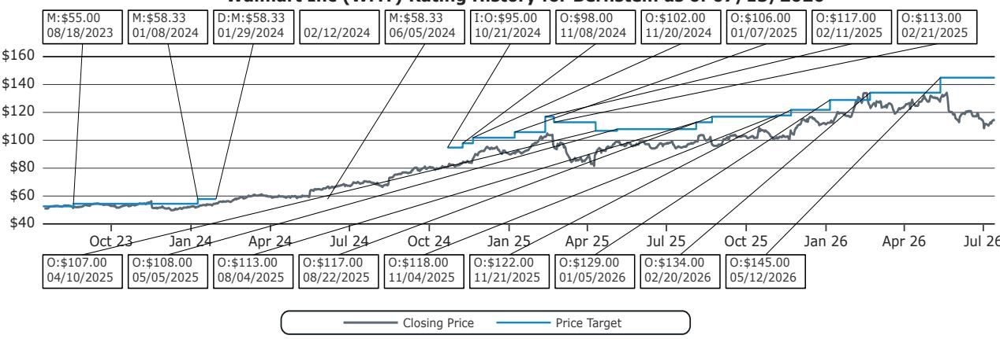

Costco Wholesale Corp (COST) Bernstein评级历史，截至2026年7月13日  
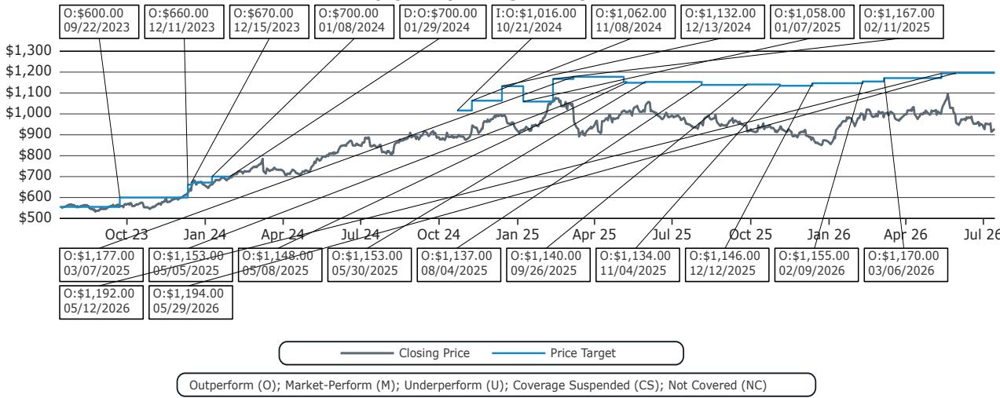

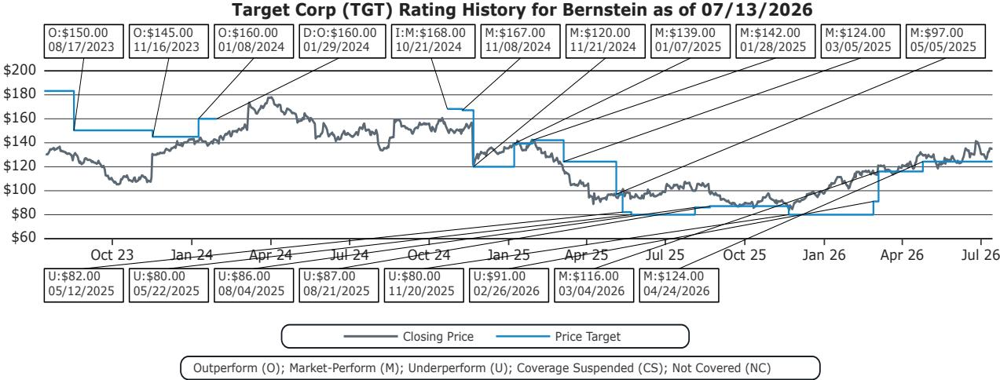  
以上图表中的所有目标价和收盘价数据均以本报告股票列表中注明的货币计价。

## 利益冲突

（利益冲突披露保留，此处省略以保持简洁）

## 其他事项

（其他事项披露保留，此处省略以保持简洁）

## 认证

本报告所列的每位主要负责本报告内容准备的研究分析师均证明，本出版物中表达的所有观点准确反映了该分析师对任何及所有主题证券或发行人的个人观点，并且该分析师的薪酬中没有任何部分直接或间接与本出版物中的具体建议或观点相关。

## II. 额外全球冲突披露

（额外全球冲突披露保留，此处省略以保持简洁）

## III. 其他重要信息与披露

（其他重要信息与披露保留，此处省略以保持简洁）

---

**法律声明**

本报告基于我们认为可靠的公开来源，但我们不保证本报告的准确性或完整性。我们不承担告知您报告信息或观点任何变化的义务。本报告不构成买卖任何证券的要约，也不构成投资、法律或税务建议。本文提及的投资可能不适合您。读者必须根据自身具体情况，在咨询专业顾问后做出自己的投资决策。研究价值可能波动，以外币计价的投资可能因汇率波动而价值波动。过往表现并不保证未来结果。

本报告仅供我们的客户使用，这些客户是上述监管机构定义的"合格对手方"、"专业客户"、"机构读者"和/或"专业读者"，不得分发给上述监管机构定义的零售客户。收到本报告的零售客户应注意，上述实体的服务不适用于他们，他们不应依赖本文材料做出投资决策。

本报告中的信息由Bernstein仅为客户的内部业务使用而准备。客户可以仅为这一有限用途存储、展示、分析、重新格式化并打印本报告中的信息。未经Bernstein明确书面同意，客户不得为任何目的复制、修改、创作衍生作品、转售、逆向工程、商业利用、共享或分发本文所含的任何部分信息。

Bernstein可能在其材料准备过程中使用人工智能工具。任何此类材料在发布前均经过Bernstein研究分析师的审查。

© Bernstein Institutional Services LLC, Bernstein Autonomous LLP, BSG France S.A., Bernstein (Hong Kong) Limited 盛博香港有限公司, Bernstein (Canada) Limited, Bernstein (India) Private Limited, Bernstein (Singapore) Private Limited, Bernstein Japan KK。保留所有权利。本文所含的商标和服务标志为其各自所有者的财产。任何未经授权的使用或披露均被严格禁止。
