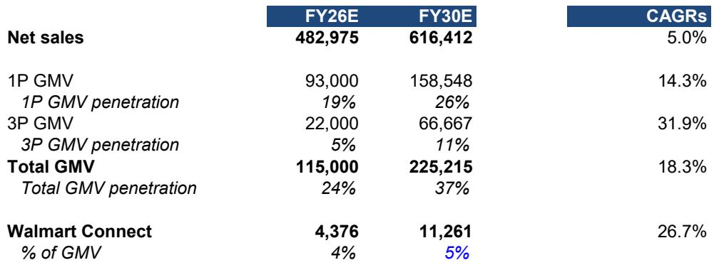

# Bernstein：沃尔玛降价焦虑过度，全渠道利润支撑上行

市场对沃尔玛的担忧，集中在一条看似简单的逻辑链上：竞争对手降价、总统公开施压、沃尔玛自己宣布更多商品降价——这些信号叠加，读者自然担心利润被侵蚀。但Bernstein这份研报的核心判断是，这种担忧被放大了。沃尔玛的定价能力从来不是新闻，真正值得关注的是它如何通过全渠道布局，在未来四年内将美国业务的利润率推高约200个基点。

报告给出的时间窗口很具体：从FY26到FY30，沃尔玛美国业务的EBIT利润率有望从当前水平升至7%。这个数字不是靠压缩成本或提价实现的，而是来自两个结构性引擎——核心电商亏损收窄和零售媒体收入增长。前者预计贡献约100个基点的改善，后者贡献约75个基点。两者加在一起，构成了沃尔玛利润扩张的主要路径。

## 1. 关税退税给了沃尔玛一个罕见的定价缓冲期

读者最直接的担忧来自价格战。但Bernstein指出，沃尔玛的定价策略并非被动应对。报告引用了具体数据：沃尔玛美国杂货的同店通胀率持续低于CPI食品通胀，价差从FY25 Q4的0%扩大到FY27 Q1的1.9%。这意味着沃尔玛在消费者感知中已经建立了明确的价差优势。

更重要的是，沃尔玛有资金来支撑这一策略。报告提到，沃尔玛预计关税退税将接近美国净销售额的50个基点，约30亿美元。这笔钱足以覆盖夏季的降价活动，同时抵消汽油价格通胀带来的成本不确定性。Bernstein的结论是，沃尔玛有足够的空间在定价上灵活操作，而不伤及利润底线。

> **KC评论：** 关税退税这个细节容易被忽略。它不是一次性补贴，而是一个可预期的资金来源，让沃尔玛在降价时不必牺牲利润率。读者看到的是“降价”，但没看到“谁在买单”。

## 2. 电商亏损收窄的路径比市场想象的更清晰

沃尔玛的电商业务长期被视为利润影响。Bernstein估算，FY26年沃尔玛美国核心电商的EBIT利润率为-6%，比FY25的-7%有所改善。这个数字是扣除零售媒体和会员收入后的“裸”亏损。

改善的路径有两个关键抓手。一是自动化履约中心的建设。报告指出，沃尔玛预计基本完成自动化履约能力的建设，这将使其成本接近亚马逊的水平。二是“暗店”网络的扩张。沃尔玛正在美国开发类似山姆会员店在中国已实践的“暗店”模式——将小型门店改造成仅用于配送的仓库，以更低的成本实现同日达覆盖。

Bernstein预计，到FY30年，沃尔玛美国电商业务可以在不依赖零售媒体和会员补贴的情况下实现盈利。这对整体利润率的贡献约为100个基点。

## 3. 零售媒体正在从“附加项”变成“利润引擎”

沃尔玛的零售媒体业务（Walmart Connect）是另一个被低估的变量。报告估算，当前沃尔玛美国零售媒体收入约占GMV的4%，约40亿美元。到FY30年，随着GMV从1150亿美元增长到2250亿美元，这一比例有望升至5%，对应约110亿美元的收入。

增长动力来自几个方向：第三方市场的扩张、全渠道零售媒体平台的深化，以及最近收购的CTV广告平台Vibe.co。Vibe的核心能力是帮助品牌监测和优化联网电视广告的效果，与沃尔玛已有的Vizio硬件和Walmart Connect广告平台形成协同。Bernstein认为，这将提高广告主在沃尔玛生态中的投入意愿。

零售媒体对利润率的贡献约为75个基点。加上电商亏损收窄的100个基点，沃尔玛美国业务的利润率从当前水平到7%的路径已经相当清晰。

> **KC评论：** 零售媒体的利润率远高于零售主业。沃尔玛本质上是在用高毛利的广告收入来补贴低毛利的商品销售。这种“零售+广告”的双轮模式，在亚马逊身上已经验证过。沃尔玛的问题不是能不能复制，而是能复制多少。

## 一个可复用的观察框架：如何判断零售巨头的利润拐点

对于关注零售行业的读者，Bernstein这份报告提供了一个简洁的分析框架。判断一家零售企业是否接近利润拐点，可以看三个指标：电商亏损是否在收窄、零售媒体收入是否在加速增长、定价能力是否足以维持市场份额而不牺牲利润。沃尔玛在这三个维度上都给出了正向信号。

当然，报告没有回避不确定性。关税政策的变化、消费者支出意愿的波动、以及竞争对手的定价策略，都可能影响最终结果。但Bernstein的核心论点是，沃尔玛的利润改善不是靠一次性因素，而是由电商履约效率提升和广告收入增长这两个结构性趋势驱动的。这两个趋势的可持续性，比市场当前讨论的“降价恐慌”更值得关注。

For informational purposes only. Portions may be generated,translated,summarized,or edited with AI assistance based on source materials and may contain omissions or errors. Please verify independently. This is not investment,legal,tax,accounting,or other professional advice.

For informational purposes only. Portions may be generated,translated,summarized,or edited with AI assistance based on source materials and may contain omissions or errors. Please verify independently. This is not investment,legal,tax,accounting,or other professional advice.

