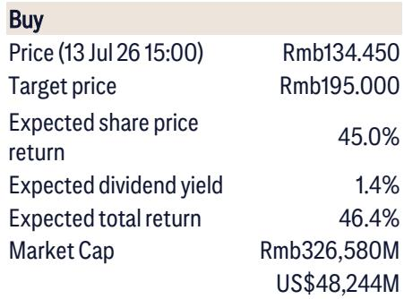
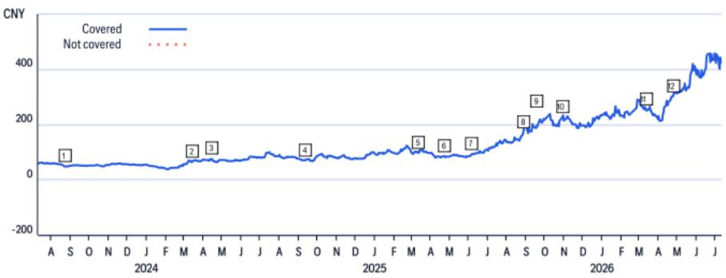

# 生益科技的AI-CCL产品结构变化：不仅是利润故事，更在重塑中国电子供应链的竞争格局

生益科技发布了2026年上半年初步业绩预告，净利润预计为31亿至33亿元人民币，同比增长117%至131%。按中值计算，2026年第二季度净利润约为20亿元，较2025年第二季度增长135%，而2025年第二季度本身已同比增长61%。即使剔除约3.8亿元的非经常性收益（上年同期仅为4800万元），经常性净利润仍实现弹性较高。这一数字超出了某全球研究机构在6月份已将2026-2028年盈利预测上调28%至34%后的预期。

这一加速背后的驱动力并非印刷电路板需求的广泛周期性回升，而是产品结构向AI级覆铜板这一高毛利特种材料的主动且加速转变。据估算，到2026年中，AI-CCL已占生益科技总产量的约15%，而过去一年约为10%。该机构预计，在Vera Rubin平台周期的推动下，这一比例到2026年底将达到约20%。其含义明确：生益科技已不再是一家依赖电子行业整体复苏的普通覆铜板制造商，而正在成为一家专业的AI赋能材料供应商，这一转型的财务成果正在实时显现。

这一转变之所以重要，是因为它发生在更广泛的AI硬件供应链面临估值、产能分配和地缘因素等密集审视的时刻。生益科技的业绩预告提供了一个难得的实证数据点，有助于区分那些拥有真实AI相关运营杠杆的公司与那些仅受益于库存回补的公司。对于关注AI基础设施建设的观察者而言，问题已不再是AI-CCL需求是否存在，而是哪些供应商拥有合适的产品结构、规模和技术地位，能够抓住随之而来的利润空间。

## 生益科技经常性利润加速增长，确认AI-CCL产品结构正带来超越营收增长的运营杠杆

净利润数据引人注目，但更具揭示性的指标是经常性净利润。在2026年第二季度，按预告中值计算，经常性净利润约为17.4亿元，同比增长112%。相比之下，2026年第一季度经常性利润增长率为93.5%。这一增长在环比和同比上均呈现加速态势。

值得注意的是，仅靠营收增长无法解释这一现象。2025年第二季度营收已同比增长35.8%，2026年第一季度营收增长45.1%。然而，2026年第一季度的毛利率达到28.1%，高于2025年第一季度的24.6%，并与2025年第三季度的峰值28.1%持平。营业利润率达到17.7%，同样追平了2025年第三季度的前期峰值。该公司正在缩短每个连续周期达到利润率峰值所需的时间。

其机制简单而有力。AI-CCL的毛利率显著高于标准CCL产品。随着其占总产量的比例从约10%提升至15%并迈向20%，综合毛利率得以扩张，而无需营收同比例增长。这是源于产品结构而非仅产能利用率的运营杠杆。对于一家历史上在商品市场中依赖销量增长的公司而言，这种利润率构成的结构性变化是其近期发展史上最重要的战略进展。

## 生益科技在AI-CCL/PCB链条中，以经常性增长大幅领先同行，揭示业务模式敞口的分化

深南电路，作为AI-CCL和PCB生态系统中的主要同行，也在同一天发布了2026年上半年业绩预告。其隐含的2026年第二季度经常性增长率约为71%。而生益科技约为112%。超过40个百分点的差距并非季度性异常。它反映了两家公司各自在AI供应链中定位的根本差异。

深南电路的业务在PCB基板领域更为多元化，包括BT基板和FC-BGA，涉及通信基础设施、汽车ADAS和数据中心服务器等终端市场。虽然这些终端市场在增长，但它们不具备AI-CCL所提供的相同产品结构升级动力。深南电路在广州的FC-BGA新工厂预计要到2026年才能实现盈亏平衡，比最初指引提前约一年，但仍处于投资阶段。其利润率轨迹正在改善，但这是从一个资本密集度更高的基础上实现的。

相比之下，生益科技受益于对材料链中升级最快部分的集中敞口。该机构的分析明确指出，生益科技的AI-CCL产品结构正因Vera Rubin而上升，并且该公司已在多个平台世代（从GB200到GB300，再到现在的Vera Rubin）中，持续增加其在领先AI GPU设计商处的份额。这不是一个周期的现象。这是一种在行业最苛刻应用中反复获得认证和份额的模式。

对于比较这两家公司的观察者而言，其含义是：生益科技提供了更纯粹的AI材料结构升级标的，而深南电路则提供了更广泛但进展较慢的PCB和基板产能扩张敞口。只要AI-CCL产品结构持续上升，两者经常性利润增长率的差异就可能持续存在。

## 估值溢价由45%的三年每股收益复合年增长率和供应链的结构性转变支撑，而市场尚未为这种持续性定价

从表面上看，这一估值倍数似乎要求较高。但该机构的理由基于2025-2028年三年每股收益复合年增长率达到45%（继2023年下降24%之后）。由此得出的PEG比率为1.2倍，与主要区域同行相当。

支撑这一增长轨迹的有三个结构性因素，每个都值得审视其持久性。

第一，生益科技在全球CCL市场有持续获得市场份额的记录，从2007年的8%上升到2024年的13%。这不是一个静态的市场地位。该公司近二十年来一直在持续获取份额，而AI周期正在加速而非逆转这一趋势。

第二，生益科技是首家进入领先GPU设计商AI供应链的中国CCL企业。这种在认证方面的先发优势形成了国内竞争对手难以迅速逾越的进入壁垒。该机构明确指出，生益科技的技术优势是支撑其估值溢价的关键因素。

第三，地缘环境正在为国内零部件采购创造越来越高的溢价。相关限制措施促使中国AI硬件供应链倾向于本地供应商。生益科技直接受益于这一顺风，且这并非暂时现象。监管环境正朝着结构性本地化转变，而非周期性调整。

这一论点面临的风险真实但可控。AI-CCL订单低于预期、国内消费表现平稳，或5G及物联网产品资本开支不及预期，都可能对盈利构成影响。反之，获得基于ASIC的客户CCL订单、更有利的宏观环境，或AI需求强于预期，则可能带来上行空间。基于当前数据，概率的天平倾向于上行情景。

## 评估当前周期中AI材料敞口的决策框架

对于评估AI硬件供应链敞口的策略制定者而言，生益科技的案例提供了一个可复制的评估材料供应商的框架。该框架包含四个维度。

第一，衡量产品结构转变速度，而不仅仅是营收增长。一家公司可能报告强劲的营收增长，但其产品结构保持不变。关键指标是AI特定产品在总产量或营收中的占比，以及该占比的变化速度。在生益科技的案例中，大约18个月内从10%到15%再到20%的转变，是利润率扩张的主要驱动力。

第二，评估相对于同一生态系统中同行的经常性利润增长。将生益科技112%的经常性增长率与深南电路的71%进行比较，可以揭示哪家公司从相同的潜在需求趋势中捕获了更多的利润上行空间。两者之间的差距比任一相对数值更具信息量。

第三，评估跨平台世代份额增长的持续性。单次认证事件并非趋势。生益科技从GB200到GB300再到Vera Rubin的份额增长模式表明，其技术地位正在深化，而不仅仅是受益于一次性分配。

第四，考虑国内采购的地缘溢价。这一因素不会出现在传统财务模型中，但它现在是中国AI供应链中供应商收入和利润的结构性驱动力。能够同时展现本地化优势和技术领导力的公司，更有可能维持那些按历史标准看似较高的估值溢价。

将这一框架应用于材料和零部件领域的其他公司，可能会揭示出真实AI敞口的广泛差异。许多供应商将报告与AI相关的收入，但很少有公司能像生益科技目前所展示的那样，同时具备产品结构转变速度、经常性利润加速、跨代际份额增长和本地化顺风等组合优势。

## AI-CCL产品结构带来的利润率扩张并非一次性台阶式变化；它是一个多年期的结构性转变，对供应链具有二阶影响

生益科技业绩预告最重要的战略含义是，AI-CCL产品结构的转变仍处于早期阶段。在2026年中占总产量的15%，到年底迈向20%，生益科技的大部分产量仍来自非AI产品。如果这一趋势持续——该机构预计会如此，得益于Vera Rubin周期和潜在的基于ASIC的客户——综合利润率还有进一步扩张的空间。

这对更广泛的供应链具有二阶影响。随着生益科技在AI-CCL上获得更高利润，它获得了竞争对手可能缺乏的定价能力和投资能力。这可能导致市场份额进一步集中，因为缺乏AI认证的小型CCL生产商难以匹配生益科技的研发支出和产能扩张。已经趋于集中的全球CCL市场，头部企业与其余企业之间的差距可能会显著扩大。

对于下游PCB制造商和AI硬件组装商而言，其含义是，随着需求超过供应，AI级层压板的材料成本可能保持高位甚至上升。那些已与生益科技等合格供应商签订长期供应协议的公司，将比那些没有这样做的公司拥有成本优势。AI材料领域供应链关系的战略重要性，在未来几年内很可能会增加，而非减少。

生益科技的业绩预告不仅仅是一个季度的超预期。它是一个信号，表明AI硬件供应链正在经历一场结构性变革，其中具有技术差异化和产品结构灵活性的材料供应商正在捕获越来越大的价值份额。对于那些追踪AI基础设施建设的人而言，信息很明确：关注产品结构，而不仅仅是产量。

*仅供参考。部分内容可能基于源材料通过AI辅助生成、翻译、总结或编辑，可能存在遗漏或错误。请独立核实。本文不构成专业建议。*

仅供参考。部分内容可能基于源材料通过AI辅助生成、翻译、总结或编辑，可能存在遗漏或错误。请独立核实。本文不构成专业建议。

