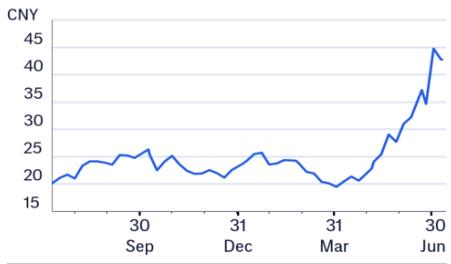
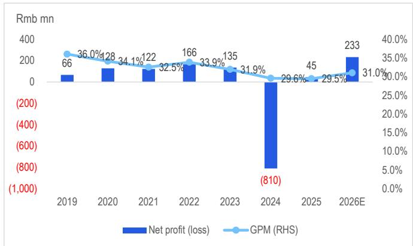
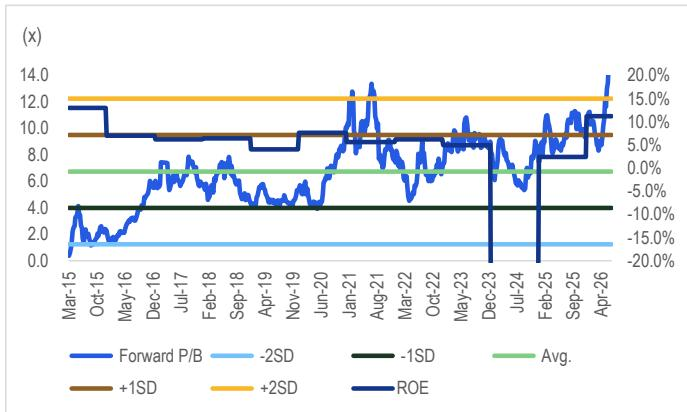
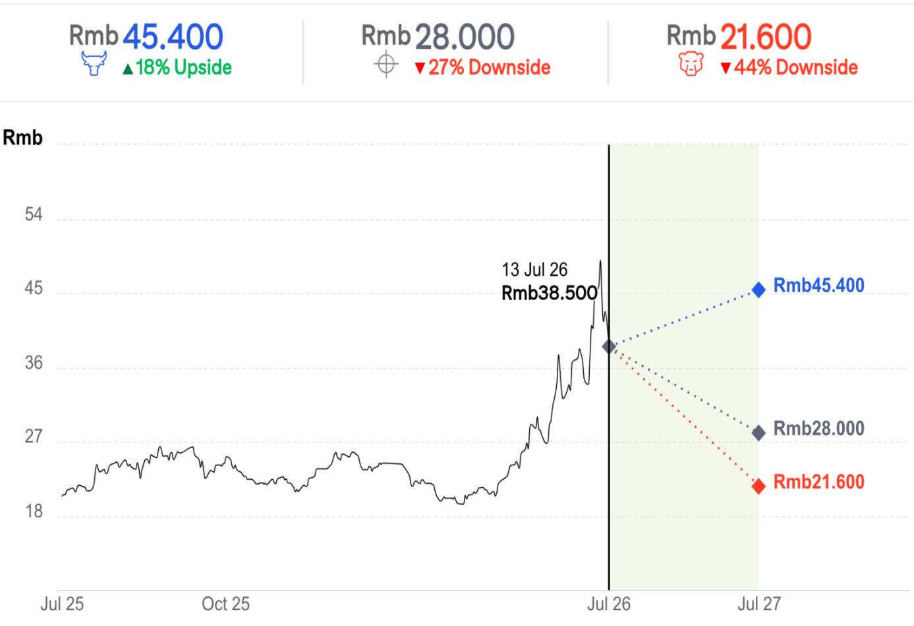

13 Jul 2026 05:08:34 ET | 15 pages

# 埃斯顿 (002747.SZ)

基本面改善但当前报价或已过度反映；维持中性观察

## 核心观点

我们上调2026E/27E盈利预测70%/26%，以反映埃斯顿更好的毛利率表现、资产处置收益及2026年的其他收入；我们同时引入2028E预测。埃斯顿正通过客户多元化（例如拓展赛力斯、吉利等客户，降低对比亚迪的依赖）来改善其毛利率；但我们预计，由于部分领先新能源车企的应收账款质量变化，埃斯顿仍将录得约2000万元的减值损失。我们同时估计，在没有大规模资产重估收益的情况下（2026年一季度为7000万元），2026年二季度的非经营性收入将从一季度的约1亿元降至1000万元。因此，我们预计埃斯顿2026年二季度净利润为2600万元，低于彭博一致预期29%。鉴于埃斯顿年初至今报价上涨约80%，我们认为二季度业绩若低于预期，可能成为短期负面因素。在高估值自动化与机器人标的中，我们相对更关注汇川技术。

2026年二季度预览 – 我们预计埃斯顿2026年二季度毛利润同比增长34%至4.73亿元，主要受15%的收入增长及4.5个百分点的毛利率扩张驱动，这得益于成本优化（如从低成本供应商采购更多减速器）和客户多元化。然而，我们的净利润预估2600万元（同比扭亏，去年同期净亏损600万元）低于市场一致预期29%，因为我们计入了与领先新能源客户相关的2000万元减值损失，且二季度投资收入仅1000万元（一季度为1亿元，其中包含南京工艺的7000万元重估收益）。

收购埃斯顿Codroid – 潜在收购Codroid的初期影响可能偏负面，因其目前处于亏损状态。考虑到Codroid在物理AI/人形机器人开发方面仍处于早期阶段，协同效应存在不确定性。

目标价调整与估值 – 我们的目标价为28元（此前为13.8元），基于2026E市净率12.3倍（此前为2025年市净率6.4倍），设定在历史平均市净率上方2个标准差。尽管我们上调了估值倍数以反映埃斯顿基本面的改善，但我们认为其当前约19倍2026E市净率及约180倍市盈率的估值已较为充分地反映了各项积极因素，使得报价对任何潜在负面因素（如二季度业绩）较为敏感。

## 盈利摘要

<table><tr><td>截至12月31日</td><td>净利润 (百万元)</td><td>摊薄每股收益 (元)</td><td>每股收益增长率 (%)</td><td>市盈率 (倍)</td><td>市净率 (倍)</td><td>净资产回报表现 (%)</td><td>股息率 (%)</td></tr><tr><td>2024A</td><td>-810</td><td>-0.930</td><td>不适用</td><td>不适用</td><td>18.7</td><td>-36.1</td><td>不适用</td></tr><tr><td>2025A</td><td>45</td><td>0.050</td><td>105.4</td><td>不适用</td><td>17.1</td><td>2.4</td><td>不适用</td></tr><tr><td>2026E</td><td>233</td><td>0.241</td><td>382.5</td><td>159.6</td><td>17.0</td><td>11.2</td><td>不适用</td></tr><tr><td>2027E</td><td>273</td><td>0.282</td><td>16.7</td><td>136.7</td><td>15.1</td><td>11.7</td><td>不适用</td></tr><tr><td>2028E</td><td>345</td><td>0.357</td><td>26.8</td><td>107.8</td><td>13.2</td><td>13.1</td><td>不适用</td></tr></table>

来源：dataCentral

## 中性

报价 (13 Jul 26 15:00) 38.500元

目标价 28.000元↑

预期报价变动 -27.3%

预期股息率 0.0%

预期总回报 -27.3%

总市值 33,534百万元

## 报价走势 (RIC: 002747.SZ, BB: 002747 CH)

Jamie Wang $^{AC}$ +852-2501-2772
jamie.ck.wang@citi.com

Eric Lau
+852-2501-2726
eric.h.lau@citi.com

<table><tr><td>利润表 (百万元)</td><td>2024</td><td>2025</td><td>2026E</td><td>2027E</td><td>2028E</td></tr><tr><td>营业收入</td><td>4,009</td><td>4,888</td><td>5,656</td><td>6,649</td><td>7,593</td></tr><tr><td>营业成本</td><td>-2,823</td><td>-3,448</td><td>-3,901</td><td>-4,561</td><td>-5,207</td></tr><tr><td>毛利润</td><td>1,185</td><td>1,440</td><td>1,755</td><td>2,089</td><td>2,385</td></tr><tr><td>毛利率 (%)</td><td>29.6</td><td>29.5</td><td>31.0</td><td>31.4</td><td>31.4</td></tr><tr><td>EBITDA (调整后)</td><td>-92</td><td>307</td><td>448</td><td>563</td><td>664</td></tr><tr><td>EBITDA利润率 (调整后) (%)</td><td>-2.3</td><td>6.3</td><td>7.9</td><td>8.5</td><td>8.7</td></tr><tr><td>折旧</td><td>-93</td><td>-103</td><td>-112</td><td>-126</td><td>-138</td></tr><tr><td>摊销</td><td>-69</td><td>-65</td><td>-59</td><td>-53</td><td>-49</td></tr><tr><td>EBIT (调整后)</td><td>-254</td><td>138</td><td>277</td><td>384</td><td>477</td></tr><tr><td>EBIT利润率 (调整后) (%)</td><td>-6.3</td><td>2.8</td><td>4.9</td><td>5.8</td><td>6.3</td></tr><tr><td>净利息</td><td>-136</td><td>-153</td><td>-100</td><td>-100</td><td>-101</td></tr><tr><td>联营公司</td><td>0</td><td>0</td><td>0</td><td>0</td><td>0</td></tr><tr><td>非经常/例外/其他调整</td><td>-384</td><td>93</td><td>117</td><td>59</td><td>59</td></tr><tr><td>税前利润</td><td>-775</td><td>77</td><td>294</td><td>344</td><td>436</td></tr><tr><td>所得税</td><td>-42</td><td>-32</td><td>-59</td><td>-69</td><td>-87</td></tr><tr><td>非经常/少数股东/优先股股息</td><td>7</td><td>0</td><td>-2</td><td>-2</td><td>-3</td></tr><tr><td>报告净利润</td><td>-810</td><td>45</td><td>233</td><td>273</td><td>345</td></tr><tr><td>净利润率 (%)</td><td>-20.2</td><td>0.9</td><td>4.1</td><td>4.1</td><td>4.6</td></tr><tr><td>核心净利润</td><td>-810</td><td>45</td><td>233</td><td>273</td><td>345</td></tr></table>

报价: 38.500元; 目标价: 28.000元; 总市值: 33,534百万元; 评级: 中性

<table><tr><td>估值比率</td><td>2024</td><td>2025</td><td>2026E</td><td>2027E</td><td>2028E</td></tr><tr><td>市盈率 (倍)</td><td>-41.4</td><td>不适用</td><td>不适用</td><td>不适用</td><td>不适用</td></tr><tr><td>市净率 (倍)</td><td>18.7</td><td>17.1</td><td>17.0</td><td>15.1</td><td>13.2</td></tr><tr><td>EV/EBITDA (倍)</td><td>不适用</td><td>不适用</td><td>78.0</td><td>62.0</td><td>52.6</td></tr><tr><td>自由现金流回报表现 (%)</td><td>-1.3</td><td>0.6</td><td>0.0</td><td>0.0</td><td>0.0</td></tr><tr><td>股息率 (%)</td><td>不适用</td><td>不适用</td><td>不适用</td><td>不适用</td><td>不适用</td></tr><tr><td>派息率 (%)</td><td>0</td><td>0</td><td>0</td><td>0</td><td>0</td></tr><tr><td>净资产回报表现 (%)</td><td>-36.1</td><td>2.4</td><td>11.2</td><td>11.7</td><td>13.1</td></tr></table>

<table><tr><td>现金流量表 (百万元)</td><td>2024</td><td>2025</td><td>2026E</td><td>2027E</td><td>2028E</td></tr><tr><td>EBITDA</td><td>-92</td><td>307</td><td>448</td><td>563</td><td>664</td></tr><tr><td>营运资本变动</td><td>-72</td><td>114</td><td>-104</td><td>-167</td><td>-241</td></tr><tr><td>其他</td><td>84</td><td>87</td><td>-42</td><td>-109</td><td>-129</td></tr><tr><td>经营活动现金流</td><td>-80</td><td>507</td><td>302</td><td>287</td><td>294</td></tr><tr><td>资本支出</td><td>-343</td><td>-312</td><td>-300</td><td>-300</td><td>-300</td></tr><tr><td>净收购/处置</td><td>-1,773</td><td>-1,872</td><td>0</td><td>0</td><td>0</td></tr><tr><td>其他</td><td>1,923</td><td>2,340</td><td>0</td><td>0</td><td>0</td></tr><tr><td>投资活动现金流</td><td>-192</td><td>157</td><td>-300</td><td>-300</td><td>-300</td></tr><tr><td>已付股息</td><td>-52</td><td>0</td><td>0</td><td>0</td><td>0</td></tr><tr><td>融资活动现金流</td><td>289</td><td>-990</td><td>0</td><td>0</td><td>0</td></tr><tr><td>现金净变动</td><td>1</td><td>-323</td><td>2</td><td>-13</td><td>-6</td></tr><tr><td>股东自由现金流</td><td>-423</td><td>194</td><td>2</td><td>-13</td><td>-6</td></tr></table>

<table><tr><td>每股数据</td><td>2024</td><td>2025</td><td>2026E</td><td>2027E</td><td>2028E</td></tr><tr><td>报告每股收益 (元)</td><td>-0.930</td><td>0.050</td><td>0.241</td><td>0.282</td><td>0.357</td></tr><tr><td>核心每股收益 (元)</td><td>-0.930</td><td>0.050</td><td>0.241</td><td>0.282</td><td>0.357</td></tr><tr><td>每股股息 (元)</td><td>0</td><td>0</td><td>0</td><td>0</td><td>0</td></tr><tr><td>每股经营现金流 (元)</td><td>-0.092</td><td>0.563</td><td>0.312</td><td>0.297</td><td>0.304</td></tr><tr><td>每股自由现金流 (元)</td><td>-0.485</td><td>0.216</td><td>0.002</td><td>-0.013</td><td>-0.006</td></tr><tr><td>每股净资产 (元)</td><td>2.057</td><td>2.252</td><td>2.268</td><td>2.549</td><td>2.906</td></tr><tr><td>加权平均普通股 (百万)</td><td>871</td><td>900</td><td>968</td><td>968</td><td>968</td></tr><tr><td>加权平均摊薄股 (百万)</td><td>871</td><td>900</td><td>968</td><td>968</td><td>968</td></tr></table>

<table><tr><td>增长率</td><td>2024</td><td>2025</td><td>2026E</td><td>2027E</td><td>2028E</td></tr><tr><td>营业收入 (%)</td><td>-13.8</td><td>21.9</td><td>15.7</td><td>17.6</td><td>14.2</td></tr><tr><td>EBIT (调整后) (%)</td><td>-213.3</td><td>154.2</td><td>101.0</td><td>38.7</td><td>24.2</td></tr><tr><td>核心净利润 (%)</td><td>-700.1</td><td>105.6</td><td>419.1</td><td>16.7</td><td>26.8</td></tr><tr><td>核心每股收益 (%)</td><td>-681.3</td><td>105.4</td><td>382.5</td><td>16.7</td><td>26.8</td></tr></table>

<table><tr><td>资产负债表 (百万元)</td><td>2024</td><td>2025</td><td>2026E</td><td>2027E</td><td>2028E</td></tr><tr><td>现金及现金等价物</td><td>1,197</td><td>896</td><td>896</td><td>881</td><td>872</td></tr><tr><td>应收账款</td><td>2,407</td><td>2,386</td><td>2,545</td><td>2,793</td><td>3,113</td></tr><tr><td>存货</td><td>1,721</td><td>1,478</td><td>1,672</td><td>1,954</td><td>2,231</td></tr><tr><td>固定资产及其他有形资产</td><td>2,016</td><td>2,138</td><td>2,326</td><td>2,501</td><td>2,663</td></tr><tr><td>商誉及无形资产</td><td>1,835</td><td>1,685</td><td>1,626</td><td>1,573</td><td>1,524</td></tr><tr><td>金融及其他资产</td><td>965</td><td>833</td><td>833</td><td>833</td><td>833</td></tr><tr><td>总资产</td><td>10,141</td><td>9,415</td><td>9,898</td><td>10,534</td><td>11,236</td></tr><tr><td>应付账款</td><td>2,208</td><td>1,900</td><td>2,150</td><td>2,513</td><td>2,869</td></tr><tr><td>短期借款</td><td>1,839</td><td>1,278</td><td>1,278</td><td>1,278</td><td>1,278</td></tr><tr><td>长期借款</td><td>1,353</td><td>1,216</td><td>1,216</td><td>1,216</td><td>1,216</td></tr><tr><td>准备及其他负债</td><td>2,848</td><td>3,003</td><td>3,003</td><td>3,003</td><td>3,003</td></tr><tr><td>总负债</td><td>8,248</td><td>7,396</td><td>7,646</td><td>8,009</td><td>8,365</td></tr><tr><td>股东权益</td><td>1,789</td><td>1,961</td><td>2,195</td><td>2,467</td><td>2,813</td></tr><tr><td>少数股东权益</td><td>104</td><td>58</td><td>58</td><td>58</td><td>58</td></tr><tr><td>总权益</td><td>1,893</td><td>2,019</td><td>2,252</td><td>2,525</td><td>2,870</td></tr><tr><td>净债务 (调整后)</td><td>1,995</td><td>1,598</td><td>1,598</td><td>1,613</td><td>1,622</td></tr><tr><td>净债务权益比 (调整后) (%)</td><td>105.4</td><td>79.2</td><td>70.9</td><td>63.9</td><td>56.5</td></tr></table>

有关此表中项目的定义，请点击此处。

图1. 埃斯顿：盈利预测调整

<table><tr><td>单位：百万元</td><td colspan="3">旧预测</td><td colspan="3">新预测</td><td colspan="3">变动 %</td></tr><tr><td>除非另有说明</td><td>26E</td><td>27E</td><td>28E</td><td>26E</td><td>27E</td><td>28E</td><td>26E</td><td>27E</td><td>28E</td></tr><tr><td colspan="10">利润表</td></tr><tr><td>收入</td><td>6,020</td><td>6,923</td><td>不适用</td><td>5,656</td><td>6,649</td><td>7,593</td><td>-6%</td><td>-4%</td><td>不适用</td></tr><tr><td>毛利润</td><td>1,715</td><td>1,993</td><td>不适用</td><td>1,755</td><td>2,089</td><td>2,385</td><td>2%</td><td>5%</td><td>不适用</td></tr><tr><td>营业利润</td><td>265</td><td>360</td><td>不适用</td><td>277</td><td>384</td><td>477</td><td>4%</td><td>7%</td><td>不适用</td></tr><tr><td>净利润</td><td>137</td><td>217</td><td>不适用</td><td>233</td><td>273</td><td>345</td><td>70%</td><td>26%</td><td>不适用</td></tr><tr><td>每股收益 (元)</td><td>0.158</td><td>0.250</td><td>不适用</td><td>0.241</td><td>0.282</td><td>0.357</td><td>53%</td><td>13%</td><td>不适用</td></tr><tr><td colspan="10">利润率</td></tr><tr><td>毛利率</td><td>28.5%</td><td>28.8%</td><td>不适用</td><td>31.0%</td><td>31.4%</td><td>31.4%</td><td>2.5pp</td><td>2.6pp</td><td>不适用</td></tr><tr><td>营业利润率</td><td>4.4%</td><td>5.2%</td><td>不适用</td><td>4.9%</td><td>5.8%</td><td>6.3%</td><td>0.5pp</td><td>0.6pp</td><td>不适用</td></tr><tr><td>净利润率</td><td>2.3%</td><td>3.1%</td><td>不适用</td><td>4.1%</td><td>4.1%</td><td>4.6%</td><td>1.9pp</td><td>1.0pp</td><td>不适用</td></tr></table>

<table><tr><td>单位：百万元</td><td colspan="3">一致预期</td><td colspan="3">CitiE</td><td colspan="3">CitiE vs. 一致预期</td></tr><tr><td>除非另有说明</td><td>26E</td><td>27E</td><td>28E</td><td>26E</td><td>27E</td><td>28E</td><td>26E</td><td>27E</td><td>28E</td></tr><tr><td colspan="10">利润表</td></tr><tr><td>收入</td><td>5,799</td><td>6,699</td><td>7,629</td><td>5,656</td><td>6,649</td><td>7,593</td><td>-2%</td><td>-1%</td><td>0%</td></tr><tr><td>毛利润</td><td>1,761</td><td>2,060</td><td>2,370</td><td>1,755</td><td>2,089</td><td>2,385</td><td>0%</td><td>1%</td><td>1%</td></tr><tr><td>营业利润</td><td>330</td><td>428</td><td>548</td><td>277</td><td>384</td><td>477</td><td>-16%</td><td>-10%</td><td>-13%</td></tr><tr><td>净利润</td><td>259</td><td>341</td><td>439</td><td>233</td><td>273</td><td>345</td><td>-10%</td><td>-20%</td><td>-21%</td></tr><tr><td>每股收益 (元)</td><td>0.272</td><td>0.356</td><td>0.457</td><td>0.241</td><td>0.282</td><td>0.357</td><td>-11%</td><td>-21%</td><td>-22%</td></tr><tr><td colspan="10">利润率</td></tr><tr><td>毛利率</td><td>30.4%</td><td>30.8%</td><td>31.1%</td><td>31.0%</td><td>31.4%</td><td>31.4%</td><td>0.7pp</td><td>0.7pp</td><td>0.4pp</td></tr><tr><td>营业利润率</td><td>5.7%</td><td>6.4%</td><td>7.2%</td><td>4.9%</td><td>5.8%</td><td>6.3%</td><td>-0.8pp</td><td>-0.6pp</td><td>-0.9pp</td></tr><tr><td>净利润率</td><td>4.5%</td><td>5.1%</td><td>5.8%</td><td>4.1%</td><td>4.1%</td><td>4.6%</td><td>-0.3pp</td><td>-1.0pp</td><td>-1.2pp</td></tr></table>

© 2026 Citi Inc. 未经Citi书面许可不得转载。
来源：彭博，Citi预估

图2. 埃斯顿：季度利润表摘要

<table><tr><td>百万元</td><td>1Q25</td><td>2Q25</td><td>3Q25</td><td>4Q25</td><td>1Q26</td><td>2Q26E</td><td>同比</td><td>环比</td><td>一致预期</td><td>差异</td></tr><tr><td colspan="10">利润表</td></tr><tr><td>净销售额</td><td>1,244</td><td>1,304</td><td>1,255</td><td>1,084</td><td>1,217</td><td>1,500</td><td>15%</td><td>23%</td><td>1,535</td><td>-2%</td></tr><tr><td>毛利润</td><td>352</td><td>353</td><td>378</td><td>358</td><td>370</td><td>473</td><td>34%</td><td>28%</td><td>448</td><td>6%</td></tr><tr><td>营业利润</td><td>5</td><td>18</td><td>28</td><td>19</td><td>120</td><td>33</td><td>77%</td><td>-73%</td><td>35</td><td>-8%</td></tr><tr><td>净利润</td><td>13</td><td>(6)</td><td>22</td><td>16</td><td>98</td><td>26</td><td>538%</td><td>-73%</td><td>37</td><td>-29%</td></tr><tr><td>每股收益 (元)</td><td>0.015</td><td>(0.007)</td><td>0.026</td><td>0.018</td><td>0.101</td><td>0.017</td><td>340%</td><td>-84%</td><td>0.023</td><td>-29%</td></tr><tr><td colspan="10">利润率</td></tr><tr><td>毛利率</td><td>28.3%</td><td>27.0%</td><td>30.1%</td><td>33.0%</td><td>30.4%</td><td>31.5%</td><td>4.5pp</td><td>1.1pp</td><td>29.2%</td><td>2.3pp</td></tr><tr><td>营业利润率</td><td>0.4%</td><td>1.4%</td><td>2.2%</td><td>1.7%</td><td>9.8%</td><td>2.2%</td><td>0.8pp</td><td>-7.7pp</td><td>2.3%</td><td>-0.1pp</td></tr><tr><td>净利润率</td><td>1.0%</td><td>-0.5%</td><td>1.8%</td><td>1.5%</td><td>8.0%</td><td>1.7%</td><td>2.2pp</td><td>-6.3pp</td><td>2.4%</td><td>-0.7pp</td></tr></table>

© 2026 Citi Inc. 未经Citi书面许可不得转载。
来源：公司报告及Citi预估，彭博

图3. 埃斯顿：净利润（亏损）vs. 毛利率

© 2026 Citi Inc. 未经Citi书面许可不得转载。
来源：公司报告及Citi预估

图4. 埃斯顿：远期市净率趋势 vs. 净资产回报表现

© 2026 Citi Inc. 未经Citi书面许可不得转载。
来源：公司报告及Citi预估

## 乐观/悲观情景：埃斯顿 (002747.SZ)

价差 62pp
当前报价及预期回报（上行/下行）截至2026年7月13日

## 乐观假设

\- 因埃斯顿及CLOOS出货量好于预期，估值上调至20.0倍市净率

## 基准假设

\- 基于2026E市净率12.3倍估值

## 悲观假设

\- 埃斯顿及CLOOS出货量低于预期

## 埃斯顿

## 公司简介

南京埃斯顿自动化股份有限公司（埃斯顿）成立于1993年，是中国领先的工厂自动化组件及工业机器人制造商之一，产品广泛应用于太阳能、消费电子、新能源汽车、数控机床、工程机械等多个行业。除自主研发外，埃斯顿还通过收购国际自动化公司（包括德国焊接机器人制造商CLOOS）来增强其核心技术能力。

## 研究策略

我们对埃斯顿持中性观点，主要担忧其当前估值已较为充分地反映了各项积极因素，使得报价对任何潜在负面因素（如二季度业绩可能低于预期）较为敏感。

## 估值方法

由于埃斯顿盈利波动较大，我们采用市净率作为估值方法。我们的目标价28.0元基于2026E市净率12.3倍，设定在历史平均市净率上方2个标准差，以反映埃斯顿基本面的改善。

## 风险因素

可能导致埃斯顿报价高于我们目标价的主要上行风险包括：1）工业机器人出货量或市场份额增长强于预期；2）因原材料成本下降或价格竞争缓解，毛利率好于预期；3）有利的汇率变动。

## 汇川技术

(688017.SS; 379.51元; 1; 13 Jul 26; 15:00)

## 估值方法

我们对汇川技术的目标价496元基于2027E市盈率322倍，设定在+1.5倍标准差，以反映其在人形机器人和工业机器人领域高于预期的可见度。

## 风险因素

可能导致报价偏离我们目标价的主要基本面下行风险包括：1）自动化市场增长放缓；2）行业整合导致来自外资或本土品牌的竞争加剧；3）原材料成本上升侵蚀毛利率；4）人形机器人及其他新兴应用领域的贡献低于预期。

如果您有视觉障碍并希望与Citi代表就本文档中图形的细节进行沟通，请致电美国1-888-500-5008（TTY: 711），或从美国境外拨打+1-210-677-3788。

## 附录A-1

## 分析师认证

主要负责本研究报告准备和内容的研究分析师要么在作者栏中以“AC”标识，要么以粗体列出，其内容归属于该分析师。如果作者栏中指定了多位AC分析师，则每位分析师仅对其负责的部分进行认证，但以下情况除外：(a) 归属于另一位以粗体列出的AC认证分析师的内容，以及(b) 仅针对特定发行人的观点，该观点归属于该发行人下方价格图表或评级历史表中标识的另一位AC认证分析师。每位分析师就其负责的报告部分认证：(1) 其中表达的观点准确反映了他们对每个
