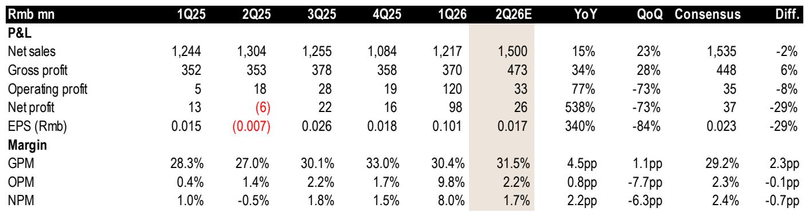
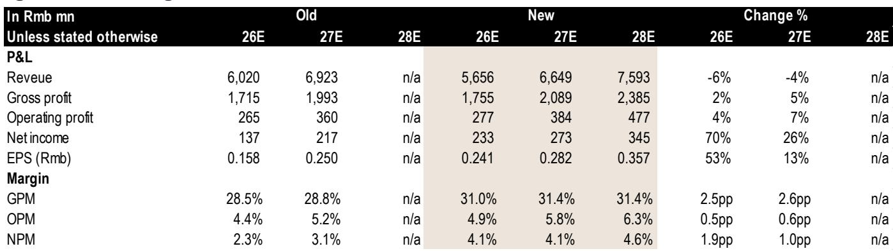
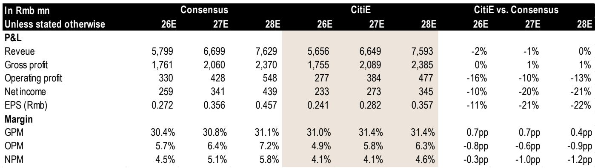

# 埃斯顿：市场定价已提前反映运营改善，但现金收益尚未兑现

埃斯顿自动化今年以来的市场报价累计上涨约80%，驱动因素来自基本面改善的叙事。公司正在分散客户基础，减少对比亚迪的过度依赖，通过采购更低成本的减速器来扩大毛利率，并受益于一次性资产重估收益。然而，表象之下，2026年第二季度相比第一季度可能出现明显放缓，当前公司报价约为账面价值的19倍、收益的180倍。在这些水平上，市场正在将未来多年的改善预期浓缩到一个季度的热情中。核心矛盾在于：埃斯顿的运营轨迹确实在改善，但改善的速度和持续性被估值所夸大，而这一估值几乎没有为任何程度的失望留下空间。

2026年第一季度的业绩报告形成了一个具有误导性的基准。9800万元人民币的净利润中，包含了约7000万元来自南京一工（埃斯顿持股的滚珠丝杠和直线导轨制造商）的重估收益。剔除这一非经营性收益后，基础收益接近3000万元。2026年第二季度净利润预估为2600万元，这并非崩盘，而是正常化。但市场当前的定价，仿佛第一季度业绩的节奏是可以持续的。这种认知与构成之间的差距，是当前价位持有该公司的核心风险。

---

## 毛利率通过成本工程和客户多元化实现扩张，但营业利润增长落后于叙事

埃斯顿业务中最扎实的改善是毛利率。2026年第二季度预估毛利润为4.73亿元，在仅15%的收入增长基础上同比增长34%。这意味着毛利率扩张约4.5个百分点，由两个可识别的机制驱动。

首先，埃斯顿正在将减速器采购转向成本更低的供应商。减速器是工业机器人中的关键机械部件，高端与二线供应商之间的成本差异可能相当显著。这是一种经典的成本工程策略：产品规格不变，但物料清单发生变化。这是一个有效的策略，但空间有限。一旦低成本供应商基础被充分利用，进一步的毛利率扩张必须来自定价能力或产品组合的转变，而在竞争激烈的自动化市场中，这两者都无法保证。

其次，公司正在分散客户基础。历史上，埃斯顿的收入高度集中于比亚迪——中国领先的电动汽车制造商。这种集中带来了定价压力和应收账款风险。向赛力斯和吉利的渗透降低了对单一客户的依赖，并赋予埃斯顿在商业谈判中更多筹码。多元化带来的毛利率提升是真实的，但它是渐进的。新客户关系需要时间才能发展到有意义的收入贡献。

关键点在于，毛利率的改善并未以相同速率传导至营业利润。2026年第二季度营业利润预估为3300万元，意味着营业利润率仅为2.2%，仅略高于2025年第二季度的1.4%。读者通常期望的与利润率扩张相关的经营杠杆，正被两项结构性成本所吸收：减值损失和非经营性收入的波动。

---

## 隐性扣减：来自领先新能源车客户的减值损失是共识低估的经常性拖累

埃斯顿的客户多元化策略是一个长期利好，但这并未消除其对最大新能源车客户的遗留敞口。报告估计，2026年第二季度与领先新能源车客户应收账款质量恶化相关的减值损失约为2000万元。这并非一次性事件。它反映了一个结构性现实：随着中国新能源车市场成熟和竞争加剧，即使是大型车企的支付行为也变得不那么可靠。埃斯顿的资产负债表上，应收账款为25亿元，而权益仅为22亿元。这些应收款可收回性的任何恶化，都会直接影响报告收益。

市场共识似乎并未完全反映这一拖累。报告对2026年第二季度净利润的预估为2600万元，比彭博共识的3700万元低29%。这一差异并非由收入或毛利润驱动，这两项的预估彼此相差在2%以内。它完全由减值假设和投资收益的正常化驱动。市场正在定价一个干净的收益流，但实际现金流正被过去几年推动收入增长的客户关系所侵蚀。

这造成了一种令人不安的动态。毛利率的故事是真实的，但它不足以克服应收账款质量带来的收益拖累。只关注营收和毛利率趋势的读者，正在忽略利润表中最重要的项目。

---

## 收购埃斯顿Codroid增加战略选择权，但立即带来收益稀释

埃斯顿潜在收购其子公司埃斯顿Codroid（专注于物理AI和人形机器人）为投资主题增加了新的复杂性。初始影响将是负面的，因为Codroid目前处于亏损状态。该公司处于早期发展阶段，商业化和盈利时间表尚不明确。

战略逻辑是可以理解的。人形机器人是一个在中国市场享有高估值的主题，而埃斯顿现有的工业机器人制造能力为其提供了实现生产规模的潜在路径。但这种协同效应是推测性的。没有证据表明Codroid的技术足够差异化以证明收购价格的合理性，且整合风险是实质性的。

对于一只已经以180倍收益交易的公司而言，增加一个前景不确定的亏损子公司并不会改善风险回报状况。它为看涨论点增添了叙事燃料，但也增加了真实的现金消耗。在埃斯顿核心工业机器人业务面临任何逆风的情况下，收购Codroid可能成为合并收益的重大拖累。

---

## 估值：19倍账面价值和180倍收益，已无空间容纳正在进行的正常化

估值方法采用市净率框架，鉴于埃斯顿收益的波动性，这是合适的。目标倍数为2026年预估账面价值的12.3倍，设定在历史均值上方两个标准差，明确反映了基本面的改善。即使在这一较高的倍数下，隐含的下行空间也是可观的。

按当前市场报价计算，埃斯顿的交易价格约为2026年预估账面价值的19倍，以及2026年预估收益的约180倍。这些倍数隐含了一个假设：2026年第一季度的收益节奏是可持续的，且减值损失和非经营性收入波动将消退。数据表明情况恰恰相反。2026年第二季度预估净利润2600万元，较第一季度环比下降84%，而2026年全年预估净利润2.33亿元意味着下半年的节奏仅略高于上半年。

看涨情形假设重新评级至20倍账面价值，这需要埃斯顿及其德国焊接机器人子公司CLOOS的出货量好于预期。这是可能的，但并非基准情形。基准情形已经包含了慷慨的倍数扩张。看跌情形假设出货量低于预期，这将压缩倍数并使公司面临显著下行风险。

---

## 读者的决策框架：区分基本面改善与估值极端

对于考虑在当前价位关注埃斯顿的观察者而言，分析任务是将运营故事与价格分开。运营故事有其真实价值。毛利率正在通过成本工程和客户多元化扩张。收入增长在2024年下滑后趋于稳定。公司拥有有形资产，并在中国工业自动化领域占据市场地位。

但价格已经反映了这种改善，甚至更多。公司报价今年迄今上涨80%，而2026年预估净利润预估上调了70%。收益修正已被完全定价，估值现在需要持续的正面惊喜才能证明当前水平的合理性。风险在于，第二季度业绩（很可能显示净利润环比大幅下降）将重置预期向下。

决策框架归结为三个问题。首先，一旦低成本供应商转型完成，毛利率扩张能否以同样的速度持续？其次，随着竞争加剧，来自新能源车客户的减值损失会稳定还是增加？第三，收购Codroid是创造战略价值，还是仅仅增加收益稀释？

报告对前两个问题提供了明确的答案。随着低成本供应商收益的实现，毛利率扩张可能会放缓。减值损失是结构性的，而非周期性的。第三个问题更不确定，但即时影响是负面的。总体而言，证据支持谨慎立场。基本面正在改善，但估值已经过度。

---

*仅供参考。部分内容可能基于源材料通过AI辅助生成、翻译、总结或编辑，可能存在遗漏或错误。请独立核实。本文不构成任何专业建议。*

仅供参考。部分内容可能基于源材料通过AI辅助生成、翻译、总结或编辑，可能存在遗漏或错误。请独立核实。本文不构成任何专业建议。

