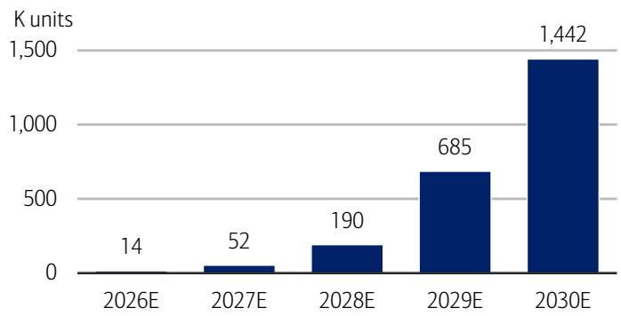
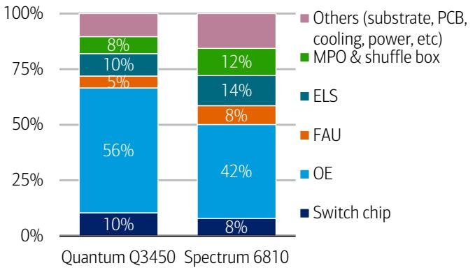
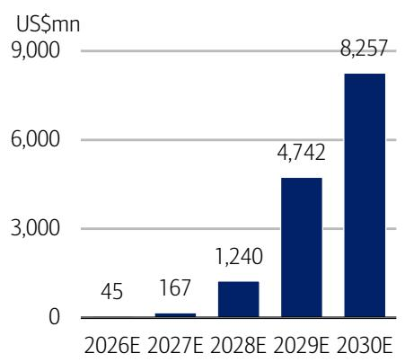
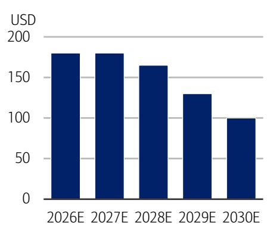
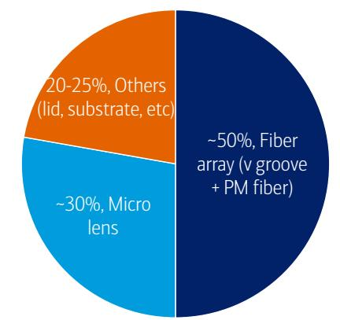
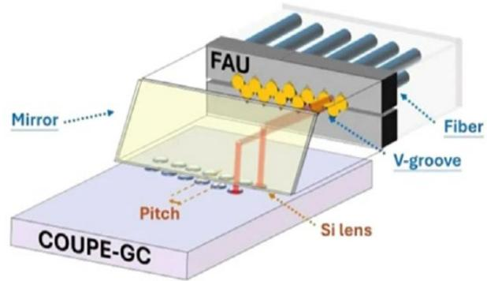
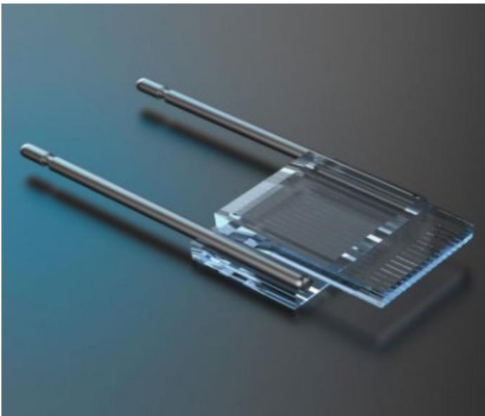

# Tech Hardware - Asia Pacific

# The essence of FAU: alignment and automation

Industry Overview

## FAU: lots of new entrants, but few likely winners

FAU acts as a highway connecting fiber to the optical engine for data transmission, and is essential to pluggable transceiver/NPO/CPO. Currently, FAUs are mostly supplied by legacy Asia supply chains, and FAU for CPO is 100% supplied by a vendor in the region. We see more new entrants aiming to ramp up CPO/FAU-related components – e.g. fiber array, micro lens, prism, etc. However, in our view, not many of them could succeed due to high entry barriers, and we see Largan's progress as faster than other new entrants as it has moved on to certification after sampling/testing for two quarters. We highlight two key bottlenecks: (1) micron-level alignment, i.e. controlling the pitch tolerance at ≤ ±0.5μm or even lower to ensure low-loss transmission; and (2) automatic alignment and testing to deliver consistent tolerance while lift efficiency. We note this know-how will take years of accumulated experience in precision optic manufacturing, mass production, as well as strong in-house automation capability.

## CPO to take off in '28-29; FAU at 5-10% BOM/ \$8bn TAM

Based on our checks, Nvidia's CPO switch volume may remain relatively low near-term, and a meaningful volume could happen in 2028-29, on rising penetration at scale-up. BofA tech team expects Nvidia CPO switch shipments to reach 14k/52k/190k units in 2026/27/28E. Among key components, we expect FAU to contribute 5-10% of the BOM, with the ASP ranging from US\$80-200. The TAM for FAU in Nvidia CPO switches could hit US\$8bn by 2030E. Amid multiple new optical solutions, we believe pluggable will remain a mainstream in scale-out into 2028-30. Within scale-up, the penetration of NPO and CPO depends on key CSPs' preference as well as CPO's overall yield and cost.

## GlassBridge: in early stage, not a replacement for FAU

Amid market's concern about potential threat from Corning's GlassBridge solution (to replace FAU), we argue that GlassBridge is still at an early stage, and is unlikely to be adopted in current and next-generation CPO design. Although GlassBridge could indeed improve the assembly yield, several bottlenecks need to be addressed, including misalignment with PIC due to the waveguide's uneven surface, rising manufacturing difficulty when channel numbers rise to $70+$ , etc. Also, under GlassBridge solution, a fiber array is still needed but likely with a lower precision-alignment requirement.

## Upgrade Largan to Buy, Neutral on Sunny Optical

We see the datacom supply chain as a more closed ecosystem vs consumer electronics, given much higher requirements. Besides capability, customer engagement is another key. We upgrade Largan to Buy from Neutral on faster progress at CPO (see Largan report). We reiterate Neutral on Sunny Optical given the lack of concrete projects.

## 14 July 2026

Equity
Asia Pacific
Tech Hardware

Katherine Zhu >>
Research Analyst
BofA (Hong Kong)
kexin.zhu@bofa.com

Robert Cheng >>
Research Analyst
BofA (Taiwan)
robert.cheng@bofa.com

Doris Kao >>
Research Analyst
BofA (Taiwan)
doris.kao@bofa.com

For acronyms, please refer to Exhibit 13

## FAU in CPO: \$8bn TAM by '30 on volume take-off from '28

Based on our supply chain check, Nvidia's CPO switch shipment may remain relatively low near-term, and a meaningful volume likely takes off in 2028-29 following rising penetration at scale-up. BofA tech team expects volume to reach 14k/52k/190k units in 2026/27/28E. Among key components, optical engine (OE) acts as the core to convert electric and light signals, while FAU acts as a highway connecting optical fiber and optical engine for data transmission. Outside of CPO switch, external laser source (ELS) is responsible for projecting laser that helps drive light signal through optical fiber, while MPO/MMC are connectors that connect optical fibers housed in the shuffle box to external ports. Looking at the BOM of a CPO switch, optical engine, ELS, and FAU are likely contribute $40 - 55\%$ , $10 - 15\%$ and $5 - 10\%$ of the total BOM, respectively.

Specifically for FAU, we believe its TAM in Nvidia CPO switch could reach US\$8bn by 2030E, based on an assumption of 1.4mn units of CPO switch and 115 units of 1.6T equivalent OEs per switch. Our check suggests FAU's ASP ranges from US\$80-200, depending on current specs. General FAU consists of fiber array (V-groove and optical fiber), lid, substrate and casing, etc, while some high-end FAU also integrate optical components like micro lens, prism and MT ferrules. For example, Spectrum 6810 adopts 36 channels of dFAU, and dFAU pricing could be in the range of US\$150-200. With volume gradually rising into 2030, the ASP could fall to US\$100. However, as specs migrate to 70-100 channels and potential multi-layer design, FAU could witness content value upside.

Exhibit 1: We expect Nvidia CPO switch shipment to reach 14k/52k/190k units in 2026/27/28E
Nvidia CPO switch shipment, 2026-30E  
  
Source: BofA Global Research estimates  
BofA GLOBAL RESEARCH

Exhibit 3: We estimate FAU value per switch could reach US\$6-7k Nvidia CPO switch BOM analysis

<table><tr><td>US$</td><td>Quantum Q3450</td><td>Spectrum 6810</td></tr><tr><td>Switch chip</td><td>12,000</td><td>5,000</td></tr><tr><td>OE</td><td>64,800</td><td>32,400</td></tr><tr><td>FAU</td><td>6,120</td><td>6,480</td></tr><tr><td>ELS</td><td>11,700</td><td>10,400</td></tr><tr><td>MPO &amp; shuffle box</td><td>8,760</td><td>9,400</td></tr><tr><td>Others (substrate, PCB, cooling, power, etc)</td><td>15,000</td><td>15,000</td></tr><tr><td></td><td>118,380</td><td>78,680</td></tr></table>

Source: BofA Global Research estimates  
BofA GLOBAL RESEARCH

Exhibit 2: Spectrum 6810 features 36 FAUs (include 4 redundancy)
Nvidia CPO switch component summary

<table><tr><td></td><td>Quantum X800Q3450</td><td>Spectrum 6810</td><td>Spectrum 6800</td></tr><tr><td>Switch chip</td><td>4</td><td>1</td><td>4</td></tr><tr><td>OE</td><td>72</td><td>36</td><td>144</td></tr><tr><td>FAU</td><td>72</td><td>36</td><td>144</td></tr><tr><td>ELS</td><td>18</td><td>16</td><td>64</td></tr><tr><td>Laser</td><td>144</td><td>128</td><td>512</td></tr><tr><td>MPO/MMC</td><td>144</td><td>128</td><td>512</td></tr></table>

Source: Company data, BofA Global Research  
BofA GLOBAL RESEARCH

Exhibit 4: FAU roughly contributes $5 - 10\%$ BOM of a Nvidia CPO switch Nvidia Quantum and Spectrum CPO switch BOM analysis  
  
Source: BofA Global Research estimates  
BofA GLOBAL RESEARCH

Exhibit 5: We expect FAU's TAM for CPO switch to reach US\$8bn by 2030E
FAU (for CPO) TAM analysis, 2026-30E

  
Source: BofA Global Research estimates  
BofA GLOBAL RESEARCH  
Exhibit 6: We see dFAU ASP at around USD180 in recent 1-2 years  
dFAU ASP trend (36-channel, 3.2T equivalent), 2026-30E

  
Source: BofA Global Research estimates  
BofA GLOBAL RESEARCH

Exhibit 7: FA likely to contribute 50% of the BOM, followed by micro lens at \~30%
BOM analysis of FAU (with micro lens, prism etc)  
  
Source: BofA Global Research estimates  
BofA GLOBAL RESEARCH

Exhibit 8: Key FAU suppliers are mostly located in Asia (China, Japan, Taiwan)
Key suppliers in CPO supply chain

<table><tr><td>Component</td><td colspan="6">Key suppliers</td></tr><tr><td>Optical engine</td><td>Nvidia</td><td>Broadcom</td><td>Marvell</td><td colspan="3">TSMC (foundry)</td></tr><tr><td colspan="7">FAU</td></tr><tr><td>V-groove</td><td>TFC</td><td>Senko</td><td>Orbray</td><td>Corning</td><td>Focuslight</td><td></td></tr><tr><td>Optical fiber</td><td>Corning</td><td>Fujikura</td><td>YOFC</td><td></td><td></td><td></td></tr><tr><td>Micro lens</td><td>TFC</td><td>Coherent</td><td>Focuslight</td><td>Largan</td><td>Himax</td><td></td></tr><tr><td>FAU</td><td>TFC</td><td>Senko</td><td>FOCI</td><td>Coherent</td><td>Corning</td><td>Largan (potential)</td></tr><tr><td colspan="7">ELS</td></tr><tr><td>Laser</td><td>Lumentum</td><td>Coherent</td><td>Broadcom</td><td>Furukawa</td><td>Yuanjie</td><td>DS Precision</td></tr><tr><td>Module</td><td>TFC</td><td>Lumentum</td><td>Coherent</td><td>Innolight</td><td>Eoptolink</td><td>DS Precision</td></tr><tr><td>Shuffle box</td><td>Corning (T&amp;S)</td><td>Browave</td><td>Senko</td><td>Molex</td><td>TFC</td><td></td></tr><tr><td>MPO/MMC</td><td>US Conec</td><td>Senko</td><td>T&amp;S</td><td></td><td></td><td></td></tr><tr><td>Assembly/testing</td><td>Fabrinet</td><td>Hon Hai/FII</td><td>ASE/SPIL</td><td>USI</td><td></td><td></td></tr><tr><td>Equipment</td><td>Chroma</td><td>FiconTEC</td><td></td><td></td><td></td><td></td></tr></table>

Source: BofA Global Research  
BofA GLOBAL RESEARCH

## Alignment and automation lift entry barrier

FAU acts as a highway connecting optical fiber to the optical engine for data transmission, and is essential to pluggable transceiver/NPO/CPO. Currently, FAUs are mostly supplied by legacy Asia supply chains, while FAU for CPO is 100% supplied by vendors in the region. We highlight two key bottlenecks faced by the supply chain: (1) micron-level alignment, i.e. controlling the pitch error tolerance at $\leq\pm0.5\mu m$ (or even $\leq\pm0.3\mu m$ ) to ensure light signal efficiency; and (2) automatic alignment to deliver consistent accuracy while lifting efficiency.

## Alignment: solving the pitch tolerance

Fiber array used in FAU acts as a multi-lane highway for light, allowing multiple data channels to be connected simultaneously with the optical engine for conversion of electronic and light signals. Under a fiber array, multiple optical fibers are densely seated on a V-groove (features parallel and microscopic V-shaped channels). The process requires highly precise alignment to achieve low-loss transfer. To compare, an optical

transceiver usually has a pitch tolerance (i.e. alignment accuracy) of $\pm0.5\mu m$ to $\pm1.0\mu m$ . NPO's pitch tolerance is likely at $\leq\pm0.5\mu m$ , while CPO's pitch tolerance could be $\leq\pm0.3\mu m$ . As V-groove and fiber also have their own geometric tolerance, alignment error could accumulate linearly when channel numbers rise. V-groove's etching depth and angle variation could introduce misalignment from channel to channel. Even if a V-groove is perfectly etched, optical fiber could also lead to alignment difficulties. A single-mode fiber generally has a diameter of 80-125 $\mu m$ (core at 6-10 $\mu m$ ); any diameter variation of a fiber could cause it to sit higher or lower on a V-groove, leading to alignment mismatch. Additionally, for dFAU, maintaining positioning tolerance after multiple detach/plug processes is also key.

This level of precision alignment usually requires years of accumulation, deep know-how in optic coupling and mass production experiences. Although smartphone optic suppliers could leverage their active alignment (AA) know-how used in lens/module, the level of precision still has a big gap (for example, telephoto camera's AA tolerance is $\leq \pm 5\mu \mathrm{m}$ ).

## Automation: crucial when channel numbers continue rising

As optical fiber channel numbers are expected to increase to 60-100 from the current 20-36 channels while CPO volume is waiting for take-off in 2028-29, fiber array alignment based on labor-intensive process looks increasingly difficult. Thus, automation becomes crucial. It could not only reduce labor intensity and lift efficiency, but more importantly help troubleshoot alignment issues and improve accuracy. As the industry has no standard automation/testing at current stage, suppliers able to ramp up automation faster or have in-house automation capability could have a better edge.

Exhibit 9: FAU assembles PM fibers on a V-groove to direct light, and leverages micro lens and prism to project light onto PIC
Illustration of FAU under grating coupler solution  

Exhibit 10: CPO has the lowest pitch error tolerance at ≤ ±0.3μm
FAU spec summary under different applications

<table><tr><td></td><td>Pluggable transceiver</td><td>NPO</td><td>CPO</td></tr><tr><td>FAU location</td><td>Inside module</td><td>On host PCB</td><td>On substrate</td></tr><tr><td>Pitch error tolerance</td><td>±0.5μm - ±1.0μm</td><td>≤ ±0.5μm</td><td>≤ ±0.3μm</td></tr><tr><td>Channel count</td><td>4 to 16</td><td>16 to 32</td><td>32 to 128+</td></tr><tr><td>Insertion loss target</td><td>&lt;0.5dB</td><td>&lt;0.3dB</td><td>&lt;0.2dB</td></tr></table>

Source: BofA Global Research  
BofA GLOBAL RESEARCH  
Source: FOCI  
BofA GLOBAL RESEARCH

## GlassBridge not a threat near-term, also not a replacement

We note market's concern about Corning's GlassBridge, a wafer-based fiber-to-PIC technology, which could be an alternative solution to FAU. We argue that GlassBridge is still at an early stage and is unlikely to be adopted in current and next-generation CPO design. Although GlassBridge could indeed improve the assembly yield, several bottlenecks need to be addressed, including misalignment with PIC due to the waveguide's uneven surface (due to edge coupling), rising manufacturing difficulty when channel numbers rise to 70+, etc. Further, GlassBridge uses edge coupling technology – i.e. horizontal coupling, with light projected directly into the PIC horizontally. Compared with grating coupling (vertical coupling), edge coupling is not able to conduct wafer-scale testing, leading to potentially lower efficiency. The horizontal design also faces space limitations and demands an extreme alignment requirement.

Exhibit 11: GlassBridge is a wafer-based fiber-to-PlC technology platform
Corning's GlassBridge connector  

Exhibit 12: Edge coupling is more efficient in insertion loss, but faces limitation in terms of wafer-level testing and spatial constraint
Comparison of grating coupling and edge coupling

<table><tr><td></td><td>Grating coupling</td><td>Edge coupling</td></tr><tr><td>Coupling type</td><td>Vertical</td><td>Horizontal</td></tr><tr><td>Insertion loss</td><td>Good efficiency</td><td>High efficiency</td></tr><tr><td>Alignment tolerance</td><td>High</td><td>Extreme</td></tr><tr><td>Wafer level testing</td><td>Yes</td><td>No</td></tr><tr><td>Spatial constraint</td><td>No</td><td>Yes</td></tr></table>

Source: BofA Global Research  
BofA GLOBAL RESEARCH  
Source: Corning  
BofA GLOBAL RESEARCH

Exhibit 13: Summary of acronyms used in this report
Acronym

<table><tr><td colspan="2">Acronym</td></tr><tr><td>AI</td><td>Artificial Intelligence</td></tr><tr><td>ASP</td><td>Average Selling Price</td></tr><tr><td>BOM</td><td>Bill of Materials</td></tr><tr><td>CPO</td><td>Co-packed Optics</td></tr><tr><td>ELS</td><td>External Laser source</td></tr><tr><td>FA</td><td>Fiber Array</td></tr><tr><td>FAU</td><td>Fiber Array Unit</td></tr><tr><td>dFAU</td><td>Detachable Fiber Array Unit</td></tr><tr><td>MPO</td><td>Multi-fiber Push-On</td></tr><tr><td>MMC</td><td>Multiport Modular Connector</td></tr><tr><td>MT</td><td>Mechanical Transfer</td></tr><tr><td>NPO</td><td>Near-packaged Optics</td></tr><tr><td>OE</td><td>Optical Engine</td></tr><tr><td>PIC</td><td>Photonic Integrated Circuit</td></tr><tr><td>PCB</td><td>Printed Circuit Board</td></tr></table>

Source: BofA Global Research  
BofA GLOBAL RESEARCH  
Source: BofA Global Research

Exhibit 14: Stocks mentioned in this report
Stocks mentioned

<table><tr><td>BofA Ticker</td><td>Bloomberg Ticker</td><td>Company Name</td><td>Price (LC)</td><td>Rating</td></tr><tr><td>LGANF</td><td>3008 TT</td><td>Largan Precision</td><td>4345.00</td><td>B-1-7</td></tr><tr><td>SNPTF</td><td>2382 HK</td><td>Sunny Optical</td><td>55.05</td><td>C-2-8</td></tr></table>

BofA GLOBAL RESEARCH

## Investment Rationale

## Largan Precision

We have a Buy rating on Largan, eyeing on rising visibility on potential CPO project gain. We believe CPO will drive valuation a re-rating and a potential earning upside from 2028E. Besides, legacy business should stay resilient thanks to iPhone's multi-year spec upgrade cycle.

## Price objective basis & risk

## Largan Precision (LGANF)

Our PO of NT\$5,600 is based on 25x 2028E P/E. 25x is at Largan's historical peak P/E during last earnings upcycle. We believe CPO take-off from 2028 will drive another new multi-year earnings upcycle for Largan, justifying our valuation multiple.

Downside risks are: 1) weaker than expected end-demand, which leads to pressured topline and margin on lower utilization rate, 2) more intense competition from Greater China competitors including Sunny Optical, Genius and AAC, 3) slower than expected spec upgrade, and 4) slower than expected progress at CPO.

Upside risks are: 1) better than expected end demand and faster than expected spec upgrade, 2) higher than expected ASP and market on competitors' inferior execution, 3) eased competition from key peers, and 4) faster than expected progress at CPO.

## Sunny Optical (SNPTF)

We set our PO at HK\$69, on 17x 2026E P/E, we view 17x, around -0.5SD, is justified by potentially slower margin improvement amid uncertainties at smartphone shipment and spec into 2026, while reflect business diversification into datacom.

Downside risk: (1) demand at consumer electronics further deteriorate with continuous de-spec, (2) slower than expected share gain at iPhone, (3) slower-than-expected auto momentum and slower ADAS penetration, (4) intensified competition at both smartphone and auto. (5) Government subsidy is removed.

Upside risk: (1) better than expected demand/spec at consumer electronics, (2) faster than expected share gain at iPhone, (3) strong auto momentum and faster ADAS penetration, (4) eased competition at both smartphone and auto, and (5) faster than expected progress at datacom.

## Analyst Certification

We, Katherine Zhu and Robert Cheng, hereby certify that the views each of us has expressed in this research report accurately reflect each of our respective personal views about the subject securities and issuers. We also certify that no part of our respective compensation was, is, or will be, directly or indirectly, related to the specific recommendations or view expressed in this research report.

## Special Disclosures

Information on securities which are listed on the exchanges where ML Securities (Taiwan) Limited is not permitted to trade or solicit trades for clients is for informational purposes only and is not a recommendation or a solicitation to trade such securities. ML Securities (Taiwan) Limited will not execute transactions for nor accept orders from clients to trade such securities. Foreign investment in Taiwan securities is regulated and restricted. Currently, foreign investment in Taiwan securities is permitted by investment through: (1) global depository receipts, (2) convertible bonds, (3) mutual funds issued offshore of Taiwan, and (4) a special

foreign institutional investors (FINIs) and foreign individual investors (FIDIs) program supervised by the Taiwan SFB whereunder FINIs/FIDIs may apply for investment ID to invest in Taiwan securities by registration with Taiwan Stock Exchange. FINIs will additionally need consent from the foreign exchange authority, ie, the Central Bank of China. In addition to the limitations above, various industry-specific percentage-based limitations on foreign ownership of Taiwan companies (and in some cases prohibitions) may apply. Investments are subject to exchange rate and currency conversion restrictions and risks. Dividends and interest earned by foreign investors' Taiwan securities/instruments are generally subject to a 20% withholding tax. Ordinary shares are not available to ML private client accounts in the U.S.

This report is distributed in Taiwan by BofA (Taiwan) Limited, which is regulated by the Taiwan SFB.

APR - Technology Hardware Coverage Cluster

<table><tr><td>Investment rating</td><td>Company</td><td>BofA Ticker</td><td>Bloomberg symbol</td><td>Analyst</td></tr><tr><td colspan="5">BUY</td></tr><tr><td></td><td>AAC Technologies</td><td>AACAF</td><td>2018 HK</td><td>Katherine Zhu</td></tr><tr><td></td><td>Asia Vital Components</td><td>AVMPF</td><td>3017 TT</td><td>Doris Kao</td></tr><tr><td></td><td>BizLink</td><td>BIZLF</td><td>3665 TT</td><td>Doris Kao</td></tr><tr><td></td><td>BOE Technology Group Co., Ltd</td><td>XCJQF</td><td>000725 CH</td><td>Brad Lin</td></tr><tr><td></td><td>Chenbro</td><td>CEOMF</td><td>8210 TT</td><td>Doris Kao</td></tr><tr><td></td><td>Cowell</td><td>CWLLF</td><td>1415 HK</td><td>Katherine Zhu</td></tr><tr><td></td><td>Crystal-Optech</td><td>XMKAF</td><td>002273 CH</td><td>Katherine Zhu</td></tr><tr><td></td><td>Delta Electronics Inc.</td><td>DLTEF</td><td>2308 TT</td><td>Robert Cheng</td></tr><tr><td></td><td>Duksan Neolux</td><td>XDSXF</td><td>213420 KS</td><td>Simon Woo, CFA</td></tr><tr><td></td><td>Dynamic Holding</td><td>XLHCF</td><td>3715 TT</td><td>Mike Yang</td></tr><tr><td></td><td>E Ink Holdings</td><td>PVWIF</td><td>8069 TT</td><td>Doris Kao</td></tr><tr><td></td><td>Elite Material</td><td>ETMCF</td><td>2383 TT</td><td>Mike Yang</td></tr><tr><td></td><td>Foxconn Industrial Internet</td><td>XDAZF</td><td>601138 CH</td><td>Robert Cheng</td></tr><tr><td></td><td>Goertek</td><td>XGKCF</td><td>002241 CH</td><td>Katherine Zhu</td></tr><tr><td></td><td>Gold Circuit</td><td>GOCCF</td><td>2368 TT</td><td>Doris Kao</td></tr><tr><td></td><td>Hana Microelectronics</td><td>XHNNF</td><td>HANA TB</td><td>Suppapong lemkongaek, CFA, CMT</td></tr><tr><td></td><td>Hon Hai Precision Industry</td><td>HNHAF</td><td>2317 TT</td><td>Robert Cheng</td></tr><tr><td></td><td>Huaqin</td><td>XHUAF</td><td>603296 CH</td><td>Katherine Zhu</td></tr><tr><td></td><td>Huaqin</td><td>XPEZF</td><td>3296 HK</td><td>Katherine Zhu</td></tr><tr><td></td><td>ISU Petasys</td><td>IPTYF</td><td>007660 KS</td><td>Matt Shin</td></tr><tr><td></td><td>Jentech</td><td>XVFSF</td><td>3653 TT</td><td>Doris Kao</td></tr><tr><td></td><td>King Slide</td><td>KGSLF</td><td>2059 TT</td><td>Doris Kao</td></tr><tr><td></td><td>Kinsus</td><td>KNSUF</td><td>3189 TT</td><td>Mike Yang</td></tr><tr><td></td><td>Largan Precision</td><td>LGANF</td><td>3008 TT</td><td>Robert Cheng</td></tr><tr><td></td><td>Lens Tech</td><td>XLTVF</td><td>6613 HK</td><td>Katherine Zhu</td></tr><tr><td></td><td>LG CNS</td><td>XLGLF</td><td>064400 KS</td><td>Simon Woo, CFA</td></tr><tr><td></td><td>LG Electronics</td><td>LGEAF</td><td>066570 KS</td><td>Simon Woo, CFA</td></tr><tr><td></td><td>LG Innotek</td><td>XLGQF</td><td>011070 KS</td><td>Simon Woo, CFA</td></tr><tr><td></td><td>Lotes</td><td>ZYZTF</td><td>3533 TT</td><td>Doris Kao</td></tr><tr><td></td><td>Luxshare</td><td>XNJQF</td><td>002475 CH</td><td>Robert Cheng</td></tr><tr><td></td><td>Netweb Technologies</td><td>XNTZF</td><td>NETWEB IN</td><td>Jatin Kalra, CFA</td></tr><tr><td></td><td>NYPCB</td><td>NANYF</td><td>8046 TT</td><td>Mike Yang</td></tr><tr><td></td><td>Quanta Computer</td><td>QUCPF</td><td>2382 TT</td><td>Robert Cheng</td></tr><tr><td></td><td>Samsung Electro-Mechanics</td><td>SMSGF</td><td>009150 KS</td><td>Simon Woo, CFA</td></tr><tr><td></td><td>Samsung SDI</td><td>SSDIF</td><td>006400 KS</td><td>Simon Woo, CFA</td></tr><tr><td></td><td>Samsung SDS</td><td>XWPBF</td><td>018260 KS</td><td>Simon Woo, CFA</td></tr><tr><td></td><td>Shennan Circuits</td><td>XAMKF</td><td>002916 CH</td><td>Katherine Zhu</td></tr><tr><td></td><td>Taiwan Union Technology Corporation</td><td>TWUNF</td><td>6274 TT</td><td>Mike Yang</td></tr><tr><td></td><td>Unimicron</td><td>UMCRF</td><td>3037 TT</td><td>Mike Yang</td></tr><tr><td></td><td>Universal Display</td><td>OLED</td><td>OLED US</td><td>Simon Woo, CFA</td></tr><tr><td></td><td>Victory Giant</td><td>XENEF</td><td>300476 CH</td><td>Katherine Zhu</td></tr><tr><td></td><td>Wistron</td><td>WICOF</td><td>3231 TT</td><td>Doris Kao</td></tr><tr><td></td><td>Wiwynn</td><td>XWIQF</td><td>6669 TT</td><td>Robert Cheng</td></tr><tr><td></td><td>Xiaomi Corporation</td><td>XIACF</td><td>1810 HK</td><td>Robert Cheng</td></tr><tr><td></td><td>Yageo</td><td>YGEQF</td><td>2327 TT</td><td>Robert Cheng</td></tr><tr><td></td><td>Zhen Ding Tech</td><td>XFAGF</td><td>4958 TT</td><td>Doris Kao</td></tr><tr><td></td><td>Zhongji Innolight</td><td>XZICF</td><td>300308 CH</td><td>Katherine Zhu</td></tr><tr><td></td><td>ZTE Corporation</td><td>SHZZF</td><td>000063 CH</td><td>Katherine Zhu</td></tr><tr><td></td><td>ZTE Corporation</td><td>ZTCOF</td><td>763 HK</td><td>Katherine Zhu</td></tr><tr><td colspan="5">NEUTRAL</td></tr><tr><td></td><td>Advantech</td><td>ADTEF</td><td>2395 TT</td><td>Robert Cheng</td></tr><tr><td></td><td>Asustek</td><td>AKCPF</td><td>2357 TT</td><td>Robert Cheng</td></tr><tr><td></td><td>AU Optronics</td><td>AUOTF</td><td>2409 TT</td><td>Brad Lin</td></tr><tr><td></td><td>AU Optronics</td><td>AUOTY</td><td>AUOTY US</td><td>Brad Lin</td></tr><tr><td></td><td>Auras Technology</td><td>AUTCF</td><td>3324 TT</td><td>Doris Kao</td></tr><tr><td></td><td>BYD Electronic</td><td>BYDIF</td><td>285 HK</td><td>Katherine Zhu</td></tr><tr><td></td><td>DS Precision</td><td>XBASF</td><td>002384 CH</td><td>Katherine Zhu</td></tr><tr><td></td><td>Innolux Corporation</td><td>CMLXY</td><td>3481 TT</td><td>Brad Lin</td></tr><tr><td></td><td>Lenovo Group</td><td>LNVGF</td><td>992 HK</td><td>Robert Cheng</td></tr><tr><td></td><td>Lenovo Group</td><td>LNVGY</td><td>LNVGY US</td><td>Robert Cheng</td></tr><tr><td></td><td>Lite-On Tech</td><td>LOTZF</td><td>2301 TT
