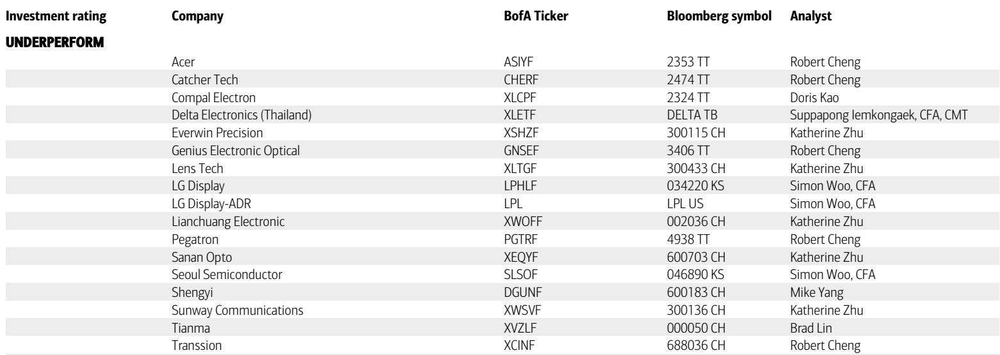
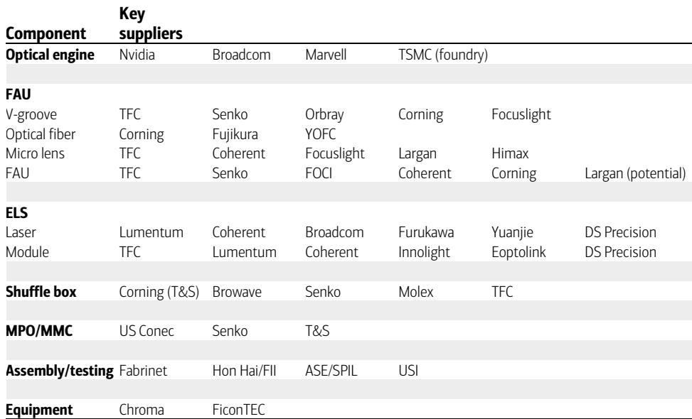
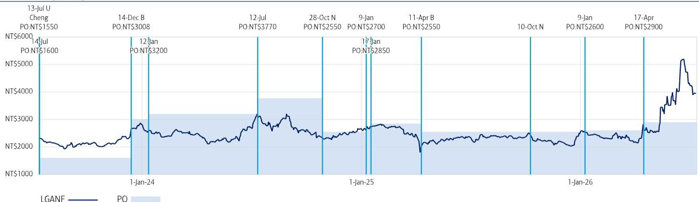

# Fiber Array Units Are the Hidden Bottleneck in Co-Packaged Optics,and Only a Handful of Suppliers Can Solve It

The co-packaged optics (CPO) transition is widely discussed as a breakthrough for AI data-center scale-up,but the technology's commercial viability hinges on a component that few investors have examined closely:the fiber array unit (FAU). According to a detailed supply-chain analysis from a global investment bank,FAU acts as the physical highway connecting optical fiber to the optical engine for data transmission. Without micron-level alignment precision and automated mass-production capability,CPO switches cannot ship at volume. The report estimates that FAU's total addressable market in Nvidia CPO switches alone could reach USD 8 billion by 2030,yet the component's manufacturing barriers are so steep that most new entrants will fail to capture that value. This is not a commodity play. It is a precision-optics bottleneck that will determine which suppliers lead the next generation of data-center infrastructure.

The timing matters because CPO volume take-off is not imminent. The same analysis expects Nvidia CPO switch shipments to reach only 14,000 units in 2026,rising to 52,000 in 2027,and then jumping to 190,000 in 2028. That trajectory means that meaningful revenue for FAU suppliers will not materialize until 2028-2029. For investors tracking the datacom supply chain,the next two years are not a revenue story but a qualification story. The suppliers that achieve certification and demonstrate repeatable automation capability during this period will be the ones positioned to capture a disproportionate share of the USD 8 billion opportunity.

The central argument of this article is that FAU represents a structural barrier to CPO scaling,and that the competitive outcome is not a wide-open race but a narrow selection of winners. The report identifies two specific bottlenecks:micron-level pitch tolerance and automated alignment and testing. Both require years of accumulated know-how in precision optic manufacturing,mass production,and in-house automation. The smartphone optics industry,often cited as a natural adjacent supplier,operates at a tolerance of roughly plus or minus 5 microns for telephoto camera active alignment. CPO requires plus or minus 0.3 microns. That is an order-of-magnitude gap that cannot be closed quickly.

## The Pitch Tolerance Requirement for CPO Is an Order of Magnitude Tighter Than for Smartphone Optics,Creating a Structural Entry Barrier

FAU's core function is to align multiple optical fibers precisely with the photonic integrated circuit (PIC) so that light signals pass with minimal loss. The component consists of a fiber array,in which optical fibers are seated in parallel V-shaped grooves etched into a substrate,along with a lid,casing,and,in higher-end designs,micro lenses and prisms. The critical parameter is pitch tolerance:the allowable deviation in the spacing between adjacent fibers. For a pluggable transceiver,the pitch tolerance ranges from plus or minus 0.5 to 1.0 microns. For near-packaged optics (NPO),it tightens to plus or minus 0.5 microns. For CPO,the requirement drops to plus or minus 0.3 microns or lower.

That tightening has real physical consequences. V-groove etching depth and angle variation introduce misalignment from channel to channel. Even a perfectly etched V-groove does not eliminate the problem,because single-mode optical fiber has a diameter of 80 to 125 microns,with a core of only 6 to 10 microns. Any variation in fiber diameter causes it to sit higher or lower in the groove,shifting the alignment. As channel counts rise from the current 20-36 to 60-100 or more in future CPO designs,these errors accumulate linearly. The result is that assembly yield drops sharply unless the manufacturer can control every variable simultaneously.

The report explicitly compares this to smartphone optics,where active alignment for a telephoto camera module operates at roughly plus or minus 5 microns. That is 16 times looser than the CPO requirement. Suppliers from the consumer electronics world may have relevant experience in active alignment and high-volume assembly,but the gap in precision is not bridgeable through incremental improvement. It requires fundamentally different process control,metrology,and manufacturing equipment. The report notes that this know-how takes years of accumulated experience,and that the current FAU supply chain for CPO is 100 percent supplied by a single Chinese vendor,underscoring how concentrated the capability already is.

## Automation Capability,Not Just Precision,Will Determine Which Suppliers Scale

Precision alignment is necessary but not sufficient. The second bottleneck identified in the analysis is automation,specifically the ability to perform consistent alignment and testing at high throughput. As channel counts increase and CPO volume ramps toward hundreds of thousands of units,a labor-intensive alignment process becomes unviable. The industry currently lacks a standard automation or testing protocol for FAU assembly. That means suppliers with in-house automation capability have a structural advantage.

The logic here is mutually exclusive to the precision argument. A supplier could achieve sub-micron alignment in a lab setting but fail to reproduce it across thousands of units per day. The report emphasizes that automation does not just reduce labor intensity;it helps troubleshoot alignment issues and improve accuracy. In other words,automation and precision are not trade-offs. They are complementary capabilities that together determine whether a supplier can deliver consistent yield at scale.

This is where the competitive differentiation becomes visible. The report upgrades Largan Precision to 报告观点,citing faster progress than other new entrants after two quarters of sampling and testing. Largan has moved to the certification stage. That timeline is consistent with the report's broader thesis:the qualification window is open now,and the suppliers that pass through it before 2028 will have a multi-year lead. The report reiterates a 报告观点 on Sunny Optical,noting a lack of concrete projects. The difference between the two ratings is not about underlying technology capability alone. It is about demonstrated progress in customer engagement and certification,which in a closed ecosystem like datacom supply chains is arguably more important than raw technical potential.

The report's BOM analysis reinforces why automation matters financially. FAU contributes 5 to 10 percent of the total BOM for an Nvidia CPO switch. For the Quantum Q3450,FAU value per switch is estimated at USD 6,120. For the Spectrum 6810,it is USD 6,480. With ASPs for detachable FAU currently in the range of USD 150 to 200 and expected to decline toward USD 100 by 2030 as volume rises,the margin pressure will be significant. Suppliers that cannot automate will face eroding margins as ASPs compress. Those that can automate will maintain margin through higher yield and lower labor cost.

## GlassBridge Is Not a Near-Term Replacement for FAU,but It Highlights the Coupling Architecture Debate

The report addresses a specific concern that has surfaced in the market:whether Corning's GlassBridge solution could replace FAU entirely. GlassBridge is a wafer-based fiber-to-PIC technology that could theoretically improve assembly yield by eliminating some of the manual alignment steps. The report's conclusion is direct:GlassBridge is still at an early stage and is unlikely to be adopted in current or next-generation CPO design.

The reasoning is technical and specific. GlassBridge uses edge coupling,which projects light horizontally into the PIC. Edge coupling offers higher efficiency in insertion loss than grating coupling,which projects light vertically. But edge coupling has two critical limitations. First,it cannot conduct wafer-scale testing,because the optical interface is on the edge of the chip rather than on the surface. That means each unit must be tested individually,reducing throughput and increasing cost. Second,edge coupling faces spatial constraints and demands extreme alignment requirements,which become more difficult as channel counts rise above 70.

The report also notes that even under a GlassBridge solution,a fiber array is still needed,though with a lower precision-alignment requirement. That means GlassBridge does not eliminate the FAU market. It shifts the value toward a different type of FAU,potentially one with less stringent tolerances but still requiring the same underlying manufacturing capability. For investors,the implication is that the FAU opportunity is not binary. It does not disappear if an alternative coupling technology emerges. The structure of the optical interconnect,whether grating or edge coupling,still requires a physical interface between fiber and PIC. The question is which suppliers can make that interface at the required precision and cost.

The report's comparison of grating and edge coupling is worth dwelling on because it frames a strategic decision for the industry. Grating coupling offers higher alignment tolerance and enables wafer-scale testing,which is critical for volume manufacturing. Edge coupling offers lower insertion loss but at the cost of extreme alignment and no wafer-level test. The report does not declare a winner,but the implication is clear:for the volume ramp expected in 2028-2029,grating coupling's manufacturing advantages may outweigh the optical efficiency gains of edge coupling. That would favor the existing FAU supply chain and the suppliers that have invested in grating-coupling alignment capability.

## The Decision Framework for Investors:Three Filters to Evaluate FAU Suppliers

The report provides enough granularity to construct a decision framework for evaluating which FAU suppliers are likely to succeed. The framework has three filters,each derived from a specific mechanism or comparison in the analysis.

The first filter is precision manufacturing capability,measured by demonstrated pitch tolerance. The report gives explicit numbers:CPO requires plus or minus 0.3 microns or lower. Suppliers that have only achieved smartphone-grade alignment at plus or minus 5 microns are not credible candidates. The relevant benchmark is whether a supplier has produced FAU prototypes or samples that meet the CPO tolerance specification and has done so consistently across multiple units. The report notes that Largan has moved to certification after two quarters of sampling and testing,which suggests it has passed this first filter.

The second filter is automation capability,measured by the supplier's ability to align and test FAUs at high throughput without human intervention. The report states that the industry has no standard automation or testing protocol at the current stage. That means suppliers must develop their own. The relevant question is whether a supplier has a history of building in-house automation for precision manufacturing,not just buying off-the-shelf equipment. The report explicitly links automation to the ability to troubleshoot alignment issues,which implies that automation is not just about speed but about quality control in a regime where errors accumulate with channel count.

The third filter is customer engagement and certification timeline. The report emphasizes that the datacom supply chain is a more closed ecosystem than consumer electronics. Relationships take time to build,and certification is a multi-quarter process. The report's upgrade of Largan is explicitly tied to faster progress in this dimension. The 报告观点 on Sunny Optical reflects a lack of concrete projects,not a judgment on technical capability. That distinction is important:technical capability without customer engagement is insufficient. Investors should look for evidence of sampling,testing,and certification milestones with major CPO switch customers,particularly Nvidia.

Applying these three filters to the supplier landscape in the report reveals a narrow set of candidates. The key FAU suppliers listed include TFC,Senko,FOCI,Coherent,and Corning,with Largan as a potential entrant. The report does not rank them,but the implication is that the legacy Asia supply chain,which has been supplying FAU for pluggable transceivers and NPO,has a head start. New entrants must clear all three filters,not just one. The report's central insight is that most will not.

The USD 8 billion TAM estimate by 2030 is based on 1.4 million units of CPO switch and 115 units of 1.6T equivalent optical engines per switch. That is a large number,but it is contingent on CPO adoption scaling as expected. The report acknowledges that pluggable transceivers will remain mainstream for scale-out into 2028-2030,and that CPO penetration in scale-up depends on key CSP preference and overall yield and cost. The FAU TAM is therefore not guaranteed. It is a scenario that assumes successful resolution of the very bottlenecks the report identifies. That is not a contradiction. It is the reason the opportunity is concentrated:the suppliers that solve the bottlenecks will capture the TAM,and the ones that do not will be irrelevant.

*For informational purposes only. Portions may be generated,translated,summarized,or edited with AI assistance based on source materials and may contain omissions or errors. Please verify independently. This is not investment,legal,tax,accounting,or other professional advice.*

For informational purposes only. Portions may be generated,translated,summarized,or edited with AI assistance based on source materials and may contain omissions or errors. Please verify independently. This is not investment,legal,tax,accounting,or other professional advice.
