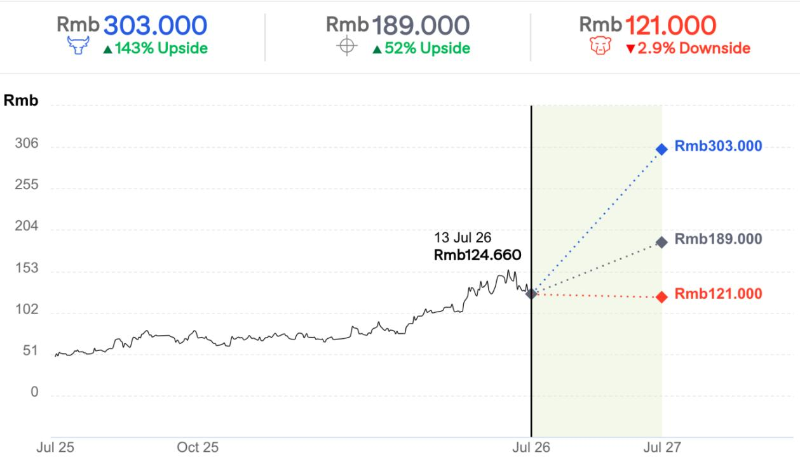

# WUS Printed Circuit (002463.SZ)

2Q26 业绩指引超预期

## 研究观点

WUS 发布 2Q26 净利润/调整后净利润指引中值分别为 16.7 亿/16.4 亿元人民币（环比增长 35%/41%），高于研究预期/市场一致预期 8%/11%，也高于我们与读者交流中了解到的买方预期 15-16 亿元。管理层表示，泰国工厂在 2Q26 实现盈利。我们认为 2Q26 超预期主要得益于产品结构优化和海外产能爬坡带来的超预期盈利能力。我们预计，在产能释放和 1.6T 交换机/新 AI 加速器平台量产的支撑下，2H26 收入/净利润同比增速将进一步加快。我们认为 WUS 是我们覆盖的 PCB 标的中增长可见度最高的公司。我们维持 2026/2027 年净利润预测 67 亿/121 亿元人民币，并注意到 WUS 当前估值约为 2027 年研究预期每股收益的 20 倍。

图 1. WUS：业绩指引

<table><tr><td></td><td colspan="3">2Q26</td><td colspan="2">1Q26</td><td colspan="2">2Q25</td><td colspan="2">市场一致预期</td></tr><tr><td>百万元人民币</td><td>公布值</td><td>研究预期</td><td>差异%</td><td>实际值</td><td>环比</td><td>实际值</td><td>同比</td><td>2Q26</td><td>差异%</td></tr><tr><td>净利润</td><td></td><td></td><td></td><td></td><td></td><td></td><td></td><td></td><td></td></tr><tr><td>上限</td><td>1,758</td><td>1,549</td><td>13%</td><td>1,242</td><td>42%</td><td>920</td><td>91%</td><td>1,501</td><td>17%</td></tr><tr><td>下限</td><td>1,588</td><td>1,549</td><td>3%</td><td>1,242</td><td>28%</td><td>920</td><td>73%</td><td>1,501</td><td>6%</td></tr><tr><td>中值</td><td>1,673</td><td>1,549</td><td>8%</td><td>1,242</td><td>35%</td><td>920</td><td>82%</td><td>1,501</td><td>11%</td></tr><tr><td>调整后净利润</td><td></td><td></td><td></td><td></td><td></td><td></td><td></td><td></td><td></td></tr><tr><td>上限</td><td>1,717</td><td>不适用</td><td>不适用</td><td>1,163</td><td>48%</td><td>899</td><td>91%</td><td>不适用</td><td>不适用</td></tr><tr><td>下限</td><td>1,567</td><td>不适用</td><td>不适用</td><td>1,163</td><td>35%</td><td>899</td><td>74%</td><td>不适用</td><td>不适用</td></tr><tr><td>中值</td><td>1,642</td><td>不适用</td><td>不适用</td><td>1,163</td><td>41%</td><td>899</td><td>83%</td><td>不适用</td><td>不适用</td></tr></table>

© 2026 Citi Inc. 未经 Citi 书面许可不得转载。

来源：Citi, Visible Alpha, 公司报告

<table><tr><td colspan="2">评级：正面</td></tr><tr><td>价格（2026年7月13日 15:00）</td><td>人民币124.660元</td></tr><tr><td>目标价</td><td>人民币189.000元</td></tr><tr><td>预期报价回报</td><td>51.6%</td></tr><tr><td>预期股息率</td><td>0.4%</td></tr><tr><td>预期总回报</td><td>52.0%</td></tr><tr><td>总市值</td><td>人民币2,399亿元/ 354亿美元</td></tr></table>

Karen Huang $^{AC}$ +852-2501-2755
karen.xw.huang@citi.com

Kyna Wong

+852-2868-7820

kyna.wong@citi.com

Kevin Chen

+852-2501-2125

kevin.y.chen@citi.com

<table><tr><td>[S304]</td><td>乐观情景假设2028年预期市盈率25倍</td></tr><tr><td></td><td>基准情景假设2027年预期市盈率30倍</td></tr><tr><td></td><td>悲观情景假设2028年预期市盈率10倍（基于峰值担忧）</td></tr></table>

人民币121.000元 ▼2.9% 下行空间

## 乐观/悲观情景：WUS Printed Circuit

  
价差146个百分点
当前价格及预期回报（上行/下行）截至2026年7月13日

## WUS Printed Circuit

## 估值

我们采用2027年预期市盈率30倍，得出WUS目标价人民币189.0元。我们认为这一估值合理，基于2026-2028年预期每股收益复合年增长率86%，驱动因素包括：1）2026-2028年GenAI相关PCB需求带来的稳健增长；2）产品结构优化带来的潜在均价/毛利率提升；3）强大的执行和交付能力有助于维持稳健的毛利率。

## 风险

可能阻碍公司达到目标价的主要下行风险包括：（1）GenAI相关PCB份额分配不及预期；（2）汽车供应链中的定价和竞争压力；（3）云服务提供商资本支出减少及宏观环境变化导致需求减弱；（4）材料成本上升；（5）中美地缘政治风险。

如果您有视觉障碍并希望就本文件中图形的细节与Citi代表沟通，请致电美国1-888-500-5008（TTY：711），或从美国境外拨打+1-210-677-3788

## 附录A-1

## 分析师认证

主要负责本研究报告编制和内容的研究分析师要么（i）在作者栏中以"AC"标识，要么（ii）以粗体列出，并附有该分析师负责的内容。如果作者栏中指定了多位AC分析师，每位分析师仅就其负责的整个研究报告进行认证，但以下内容除外：（a）归属于另一位以粗体列出的AC认证分析师的内容，以及（b）仅针对特定发行人的观点，该观点归属于下方价格图表或评级历史表中标识的另一位AC认证分析师。每位分析师就其负责的报告部分认证：（1）其中表达的观点准确反映了他们个人对每个提及的发行人和证券的看法，并且是以独立方式编制的，包括对Citi Global Markets Inc.及其关联方；（2）研究分析师的薪酬的任何部分，过去、现在或将来，均不直接或间接与该研究分析师在本报告中表达的具体建议或观点相关。

## 重要披露

  
\*表示变更  
评级/目标价变化反映东部时间

Citi Global Markets Inc.或其关联方在过去12个月内因向WUS Printed Circuit提供非投行服务而获得报酬。

Citi Global Markets Inc.或其关联方目前或过去12个月内拥有以下客户，且提供的服务为非投行、证券相关：WUS Printed Circuit。

Citi Global Markets Inc.或其关联方目前或过去12个月内拥有以下客户，且提供的服务为非投行、非证券相关：WUS Printed Circuit。

分析师的薪酬由Citi管理层和Citi高级管理层确定，并基于旨在惠及Citi Global Markets Inc.及其关联方（以下简称"公司"）读者客户的活动和服务。薪酬不与特定交易或建议挂钩。与所有公司员工一样，分析师的薪酬受到公司整体盈利能力的影响，包括投行、销售和交易以及自营交易收入。股权研究分析师薪酬的一个因素是在机构客户与所覆盖公司管理团队之间安排企业交流活动。通常，当分析师对公司持积极看法时，公司管理层更有可能参与。

对于公司未担任做市商的产品中推荐的金融工具，公司是该等金融工具（及其任何基础工具）的流动性提供者，并可能在与该等工具相关的交易中担任自营方。公司是定期发行与产品中可能推荐的证券挂钩的可交易金融工具的机构。公司定期交易产品中讨论的发行人的证券。公司可能以与产品不一致的方式进行证券交易，并且对于产品所涵盖的证券，将按自营基础向客户买入或卖出。

除非另有说明，研究分析师或其团队成员在过去12个月内均未实地考察过已提供研究观点的公司的运营情况。

有关本Citi产品（"产品"）所涉公司的重要披露（包括历史披露副本），请联系Citi，地址：388 Greenwich Street, 6th Floor, New York, NY, 10013，收件人：Legal/Compliance [E6WYB6412478]。此外，除估值和风险评估及历史披露外，相同的重要披露载于公司披露网站 https://www.citivelocity.com/cvr/eppublic/citi\_research\_disclosures。估值和风险评估可在关于标的公司的最新研究笔记/报告正文中找到。根据《市场滥用条例》，Citi在过去12个月内发布的所有建议的历史记录可通过Citi Velocity (https://www.citivelocity.com/cv2) 或您的标准分发门户访问。历史披露（最多过去三年）将根据要求提供。

Citi股权评级分布

<table><tr><td colspan="7">Citi股权评级分布</td></tr><tr><td></td><td colspan="3">12个月评级</td><td colspan="3">催化剂观察</td></tr><tr><td>数据截至2026年7月1日</td><td>买入</td><td>持有</td><td>卖出</td><td>买入</td><td>持有</td><td>卖出</td></tr><tr><td>Citi全球基本面覆盖（中性=持有）</td><td>61%</td><td>32%</td><td>7%</td><td>36%</td><td>48%</td><td>16%</td></tr><tr><td>各评级类别中投行客户的公司占比</td><td>38%</td><td>42%</td><td>27%</td><td>42%</td><td>37%</td><td>36%</td></tr></table>

## Citi基本面研究评级指南：

Citi股票建议包括投资评级和可选的风险评级以标识高风险股票。风险评级同时考虑价格波动性和基本面标准。股票将没有风险评级或被分配高风险评级。

投资评级：Citi投资评级为买入、中性、卖出。我们的评级基于分析师对预期总回报（"ETR"）和风险的预期。ETR是未来12个月内股票预期价格升值（或贬值）加上股息回报表现的总和。目标价基于12个月的时间范围。投资评级定义：买入（1）ETR为15%或以上，或高风险股票为25%或以上；卖出（3）为负ETR。任何未分配买入或卖出的覆盖股票均为中性（2）。对于评级为中性的股票（2），如果分析师认为缺乏足够的估值驱动因素和/或投资催化剂来得出正面或负面的投资观点，经Citi管理层批准，他们可以选择不分配目标价，从而不推导ETR。Citi可能因监管和/或内部政策原因暂停其评级和目标价，并分配"评级暂停"状态。Citi也可能因其他特殊情况（例如缺乏对分析师论点至关重要的信息、公司证券交易暂停）影响公司和/或公司证券交易而暂停其评级和目标价，并分配"审查中"状态。在这两种情况下，评级和目标价将在评级历史价格图表中分别显示为"—"和"-"。在2022年4月11日之前，Citi将两种情况均分配"审查中"状态，而在2020年11月11日之前仅在特殊情况下使用。在实际可行的情况下，分析师将发布重新建立评级和投资论点的说明。投资评级在覆盖启动、投资和/或风险评级变更或目标价变更时（受有限管理层酌情权限制）由上述范围确定。有时，由于市场价格变动和/或其他短期波动或交易模式，预期总回报可能超出这些范围。此类临时偏差将被允许，但将接受研究管理层的审查。您买入或卖出证券的决定应基于您个人的投资目标，并应在评估股票的预期表现和风险后做出。

催化剂观察/短期观点（"STV"）评级披露：

催化剂观察和STV上行/下行判断：Citi还可能包括催化剂观察或STV上行或下行判断，以表明分析师预计股价将在30或90天的指定期间内因一项或多项特定近期催化剂或影响公司或市场的事件而相对上涨（下跌）。当分析师对股价将受到影响有较高信心时，将发布催化剂观察；当信心水平中等时，将发布STV。催化剂观察或STV上行/下行判断将在指定的30/90天期限结束时自动到期。如果股价表现（按市场收盘价计算）相对于判断方向超过15%，催化剂观察也将自动移除（除非分析师推翻）。分析师也可以在指定期限结束前通过发布的研究说明移除催化剂观察或STV判断。催化剂观察/STV上行或下行判断可能不同于且不影响股票的基本面股权评级，后者反映长期总相对回报预期。为满足FINRA评级分布披露规则，催化剂观察/STV上行判断对应买入建议，催化剂观察/STV下行判断对应卖出建议。任何未分配催化剂观察上行、催化剂观察下行、STV上行或STV下行判断的股票被视为催化剂观察/STV无观点。为满足FINRA评级分布披露规则，我们在催化剂观察/STV上行/下行评级系统的评级分布表中将催化剂观察/STV无观点对应为持有。但我们重申，我们不认为无观点是一种建议。对于所有催化剂观察/STV上行/下行判断，存在催化剂和相关的股价变动可能不会如预期实现的风险。

## 研究分析师关联/非美国研究分析师披露

本报告作者的雇佣法律实体列于下方（其监管机构进一步列于本文）。编制本报告的非美国研究分析师（即除被标识为受雇于Citi Global Markets Inc.之外的所有下述研究分析师）未在FINRA注册/取得研究分析师资格。此类研究分析师可能不是成员组织的关联人士（但受雇于成员组织的关联方），因此可能不受FINRA规则2241关于与标的公司沟通、公开露面以及研究分析师账户持有证券交易的限制。

## 其他披露

建议中提及的任何工具的价格均为前一日该工具主要市场的收盘价，除非另有说明。

本研究报告中所作任何建议的完成和首次分发时间为产品顶部显示的东部日期时间。如果产品引用了其他分析师的观点，请参阅价格图表或评级历史表以了解该观点的完成和首次分发的日期/时间。

各司法管辖区的法规要求，如果建议与作者此前12个月内发布的关于同一金融工具或发行人的任何先前建议不同，则应指明变更和该先前建议的日期。对于基本面覆盖，请参阅本披露附录中的价格图表或评级变更历史，或发行人披露摘要 https://www.citivelocity.com/cvr/eppublic/citi\_research\_disclosures。

Citi已制定政策以识别、考虑和管理因发布或分发研究而可能产生的利益冲突。这些政策的描述可在 https://www.citivelocity.com/cvr/eppublic/citi\_research\_disclosures 找到。

过去12个月每个季度末，所有Citi研究建议中等同于"买入"、"持有"、"卖出"的比例（以及其中在过去12个月内接受过Citi投行服务的百分比，显示在括号中）如下：2026年第一季度 买入33%（63%），持有44%（52%），卖出23%（46%），相对价值0.5%（89%）；2025年第四季度 买入33%（63%），持有44%（50%），卖出23%（46%），相对价值0.4%（91%）；2025年第三季度 买入33%（61%），持有44%（52%），卖出23%（50%），相对价值0.4%（80%）；2025年第二季度 买入33%（63%），持有44%（51%），卖出23%（49%），相对价值0.4%（86%）。为披露除股权以外的建议（其定义可在相应披露部分找到），"买入"表示正向方向性交易想法；"卖出"表示负向方向性交易想法；"相对价值"表示任何不具有明确方向性的交易想法。

欧洲法规要求在引用证券过往表现时提供5年价格历史。CitiVelocity的图表工具（https://www.citivelocity.com/cv2/#go/CHARTING\_3\_Equities）提供创建可定制价格图表的功能，包括五年选项。该工具可在CitiVelocity（https://www.citivelocity.com/）的任何资产类别菜单下的数据与分析部分找到。如需更多信息，请联系CitiVelocity支持（https://www.citivelocity.com/cv2/go/CLIENT\_SUPPORT）。所有引用价格的来源，除非另有说明，均为DataCentral，该数据库从LSEG Data & Analytics获取价格信息。过往表现并非未来结果的保证或可靠指标。预测并非未来表现的保证或可靠指标。

读者在投资前应始终仔细考虑ETF的投资目标、风险和费用。适用的招股说明书和关键读者信息文件（如适用）应包含有关该ETF的这些信息和其他信息。在投资前仔细阅读任何此类招股说明书非常重要。客户可从适用的分销商或授权参与者、ETF上市的交易所和/或适用的ETF发行人的适用网站获取ETF的招股说明书和关键读者信息文件。研究价值及任何应计收入可能下跌或上涨。任何过往表现、预测或预报均不表明未来或可能的表现。本文包含的任何ETF信息仅供说明之用，不应被视为出售或邀请购买任何ETF单位的要约，无论是明示还是暗示。所表达的意见是作者的意见，不一定反映ETF发行人、其任何代理人或其关联方的观点。

Citi Global Markets India Private Limited和/或其关联方可能不时实际或实益拥有标的发行人债务证券的1%或以上。

请注意，根据经修订的第13959号行政命令（"命令"），美国人士被禁止投资于美国政府确定为命令对象的任何公司的证券。本研究不旨在以任何可能导致违反命令的方式使用或依赖。鼓励读者依靠自己的法律顾问就遵守命令以及美国财政部外国资产控制办公室管理和执行的其他经济制裁计划提供建议。

本通讯面向符合以色列《研究交流、投资营销和投资组合管理法》（1995年）（"咨询法"）中定义的"合格客户"的人士。在以色列境内，本通讯不针对零售客户，Citi不会向零售客户或非合格客户提供此类产品或交易。演讲者未获得以色列证券管理局（"ISA"）的投资顾问或投资营销许可，本通讯不构成投资或营销建议。本文包含的信息可能涉及ISA未监管的事项。本通讯涉及的证券不得向任何以色列人士发售或出售，除非根据《以色列证券法》（1968年）的证券发售豁免及其下的公开发售规则。

Citi通过公司专有电子分发平台（例如Citi Velocity和各种全球财富平台）广泛并同时向公司的机构和零售客户分发其研究内容。为方便起见，某些（但非全部）研究内容可能通过第三方聚合器分发。客户可酌情通过电子邮件接收已发布的研究报告，且仅在此类研究内容已广泛分发之后。某些研究仅向机构读者提供以满足监管要求。Citi分析师向客户提供的服务水平和类型可能因多种因素而异，例如客户对接收分析师通讯的频率和方式的个人偏好、客户的风险状况和关注焦点（例如市场范围、行业特定、长期、短期等）、与公司的整体客户关系的规模和范围以及法律和监管限制。

根据Comissão de Valores Mobiliários Resolução 20和ASIC Regulatory Guide 264，Citi需要披露Citi关联公司或业务是否与标的公司有商业关系。考虑到Citi在全球100多个国家经营多项业务，Citi很可能与标的公司有商业关系。

公司推荐、要约或出售的证券：（i）不受联邦存款保险公司保险；（ii）不是任何受保存款机构（包括Citibank）的存款或其他义务；以及（iii）受投资风险影响，包括可能损失本金金额。产品仅供参考，不构成购买或出售证券的要约或邀请。购买产品中提及的证券的任何决定必须考虑有关该证券的现有公开信息或任何注册招股说明书。尽管信息来自并基于公司认为可靠的来源，但我们不保证其准确性，且信息可能不完整和经过浓缩。但请注意，公司已采取一切合理步骤确定产品重要披露部分中披露的准确性和完整性。公司的研究部门已获得本产品中提及的标的公司的协助，包括但不限于与标的公司管理层的讨论。公司政策禁止研究分析师向标的公司发送研究草案。但应假定产品的作者已与标的公司进行讨论，以确保在发布前事实准确。关于ESG（环境、社会、治理）因素的陈述和观点通常基于标的公司发布的公开声明或其他公开新闻，作者可能未独立核实。ESG因素是读者在做出投资决策时可能考虑的一个因素。所有意见、预测和估计构成作者截至产品日期的判断，这些以及产品中包含的任何其他信息如有变更，恕不另行通知。金融工具的价格和可用性也可能随时变更，恕不另行通知。尽管公司内部其他部门为产品中讨论的公司提供建议，但在此类角色中获得的信息不用于产品的编制。尽管Citi未设定预定的发布频率，但如果产品是基本面股权或信用研究报告，Citi有意提供对覆盖发行人的研究覆盖，包括响应影响发行人的新闻。对于非基本面研究报告，Citi可能不会定期更新报告中包含的观点、建议和事实。尽管Citi保持覆盖、提出建议或讨论发行人，但Citi可能因法律或政策原因定期被限制引用某些发行人。如果已发布的交易想法的组成部分受到限制，该交易想法将从产品中包含的任何开放交易想法列表中移除。限制解除后，如果分析师继续支持该交易想法，它将重新列入开放交易想法列表，否则将正式关闭。Citi可能向不同类别的客户提供不同的研究产品和服务（例如，基于长期或短期投资期限），这可能导致不同的结论或建议，可能对证券价格产生与替代研究产品中的建议相反的影响，前提是每个产品均符合各自产品的评级系统。

投资非美国证券（包括ADR）可能涉及某些风险。非美国发行人的证券可能未在美国证券交易委员会注册，也不受其报告要求的约束。关于外国证券的信息可能有限。外国公司通常不受与美国公司相当的统一审计和报告标准、实践和要求的约束。某些外国公司的证券可能流动性较低，其价格波动性可能比可比的美国公司证券更大。此外，汇率变动可能对美国读者在外国股票上的研究价值及其相应的股息支付产生不利影响。ADR读者的净股息是使用预扣税率惯例估算的，被认为是准确的，但鼓励读者就精确的股息计算咨询其税务顾问。从公司收到产品的读者可能在某些州或其他司法管辖区被禁止从公司购买产品中提及的证券。请向您的财务顾问咨询更多详情。Citi Global Markets Inc.对美国的产品负责。美国读者因产品中包含的信息而下的任何订单只能通过Citi Global Markets Inc.下达。

对产品生产负责的Citi法律实体是第一位作者受雇的法律实体。

产品在澳大利亚通过Citi Global Markets Australia Pty Limited提供。（ABN 64 003 114 832和AFSL No. 240992），ASX集团参与者，受澳大利亚证券和投资委员会监管。Citi Centre, 2 Park Street, Sydney, NSW 2000。Citi Global Markets Australia Pty Limited不是《1959年银行法》下的授权存款机构，也不受澳大利亚审慎监管局监管。
产品在巴西由Citi Global Markets Brasil - CCTVM SA提供，该公司受CVM - Comissão de Valores Mobiliários（"CVM"）、BACEN - 巴西中央银行、APIMEC - Associação dos Analistas e Profissionais de Investimento do Mercado de Capitais和ANBIMA – Associação Brasileira das Entidades dos Mercados Financeiro e de Capitais监管。Av. Paulista, 1111 - 14º andar(parte) - CEP: 01311920 - São Paulo - SP。

本产品在智利通过Banchile Corredores de Bolsa S.A.提供，该公司是Citi Inc.的间接子公司，受Comisión Para El Mercado Financiero监管。Enrique Foster Sur, 20, piso 6, Las Condes, Santiago, Chile。

哥伦比亚共和国读者披露：本通讯或信息不构成2010年第2555号法令第2.40.1.1.2条或修改、替代或补充该条款的法规意义上的专业研究交流。编制和分发本条所述的研究报告和一般通讯无需成为哥伦比亚金融监管局监管的实体。

产品在德国由Citi Global Markets Europe AG（"CGME"）提供，该公司受欧洲中央银行和德国联邦金融监管局（Bundesanstalt für Finanzdienstleistungsaufsicht BaFin）监管。Börsenplatz 9, 60313 Frankfurt am Main, Germany。

除非另有说明，如果编制本报告的分析师位于香港且报告涉及"证券"（定义见《证券及期货条例》（香港法例第571章）），则该报告由Citi Global Markets Asia Limited在香港发布。Citi Global Markets Asia Limited受香港证券及期货事务监察委员会监管。如果报告由非香港分析师编制，请注意该分析师（以及该分析师受雇或认可的法律实体）未在香港获得许可/注册，且他们不声称如此。请参阅"研究分析师关联/非美国研究分析师披露"部分以了解分析师雇佣实体的详细信息。

产品在印度由Citi Global Markets India Private Limited（CGM）提供，该公司作为研究分析师（SEBI注册号INH000000438）受印度证券交易委员会（SEBI）监管。CGM还积极参与印度的商人银行业务（SEBI注册号INM000010718）和股票经纪业务（SEBI注册号INZ000263033），并已就此向SEBI注册。SEBI授予的注册、在孟买证券交易所（BSE）的登记以及印度国家证券管理学院（NISM）的认证均不以任何方式保证中介机构的业绩或向读者提供任何回报保证。CGM的注册办公室位于1202, 12th Floor, First International Financial Centre (FIFC), G Block, Bandra Kurla Complex, Bandra East, Mumbai – 400098，注册电话：+91 22 61759999。Citi维持健全的政策、程序、控制和培训，以确保持续遵守所有适用的规则和法规。本文包含的所有建议均由合格的研究分析师做出。CGM的公司识别号为U99999MH2000PTC126657，其合规官[Vishal Bohra]的联系方式为：电话：+91-022-61759994，传真：+91-022-61759851，电子邮件：cgmcompliance@citi.com。关于研究分析师的读者章程、合规审计报告和投诉信息可在 https://www.citivelocity.com/cvr/eppublic/citi\_research\_disclosures 找到。申诉官[Niraj Mody]的联系方式为：电话：+91-22-42775002，电子邮件：EMEA.CR.Complaints@citi.com。证券市场投资存在市场风险。在投资前请仔细阅读所有相关文件。SEBI规定的客户条款和条件可在 https://www.citivelocity.com/rendition/authfilelinksvcs/eppublic/V1/file?paramData=ZmlsZU5hbWU9L1MzL0dETVMvcHViRGlzY2xvc3VyZUhObWxzL2dkbV9kaXNfc2ViaV9UZXJtc29mVXNILmhObWw 找到。

产品在印度尼西亚通过PT Citi Sekuritas Indonesia提供。Citibank Tower 10/F, Pacific Century Place, SCBD lot 10, Jl. Jend Sudirman Kav 52-53, Jakarta 12190, Indonesia。本产品及其任何副本不得在印度尼西亚或向任何印度尼西亚公民（无论其居住地）或印度尼西亚居民分发，除非符合适用的资本市场法律法规。本产品不是印度尼西亚的证券要约。本产品中提及的证券尚未根据相关资本市场法律法规在资本市场和金融服务局（OJK）注册，不得在印度尼西亚共和国境内或向印度尼西亚公民通过公开发售或在构成印度尼西亚资本市场法律法规意义上的要约的情况下发售或出售。

产品在日本由Citi Global Markets Japan Inc.（"CGMJ"）提供，该公司受金融厅、证券交易监督委员会、日本证券业协会、东京证券交易所和大阪证券交易所监管。Otemachi Park Building, 1-1-1 Otemachi, Chiyoda-ku, Tokyo 100-8132 Japan。如果在CGMJ研究报告中发现错误，修订版将发布在公司的Citi Velocity网站上。如果您对Citi Velocity有疑问，请致电(81 3) 6270-3019寻求帮助。

产品在沙特阿拉伯王国根据沙特法律通过Citi Saudi Arabia提供，该公司受资本市场管理局（CMA）监管，CMA许可证号(17184-31)。2239 Al Urubah Rd – Al Olaya Dist. Unit No. 18, Riyadh 12214 – 9597, Kingdom Of Saudi Arabia。

产品在韩国由Citi Global Markets Korea Securities Ltd.（CGMK）提供，该公司受金融委员会、金融监督院和韩国金融投资协会（KOFIA）监管。CGMK的地址为Citibank Center, 50 Saemunan-ro, Jongno-gu, Seoul 03184, Korea。KOFIA在其网站上提供研究分析师的注册信息。如果您希望查找CGMK研究分析师的KOFIA注册信息，请访问以下网站：http://dis.kofia.or.kr/websquare/index.jsp?w2xPath=/wq/fundMgr/DISFundMgrAnalystList.xml&divisionId=MDISO3002002000000&serviceId=SDISO3002002000。产品在韩国由Citibank Korea Inc.提供，该公司受金融委员会和金融监督院监管。地址为Citibank Center, 50 Saemunan-ro, Jongno-gu, Seoul 03184, Korea。本研究报告仅面向韩国《金融投资服务和资本市场法》及其施行令中定义的"专业读者"。

产品在马来西亚由Citi Global Markets Malaysia Sdn Bhd（注册号199801004692 (460819-D)）（"CGMM"）向其客户提供，CGMM就其内容对CGMM客户负责。CGMM受马来西亚证券委员会监管。如有任何关于产品的问题，请联系CGMM，地址：Level 43 Menara Citibank, 165 Jalan Ampang, 50450 Kuala Lumpur, Malaysia。

产品在墨西哥由Citi México Casa de Bolsa, S.A. de C.V., Grupo Financiero Citi México提供，该公司是Citi Inc.的全资子公司，受Comision Nacional Bancaria y de Valores监管。Prolongación Reforma 1196, 24 floor, Colonia Santa Fe, Alcaldía Cuajimalpa de Morelos, C.P. 05348, Ciudad de México。

产品在波兰由Biuro Maklerskie Banku Handlowego（DMBH）提供，DMBH是Bank Handlowy w Warszawie S.A.（Citi Inc.的子公司）的独立部门，受Komisja Nadzoru Finansowego监管。Biuro Maklerskie Banku Handlowego (DMBH), ul.Senatorska 16, 00-923 Warszawa。

产品在新加坡通过Citi Global Markets Singapore Pte. Ltd.（"CGMSPL"）提供，CGMSPL持有资本市场服务牌照和豁免财务顾问牌照，受新加坡金融管理局监管。如有任何关于本文件分析的问题，请联系CGMSPL，地址：8 Marina View, 21st Floor Asia Square Tower 1, Singapore 018960。本产品面向《证券及期货法》（2001年）定义的认可读者、专家读者和机构读者。对于Citi Private Bank，产品在新加坡由Citi Private Bank通过Citibank, N.A., Singapore Branch提供。Citibank N.A., Singapore Branch是新加坡持牌银行，受新加坡金融管理局监管。如果您对本文件有任何疑问或任何相关事宜，请联系您在Citibank N.A., Singapore Branch的私人银行家。本产品面向《证券及期货法》（2001年）定义的认可读者、专家读者和机构读者。对于Citibank Singapore Limited（"CSL"），产品在新加坡由CSL向选定的Citigold/Citigold Private Clients分发。CSL不提供对产品实质或编制的独立研究或分析。如果您对本文件有任何疑问或任何相关事宜，请联系您在CSL的Citigold//Citigold Private Client客户关系经理。本产品面向《证券及期货法》（第289章）定义的认可读者。

Citi Global Markets (Pty) Ltd.在南非共和国注册（公司注册号2000/025866/07），其注册办公室位于145 West Street, Sandton, 2196, Saxonwold。Citi Global Markets (Pty) Ltd.受JSE证券交易南非、南非储备银行和金融服务委员会监管。本文所述的投资和服务不适用于南非的私人客户。

产品在中华民国（台湾）通过Citi Global Markets Taiwan Securities Company Ltd.（"CGMTS"）提供，地址：14F, 15F and 16F, No. 1, Songzhi Road, Taipei 110, Taiwan，受中华民国（台湾）金融监督管理委员会证券期货局监管。未经CGMTS书面授权，任何媒体或第三方不得在中华民国（台湾）复制或引用产品的任何部分。根据中华民国（台湾）适用的法律法规，产品接收者不得利用该产品参与任何可能产生利益冲突的事项。如果产品涵盖不允许在中华民国（台湾）发售或交易的证券，则产品及其包含的任何信息均不得被视为在中华民国（台湾）宣传该证券或推荐该证券。产品仅供参考，不构成购买或出售证券或金融产品的要约或邀请。购买产品中提及的证券或金融产品的任何决定必须考虑有关该证券或金融产品的现有公开信息或任何注册招股说明书。

产品在泰国通过Citicorp Securities (Thailand) Ltd.提供，该公司受泰国证券交易委员会监管。399 Interchange 21 Building, 18th Floor, Sukhumvit Road, Klongtoey Nua, Wattana, Bangkok 10110, Thailand。

土耳其共和国读者披露：产品在土耳其通过Citibank AS提供，该公司受资本市场委员会监管。Tekfen Tower, Eski Buyukdere Caddesi # 209 Kat 2B, 23294 Levent, Istanbul, Turkey。根据土耳其资本市场法（第6362号法律），此处提供的投资信息、评论和建议不属于投资咨询活动范围。此处提供的评论和建议基于提供这些评论和建议的个人意见。这些意见可能不适合您的财务状况、风险和回报偏好。因此，仅依赖此处所述信息做出投资决定可能不会产生符合您期望的结果。此外，Citi是Citi Global Markets Inc.（"公司"）的一个部门，该公司确实并寻求与本研究报告中涵盖的公司和/或证券进行业务往来。因此，读者应注意公司可能存在可能影响本报告客观性的利益冲突，但读者也应注意到公司已建立组织和行政安排以管理此类性质的潜在利益冲突。

在阿联酋，这些材料（"材料"）由Citi Global Markets Limited, DIFC branch（"CGML"）传达，CGML是在迪拜国际金融中心（"DIFC"）注册的实体，由迪拜金融服务局（"DFSA"，许可证号CL0221）许可和监管，仅面向DFSA法规中定义的专业客户和市场对手方，不应依赖或分发给零售客户。材料涉及的金融产品和/或服务仅向专业客户和市场对手方提供。Citi Global Markets Limited DIFC Branch注册地址为Level 3, Gate District Building 02, Dubai International Financial Centre，联系电话+971 4 509 97 90。

产品在英国由Citi Global Markets Limited提供，该公司由审慎监管局（"PRA"）授权，受金融行为监管局（"FCA"）和PRA监管。本材料可能涉及英国境外人士的投资或服务，或PRA未授权
